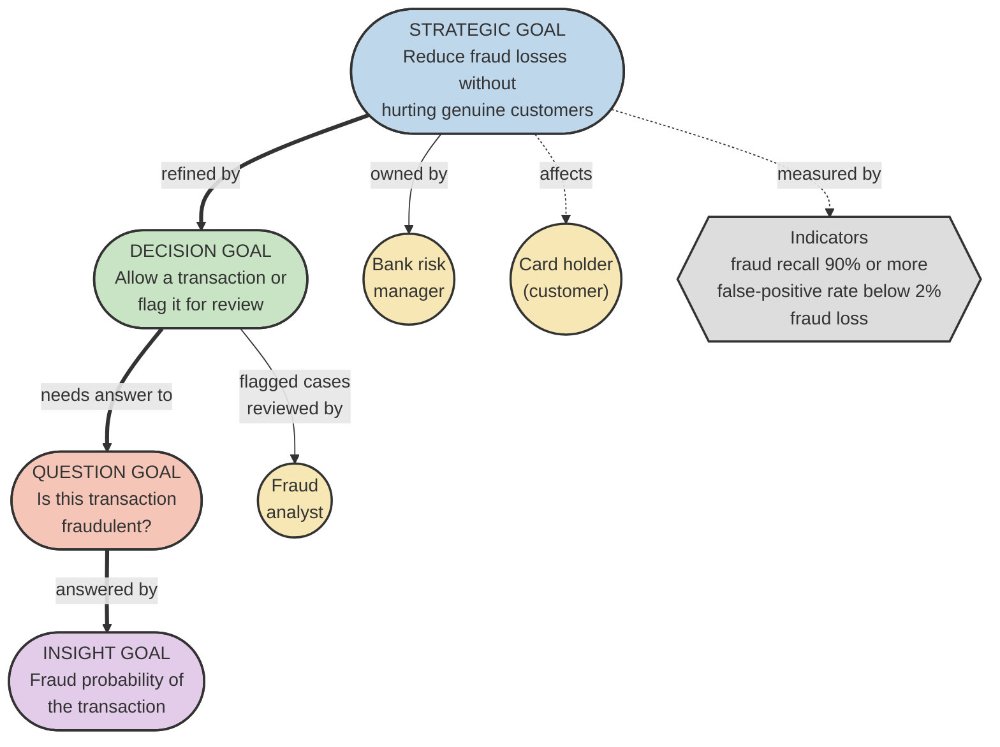
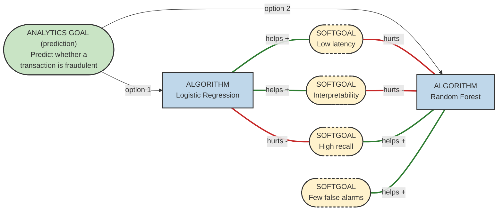
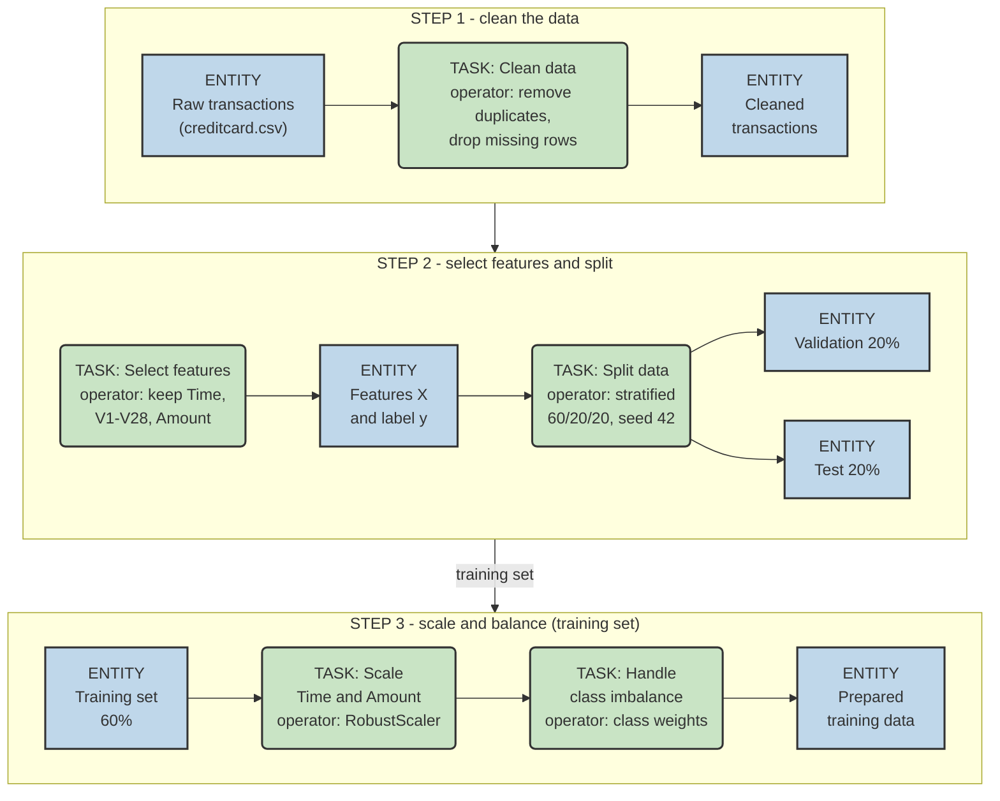
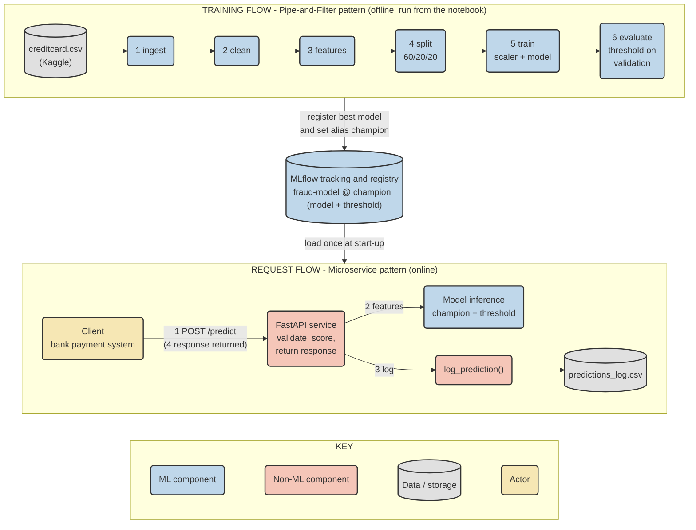

# AIMLZG546 - Software Engineering for Machine Learning

## Assignment I - Report

**Group No:** 13  
**Project:** Credit Card Fraud Detection

---

## Group Details

| Sl. No | BITS ID     | Name                   | Contribution of team member (Qualitative)                                                                                                                                                                                                                  | Percentage Contribution (out of 100) |
| ------ | ----------- | ---------------------- | ---------------------------------------------------------------------------------------------------------------------------------------------------------------------------------------------------------------------------------------------------------- | ------------------------------------ |
| 1      | 2025ae05576 | Anirudh Anand          | Report lead. Wrote the domain and problem statement, ML problem formulation, stakeholders, scope, functional requirements and measurable goals (Sections 1 and 2) and the GR4ML Business View. Compiled the final report and PDF.                          | 25                                   |
| 2      | 2025ae05178 | Aniketh Paul           | Wrote the GR4ML Analytics Design View, the Data Preparation View and the top three quality requirements with justification (Sections 3.2, 3.3 and 4). Built the data part of the pipeline in the notebook: EDA, ingest, clean, features and split filters. | 25                                   |
| 3      | 2025ae05898 | Pushadapu Sanjay Kumar | Designed the system architecture diagram showing ML and non-ML components, selected the two patterns and wrote Sections 5 and 6. Built the FastAPI prediction service, input validation, prediction logging and the automated tests.                       | 25                                   |
| 4      | 2025af05111 | Biswajeet Mahato       | Built the model part of the pipeline: train and evaluate filters, threshold selection on validation, MLflow tracking and model registry. Ran the notebook end to end, took the screenshots and wrote Sections 7.2, 7.3, 8 and 9.                           | 25                                   |
|        |             |                        | **Total**                                                                                                                                                                                                                                                  | **100**                              |

---

# Objective 1: Requirements Formulation

## 1. Domain and Problem Statement

### 1.1 Domain

The domain we chose is banking, and within it credit card fraud detection. Millions of card payments happen every day and each one has to be approved or declined in a few seconds. If a fraudulent payment goes through, the bank normally has to bear the loss and the customer also loses trust in the bank. So we felt this is a good practical area for a machine learning application.

### 1.2 Problem Statement

Banks lose a lot of money every year because of fraudulent credit card transactions. The fraud team cannot check every payment by hand, and manual checking is too slow to stop a payment that is being processed. Fraud is also very rare compared to genuine payments (less than 1%), so fixed rules either miss the fraud or block many genuine customers.

In this assignment we propose an application that checks each card transaction when it arrives and gives the probability that it is fraud. Transactions with a high probability are flagged, and the fraud analysts look only at the flagged ones instead of all transactions. Our goal is to catch at least 90% of the frauds, wrongly flag less than 2% of genuine transactions, and give the answer fast enough to be used during the payment.

### 1.3 Why Machine Learning is Needed

Most banks already have rule based checks, for example blocking a payment above some amount or from an unusual country. Someone has to write these rules by hand, and fraudsters slowly find ways around them. A rule also looks at only one or two fields at a time, and if the rules are made stricter, more genuine payments get declined.

A machine learning model can learn the fraud patterns from old transactions that are already marked as fraud or genuine. It can look at many features together and can be trained again when new fraud patterns come. The model also gives a probability instead of a plain yes or no, so the bank can pick a threshold that gives an acceptable balance between missed frauds and false alarms.

### 1.4 Stakeholders

| Stakeholder             | Interest in the system                                                       |
| ----------------------- | ---------------------------------------------------------------------------- |
| Bank risk manager       | Reduce fraud losses without increasing complaints from customers             |
| Fraud analyst           | Get a reliable score so that only suspicious transactions need manual review |
| Card holder (customer)  | Genuine payments should not be declined                                      |
| ML and development team | Build and maintain a model and service that are accurate and fast            |

### 1.5 Scope

These are inside the scope of this assignment:

- Checking a single transaction and returning a fraud label with its probability
- Providing this check through a prediction service (API)
- Training the model and storing it in a model registry
- Logging every prediction made by the service

Outside the scope are: connecting to a real payment network, sending alerts to customers, handling chargebacks and using real customer card data. We use a public anonymised dataset instead.

### 1.6 Formulation as a Machine Learning Problem

We treat this as a binary classification problem. Each transaction is labelled fraud (1) or genuine (0). The model takes the transaction features as input and gives the probability of fraud, and the final label is decided by a threshold.

We use the "Credit Card Fraud Detection" dataset from Kaggle. It has card transactions made by European card holders, <!--A:q1-->with 284,807 transactions of which only 492 (0.173%) are fraud<!--/A:q1-->. Except for Time and Amount, the features V1 to V28 are already anonymised by the dataset provider. The two classes are very unbalanced, so accuracy alone does not tell us much (a model that says everything is genuine would still be 99.8% accurate). Because of this we judge the model with recall, precision, F1 score, the area under the precision-recall curve and the confusion matrix.

For the design we picked two architectural patterns: Pipe-and-Filter for the training pipeline, and Microservices for serving the model as a separate prediction service together with a model registry. They are explained in Section 6.

## 2. Requirement Specifications and Measurable Goals

### 2.1 Functional requirements

| ID  | Requirement                                                                                                                                                          |
| --- | -------------------------------------------------------------------------------------------------------------------------------------------------------------------- |
| FR1 | The system accepts one card transaction (Time, V1 to V28 and Amount) through a POST /predict API call.                                                               |
| FR2 | The system returns the fraud probability, the fraud label, the threshold used and the model version.                                                                 |
| FR3 | The system rejects invalid input (missing field, wrong type, NaN or infinity, negative Amount, unknown field) with HTTP 422 and does not return a prediction for it. |
| FR4 | The system writes one row to a prediction log for every prediction made.                                                                                             |
| FR5 | The training pipeline reads the dataset, cleans it, splits it, trains the model and reports the evaluation metrics. The pipeline can be run again to retrain.        |
| FR6 | The trained model is stored in a model registry, and the prediction service loads only the registered model marked as champion.                                      |
| FR7 | The service has a health endpoint that reports whether it is running and which model version it serves.                                                              |

### 2.2 Measurable goals

<!--A:goals-->| Goal | GR4ML concept | Metric | Target | Result (latest run) | Met? |
|---|---|---|---|---|---|
| Catch fraud | Indicator of the strategic goal; softgoal High recall | Recall on the test set | at least 90% | 85.3% | No |
| Avoid blocking genuine customers | Indicator of the strategic goal; softgoal Few false alarms | False-positive rate on the test set | below 2% | 1.08% | Yes |
| Decide while the payment is processed | Softgoal Low latency | p95 latency of the prediction API | below 200 ms | 5.9 ms | Yes |
| Reduce losses | Strategic goal | Share of fraud money caught (test set) | at least 30% | 82.4% | Yes |<!--/A:goals-->

The results are from our latest notebook run. If a target is not met, we report the real value and do not tune anything on the test set.

### 2.3 Business rules

| ID     | Rule                                                                                                                                             |
| ------ | ------------------------------------------------------------------------------------------------------------------------------------------------ |
| BR-001 | A transaction is labelled fraud only if its fraud probability is greater than or equal to the threshold.                                         |
| BR-002 | The threshold is chosen on the validation set (highest value with recall at least 0.90), stored as a run parameter and kept in one config place. |
| BR-003 | The scaler is fitted on the training data only.                                                                                                  |
| BR-004 | The scaling is saved inside the model pipeline and applied the same way at serving time.                                                         |
| BR-005 | Evaluation reports recall, precision, F1, PR-AUC, ROC-AUC, false-positive rate and the confusion matrix.                                         |
| BR-006 | Targets are compared honestly with the test results; nothing is tuned on the test set.                                                           |
| BR-007 | Invalid input is rejected with HTTP 422 and is not logged.                                                                                       |
| BR-008 | One log row is written per prediction; a failed write is reported as an error.                                                                   |
| BR-009 | The API loads only the model with the alias champion.                                                                                            |
| BR-010 | Training runs as a chain of six filters: ingest, clean, features, split, train, evaluate.                                                        |
| BR-011 | A fixed seed (42) and a single config make the run reproducible.                                                                                 |

## 3. GR4ML Views

### 3.1 Business View



Colour key: yellow circles are actors, the blue, green, red and purple rounded boxes are the strategic, decision, question and insight goals, and the grey hexagon holds the indicators. Thick arrows connect the goals, dotted lines are weaker links (affects, measured by).

**Explanation:** The bank risk manager owns the strategic goal, which is to reduce fraud losses without hurting genuine customers. The card holder is affected because a wrongly blocked payment is annoying for them. To reach the goal, the bank must decide for every transaction whether to allow it or to send it to a fraud analyst for review. For this decision the bank needs to know one thing, whether the transaction is fraudulent, and the insight that answers it is the fraud probability of the transaction. We measure the strategic goal with three indicators: fraud recall, false-positive rate and fraud loss. The first two are the same measurable goals as in Section 2.2.

### 3.2 Analytics Design View



Colour key: green arrows are positive influences (+) and red arrows are negative influences (-). These are expected influences, not measured results.

**Explanation:** The analytics goal is prediction, we want to predict whether a transaction is fraud. We considered two algorithms for this, Logistic Regression and Random Forest, and implemented both. The softgoals are high recall, low latency, interpretability and few false alarms. We expected Logistic Regression to be good for latency and interpretability but weaker on recall, and Random Forest to be better on recall and false alarms but worse on interpretability and latency. These influence links are only our expectations from the course material, not results. <!--A:analytics-->In our run Logistic Regression was selected because it had the lower validation false-positive rate (1.02% against 4.69% for Random Forest), although Random Forest had the better PR-AUC (0.859 against 0.786). The recall of Logistic Regression was 90.4% on validation and 85.3% on the test set.<!--/A:analytics-->

### 3.3 Data Preparation View



Colour key: blue boxes are entities (data), green boxes are tasks, and the operator used by a task is written inside the task box. Arrows show the flow of the data.

**Explanation:** First the raw transactions are cleaned by dropping duplicate rows and rows with missing values. From the cleaned data we make the feature table, with Time, V1 to V28 and Amount as inputs and Class as the label. This table is split into training, validation and test sets (60/20/20, stratified, seed 42). Time and Amount are scaled with a RobustScaler that is fitted on the training set only, and the class imbalance is handled with class weights in the classifier. We use the validation set to choose the decision threshold and keep the test set only for the final result.

### 3.4 GR4ML concept mapping

| GR4ML concept             | In this project                                                      |
| ------------------------- | -------------------------------------------------------------------- |
| Strategic goal            | Reduce losses from card fraud                                        |
| Decision goal             | Block or allow a transaction                                         |
| Question                  | Is this transaction fraudulent?                                      |
| Insight                   | Fraud probability and label per transaction                          |
| Indicators                | Recall, false-positive rate, p95 latency                             |
| Analytics goal            | Binary classification (fraud or genuine)                             |
| Algorithms                | Logistic Regression, Random Forest                                   |
| Softgoals                 | High recall, few false alarms, low latency                           |
| Data preparation entities | Raw transactions, cleaned data, features, train/validation/test sets |
| Tasks and operators       | Ingest, clean, features, split, train, evaluate                      |

## 4. Top Three Quality Requirements

| #   | Quality requirement   | Measurable target                                         | Justification (why it matters here)                                                                                                            | How architecture supports it                                                                                                                                                                     |
| --- | --------------------- | --------------------------------------------------------- | ---------------------------------------------------------------------------------------------------------------------------------------------- | ------------------------------------------------------------------------------------------------------------------------------------------------------------------------------------------------ |
| 1   | Accuracy (recall)     | Recall at least 90% with false-positive rate below 2%     | A fraud that is not detected is a direct loss for the bank. The classes are very unbalanced, so overall accuracy would hide the missed frauds. | We use class weights and a separate validation set to choose the threshold, and we report recall, precision, F1, PR-AUC and the confusion matrix instead of accuracy.                            |
| 2   | Performance (latency) | p95 latency below 200 ms                                  | The decision has to be taken while the payment is being processed, so a late answer is as bad as no answer.                                    | The model is loaded once when the service starts and kept in memory. The prediction service is separate from training, so for each request it only validates the input and calls the model once. |
| 3   | Security and privacy  | No card number accepted or stored; invalid input rejected | Card data is sensitive, and a service that accepts any input can be misused.                                                                   | The API accepts only the numeric model features (no card number or name) and rejects any extra field. The prediction log stores only the probability, label, latency and model version.          |

Authentication of API clients is not part of this assignment. We list it as a limitation of our prototype.

---

# Objective 2: System Architecture

## 5. System Architecture Diagram



The key inside the diagram explains the colours: blue is an ML component, red is a non-ML component, grey is data or storage and yellow is an actor.

**ML components:** the six pipeline filters (ingest, clean, features, split, train, evaluate), the MLflow model registry that keeps the trained model and its threshold, and the model inference step inside the prediction service.

**Non-ML components:** the FastAPI service with the /predict and /health endpoints, the pydantic request validation, the log_prediction function with the prediction log file, and the client that sends the transactions.

**Request flow:** (1) The client sends a transaction to /predict. (2) The FastAPI service validates it and gives the features to the loaded champion model, which returns a probability. (3) The service compares the probability with the threshold and writes one row to the prediction log through log_prediction(), and (4) the response goes back to the client.

**Training flow:** the Kaggle dataset goes through the six filters. In the last filter the threshold is chosen on the validation set, the results are logged to MLflow, and the best model is registered as fraud-model with the alias champion. The prediction service loads this model when it starts.

## 6. Architectural Patterns

### 6.1 Pattern 1: Pipe-and-Filter

- Problem: Training a model has several processing steps. If everything is in one long script, it is hard to test a single step or to replace one, for example the model.
- Solution: We divide the processing into independent filters. Each filter takes an input, gives an output and keeps no hidden state, and the output of one filter is the input of the next one.
- How we applied it: The training pipeline has six filters (ingest, clean, features, split, train, evaluate), each in its own module under pipeline/. The file run_pipeline.py only connects them. The train filter accepts a classifier name, so the other filters need no change, and we used this to train both Logistic Regression and Random Forest.
- Benefits and trade-offs: Each filter can be tested alone (the notebook has tests for this) and the order of the steps is easy to follow. The trade-off is that the data is passed between filters as whole tables in memory. That is fine for this dataset, but a much bigger dataset would need streaming.

### 6.2 Pattern 2: Microservices

- Problem: The payment system of the bank needs the model at any time, while training is a separate job that runs only sometimes and needs far more resources.
- Solution: We make the prediction a small independent service with its own interface and keep it apart from the training code. Managing the models is done by a third component, the registry.
- How we applied it: The FastAPI service in api/main.py only loads the registered model fraud-model with the alias champion and answers /predict and /health. It never trains. MLflow works as the registry between training and serving, so a new model can be registered and picked up without changing the service code.
- Benefits and trade-offs: The service can be restarted or scaled without touching the training, and every response carries the model version. The trade-off is that there are more parts (service, registry and log) than in a single script, and the service has to be restarted to load a newly registered champion.

## 7. Implementation

### 7.1 Technology stack

| Layer              | Technology                                                  | Purpose                                                |
| ------------------ | ----------------------------------------------------------- | ------------------------------------------------------ |
| ML pipeline        | Python, pandas, scikit-learn                                | Filters for data preparation, training and evaluation  |
| Model registry     | MLflow (SQLite backend)                                     | Tracking of runs and registry of the champion model    |
| Prediction service | FastAPI, pydantic, uvicorn                                  | Separate prediction microservice with input validation |
| Logging            | CSV file written by log_prediction()                        | One row per prediction                                 |
| Testing            | pytest, FastAPI TestClient                                  | Tests named after the business rules                   |
| Runtime            | Jupyter notebook 13.ipynb (runs in Google Colab or VS Code) | Runs everything from top to bottom, no GPU needed      |

### 7.2 Pipe-and-Filter pipeline

The notebook writes each filter to its own file and run_pipeline.py joins them. ingest checks that the file and the columns exist, and stops with an error if they do not. clean drops duplicate rows and rows with missing values. features takes Time, V1 to V28 and Amount as inputs and Class as the label. split does a stratified 60/20/20 split with seed 42. train fits a scikit-learn Pipeline where a RobustScaler for Time and Amount comes before the classifier, so the scaler is fitted on the training set only and is saved together with the model. evaluate picks the highest threshold that gives a recall of at least 0.90 on the validation set, and the test set is used only once at the end with this threshold.

```python
# each stage hands its output to the next one
raw = ingest(data_path)
df = clean(raw)
X, y = build_features(df)
parts = split(X, y)
# train every candidate on the training set and judge it on the validation set
fitted = {}
for name in candidates:
    model = train(parts["X_train"], parts["y_train"], name)
    threshold, val_m = evaluate_validation(model, parts["X_val"], parts["y_val"])
    fitted[name] = (model, threshold, val_m)
# the winner is chosen from validation results only; the test set is used once at the end
winner = pick_winner(fitted)  # lowest validation false-positive rate, PR-AUC breaks ties
model, threshold, val_m = fitted[winner]
test_m = evaluate_test(model, parts["X_test"], parts["y_test"], threshold)
```

<!--A:results-->**Model results:** The dataset has 284,807 rows with 492 frauds (0.173%). After removing 1,081 duplicate rows, 283,726 rows remain with 473 frauds (0.167%). The stratified split gives 170,235 training, 56,745 validation and 56,746 test rows. For each model the threshold is the highest one that still gives a validation recall of at least 0.90.

| Model (validation) | Threshold | Recall | Precision | FPR | PR-AUC |
|---|---|---|---|---|---|
| Logistic Regression | 0.7692 | 0.9043 | 0.1286 | 1.02% | 0.786 |
| Random Forest | 0.0107 | 0.9043 | 0.0310 | 4.69% | 0.859 |

Both models were tuned to the recall target on validation. Random Forest gives 4.69% false positives on validation, which is above the 2% limit, but Logistic Regression stays within it, so we selected Logistic Regression (version 1 in the registry). Below are the results of the selected model on the test set, which we used only once:

| Recall | Precision | F1 | PR-AUC | ROC-AUC | FPR |
|---|---|---|---|---|---|
| 0.8526 | 0.1169 | 0.2056 | 0.6884 | 0.9644 | 1.08% |

Confusion matrix on the test set: TN 56,039, FP 612, FN 14, TP 81. **The FPR target (below 2%) is met, but the recall target (at least 90%) is not met on the test set (85.3%).** On validation the recall was 90.4%. The test set has only 95 frauds and the validation set 94, so missing just one more fraud changes recall by about one percentage point, and a threshold that is only just enough on validation can fall short on new data. We report the result as it is and did not tune the threshold on the test set.

**Fraud loss (goal G4):** We measured the loss in money using the Amount column and assumed that every flagged fraud is stopped. The 95 frauds in the test set add up to 14,766.31 and the model catches 12,163.97 of it, so the fraud loss goes down by 82.4%, against the target of 30% (met). The cost is that genuine transactions worth 205,692.94 were also flagged, and a real bank would have to consider the cost of these blocked payments too. This is only an estimate from the test set and it does not include chargeback fees or the cost of reviewing the flagged transactions.

**Note on the selection rule:** In our first run we chose the winner by the best validation PR-AUC and Random Forest won. On the test set it missed both targets (recall 87.4%, FPR 4.74%). After seeing this we changed the rule to the lowest validation FPR, with PR-AUC as tie-break, because the false-alarm limit is one of our stated goals. The change was based on validation results only, but we made it after seeing the first run, so we mention it here.<!--/A:results-->

### 7.3 MLflow model registry

Every candidate model is logged as an MLflow run with its parameters (model name, seed, threshold) and its validation metrics. The winning model also gets its test metrics, is registered as fraud-model, and the alias champion is set on this version. The threshold is saved as a run parameter, so the prediction service reads the same value that was chosen during evaluation and it is not written inside the service code. <!--A:registry-->After the run, fraud-model has Logistic Regression as version 1 with the alias champion, and the stored threshold is 0.7692. The prediction service loads only `models:/fraud-model@champion`, so a new version can be promoted without any change in the service code.<!--/A:registry-->

### 7.4 Prediction microservice (FastAPI)

The service has two endpoints. GET /health returns the status and the model version. POST /predict takes the 30 input values and returns request_id, probability, is_fraud, threshold, model_version and latency_ms. The label is true only when the probability is greater than or equal to the threshold. Invalid input gets HTTP 422 and is not logged. If the prediction log cannot be written, the call fails with HTTP 500 and does not continue silently.

```python
@app.post("/predict", response_model=Prediction)
def predict(tx: Transaction) -> Prediction:
    """Score one transaction; the label is probability >= threshold and nothing else (BR-001)."""
    start = time.perf_counter()
    # Invalid requests never reach this point, FastAPI has already answered with 422.
    row = pd.DataFrame([tx.model_dump()], columns=config.FEATURES)
    # The saved model scales the input itself, so no separate preprocessing is done here (BR-004).
    probability = float(app.state.model.predict_proba(row)[0, 1])
    is_fraud = probability >= app.state.threshold
    latency_ms = (time.perf_counter() - start) * 1000
    request_id = str(uuid.uuid4())  # unique id so a log row can be matched to a call
    try:
        log_prediction(request_id, probability, is_fraud, latency_ms, app.state.version)
    except OSError as exc:
        # A failed log write is reported as an error, never ignored (BR-008).
        raise HTTPException(status_code=500, detail=f"Prediction log failed: {exc}") from exc
    return Prediction(request_id=request_id, probability=probability, is_fraud=is_fraud,
                      threshold=app.state.threshold, model_version=app.state.version,
                      latency_ms=round(latency_ms, 3))
```

<!--A:latency-->**Measured latency:** For 100 requests the median is 4.4 ms, the p95 is 5.9 ms and the maximum is 9.3 ms. The target of p95 below 200 ms is met.<!--/A:latency-->

### 7.5 Prediction logging

Every successful prediction is added to predictions_log.csv with the time, request id, probability, label, latency and model version. We do not write the feature values to the log, so no transaction data is stored there.

```python
def log_prediction(request_id: str, probability: float, is_fraud: bool, latency_ms: float,
                   model_version: str, path: Path | None = None) -> None:
    """Write one log row; an OSError is raised if the file cannot be written."""
    path = Path(path or config.LOG_PATH)
    # Only result data is logged. The transaction values themselves are not stored.
    row = {"timestamp": datetime.now(timezone.utc).isoformat(), "request_id": request_id,
           "probability": round(probability, 6), "is_fraud": int(is_fraud),
           "latency_ms": round(latency_ms, 3), "model_version": model_version}
    with _lock:
        new_file = not path.exists() or path.stat().st_size == 0  # write the header once
        with path.open("a", newline="") as f:  # "a" = append, old rows are kept
            writer = csv.DictWriter(f, fieldnames=FIELDS)
            if new_file:
                writer.writeheader()
            writer.writerow(row)
```

### 7.6 End-to-end run and test calls

We run the notebook from top to bottom after restarting the runtime. It uploads the dataset, runs the pipeline, shows the MLflow registry and starts the service in the background. Then it sends one fraud row and one genuine row from the test set, three invalid requests (negative Amount, missing field, unknown field) and 100 requests to measure the latency. At the end it shows the prediction log and runs the automated tests with pytest. <!--A:tests-->The last pytest run shows **31 passed**.<!--/A:tests-->

## 8. Application Screenshots

<!--A:shots-->**Screenshot 1 - Pipeline run.** Output of the six-filter pipeline: 284,807 rows read, 1,081 duplicates removed, the 60/20/20 split, both models trained and Logistic Regression selected, with test recall 0.853 and FPR 0.0108.


**Screenshot 2 - MLflow.** MLflow registry page of fraud-model. Version 1 is registered and has the alias champion, which is the only model the service loads.


**Screenshot 3 - FastAPI.** The /docs page of the service with the GET /health and POST /predict endpoints, the request fields (Time, V1 to V28, Amount) and the response fields.


**Screenshot 4 - Fraud test call.** A fraud row from the test set sent to /predict. The probability is 1.0000, is_fraud is true and the answer came in 42 ms.


**Screenshot 5 - Genuine test call.** A genuine row from the test set. The probability is 0.028, below the threshold 0.7692, so is_fraud is false.


**Screenshot 6 - Prediction log.** The prediction log after the test calls and the 100 latency requests: 102 rows, each with timestamp, request id, probability, label, latency and model version.

<!--/A:shots-->

## 9. Conclusion

<!--A:conclusion-->In this assignment we built a fraud detection system with a pipe-and-filter training pipeline, an MLflow registry and a FastAPI microservice that serves the champion model, with prediction logging and 31 automated tests. Against our goals: false-positive rate (1.08% against 2%) is met, latency (p95 5.9 ms against 200 ms) is met, and the test recall is 85.3% against the 90% target, so that goal is not met. The estimated fraud loss reduction is 82.4% against the 30% target (met). From this work we learned that with so few frauds in each split the recall on the test set can differ from the validation recall, that the model for serving should be chosen on validation results only, and that a registry alias keeps the service independent of the model version. If we had more time we would try more tuning on validation, cross-validation for the threshold, and more fraud examples.<!--/A:conclusion-->

---

## Appendix A - Full Code

The complete code of every file is printed below. Repository: https://github.com/sanjaykumarpushadapu/SE-ML-Assessments · Notebook: `13.ipynb`

<!--APPENDIX_CODE-->
