# AIMLZG546 - Software Engineering for Machine Learning

## Assignment I - Report

**Group No:** 13  
**Project:** Credit Card Fraud Detection

**Repository:** [https://github.com/sanjaykumarpushadapu/SE-ML-Assessments](https://github.com/sanjaykumarpushadapu/SE-ML-Assessments)

---

## Group Details

| Sl. No | BITS ID     | Name                   | Contribution of team member (Qualitative)                                                                                                                                                                                                                  | Percentage Contribution (out of 100) |
| ------ | ----------- | ---------------------- | ---------------------------------------------------------------------------------------------------------------------------------------------------------------------------------------------------------------------------------------------------------- | ------------------------------------ |
| 1      | 2025ae05576 | Anirudh Anand          | Report lead. Wrote the domain and problem statement, ML problem formulation, stakeholders, scope, functional requirements and measurable goals (Sections 1 and 2) and the GR4ML Business View. Compiled the final report and PDF.                          | 25                                   |
| 2      | 2025ae05178 | Aniketh Paul           | Wrote the GR4ML Analytics Design View, the Data Preparation View and the top three quality requirements with justification (Sections 3.2, 3.3 and 4). Built the data part of the pipeline in the notebook: EDA, ingest, clean, features and split filters. | 25                                   |
| 3      | 2025ae05898 | Pushadapu Sanjay Kumar | Designed the system architecture diagram showing ML and non-ML components, selected the two patterns and wrote Sections 5 and 6. Built the FastAPI prediction service, input validation, prediction logging and the automated tests.                       | 25                                   |
| 4      | 2025af05111 | Biswajeet Mahato       | Built the model part of the pipeline: train and evaluate filters, threshold selection on validation, MLflow tracking and model registry. Ran the notebook end to end, took the screenshots and wrote Sections 7.2, 7.3, 8 and 9.                           | 25                                   |
|        |             |                        | **Total**                                                                                                                                                                                                                                                  | **100**                              |

---

# Objective 1: Requirements Formulation

## 1. Domain and Problem Statement

### 1.1 Domain

The domain we chose is banking, and within it credit card fraud detection. Millions of card payments happen every day and each one has to be approved or declined in a few seconds. If a fraudulent payment goes through, the bank normally has to bear the loss and the customer also loses trust in the bank. So we felt this is a good practical area for a machine learning application.

### 1.2 Problem Statement

Banks lose a lot of money every year because of fraudulent credit card transactions. The fraud team cannot check every payment by hand, and manual checking is too slow to stop a payment that is being processed. Fraud is also very rare compared to genuine payments (less than 1%), so fixed rules either miss the fraud or block many genuine customers.

In this assignment we propose an application that checks each card transaction when it arrives and gives the probability that it is fraud. Transactions with a high probability are flagged, and the fraud analysts look only at the flagged ones instead of all transactions. Our goal is to catch at least 90% of the frauds, wrongly flag less than 2% of genuine transactions, and give the answer fast enough to be used during the payment.

### 1.3 Why Machine Learning is Needed

Most banks already have rule based checks, for example blocking a payment above some amount or from an unusual country. Someone has to write these rules by hand, and fraudsters slowly find ways around them. A rule also looks at only one or two fields at a time, and if the rules are made stricter, more genuine payments get declined.

A machine learning model can learn the fraud patterns from old transactions that are already marked as fraud or genuine. It can look at many features together and can be trained again when new fraud patterns come. The model also gives a probability instead of a plain yes or no, so the bank can pick a threshold that gives an acceptable balance between missed frauds and false alarms.

### 1.4 Stakeholders

| Stakeholder             | Interest in the system                                                       |
| ----------------------- | ---------------------------------------------------------------------------- |
| Bank risk manager       | Reduce fraud losses without increasing complaints from customers             |
| Fraud analyst           | Get a reliable score so that only suspicious transactions need manual review |
| Card holder (customer)  | Genuine payments should not be declined                                      |
| ML and development team | Build and maintain a model and service that are accurate and fast            |

### 1.5 Scope

These are inside the scope of this assignment:

- Checking a single transaction and returning a fraud label with its probability
- Providing this check through a prediction service (API)
- Training the model and storing it in a model registry
- Logging every prediction made by the service

Outside the scope are: connecting to a real payment network, sending alerts to customers, handling chargebacks and using real customer card data. We use a public anonymised dataset instead.

### 1.6 Formulation as a Machine Learning Problem

We treat this as a binary classification problem. Each transaction is labelled fraud (1) or genuine (0). The model takes the transaction features as input and gives the probability of fraud, and the final label is decided by a threshold.

We use the "Credit Card Fraud Detection" dataset from Kaggle. It has card transactions made by European card holders, <!--A:q1-->with 284,807 transactions of which only 492 (0.173%) are fraud<!--/A:q1-->. Except for Time and Amount, the features V1 to V28 are already anonymised by the dataset provider. The two classes are very unbalanced, so accuracy alone does not tell us much (a model that says everything is genuine would still be 99.8% accurate). Because of this we judge the model with recall, precision, F1 score, the area under the precision-recall curve and the confusion matrix.

For the design we picked two architectural patterns: Pipe-and-Filter for the training pipeline, and Microservices for serving the model as a separate prediction service together with a model registry. They are explained in Section 6.

### 1.7 Data Exploration (genuine vs fraud)

The charts below are copied from the notebook outputs (Section 2, Exploratory data analysis) by `build_report.py`. They show how rare fraud is and in which columns fraud looks different from genuine transactions.

<!--A:fig_eda-->**Figure 1 - Class balance and amount.** Only 492 of the 284,807 transactions (0.173%) are fraud, and most amounts are small with a long tail of large payments.

![Class balance and amount](data:image/png;base64,iVBORw0KGgoAAAANSUhEUgAAA94AAAFUCAYAAADS2eS8AAAAOnRFWHRTb2Z0d2FyZQBNYXRwbG90bGliIHZlcnNpb24zLjExLjIsIGh0dHBzOi8vbWF0cGxvdGxpYi5vcmcvgI3uAAAAAAlwSFlzAAAPYQAAD2EBqD+naQAAVZlJREFUeJzt3QeYE1X3+PGz0nvvAop0BKnSkd67CK8IShGxAEp5UWw0FRtiAxFFRJQqTSwgTZReBaQoUgSkd1g6zP859/1Pfkk2uyTspszu9/M8gc3MTTKZJHPnzL333CjLsiwBAAAAAABBcUdwnhYAAAAAABB4AwAAAAAQZLR4AwAAAAAQRATeAAAAAAAEEYE3AAAAAABBROANAAAAAEAQEXgDAAAAABBEBN4AAAAAAAQRgTcAAAAAAEFE4J3E/P333xIVFSVffvmlRJL169eb7fr2228T/Xu9Xfv27ZPUqVPL0qVLw70pjpfYvhsJ7fTp09K5c2fJlSuX2U/PPfecRIrLly+bbRoyZIhr2V9//SUpUqSQVatWhXXbACCYrl27JkWLFpURI0YE/Njs2bPLk08+ectlkaps2bLSuHFjSaquXLki+fPnl/fffz/cm4J4IPBOJM6dO2cOxJUrV5bMmTNL2rRppVixYtKuXTv56aef5ObNm+HeRMTTwIEDpVq1alKnTp0Y6z777DO59957TWCeN29eEyidP3+efe6wCytvv/22VKxY0QSWNWrUCNu2vPLKK7Jo0SITyFqWFfEVvZ6IdurUSfr27Wu2F4Az6e/3nnvuMcfAjz76SBKz9OnTS69evQJ6jO6TM2fOSO/evYO2XUlFoPu/efPm5nvpfbvzzjt9ltdGEq3H06VLJ1mzZpWHHnrI1PO3WzZVqlTy8ssvy7Bhw+TkyZMBvltECgLvREBbe8qVKyeff/65Cbh27dplWqxmzJhhrmY2a9ZMNm7cGO7NRDzoZ6q9AXxVtu+++6489dRT0r9/f/O5z5s3T+bOnSutWrUiCIlF4cKFzb7p0qVLxHwvu3btKidOnJCxY8ealuZwWrZsmbnIU6hQIXGKZ555RtasWSNLliwJ96YAuE36+92zZ48JZvSCMjxbu9955x1TV2jQmBDsOgf+0QYtPXdwvx08eDBGuV9++UUaNmxoGsMOHTokmzZtklOnTknNmjXNPr/dso8++qhcv36dz8zBCLwTwYFYA6yrV6/K6tWr5eGHH5YcOXKYK2NlypQxP04N2FKmTBnuTUU8fPrpp6Yng15EcaeB9uDBg00AqZVxmjRppEKFCuaquF5BnTVrFvvdIfTzslu8w00re/0uOYnuNz0p4iQScC4NtosUKSKjR4+WrVu3motp+B+9oH7kyBEzDAiRrV+/flK8eHHTMJIpUyYpWLCgfP3113L06FF56623brus1stt27aVcePG0ZPVoQi8HW7atGmyc+dO0zVUA25f9EeqQXhsLly44NFtRoN2rfj0OXVMiU27q7/55ptSokQJ0x1Gr0i3b99etm/fHlCZW/nkk0/k7rvvNt2m77///hhjmv3d3vi8V/cx51999ZUpo9ujQe2vv/7qc9zp0KFDpWTJkqacHji1Be748eMeZTRI1uBAX1c/L716efjw4VvuE23F1m5I3hdQ5s+fLxcvXpQ2bdp4LNdxUDrcQHs9hNI///xjvm8ZMmQw3aWeeOIJc+XWe0yuv/sjkM9hzpw5pqxegPL1mb/22mtxjvG+nc/8dj/PSKWVve4DPbn75ptvXL8TPca47x/tXaPdu5MnTy7Lly/3+3cVyGekDhw4YIbLuH+f9Psem7p165qhNdoiAMBZtPusHiN0zLF269V6VI81vuixZ8CAAaaFvHz58qa+0xbD33//3azXoTJ67NZApVSpUj57wmjDhXbb1WOZHrNy5sxphqxoPWbTY6Eem3wNt9HhXbqdvrZr5cqV5vxF6xDtOv/FF194XNjU54yOjjYXGOzjZv369W95HqD1jL6uLxMmTDD7QFvDtbej1sW3OvfyNcbbfg+6D7U3pb4H3Uca7HkLpKzS/aAXSfXz0uO6nqt498jUY/yzzz5ren7pe2natKns379f/KX7x96nun358uWTbt26mc8yPvvfX3v37jWt1q1btzbPa8uTJ49UqVLF47wskLLu9Zzuj82bNyfI9iK0CLwdTgMv1aRJk9t+Dj2wuXeb0ats2vI2ZswYef75513ltIvT8OHDzRW4Y8eOmYPlf/7zH3nvvfcCKhMXPdnXcS06tlRP9rVLcKNGjWTFihUBb2983qtNgwzdDg28tLu3tjrrAVLH1Nu0t4EesPUA/uqrr8q///5rtrd06dKmIrQreH0fehKhr6cBuT6nVvAaUJ89ezbWbdayOpzAV0voli1bzP8a/LnTykb3nbYY3IruE1/jlrxv+r7jou/hgQceMNuqJzn6OTZo0MCMu/UW6P7w53NIKP68Vnw+z2BJiM9RTzr1d6EnPI888ojrd6JX422TJ082n7F2j9OgW183Pr/J2Oj+1u+TnjguXrzYnKDoCYeekMVGT3T1ZGrDhg239ZoAwkcveN5xxx2m95b+37NnT5k6daq5MOfLjh07TCCnPbv0+JAtWzYTpOmxWFvONWjRY7IGvhqEetcXHTp0MMcpvSis5yt6PvXHH3+4uvzeLj0+aq8zPZ/R59HgvHv37rJu3TpXsKvHSW2c0Av09nFTg9e46PE2th5ROgxNA+gHH3zQ7Bfdhscee0w+/PDD23oPetzVRhDdh3oBVC8q6/P7Gnfvb1k9F9D3qz309HPRelYvrmiXavtcRmljzaRJk0xPP91/L774onm+WzWs2PQztPep5rqZPn26qRN039y4ceO297/S75leBNZGEG0g0v3uPd46tvMypY1S+t7t72IgZd3rOeWrQQAOYMHRatSoYd1xxx3WzZs3/Sq/a9cuzTxkTZgw4ZZlX3vtNStt2rSu527cuLFVtWrVOB/jTxlf1q1bZ7brgQce8Fh+9epVq0CBAlatWrUC3t74vFd7exo2bOhRbvPmzWb5+PHjXcs+/vhjs+zHH3+M9fk//fRTU2bhwoUeyw8fPmylTp3aGjFiRKyPXb9+vXnsuHHjYqzr0aOHWXf8+PEY63Sf5cyZ8xbv3LLSpUtnnuNWt1atWsX5PPoetJzuI3fvvvuuWT548OCA90cgn8Ps2bPNslWrVnmUPX/+vFk+fPhw1zJf341AXis+n6c/cuXKZVWvXj2gxyTU52i//iOPPOKxzN4/NWvW9HubvH9XgXxGb731llm2adMmj7JvvvlmjO+Tbf78+WbdtGnT/N5GAJGhZMmSVteuXV33jx07ZqVMmdJn3ZcsWTIrd+7c1qVLl1zLtmzZYn7/hQoVsqKjo13Lt23bFuMY/uuvv5plb7/9tsfz/v333+a5n3nmGdcxXcuNGjUqxjaUKlXKatasWYzt0uPnxYsXXcsuX75sZc6c2dTX3sds+3X8kSJFCqtbt26xniO8+uqrcT4+W7ZsVs+ePW+5TN9D1qxZrQsXLngsb926tXkf7u/N37K///57jGO8unHjhtmPdr20bNkyU+6TTz7xKPfLL7+Y5Y0aNbJux6JFi8zjdTtud/8PGDDA1C1Hjhwx51yTJ08251j6fTt58qSrnH7P9LXmzZsX4zkGDhxo1u3ZsyfgsrYzZ86Y5X379vV72xE5aPGGa+yQZsvOkiWLudKsLWOaPVG7/NhXfu+77z4z3mrQoEHmKp2v7MH+lIlLy5YtPe7rFEF6BVtbkN2vdvqzvbEJ5LHeY6q1y5o+RpO/2H788UfTKhpXrwPtIqavV69ePY/luXPnNt2iNJlVbDSDqdJuWbFx76Lkz3J32prgnSzE1027AMZFhwQUKFAgxrAG78/0dvaHP59DQvHnteLzeQZLQn2Ot+Lr84zvb9IXbeXWqVN0Chl3cbXYZ8yY0eM3A8AZtI7XltOnn37atUy7VetQk9i6m+vxRrs22+yeOdrFXLsy27Q10fsYrscXpS3h7rR1XI859vrboT1z3HNk2ENv4lNfaU8e7Wnl6zxAz0FUx44dJaFo3aYtwt7HXj22encN96fs999/b/7XbN3u9HPRz9GuM+397l3PaO8nPc/yhw430M9V62Pt/efejVyHmd0u7dGprfHaI0xbzTWnkrbM6+fqq1dnXOdf3usCKUs952wE3g6n3XR0XLWvrIr+0iBCD5I6Pke74+jYVfcphPRgr3Q8q05ppQcaDbD1wKMHevcxRP6UiYuvbM66TLsH2SfT/m5vfN6r+zgbd8mSJTMVqvuJvXZR0zFEcdGxRZoITS8kaEWgz2MHJzp2Nq6pIezKxle3au1ap/S5vek2apeoUNH3oGPkvPlaFuj+8OdziE2gF3/8ea34fJ5O5+u7Hp/fZGyfke7D2I4HsbF/Ixr8A3AOO7iuVKmSx9AYHdqydu1aj67IsR2r9XisQa4/x3D7GK3BmTdd5p1NOpC6xfv17WApPhcENbDV9+frPEDPQdStzkMCEdex13vf+FPWHl+tF7Ld60y9ffzxx2bf6Lms/bn4Om/wZ7YPe7iX1kE///yz6Wqun5OdV+RWdVGgdDidfjY6DMDf8zJln5sFUtZGPedsBN4Op4kplCYUul0aJGtFoVfsdPogO4GXjmVxpxWXzhWuQb6OfdW/dSy2HuQ0gZa/ZeKiY0N9LdODtB2A+ru98XmvgbQY61X5W7Xo6QUITTSnSZ/0phcStJKxWyH1xCI22orsXnG503Hk6s8///RYrq+hV3bjSqqX0GO8tQKxTwDc+VoW6P7w53PQbKDKe/5yHXMfCH9eKz6fZ7Ak1Od4K3ryd7u/q0A+I/0+xXY8iI2d2E4vSAJwBg0kdByuJnf01UtHx1z7mlosPj297GAmtmOMHuPjOmap2Op9f17/dui5gK/zADuxbqB1XVziOvbawWIgZe39qYGxe53pXm9qEG6X93XeENex3zZz5kzTO0Bnt9DzH7vngT/nhwkltvMypePvtX6yW60DKWujnnM2Am+H0+Qg2r1KswHH1sqmiUd8XS12p1eJ3Wm3bq0IY6OJuzTDsCZS0yt1mszidsr4ajlzpwdo7UZVvXp1j20MdHvdxeexvmjiFH1/cV38aNGihbkYoZlOA6WVqnaV05ZUb9q9XSuW2bNn+8x2rt30QkW7i2mmTe+EbnYXs4TaH7Gx55z2/p75ev34Csb2O50/v6tAPiPtrqmJerwzt2qX9tjoBQ9tfdAsxwCcQZOQXbp0ycxl7IvWc1pGWzETij1MyLvu1G7D2lXZXq/1q15U9D5maQtnfIe06LHK34RhShswfJ0H2MOjtHdAQtEEqd4zSOixVy9EaFf+QMva2d91Jp646HHf17mgJhILZH9710eauC+++98XTcimgb6eo7rXc9rjU4d1ufeK0IBZW97dz8sCKWuzL+xrUjo4D4G3w2nrkx7gtOuOTj2gBzXt2qMHEw22n3rqKfPD1czbsdGxNJqBWrN76lVdzTSp42OqVavmUU7H5ugUEdqSrc+/e/duUxnqlWO7ZdWfMnHRA7VmsNQrmxrEafZLvarsPs2Qv9sbn/caCM1Wqo/XDKK6//UCiF551iuu+jrq8ccfN2OUdHyQltEs2HqVX7OcaqZPzd55q0BPK3rvz1G71Gr3fp0WSzOo68mLdvXt06ePeT3N4hmqscH6XdOrs5oNW7dB969effY15UV894cv+tp64qatrvo8mlnczsCd0ALZ/tq1awetBSQcY7zj87sK5DPSLLb290nL2q1icV3A0xNAPUnX4yEA53Qz1wAttilR9TetF7d1xomEUqtWLWnVqpWZBlQzp+vxRad10vMlPV/RPDW2Hj16mOOm1md6nNUgUIfR6LRZ8aH5QLRHoK9W7NjOA7Su8T4G6r7T7Nw6laseg/WisPYw1HND76nC/KVd/vWcRs/h9JxSey/qPtAM8O7j1/0tq9uodeNLL70kI0eONBdVNVjftm2b2WZ7tgqtV7Unp54Hfvfdd6Y+0QvcOlOO++wasdHH6nlx//79Tau5novpdGfeY9AD3f96wUOHTf7222/mHE9vWvdrBnfNbq5zcbvT96j1oL621nN6Pquzhuh33Humj0DK2vWc9n7QgB0OFO7sbkgYZ8+etV5//XWrYsWKVoYMGUxm5SJFiljt2rUz2bY1c2Rcmb5HjhxpMjPq40qXLm3NnDnTZJXUsnv37jVldu7caT399NPmeVOlSmXly5fPZD7esWOH63n8KeOLnTF5xowZ1kcffWQymWs2U30/3pmj/d3e+LxX9+3x5isTpmbufOWVV8z71u0uWLCg2Q+aldV25coVk5G5TJky5rWzZMliVa5c2frwww9jZAT1pu8lKirKmjVrls/1Y8eONRlh9bU102vv3r3NdyLU9u3bZ7Vp08ZKnz69eX+axfXQoUNmX77xxhseZf3ZH4F+DgcPHrRatGhhMmlrttbnnnvOOnXqVEBZzf19LX8/zwoVKlh58uS55b7T30lsmch9ZfAOpriymvvaP/7+rgL5jLy/T5ohVzP6avZYX/vE3j7NXgvAGTZu3Gh+ty+//HKsZfT8JUeOHB6zm2g27f79+8coq+cdzz77rN/HcD2O3HPPPSZjePbs2a2HH344RhZpzUr+1FNPmezd+jx6TDp69GisWc19bVe9evVMXeA9Y0aVKlXMMVP3gZaJy7Vr10xdotmuffnss8/Ma+jz6f5q27atyeh+O1nN9T0sWLDA1G96XlG4cGFrzJgxMV4zkLJKM4HrzBh6nqp1gNYVgwYNMucJNq0/e/XqZT4PLaOZzLUOue+++/zKaq4ZwsuWLWulSZPGnIvpLCP292zKlCm3tf/1O/jtt99aDRo0MPtW36ee72lm8RMnTvh8jJ67VqtWzWxHpkyZrAcffNDavXt3vMrquabuO50xBM4Upf+EO/gHcGs6H7pewdWrnU6iV7T1yrLOt6rzsyYl2oqirSc6n6n2CEDw6HdLx8RpC0YoehgAQKhpS/sbb7xhxiz7asVNCNpj6LnnnpN33303Qcsi/rQ3nfbG0F6l3mPt4Qx0NQccQruRaZcrpwXe2j1PAyHt2pfU/PLLL6a7tHZNR/BoV3VNzDRq1CiCbgCJlnYp10SzH3zwQbg3BSGmwzdff/11efXVVwm6HYyBcIBD3HXXXQmaXCYY9Ers/fffb5J+aNZSHeelY7N0HJTOj5rU6Njn2Oa9RsLRsZYJPU0MAEQaHb8cjLwliHyaME7Hf8PZaPEGkGA0wcqUKVOkbNmyJvmHJg3R5CD2HK0AAABAUsQYbwAAAAAAgogWbwAAAAAAgojAGwAAAACAICK5mh9u3rwphw4dkgwZMpAxNw6bNm2ScePGyebNm82+ql+/vsnAmTZtWleZkydPmnG/mp370qVLUrhwYenVq5dUrVrV53Pq+OAff/xRXnnlFWnfvn2sr62fz8cffywrVqzQuemlXLly0rdvX5OQzKavpxm2v/rqKzl8+LAsXbpUsmfPHmNKovXr13ssa9Cggbz33nu3/qIAwC3o8en8+fOSN29eueMOrn2HC/U6ACDU9TpjvP1w8OBByZ8/f4J8OAAAHDhwQO688052RJhQrwMAQl2v0+LtB229tXdoxowZE+bTSWR06qhkyZJ5LNOW6ocfflh27dolOXPmNFNh5cqVS8aPHy/t2rVzXSXSZTpHdbdu3VyP3bdvnzRq1Ei+//57qV69uowYMUK6d+/u9+vra1asWFF+/vlnqVy5sll2/fp1SZ48uWnpbt26tZmSQ1/bXbNmzaRKlSqmhR0AEtq5c+fMhVy7XokES5YskU8++UQWLFggPXr0ML2SfPVo6t+/v2zZssUcz/v06SNPPvlkRJeJC/U6ACDU9TqBtx+ioqLM/xp0E3gHNuegypw5s2vfVatWzZzkderUSVKmTCnz5s0zZRo2bOjatzof7xNPPCFDhgyRChUqmGVp0qTxe99rF8L58+ebbuSVKlWK8bh06dKZ//UH4r1Og/fp06fLd999J3ny5JEmTZqYLuu6rQCQ0PVKuP36668yfPhwE7Tu2bNHrly5EqPMkSNHpG7dutKxY0eZMGGCrFmzRh599FFzXNYpBCOxzK1QrwMAQl6vW7ils2fPWrqr9H/45/Lly1a5cuWs+vXreyw/ffq0VbNmTStt2rRWjhw5rCxZsliLFi3yKDNw4ECrZcuWrvupUqWyPvnkk1u+5vjx462CBQta6dOntwoUKGBt2bLFZ7mFCxeaz/Pw4cMx1nXt2tWaOHGitXXrVmvq1KnmeZo3b87HDiDR1yeVK1e2nnnmmRjLBw8ebOXKlcu6ceOGa9lTTz1lFS9ePGLLOPlzAAA4RyD1CZldkOC0xVlbH44dO2ZaI9zp8osXL8oPP/wgixcvNt3L7e7oauHChTJp0iT5/PPPA35d7b6u3ch/+uknKV26tLRp00ZOnz4d0HPo6+o23nvvvdKhQwf5+uuvTXd3bVEBgKRo+fLlUrt2bY+kMZp0cufOnSZhZiSWAQAg0hB4I8GD7i5dupgTIw2C3ZMMrFu3znQtHzt2rDlp0uD43XffNePzPvjgA1Nm7ty5cuHCBdNFXDOS6027Pr700kvmMXHRbuN333231KhRQ7799luTufybb74JaPu9sxFqtnXtOrJ9+/aAngcAEgudNUKP0+7s+3qcjcQy3rQe0XF47jcAAEKJMd5I0KBbW7AXLVokv/zyixQpUsRjvSZXs8d8u8uUKZOZ6ksNGzZMBgwY4LG+WLFi0q9fPxPQBzK+PEWKFKZ1PT40yZsmgMuaNWu8ngcAnMz7oqR9X4+PkVrGnSboHDp0aJzvEQCAYKLFGwlCT3Yef/xx01Vcg+6iRYvGKFO2bFnJkSOHSeRjJ/Cxu3FrcjWlAa7d0m3ftMU5W7Zski9fPtdzaXDetGlT87e2RmsWXp1Dzw7wX3zxRRN0t2jRwu/38Oeff8pbb73leh5N4NOzZ0/Taq/dGAEgKdLW5OPHj3sss+/bLc2RVsbboEGD5OzZs66bzlICAEAoEXgjQaxatcqM59ZgV4No98B5/fr1rizic+bMka1bt5pWbw2mdTy1BuI6njoQ+hyadVxp93I9kSpUqJDkzp3bPLc91rtEiRKux2hQrdujGdWV3Z3dzqxesGBB0/Kuz6Mnb7oubdq05rn0fwBIinTIzW+//eaxTI+Leoy0p2SMtDK+ekHZs2swQwkAICxCku7N4ch+6l8W87179/q86Tpv0dHR1vHjx/3a//v27bPOnTvn8dhs2bJZ//77b4yyR48eta5everzeU6dOuVz+y5cuBCj7LFjxzwy5gJAUs1qvmfPHitNmjTWkCFDrIsXL1rLli2zMmTIYL3//vsRW8bJnwMAwDkCqU+i9J/whPzOoUlYdByytqoyj3f46Tzfp06dirVlAwAiVaTVJ9HR0a5jqfb4SZYsmaRMmVJKliwpa9eudZXTWSh69+5thuTo9uvfQ4YM8Zi3NNLKOOlzAAA4UyD1CYF3Au9QAACcVJ/oTBLeNABPkyaNzwufmrgyLpFWximfAwDAeQKpT8hqnsS06D833JsAL/NGtmKfAAib9OnT+13WnyA30sqEu17lGA8AUCRXAwAAAAAgiAi8AQAAAAAIIgJvAAAAAACCiMAbAAAAAIAgIvAGAAAAACCICLwBAAAAAAgiAm8AAAAAAIKIwBsAAAAAgCAi8AYAAAAAIIgIvAEAAAAACCICbwAAAAAAgojAGwAAAACAICLwBgAAAAAgiAi8AQAAAAAIIgJvAAAAAACCiMAbAAAAAIAgIvAGAAAAACCICLwBAAAAAAgiAm8AAAAAAIKIwBsAAAAAgCAi8AYAAAAAIIgIvAEAAAAACCICbwAAAAAAgojAGwAAAACASAm8N2/eLI888ojceeedkitXLmnevLlZ5u6NN96Q5MmTe9yyZ88e47kmT54sJUuWlHTp0knZsmXlxx9/DGsZAAAAAADCHng///zzJthevXq1/P7775IjRw6pW7euHDp0yFXm5s2bUrFiRbl8+bLrdvToUY/n+fnnn+Wxxx6TAQMGyL59+6Rjx47SunVr2bRpU1jKAAAAAAAQLFGWZVm3++ArV65I+vTp5fPPPzfBrXrttdfk+++/N8F5bBo2bChp06aVOXPmuJZVqlRJSpQoIV999VXIy9zKuXPnJFOmTHL27FnJmDGjOFmL/nPDvQnwMm9kK/YJkEQkpvrEyRLyc7hVvcoxHgASr0Dqk3iN8T5z5ozcuHFDMmTI4LF8y5YtkiVLFsmTJ4+0atVKtm/f7lqncf7KlSulTp06Ho+pV6+eWR7qMgAAAAAABFO8Au++fftKvnz5pFGjRq5lOXPmlE8//VT++usv+fXXXyV16tRSvXp1OXjwoFl//vx5iY6ONuXcabf1I0eOhLxMbC35evXC/QYAAAAAQEgD71dffVW+++47+fbbb03SMtsTTzwhnTt3NsFtkSJFZNKkSZImTRoZN25c3Btyxx2mhToSyowYMcJ0GbBv+fPnj/P5AAAAAABI0MBbx3GPHDnSZAevXLlynGVTpkwpxYsXl127dpn72i1dx1wfP37co9yxY8dMpvRQl/Fl0KBBpp++fTtw4IAfewUAAAAAgAQIvF9//XXTIvzDDz9IrVq1bln+2rVrptu5jvdWUVFRUqVKFVm2bJlHuSVLlki1atVCXsaXVKlSmcHx7jcAAAAAAIIeeL/11lsm6NaW7tq1a/ss8/DDD5vEZZcuXTItxd26dZNTp05Jjx49XGX69etnuqnr/No6Dvujjz6SjRs3yrPPPhuWMgAAAAAARETgPWTIELl48aLJCp48eXLXbdiwYa4yTz75pLzyyitmjHeFChXk9OnTsmrVKjN9l61Zs2YmAdtLL70kmTNnltGjR8v06dPNNF/hKAMAAAAAQETM461Th/kqrsnK9JZYJaZ5V5nHO/IwxyuQdCSm+sTJmMcbABDq+iR5IE+cLFmy+G4bAAAAAABJSuJtpgYAAAAAIAIQeAMAAL9oVzoddhaXM2fOyPXr1yOmDAAAkYDAGwAAxEpzu7z44ouSJUsWKVCggKRNm1aaNGki+/fv9yin04wWLFjQTB+q490GDBggN2/eDFsZAAAiCYE3AACI1RdffCGjRo0yU4lqi/ehQ4fMjCXdu3d3ldm1a5e0bdtW+vTpIxcuXJDffvtNxo8fL++++25YygAAEGkIvAEAQKz+/PNPueeee6Rq1armfrZs2cxUnbrcNm7cOMmXL5/079/fJGItX768PP744/Lxxx+HpQwAAJGGwBsAAMSqU6dOppVbA959+/bJsmXLZOLEiabF2bZ27VqpXr26x+Nq1aolBw4ckCNHjoS8DAAAkYbAGwAAxKpMmTLy9ttvm0Bb/65Tp45UqFBBnnnmGVeZ48ePS/bs2T0elyNHDvP/sWPHQl7G25UrV8xcq+43AABCicAbAADESsdP9+3bVxYvXmwC1qNHj8rhw4elTZs2rjJRUVExsovb97U7eKjLeBsxYoRJwmbf8ufPzycOAAgpAm8AABCrCRMmmCDb7t6trcsvvPCCLFiwQP7991+zTMdca0Duzr6fN2/ekJfxNmjQIJMYzr5pt3QAAEKJwBsAAMQqXbp0Eh0d7bFMs4nb6+wx1kuXLvVoidbA/N577zXTkIW6jLdUqVJJxowZPW4AAIQSgTcAAIhV586dZe7cuTJmzBjZs2eP6XL+0ksvSfPmzSVz5symTM+ePc3/PXr0kG3btpkpyLSl/OWXX3Y9TyjLAAAQaZKHewMAAEBkZzXXsdOa1VznytZW5Xbt2pnu2zbtfq7ZzrULetOmTSVnzpwmIO7QoUNYygAAEGmiLMuywr0RkU6TyWgyFh0X5vTuaS36zw33JsDLvJGt2CdAEpGY6hMnS8jP4Vb1Ksd4AEi8AqlP6GoOAAAAAEAQEXgDAAAAABBEBN4AAAAAAAQRgTcAAAAAAEFE4A0AAAAAQBAReAMAAAAAEEQE3gAAAAAABBGBNwAAAAAAQUTgDQAAAABAEBF4AwAAAAAQRATeAAAAAAAEEYE3AAAAAABBROANAAAAAEAQEXgDAAAAABBEBN4AAAAAAAQRgTcAAAAAAEFE4A0AAAAAQBAlD/QB0dHRsmnTJrl27ZqULl1asmfP7rPcli1b5J9//pEiRYpI8eLFHVEGAAAAAICwtngPGzZMihYtKi+88IIMGTJEChYsKO+8845HmatXr0rr1q2lTp068v7778v9998v3bt3F8uyIrYMAAAAAAAR0eKdM2dO2blzp2TIkMHcnzNnjrRp00Zq164tlSpVMss0uF2xYoVs3rxZ7rzzTtm2bZtUrFjRlOncuXNElgEAAAAAICJavJ988klX0K20JTllypSm67lt0qRJ0qFDBxPkqlKlSkmTJk3M8kgtAwAAAABARCZXW758uenKrcGsun79uuzYsUPKlCnjUU7v6xjrSCzjy5UrV+TcuXMeNwAAAAAAQhp4nz59Wrp16ybNmjWT6tWrm2UXLlyQGzduSJYsWTzKZsuWTc6cORORZXwZMWKEZMqUyXXLnz9/wPsHAAAAAIDbDry1BVi7a2fOnFkmT57sWp4qVSrz/8WLFz3KawCcOnXqiCzjy6BBg+Ts2bOu24EDB/zYKwAAAAAAJMB0YufPn5fGjRubbtyLFi2SjBkzutalSZNGcufOLfv37/d4jN4vVKhQRJbxRQN2O2gHAAAAACBkLd7aUqxBt47rXrhwoWnx9qYt4bNmzZKbN2+a+5cvX5Z58+aZ5ZFaBgAAAACAYImyApjQWufCXr9+vYwaNcoj6C5ZsqS5qX379pmpxWrUqCFNmzaVqVOnyu7du2XDhg1mbHUklvGna72O9dZu5+4t/E7Uov/ccG8CvMwb2Yp9AiQRiak+cbKE/BxuVa9yjAeAxCuQ+iSgFu88efJIo0aNZP78+SaAtW9//PGHq8xdd90lGzdulOLFi8svv/wiNWvWlHXr1nkEuZFWBgAAAACAiGjxTqoSUwsFLd6Rh9YQIOlITPWJk9HiDQAIdX0ScHI1AAAQXk8++aSZnUOn9SxTpgwfBwAAiXUebwAAEB6as2TNmjVy3333ScWKFWXMmDFy5swZPg4AACIUgTcAAA7TsmVLWbVqlWzfvt0kPh02bJjJw/LII4/I4sWLhVFkAABEFgJvAAAcqkSJEvLOO+/IwYMHZcqUKbJy5UqpX7++FCpUSN5++205f/58uDcRAAAwxhsAAGc7cOCATJw4USZMmCDHjh2Txx57TIoVKybjxo2T8ePHm+kz06dPH+7NBAAgSaPFGwAAh7ly5YpMnz5dGjdubKbNnDVrlgwYMEAOHz4sX375pQwaNEh27NghadKkkd9++y3cmwsAQJJHVnMAABxGW7Xnz58vHTt2lPXr10u5cuVilEmRIoW0atVK0qZNG5ZtBAAA/4fAGwAAh9HWbe1ari3acRk6dGjItgkAAMSOwBsAAIfRKcQAAIBzMMYbAACH0SRq5cuXl5MnT3osnzlzpnTu3Dlor7tnzx6TrO3q1as+1+tc4qtXrzblYhPKMgAARAoCbwAAHGb06NHSpk0byZYtm8fyBx98UDZu3Ch//fVXgr7e7t27pUqVKlK5cmXp1auXlCpVSpYuXepR5qOPPpK8efNKjx495L777pPmzZvLxYsXw1YGAIBIQuANAIDDaCCcJ08en+t0eUIG3tHR0dKgQQMpUKCAmS981apVZr5wbXG2rVu3Tp599lmZOnWqbN26Vf7++2/ZsmWLvPrqq2EpAwBApCHwBgDAYYoWLSpz5syJsVwD47Vr10rhwoUT7LV0erJDhw7JJ598IqlSpTLLcuTIYVrcbZro7d5775WWLVua+7ly5TKt0fpYy7JCXgYAgEhD4A0AgMM8/vjjptW5RYsWpuV34cKF8vHHH0vNmjWlTp06Urx48QR7rcWLF0vVqlUlc+bMphv79u3b5dq1ax5lNm3aJBUqVPBYpvd1DPqBAwdCXsbXvOfnzp3zuAEAEEoE3gAAOIyOb/7ll1/kwoUL0qlTJ2nYsKG89NJL0rRpU5k8eXKCvtbhw4fljjvuMMncunfvLs2aNZNChQqZgNx2+vRpyZo1q8fjsmfP7loX6jLeRowYIZkyZXLd8ufPf1v7AgCA28V0YgAAOFCZMmVMgrPLly+bcdhZsmQxAXJCS5EihXmdn376SRo1amS6c/fu3Vv+85//mBbm1KlTS8qUKeXSpUsej7OTnek6+/9QlfE2aNAg6devn+u+tngTfAMAQokWbwAAHEwDX81uHoygW911110msZoG3SoqKsq0fJ84cUJ27NhhlhUsWFD+/fdfj8fpfS1rB7ihLONNx6ZnzJjR4wYAQCgReAMA4ECTJk2SJk2amJZvTTbmftMx3wmlcePGZvy0+3Rd9lhqTWymNOv5kiVLTNd3myZ/07Hh6dOnD3kZAAAiDV3NAQBwmG+//VZ69uwpXbt2NYGod2v33XffnWCv1aFDBzNvtmYxf/rpp+XUqVMyePBgefTRR81YczvZ25gxY0yyN53ne82aNSYYXrRoket5QlkGAIBIQ+ANAIDDzJ8/X1555RUzdjnYkiVLZlrQR40aJWPHjjXJyYYMGSJdunRxlUmbNq0sX75c3n77bRk3bpzkzJlTli1bJtWqVQtLGQAAIg2BNwAADqNjlDXgDBXtwq2Bflw0s7gGw5FSBgCASMIYbwAAHKZ169by5ZdfxsjuDQAAIhMt3gAAOMy6detk27ZtZj7tihUrmqzd7gYMGCBVqlQJ2/YBAABPBN4AADhMhgwZpH379rGu9w7EAQBAeBF4AwDgME888US4NwEAAASAMd4AADiYZVnmBgAAIheBNwAADqRTfOn47jRp0sjMmTPNsmnTpsnEiRPDvWkAAMALgTcAAA6zdetWadeunTz00ENSqVIl1/KGDRuaObbJdg4AQGQh8AYAwGEmTZokffr0keeff15y587tWp4lSxbJmzevrF69OqzbBwAAPBF4AwDgMP/++68ULVrU/B0VFeWxLkWKFBIdHR2mLQMAAL4QeAMA4DBFihSRVatWxQi8d+/ebeb4Ll26dBi3DgAAxHs6sRMnTsgXX3whGzdulF69ekmNGjU81s+ePdskd3GXLl06GT9+fIyr9Z9++qn8888/5gTi6aeflqxZs4atDAAATtGjRw8pV66cqV8PHTokv//+u+zdu1dGjhwpLVu2lIIFC4Z7EwEAwO22eE+ePFnKli0rx44dM8H1vn37YpTZtm2bbNiwQVq3bu26NWvWzKPM/v37pXz58rJp0yapUqWKLFq0yGRmPXXqVFjKAADgJPny5ZMlS5aYgFvHc7/++usyfPhwad++vbk4DgAAHNzira3b2o0tVapU5qp6bLJlyyb/+c9/Yl0/bNgwyZMnj8yZM0eSJUsmXbp0kcKFC8uoUaPMiUOoywAA4DT33nuvmVLs6tWrcuHCBcmcObPccQcjyAAAiEQB1dAFChQwQfetHDx40HSD6927t8m8euPGDY/1P/74o7Rt29YEwkrnIG3RooX88MMPYSkDAIBTpUyZ0gyfIugGACByJfilcU3yUqFCBdO9W6c0eeGFF6R27dpy7do1s17nFj18+LAJ4t3peLQ9e/aEvIwvV65ckXPnznncAACIFIMHDzZ1a2y3ZcuWhXsTAQBAfJKr3cqTTz4pL730kut+x44dpUSJEvL555/LU089JZcvXzbL06dP7/E4vW+vC2UZX0aMGCFDhw4N+L0DABAKWq969yY7efKkzJw506zLnj07HwQAAIk58Nbx3d6ty9oCvnbtWhN4a9Cr3eG8k5vpCYOOT1OhLOPLoEGDpF+/fq772uKdP3/+APcEAADBEVselZdffllq1aoVo6cXAAAIr5BkYdHA1Z5nNEWKFOZq/B9//OFRZuvWra55R0NZxhcdx54xY0aPGwAATsh2rglENds5AABIxIG3Tjl28+ZN1/0ZM2bIli1bzLyitkceecRMR6Zzj6odO3bITz/9JJ06dQpLGQAAEgPNcP7333+HezMAAEB8uppry/Frr73muj969Gj5/vvvpW7duvLEE0+YZRs3bjRd3bSl+cSJE+YxOr+ozudt027cy5cvl/vuu88kYVuzZo089NBD0rlz57CUAQDAScaNG2fqW+/EoCtWrDCzeFSqVCls2wYAAGKKsizLEj8dPXpUli5dGmP5Pffc41HJHzt2zJwQpE2b1swzqtOc+LJhwwbZv3+/FClSxJQLd5m4uspnypRJzp496/hu5y36zw33JsDLvJGt2CdAEpFQ9cnIkSNl1apVHstSp04txYsXN/lUvPOtIDifgz/1Ksd4AEi8AqlPAgq8kyoCbwQTJ2VA0pGY6hMnI/AGAIS6PglJcjUAAAAAAJKqBJ9ODAAABNfgwYNl2bJlfpUdOnSoPPDAA3wkAACEEYE3AAAOU6pUKfn4449NLpVmzZpJ5syZZc+ePfLdd99J5cqVpU6dOq6yOXLkCOu2AgAAAm8AABzn+vXrUqZMGVmwYIGkTJnStXz79u3SsGFDmTt3rgnGAQBAZGCMNwAADvPrr79Kp06dPIJuVbJkSTOd5+bNm8O2bQAAICYCbwAAHEYnJNFpMr1FR0fLzp07zXoAABA5GOMNAIDDdOvWTWrWrCmXL1+WVq1amW7le/fuNeO+9e/q1auHexMBAIAbWrwBAHAYTaC2ZMkS2b17t7Rv315q164tffv2lUqVKpnlKVKkCPcmAgAAN7R4AwDgQDVq1DBTit28eVMuXLggGTNmDPcmAQCAWNDiDQCAg0VFRUmGDBnCvRkAACAOBN4AADjQwoULpWLFipImTRqZOXOmWTZt2jSZOHFiuDcNAAB4IfAGAMBhtm7dKu3atZOHHnrIjOu26RzeQ4YMkUuXLoV1+wAAgCcCbwAAHGbSpEnSp08fef755yV37tyu5VmyZJG8efPK6tWrw7p9AADAE4E3AAAO8++//0rRokVdY7zdaUZznc8bAABEDgJvAAAcpkiRIrJq1aoYgbdOL7Zu3TopXbp0GLcOAAB4YzoxAAAcpkePHlKuXDlJly6dHDp0SH7//XfZu3evjBw5Ulq2bCkFCxYM9yYCAAA3BN4AADhMvnz5ZMmSJdK3b18znnv58uVmSrEuXbrIW2+9FbTX1TnDdXx5ypQp5eGHH46xfsuWLeaWM2dOqVOnjun2Hs4yAABECgJvAAAcZs+ePSb41inFrl69KhcuXJDMmTPLHXcEdwTZsGHDTGCfLVu2GIH3c889JxMmTJC6devKH3/8IalTpzYXB3LkyBGWMgAARBLGeAMA4DCDBg2SxYsXm7+19Tlr1qxBD7p//fVX09rdq1evGOt+/vln+fDDD82FgNmzZ5uu79o6/sILL4SlDAAAkYbAGwAAhylQoIBJpBYqJ0+elEcffdS0MmfKlCnG+ilTpkjlypXl/vvvN/d17Hn37t1l+vTpcuPGjZCXAQAg0hB4AwDgML1795bPP/9cvv/+e7l48WLQX69bt27yyCOPSK1atXyu1+7eJUuW9FhWqlQp0wX+n3/+CXkZb1euXJFz58553AAACCUCbwAAHOa///2vafFu0aKFafFNnjy5x23WrFkJ9lrarVszpw8ZMiTWMhrIZsmSxWOZdn+314W6jLcRI0aYlnr7lj9/fr/eOwAACYXkagAAOHCMd9euXWNdr1ONJYSzZ8/KwIEDpU+fPjJx4kSzbMOGDaaVXVvcNblZoUKFJE2aNHL+/HmPx9r3dZ39f6jK+Npf/fr1c93XAD1UwXeL/nNjXTdvZKuQbAMAIPwIvAEAcIg333xTatasKdWrVzf3t27dKrly5TJTagVDVFSUdOrUSU6dOmWmLVMHDhwwXbf1/n333WcC78KFC8u+ffs8Hqvzimvruz2neCjLeEuVKpW5AQAQLnQ1BwDAIdavXy+HDx923R86dKjJNh4sGTNmNC3b7rfWrVubrt76d6VKlUw57fK+bNkyj23TJGgNGjQwU32FugwAAJGGFm8AABAvmnht/PjxUq9ePXnsscdk7dq1sm7dOlm+fHlYygAAEGlo8QYAAH7T8eMdO3b0WKbdvBctWiTPPfec7N+/X8qUKSNbtmyR0qVLh6UMAACRhhZvAAAcZNeuXa7x1jr22v2+rWjRoq5M3wmtWbNm5uYtZcqU8sQTT8T52FCWAQAgkhB4AwDgIC+++KLH/aVLl8YoM2PGDGnXrl0ItwoAAMSFwBsAAIfQObVfe+21W5bLly9fSLYHAAD4h8AbAACHyJs3r7kBAIBEnFwtOjpaPvvsMylfvryZ2/Prr7/2We6rr74y48t0zsx7771X5s2bF/FlAAAAAAAIe+A9YcIEWbNmjQm+YzN//nzp3r27vPzyy3LkyBHp1q2btG3bVjZs2BCxZQAAAAAACJYoy7Ks23pgVJRMmjRJOnXq5LG8fv36kjFjRpk1a5ZrWaVKlaR48eKmfCSWuZVz585JpkyZ5OzZs+a5nKxF/7nh3gR4mTeyFfsESCISU33iZAn5OcSnXuX4DwBJpz5J0Hm8NYbXKU1q167tsbxevXqycuXKiCwDAAAAAIBjkqudP3/ejAPPkSOHx/KcOXOabt6RWMaXK1eumJv7lQwAAAAAAG5HgrZ4x0ZbnrVrulPKjBgxwnQZsG/58+eP8/kAAAAAAAhJ4J0hQwZJly6dHD9+3GO53s+VK1dElvFl0KBBpp++fTtw4MBt7A0AAAAAABI48NZW5CpVqsjSpUs9li9ZskSqVasWkWV80WnHdHC8+w0AAAAAgIjoaj5gwAD5/vvvzdzZp0+fllGjRsmmTZvkueeei9gyAAAAAABEROC9aNEi04psj4/u3Lmz+fvxxx93lWncuLGMHz9ehg8fLrlz5zZ/z5w5UypUqBCxZQAAAAAAiLh5vJOSxDTvKvN4Rx7mcQWSjsRUnzgZ83gDABw9jzcAAAAAAPBE4A0AAAAAQBAReAMAAAAAEEQE3gAAAAAABBGBNwAAAAAAQUTgDQAAAABAEBF4AwAAAAAQRATeAAAAAAAEEYE3AAAAAABBROANAAAAAEAQEXgDAAAAABBEBN4AAAAAAAQRgTcAAAAAAEFE4A0AAAAAQBAReAMAAAAAEEQE3gAAAAAABBGBNwAAAAAAQUTgDQAAAABAEBF4AwAAAAAQRATeAAAAAAAEEYE3AAAAAABBROANAAAAAEAQJQ/mkwMAAMC3Fv3nxrpr5o1sxW4DgESEFm8AAAAAAIKIFm8AABCnf/75RxYsWCDHjx+XEiVKSMuWLSV5cs9TiJs3b8qcOXNky5YtkjNnTmnfvr1kz549bGUAAIgktHgDAIBYvfHGG9KgQQNZv369XLx4UV566SUpX768nD171lXGsixp3bq19O3bV6Kjo2XGjBly7733yu7du8NSBgCASEOLNwAAiFXDhg1l4MCBrhbu559/XooWLSrvv/++DB482CzT4Penn36SP//8UwoVKiQ3btyQmjVrmsfNnDkz5GUAAIg0tHgDAIBYVaxY0aNbecaMGaVw4cJy4MAB17JZs2aZ4FcDYZUsWTJ59NFH5fvvv5erV6+GvAwAAJGGwBsAAPht165dsnbtWqlevbpr2V9//WWCcXd6XwNhHR8e6jLerly5IufOnfO4AQAQSgTeAADALxqwPvjgg1K1alXTymzTsdbaEu4uU6ZMrnWhLuNtxIgRpox9y58/P584ACCkCLwBAMAtXbhwQZo0aSIpUqQwGcW1i7ctffr0HsnW1JkzZ1zrQl3G26BBg8xj7Jt7N3kAAByZXG379u1meg93KVOmlLZt28You3HjRtMtrEiRIiYjqS+hLAMAAGIPui9duiSLFi2SLFmyeKzXKcY02Zk7vZ8mTRq56667Ql7GW6pUqcwNAIBE0+KtSU969eplrobbtx9++CHGWKvmzZtLo0aNZOzYsVKjRg157LHHzLyc4SgDAAB80+7bTZs2Nf9r0J01a9YYZR566CFZuXKlufiudLz1l19+aab9shOzhbIMAACRJig1lCY5mTp1aqzrR40aJevWrZPNmzdL3rx5ZceOHVKhQgWpW7euCYpDXQYAAPjWs2dPWb58uTz++OPy9ttvu5YXK1ZMunbtav5u1aqVdOjQQerUqSMtW7aUTZs2yYkTJ2T27Nmu8qEsAwBApImyLMtKyCd87bXXZPr06SaRSerUqaVMmTKSI0cOjzLa1VsD3w8//NC1TJO1aNKWhQsXhrzMrWhZTcai48K8E7o4TYv+c8O9CfAyb2Qr9gmQRDixPpk8ebLs378/xnKdzqt9+/Yey5YsWWIudOfMmdMEyL7GXIeyTCg+h2DVq9QNABD5AqlPgtLirWOpNdDVZCc63nvo0KEycOBAs+769eum1blPnz4ejyldurTpCh7qMr5o93S92Zh2BACQVHXs2NHvsnqhW2+RUgYAgEQ7xlsrQb0yvmDBAlmzZo189dVX8vzzz7talzVBi46v9h4jli1bNldW0lCW8YVpRwAAAAAAERt4V6tWzTWfpp0ERbubz5s3z9y3s4pqUOxO72vX9FCX8YVpRwAAAAAACSUk6T+1v/vx48fN3zrdR548eWKMF9Pu6TpeLNRlfGHaEQAAEE63GjvOGHAASOIt3ocPH44R5Ooc2pUqVXIt02lJdNqxGzdumPs6L6i2iDdr1iwsZQAAAAAAcExW86pVq0q5cuXMTaf3GD16tOTPn9/M/ZkuXTpTRlugK1asKJUrVzaB8bRp08yy9evXu8Zjh7JMYsxCGxuymkceWi2ApCMx1SdO5oSs5rdC3QEAzqpPErzFe9myZaZ1e8OGDaZ7+bvvvisrVqxwBd2qQIECZt7NsmXLyurVq6V+/fpmrm33QDiUZQAAAAAAcEyLd2KUmFooaPGOPLRaAElHYqpPnIwWbwCA41u8AQAAAADA/yHwBgAAAAAgiAi8AQAAAABw+jzeAAAACE3OFnKHAEDkocUbAAAAAIAgIvAGAAAAACCICLwBAAAAAAgiAm8AAAAAAIKIwBsAAAAAgCAi8AYAAAAAIIiYTgwAACARYaoxAIg8tHgDAAAAABBEtHgDAAAAAJJM7x81b2QrCSVavAEAAAAACCICbwAAAAAAgoiu5gAAAElEpHW9BICkghZvAAAAAACCiMAbAAAAAIAgoqs5AAAADOYAB4DgoMUbAAAAAIAgosUbAAAAt0RrOADcPlq8AQAAAAAIIlq8AcCBTp8+LT169JDkyZPL1KlTPdbt2rVLPvvsM9m7d6/ky5dPnnrqKSlWrJhHmV9++UXmzJkjR44ckaJFi5oyefLkCfG7AAAASBoIvAHAgR5//HHZvHmznDhxwmP5ypUrpU6dOtK1a1dp166drFu3Tu6//35ZtmyZlC1b1pQZMGCAbNq0SVq0aCFVqlSR6dOnS4kSJWTNmjUxAnQA8AfzgwNA3Ai8AcBhxowZYwLup59+WoYNG+ax7vXXX5e6devK2LFjzf0OHTrIyZMn5YUXXpD58+ebZf/9738lV65crse0b99eypQpIx988IF5bgAAACQsAm8AcJCtW7fK8OHDTev0rFmzYqw/fPiwVK9e3WPZPffcI19//bVcuXJFUqVK5RF0qzvuuENy5swp586dC/r2A0iaSMwGIKkjuRoAOMTFixdNC/Z7770nBQoU8FmmcuXK8sMPP5gx4PZjZs+eLdevX5f9+/f7fMyGDRvk119/laZNmwZ1+wEAAJIqWrwBwCF69+4t5cuXl4cffjjWMtrV/I8//pAiRYqY7uN//fWXPPDAA7Jx40a5du1ajPL//vuvtG3bVlq1aiUdO3YM8jsAgMDHh8dl3shW7FIAjkDgDQAOEB0dLV988YXUqlVLmjdvbpZp1nJdrvf79OkjDRs2lKxZs8pvv/0mO3fulIMHD5qM5StWrJDJkyfH6GKuGc3r1asnJUuWNOsBICmh+zuAUCLwBgAHSJ06tcybN89j2XfffSf//POPPPnkkyYrubvixYubm3r55ZeldOnSki1bNo+gW7OfFyxY0HRF17HfAJCUWssBIJQIvAHAAZIlS+Zq6bb9/fffZh5v9+X79u2To0ePmrHeatGiRTJlyhSPub6PHTtmMp9r0K1zeWtQDwAAgOBJEoH3gQMH5JNPPjEtQzrusVevXpI9e/ZwbxYAJLgMGTJIly5d5MKFCyZY37Fjh5km7MEHH/QYK67L8+bNa+b6tpUqVUreeustPhVEPB1iMXr0aNmyZYvJyK/z2uuQCSChMO4cQEJL9IG3tv5UqlRJatSoYTL2aqvPl19+abL4une7BACn0YRo3l3M9bi2dOlS2bx5s5w9e1YqVKgg6dOn9ygzYMAA6dy5c4zn0/HhQKS7evWqyXUQFRUlPXr0MFPrVaxY0WTm1/+BxNr9nURygLMl+sBb57u98847ZebMmWauWj3ZLFy4sIwaNUpee+21cG8eANy2u+++29y8aUBStmzZWB+nFyMBp5o4caLpsaG92fRCU8+ePc3wihdeeMEMrQASq3AE9CSgAxJOog+8f/zxR3n66adN0K10LGOLFi3McgJvAACcRetvTQzo3mutffv20q1bN7l06ZKkSZMmrNsHJJWA3mmJ7egxgHBL1IG3VsCaubdAgQIey/W+JhuKzZUrV8zNpt011blz58Tprl25GO5NgJfE8L0CENjv3bIsdtlt2rNnj1SrVi1GvX7z5k2Ty8XO5h+qep16FXCGxr1iP/dH0nQuAeqAQOr1RB1425Vs2rRpPZbreMfLly/H+rgRI0bI0KFDYyzPnz9/ELYSSV2m0eHeAgChdv78ecmUKRM7/jbrdl/1uoqtbqdeBwAE8xzcn3o9UQfeWhFrVt/Tp097LD958qRkzpw51scNGjRI+vXr57qvV9FPnTplurXp2EmEn15d0gshOsYvY8aM4d4cICLxO4k8ekVcK2fNKI/boyc2vup1FVvdHqx6nd8Y+ymh8F1iP/FdcuZvLpB6PVEH3jq/rWb81elG3On9MmXKxPq4VKlSmZu7uAJ1hI/+UAi8AX4nTkJLd/xo/b1p06YY9bruV++hZaGq16mL2E98l0KL3xz7KJK+S/7W6//LOJaIderUSaZPny4HDx4097dt2yY//fSTWQ4AAJxF62+dEvSXX35xjdf+7LPPpGPHjq5EqgAARJpE3eKt+vbtKytXrpT77rvPTK+zbt06efjhh33OYQsAACLbAw88IK+++qo0a9ZM7r//fvnzzz+lYMGC8sYbb4R70wAASLqBd8qUKWXu3LmyefNm2b9/v5nDW7ufw9m0y+DgwYNjdB0EwO8EiZ8mQO3atats3bpVcubMaQLwcORgoS5iP/Fd4jcXaTguRe5+irKY0wQAAAAAgKBhMBQAAAAAAEFE4A0AAAAAQBAReCPRWrVqlZmnFXCq6OhoM22SJogMl/Xr18uxY8fC9voAAACJAWO8kWilT59evv76a2ndunW4NwUImAbcDRo0kPz580vWrFll8eLFYdmLd911lwwZMkS6dOkSltcHIvk3+uWXX5oLvBUrVpSePXtK6tSpJam4cuWKzJgxQ77//nupVq2a9OnTJ0aZy5cvy6effmou4OlxTBPi6QwzgZZxKp3qbtKkSbJx40YzT3CTJk2kUaNGMcrpxdVvvvlGzp8/L9WrV5fu3btL8uTJAy7jVDozgb63ffv2yZ133imPPPKIlCpVyqPMhQsXZPTo0SahYq5cuaRHjx5SvHjxgMskBh999JEsW7bMzNyk3wV3S5culWnTpsmlS5ekTp068uijj8aYZtGfMk60YsUKGTVqVIzlEyZMkAwZMrjunz592nxPduzYYb5veuwuVKiQx2P8KXM7nL+XgVjoiUC2bNnYP3CkTz75ROrVq2dO7sMVdAPwTU9cK1euLDdu3DB1zbhx40xAdfPmzSSxy/bs2SP33HOP/PTTT7Jt2zZZu3ZtjDK6L3Sf6Bzruo+uX79uss/b86/7W8ap/vnnHzOV7V9//SU1atQw5yPt27eX559/3qPc7NmzzRR56dKlM9+pt956Sx566KGAyzjVt99+K506dTIXrfRi88mTJ82FF/1uuV/kqVmzpsycOVNq1aplylSoUMHUj4GUSQyWLFki77//vnmfBw4c8FinFwL195QjRw4pX768vPTSS+YCTaBlnOrAgQPy888/y3/+8x+Pm3vW8nPnzkmVKlVMudq1a8vevXvNftCLP4GUuW2a1RxIKBcuXLDWr19vHT161Nxfs2aNdfz48Rjl/vzzT+v333+3oqOjY6z77bffrDNnzliXL1+2tmzZYh08eNBj/bVr10wZfS13q1ev9nitlStXWidPnvT7ef3dPiDY9HdTrVo166GHHjLf27/++sssX7FihXXq1Cnr/Pnz1rp166x//vnHLN+4caMpt3z5cmvv3r3WjRs3PJ5P7+v6c+fOeSxfu3at67dqu3jxovkNHzlyxNwvWLCgNWHChCC/Y8BZypcvbz366KOu+/v27bPuuOMOa8aMGVZSoMcSu75t1KiR9cgjj8QoM336dCtZsmTW/v37Xcs6duxoVahQIaAyTqXHaT3ncPfFF19YUVFR1tmzZ839mzdvmmNsv379XGX0eK6n50uXLvW7jJMdO3bMvEd3jRs3ttq0aeO6P2bMGCtdunSm/rM1bNjQfPcCKZMY9lWBAgWsZcuWmc9/ypQprnVXr161smXLZg0bNsy1bMmSJaacfl/8LeNkU6ZMMe8vLm+88YaVI0cOVwyh370qVapYHTp0CKjM7SLwRoKZN2+elTFjRqtQoULWnXfeaT344INWlixZPA4Mf/zxh1WqVCmz/r777jPlP/roI88vpYj12GOPWXnz5rXKli1rpU6d2nrqqadc67Wy1zKbNm3yeJz+2NxfSw/As2fP9vt5/d0+INhatmxpfjv6Xa1evbr1+uuvm+WpUqWyOnXqZOXKlcuqVKmSNW7cOLO8c+fOplzVqlWt3LlzW/fee6+1c+dOjxNA/f6vWrXK43Xy5cvnEVRrBay/Iz3Jy58/v9WiRQvzWgTewP/Ri1L6e/ruu+88douemHXt2jXJ7arYAu8uXbqYC4ju5syZY/adfWHPnzKJyc8//2zem32hQc859L42FLgrXLiw9d///tfvMomJNo5oHeZ+oaF58+amXnT3+eefW8mTJzfl/S3jZBr8NWnSxBo+fLh16dKlGIG3XnjXZdu3b/d4TM6cOV3nEP6UcbIpU6ZYadKksXr06GF1797d+vDDD2M0oNWoUcPjoql69913zfl+IGVuF13NkSB0XI2Oy3r22Wdl9+7dsn//ftOtSsdIuI/jatasmRlLout///13053shRdekNWrV3s8386dO2X79u2mi9Dy5ctl7Nixsm7dunhvZ1zPG8j2AcE0d+5c0+1SuxLq9/TFF190rduwYYMZv6ZdO3X8mvrqq69MOR0DePDgQalatar06tUroNfUbnr63dffsY6z09+Aji8/evRogr8/wOndrFWBAgU8lut9ex3+t5987SOlXTf9LZPYxuaWKFHCHFv9/S4lle9bx44dpWXLllK4cGHTVXz48OGudbF9T3Rogt3d2p8yTvbee++Z8f2DBg3yud7X9yQqKsqMT47ru+RdxumqVKlihnjoTYcAlS5d2iPRcmzfE+1efuLECb/L3C4CbySI+fPny8WLF10HBP0hDxs2zKPMDz/8YLIj61gnDWQ167gmdihZsqTHWB6lSVoyZcpk/tYxOnpQ0GAjvuJ63kC2DwiXp59+2ozN8nXx648//jDf3XLlyslvv/2mPZr8ft5FixaZIHvw4MGuZXrio79lAJ4XqVTatGljJPTUC7j4v/3kax8pez/5Uyax0OOpHmcnTpwY0HcpqXzf9EJzu3btzPjjyZMnm3MwW1L/LmniwTfffNMk6kuWLJnPMvb3JE2aNLf8LsVVxskaNWpkxsA/88wz0rt3b/Mdunr1qsdFnHB/lxJHOkSEnV6Z1iu47j9mzSipWTxtmmBET+IHDhzo8diUKVPG+ILnzJnT476u18A+vuJ63kC2DwgX76uwSoPld99911xI0p4mesFIKw7tcaJZgv2hV3jz5s3rqlyUPtZXkA8kZfbFW/ceXUqTOWXOnDlMWxWZ+8nXPlL2fvKnTGKgmZbfeOMNmTNnjlSqVMnndylLliwe+0BnlPC3TGLQpk0b87/2vNJzMW0o0cR9Kql/lz788EOTlXvAgAHmvp3EUZOsaQ9OTbZnf0/OnDnjUe/rPtBWX+VPGSfL4vb7UHo+U79+fY8es+H+LhF4I0HoAUFb3NzpgUEDAJsG5SlSpDBdYuPDboHzbs27du1avJ43obYPCCbvKT+0y/nrr79upqspU6aMWaZDJHSKELtyju03o1eCbXqRzPs3rHwtA5KyYsWKmQuyW7ZsMRm4bXpfW+zwP3o80mzc7nQfaYbhokWL+l3G6TQ40uFC+j69pxLTYEePz/qe7amKtGu0TmGk3a79LZPY6BRgU6dOdd3X74m+f3d6X4PHfPny+V3GqbT11v2z1vNd/T7psDL7O2XX//qeNRO3io6ONhfV7an+/CmT2Jw9e9ajl0Bs35O7777b1fDgT5nbRVdzJAidw/TQoUNm/LRN5xh0D4b1R64/gHnz5sV4vP7wA7mipZWy+5gdHbutYy/iI6G2Dwh1bxNt5bYrVOU9NEKnoNGLY+6/GX3c8ePHPX7DOg5KA3ibdldPiJ4mQGKiPaDatm1rpvyzLy7PmjXL5EbQcar4H52LWU/oNWeF0mPJmDFjzL6ze5H5U8bpY7p1CJ4GSY0bN46xPnfu3GbaSG3R1GBaffHFF+aCp0495m8Zp08n5n6OpedyOqe3jvO26XRjepHZbhjR1sjx48eb7499YdmfMk6lvST0op59s3sH6NRydevWdV0Q1Hpce1fYF9l1Hmq9WG+X96eMk037/3OT2zTvjQ4jbdWqlWuZfk+0O7rmcVI6xO7rr782ywMpc9vinZ4N+P+aNWtmlShRwkwP8vXXX1t33323ySY5depU1z565plnTFbAt956y5o/f741duxYkwl24cKFrjL6tXS/r4oVK+aRXbx9+/Ym+/jcuXOtyZMnW2XKlDGvdaus5rd6Xn+2DwjV7+nZZ5/1WKZZzXX2AHc6jZFm8dQMsAsWLLBefvllK3369Ob77j69nmbo1O+7/ib0N1muXDkrRYoUHhnLdaoMnZVAf0fffPON+Q17lwFgmWn4tN7R7P8PPPCA+Q1q1tukROthnb1EZz7QKY707yeeeMKjjO4T3Te6j3Rf6Wwh3lMY+lPGiXRKUj0O6zFV9437bceOHa5yOgWkZii/5557TDbltGnTWuPHj/d4Ln/KOJVmHtd9pJ9//fr1rUyZMll169a1Dhw44FHuxRdfNO+7Tp06ZvYOzYZvT8sWSJnEwFdWc6XZyvU3pHW9znKi58HTpk0LuIxTffTRR2ZWFv3+6Gev50zPPfecdf36dY9yvXr1Mu9by2XPnt1q0KCBmUo10DK3I0r/iX/4DvyvS+qIESNkzZo1Zry3Zlxu0KCB6S7UokUL1y6aMWOGzJw502QG1K5kmkXZfcyTJjfTrll6Vc6mVywffPBBcxVcaWZHHS+lrXP6Wppw6tVXX5W+ffuaK8OqYcOG8sorr0jNmjX9fl5/tg8Iheeff950j3Pv/qXfbU0SohnP3a1YscK0rGgLtmbMbd26tQwZMsRc6bXHdGmLgv4+NUmLPm/Pnj1Nshb9nTZp0sSU0SvFOlZMn0/LdO/e3bSydOvWzVUGwP/cuHHD1HfaU6Rs2bImx0JSoq389nAWm7ZSN23a1GOZzrSgLUfa5Vdb6Hwlh/KnjNPomNClS5f6XKdDgbSnkk17B2oiKD230XMUzZHjzZ8yTqX1k57PaeKqe+65x9Wl3pv21NIkovre9bzMV0u2P2WcTn93+vvTDN7exx3N76ItvVqf62/J/XsWSBmnOn/+vKvnnp4Peed2su3atcv0ltVznfLly992mUAReCPB6AEzderUrvva5Ud/0HoQTEwJQAAAAAAgECRXQ4LRljJN1qQtzHr1WlvmdPwRQTcAAACApIwWbyQY7brywQcfmIRMmiFcu1Jpd1bvLMwAAAAAkJQQeAMAAAAAEEQ0RQIAAAAAEEQE3gAAAAAABBGBNwAAAAAAQUTgDQAAAABAEBF4A/DbX3/9JfPnz2ePAQAAAAFgHm8AMYLrP//8U1KnTi3FixeX/Pnzu9b9+OOP8vnnn0vjxo3ZawAAAICfCLwBGDt27JAuXbrIrl27pEqVKmJZluzcudME3xps58uXjz0FAAAA3AYCbwBy8OBBqVWrljRo0ECWLl0qadOmde2VhQsXyvnz533upf3798vKlSvN3+nSpZMSJUpI4cKFY5Q7evSobNq0SdKkSSMVK1Y0Zf1ZBwAAACQGBN4A5M033zR7YezYsR5Bt9JgPDb//vuvzJkzx/ytwfny5culY8eO8sknn7jKTJo0SZ5++mmpXLmyREVFmWD9yy+/lKpVq8a5DgAAAEgsCLwByIIFC6R+/fqSMWPGgPaGBsjuQbK2nJcpU0batWsn9erVM8uGDRsmb7/9tjz11FOuFu7du3ffch0AAACQWBB4A5AjR45IgQIFbmtPXLlyRdavXy+HDx+W69evm7Hga9eudQXe2oVcx49fvXpVUqZMKbly5TK3W60DAAAAEgumEwMgGTJkkJMnTwa8J1avXi0FCxaUHj16yFdffWW6nZ86dUqOHTvmKjNu3Dj59ddfJUeOHNKsWTOTqE0D9FutAwAAABILWrwByP333y9r1qwxmcx1rLW/Bg4cKB06dJAPPvjAtczOiO5+//fffzfd0H/++WcZMmSIbNy4UcaMGRPnOgAAACCxoMUbgDz33HOybds20+LsLTo62rRix9ZFvVixYq77e/bsMRnKvROwqTvvvFO6detmWse1pfxW6wAAAIDEghZvAFK7dm35+OOPpXfv3rJ48WIzPvvmzZtmHu+5c+fKzJkzJWvWrDH2VOvWrWX48OGme/iNGzfk/fffN+O23WnSNp2qTKcKO3funIwePVqeffbZW64DAAAAEosoy71PKIAkbd++fTJt2jT5888/JXXq1GZebp0eLFu2bGb9Tz/9JEuWLJF33nnH3Ndg+4svvpBVq1aZ+bfbtGljEq3lzp1bHn30UVPm8uXLZtqwdevWmaC8UaNG0rRp01uuAwAAABILAm8AAAAAAIKIMd4AAAAAAAQRgTcAAAAAAEFE4A0AAAAAQBAReAMAAAAAEEQE3gAAAAAABBGBNwAAAAAAQUTgDQAAAABAEBF4AwAAAAAQRATeAAAAAAAEEYE3AAAAAABBROANAAAAAEAQEXgDAAAAACDB8/8Ak6AAU979DnwAAAAASUVORK5CYII=)<!--/A:fig_eda-->

<!--A:fig_hour-->**Figure 2 - Time of the transactions.** Each bar is the share of that class's transactions in one hour (Time is counted from the first transaction, so hour 0 is not midnight). 27.0% of the frauds fall in hours 0 to 6, where only 9.8% of the genuine transactions happen, so fraud is relatively more common when there are few genuine payments. This is why Time is kept as a model input.

![Time of the transactions](data:image/png;base64,iVBORw0KGgoAAAANSUhEUgAAA94AAAFUCAYAAADS2eS8AAAAOnRFWHRTb2Z0d2FyZQBNYXRwbG90bGliIHZlcnNpb24zLjExLjIsIGh0dHBzOi8vbWF0cGxvdGxpYi5vcmcvgI3uAAAAAAlwSFlzAAAPYQAAD2EBqD+naQAAWMZJREFUeJzt3Qe81/P////HaZf20h6SSsNKExllponKiKjICmVkRESUIpUZaSARsisSnyIJoaQdpb211+t/uT9///f7+z6n9zm93+/zXuec2/VyeV/Oeb/er/F87dfj9Vwpnud5BgAAAAAAYiJXbGYLAAAAAAAIvAEAAAAAiDFyvAEAAAAAiCECbwAAAAAAYojAGwAAAACAGCLwBgAAAAAghgi8AQAAAACIIQJvAAAAAABiiMAbAAAAAIAYIvAGgAS69tprrVKlSuyDLOD222+34sWLW7LiWMp+kv2Yy6ypU6faaaedZgULFrSUlBRbtWqVJYunn37apWn79u2JTgqAbILAGwAiMGDAAPdQNm/evKN+q1Wrlvvtyy+/POq35s2bW+nSpc3zvKTd7t27d3dpzIly8roD8bR161a78sor7eyzz7Zt27a5a2K1atXYCQCyLQJvAIjA+eef7/5+8803qYb/+++/tmTJEjvuuONsxowZqX7bvXu3/fTTT3buuee6wBxZy8iRI8n9AsdclPz666/233//ueC7QIECHFkAsj0CbwCIQJMmTYIG1/quh8ibbrrpqN/+97//2cGDB+2CCy5gmwPI0TZv3uz+qpg5AOQEBN4AEIG8efPaWWedZbNmzbJDhw75hyvYbtq0qV188cUuRyewfqAvd9yXWx5I411zzTVWrFgxK1mypCvyvGfPnqPG0zzbtWtnpUqVsvz581vdunXtlVdeCVrXN9R5BmrZsqW9/vrrtmXLFpcr7/v4HpJ989b3q6++2kqUKGFnnnmm+23gwIGpptFy9ZIh7QuIcNK3ePFilyNWvnx596KjQYMGNmTIENu3b59/nFCX69t+HTt2tLJly1qhQoVc2idOnBjSuqdX3/aLL75wxWULFy7s0qjj4rPPPovpOmcklGWEu682btzotlvRokVdUfyePXvazp07Ix43HsdyRsaPH28nn3yye0mm5X700Ufp1umNdjpV4kUv7tLy7ZNdu3b5hwU75sLdJqGkP1hVmly5ctmKFSuO+m3YsGEunX/++WfEx2vDhg2tc+fO7n+dg5qfrpnRusaEs43l7bffPup4AICo8wAAEXnmmWdUUdubPXu2f1jVqlW9AQMGeDt37vTy5Mnjffjhh/7fGjZs6FWoUCHVPK655hqvfPny3tVXX+1NmzbNTTdlyhSvYMGCXp8+fVKNO3PmTC9//vzeVVdd5S1evNjbsWOHN2HCBO+4447znnjiiYjmGcxNN93klSpVKuhvvnm3b9/emzp1qrd161bvzTffPGq8Q4cOeStWrPB69uzpFShQwPvzzz/DTt/Bgwe9ypUrexdffLG3dOlSb+/evd7ChQu9Bx54wPvoo4+Cpi+j5X799ddevnz5vMsvv9z7/fffvV27dnk///yz16VLF2/NmjXHXPfbbrvNK1asWKphEydO9FJSUrxevXp5q1evdvO544473DDtm3isc7jLiGRftWvXzps+fbo75rTfjz/+eO/ss8/2Dh8+HNG48TqWgxkzZow7bx988EFv/fr13qpVq7wbbrjBHRcavm3btpims0WLFl7jxo2PSpfmp+X/999/GR5zsbhmpPXPP/94uXLl8h5++OGjfqtXr57XtGnTTB+v77zzjlvfn376KerXmHC28bhx49yw+++/31u3bp23cuVKl4ZgxwMAZAaBNwBESA+MejAbOHCg+75s2TL3/bvvvnPfGzVq5IIw2b59u5c7d27vuuuuSzUPPeBpms8//zzV8G7dunlFixZNNaxOnTpegwYN3ANnoMcee8w9eOoBNdx5RhJ4a96TJ0/2QlWmTBn3IJ52HsdK319//eXGe/fdd0NeVkbLrVmzptuGabdfoHAC7yNHjniVKlXyTj/99KPGbdKkiQs4fcuKxzpndr9ntK8CXyD5Xjho+AcffBDRuPE6ltNS8K+XX+edd16q4UpH9erVjwq0YpHOaATe0b5mBKNgWsd34AuTOXPmuGWPHj0608drRoF3Zq8xoW5jrVvFihXd+IEOHDjgValShcAbQFRR1BwAInT66ae7YpC+Yo76q/qKjRs39hd39P327bff2uHDh4MWM8+TJ49deOGFqYbVq1fPFc/1FXNevny5LVq0yDp06GC5c+dONa6KSKtY59y5c8OaZ6RUVLN169ZHDde87733XjvppJNckU1fcdBNmzbZsmXLwl7nypUruyK0/fv3t3feeccVAQ8mlOUuXbrUfTp16nTU9ouUitiuWbPG7ZO0VNR6w4YNtmDBgpisc3pC3e/h7CsVOU67v9u2bevGT1vEN5RxE3ksa5+tXbvWLr/88lTDlY5LLrkk1bBkOuficc1IS+1U6PieNm2af9gbb7zhipPrPIrG8RrLa0yox4MaxGzTps1RVYkuvfTSTK0DAKRF4A0AEVKQ0aJFC/v+++9t//79rg63ugvLly+fP/BeuHChq/OaUf1u1TdO+2Cs+rHiq2+6fv169/fxxx93D90aXx+lQXWKJfChN5R5RqpMmTL+dQykB/xx48bZ888/b+vWrbMjR474uwhSo3LhrrPqYOuhX9PfcMMNrr6w6o8+88wzbnuHs1ztA6lYsaJFi297lytX7qjffMMCA65ornN6Qt3v4ewrBVY65gIp6NF80waUoYybyGPZN1/NM620w+KdznC6GIzFNSMtvTDRua52D0T1x9UegoJutWcQjeM1lteYULaxb/2PP/74o8YNNgwAMoPAGwAyQYG0co5++OEHF1yfd955/t/U4JYeeDVcuX0nnniiValS5ah5hNK1mK9v6cGDB7vG3JR7ro/vwVMfNUQUzjwjpdygtJSL+PXXX1ufPn1cTpFKAigNSqtyzdIKNX1nnHGG6w9dwYRKDehFxwMPPGD3339/WMvVg7wodytaFGSKcrbT8g0L7BM8WuuckVCWEe6+Un/LgQ0IioIq5T6qwa5wx03ksexLg+9FTKC0w2KVTjUIpm600grn2IzFNSPYeX7dddfZxx9/7F6avP/++24/Kic8WsdrRsvOzHEb6jb2HQ8ZncMAEC0E3gCQCb6uwUaNGuVymAIDb+UKqTj6e++9Z3/88UfQ3O5Q1apVyxWv1MOvHpxjSUVJI82tUqvJaVsLThuIRUJF+M855xwbMWKEe9D/7rvvwlqutl3NmjXt3XffdcFHNNZd+0Q56MFaQP7ggw9cjplaSI7VOmdWqPtKx1vaVtqnTJniAre0XeOFMm48j+W0tOwKFSoclUYdEwoe044bi3TWqFHDVq1alaplbeXWBhbpjoZopF8tpR84cMAmTJjgcr5r165tzZo1S8jxGs5xG+o29h0Pn3zySarhmt/nn38ek/QDyLkIvAEgE9QFjYoVT5482QXavm5vfFTcXEGYAo/MBN7y6quv2vz58103PL/99psr+vnPP/+4B2vlrmcUUIZDdUX1wKqc+lDnqYdXPWwPHz7cdV+knDGla8yYMe4hOBLKPevSpYtLh3LctL7KfVO9Vd8LjnCW+/LLL7t6ryquqhchu3fvtl9++cV1yeTLCQtn3VVkV7mJ8+bNc90+aR7Klbvrrrtc9QP9lrbYdTTWObPC3VfqJmrs2LEut1G5iNOnT7fevXu7ACxt3dhQx43Fsaz5KQdU2z+jffbkk0+69D3yyCMul1vLVZdnwV6SxCKdyjHeu3ev9e3b1xV1XrlypRt22mmnWbRlNv116tRx3SMOHTrUBdJpc7vjcbxGctyGuo19x8PMmTPtwQcfdLncf//9t9144412yimnRDX9AEDgDQCZpIBagbXqd6cNtPTwqd8UEGT2QVRFOBXkaRnq81ZFLTVMD5/qgzhajYZdf/31rojpFVdc4Yp8BvZlnRG9YNDDqrZH1apVXU6/cpjDDT59tD3bt2/vHoyV06YcZAVLqrOqOqThLle/KyDW+uiFiOrJ3nLLLa6hLV/d73DXXUV1FWgoEFDuoqoTqMEq5fJ27do1ZuucWeHsKwUnL730ksvJVPCjIO6yyy5zucZpj7lQx43FsezL3dRyM6K6yHo5oGWpcTA1qqZjQEFd2hzVWKRTAb5ykFX9RGnV/tYxF4vAOxrpV663inLrfEh7TMfreA33uA1nG+t4UL3xDz/80FUF0nZS/fb0cvYBIFIpato84qkBAEC2de2117rcwGB1vzMzbiwo+HvuuedsxYoV/obGwtGjRw+bNGmS7dixIybpAwDkbOR4AwCALE/Fx/v16xdR0K16/cqVV24wAACxQOANAACyPBUrVovXx6I6zjfffLO/zrP6WlfVAlUpePjhh+OSVgBAzkPgDQAAcgzV61YjiKq7rDrJqqesLgHVQFijRo0SnTwAQDZFHW8AAAAAAGKIHG8AAAAAAGKIwBsAAAAAgBiKrHPVKHrjjTds+PDhtmHDBqtfv74NHjw4w74s9+7d6/psfPnll+2vv/6yTz/91M4666xU48yfP9+GDh3q+mtV3476fcCAAVapUqWQ03XkyBFbu3atFSlSxPXjCgAAAACAj3rm/u+//6xChQqWK9cx8rS9BHr77be9fPnyeePHj/eWLVvm3XzzzV7x4sW9tWvXpjvNfffd53Xt2tV7//331f+4980336T6/dChQ97pp5/uTZgwwVu+fLn3xx9/eBdccIF30kknebt37w45batXr3bz58M24BjgGOAY4BjgGOAY4BjgGOAY4BjgGOAYsHS2gWLHY0lo42oNGjSwZs2audxrOXz4sFWsWNF69uxpjz/+eNBplFzlQK9Zs8a1TKpWSM8999wMl7NixQqrUaOG6+Pz/PPPDyltO3bssOLFi9vq1asj6hMUAAAAAJB97dy508Wk27dvt2LFiiVnUXMl7o8//rBHHnnEPyx37twuMJ41a1a600VS7HvXrl3ub8GCBUOexrccBd0E3gAAAACASGPUhAXeqj8t6kMzUNmyZe2XX36J2nJUV/u+++6zOnXquH4707N//373CXx7AQAAAABAlm/VPG0ldDWGFs3S73fddZfNnTvXJk2a5OadnkGDBrniAb6PigwAAAAAAJBlA2/lbMvmzZtTDd+4caP/t8zq27evjR8/3qZNm2b16tXLcNx+/fq5et2+j+p2AwAAAACQWQkral66dGk74YQT7H//+5+1a9fOP/y7776zK664ItPzV/Hy0aNH2/Tp061hw4bHHD9//vzuAwAAAACxpEalDx48yEZOcnnz5nXtkGX5frx79+7tGlfr0KGDq3+tvrfXr19vN998s3+cO++80+bNm+f65A6Vcq9fe+01F3RnVK8bAAAAAOJFVWoV76ihaWQN6umqXLlyETXynTSB9x133OGKml966aW2e/duq1atmn300UdWs2ZN/zh79uxJ1dDZ22+/bbfeequ/Hnjr1q1d3e0HHnjAfbZs2WJPP/205cuXz1q1apVqeSNGjLDrrrsujmsIAAAAAP+PL+hW1dpChQplOphD7CjeVCyqqtBSvnz5TM0vof14+ygJ+/btC9rd1969e+3QoUNWpEgR9/3AgQNuA6RVoEAB99G8VEc7GB3cCshDoWBfjaxpXnQnBgAAACCzxcuXLFnigu5SpUqxMbMIZewq+D7ppJOOKnYeTsyY0BxvH73pSa+P7bTDFThnFDxrXioOAAAAAADJwlenW5mByDp8+0v7LzP1vRPenRgAAAAA5BQUL8+Z+yspcryBY5ndtmPEG6n5lMlsYAAAACATlOO7ePFiV+Q61Oq7+D/keAMAAAAAnHXr1tmKFStcO1uB/v33X6tfv779888/bKkIEHgDAAAAQA6mBqqHDx9ulStXtrp169qFF17oGg1r06aN/f7774lOXrZAUXMAAAAAyMFuv/12mzhxoo0bN8519ax6zWqFfdq0afbjjz9agwYNggbrCxcudP+re+eqVaum22D21q1bbdeuXS6wT1tnOqPfshMCbwAAAADIoX755Rd78cUX7Y033rDLLrvMP1wteF9yySUZ1vnu3Lmz/38VQW/Xrp29/vrr/pbAt23bZldccYXNnTvXypQp47qQHjlypHXo0CHD37IjipoDAAAAQA710UcfWd68ea1r165hTacG1hYsWOA+anRNgbf6KR8yZIh/nOeff971db1x40ZXb1zF1levXn3M37IjAm8AAAAAyKH+/vtvq1KlSsR9VO/fv99WrlxpGzZssJYtW9pXX33l/01FyIsUKeICeyldurT17t37mL9lRwTeAAAAAJBDKed6z549YU+nOuC33HKLa4TtnHPOsU6dOtmECRNc6+eBdcfVSnq1atXspptusnfffdcVSz/Wb9kRgTcAAAAA5FBqOE0B8KZNm8KabsyYMfbJJ5/YX3/95YqIq6G1Pn362JEjR/zjVK9e3f78809XnL127drWv39/a9GihRsno9+yIwJvAAAAAMih1EBa4cKFbcCAAekWJQ9GAfdpp53mcqx9vv7661TjHDhwwLVU3rBhQ7v33ntdy+k//PCDrVmzJsPfsiNaNQcAAACAHEotir/11lsuAFdjZ9dee62VLFnS1dv+7LPPrFy5cvb0008fNV3z5s1t1KhRrguymjVrusBZ3Y9VrFjRP86tt95qxYsXt4suusjV51br6ep2TOPcfPPN6f6WHRF4AwAAAEAO1qZNG9eq+EsvvWRPPPGEy+U+4YQT7PLLL/d3Gaa64HXr1rX8+fO77+3bt7dhw4a57sP27t1rTZo0cd2BffDBB/756rsC6sGDB9vu3bvt1FNPtZkzZ7qG3DL6LTtK8dTzOY6itz1qKGDHjh1WtGhRtlCCzW7bMeJpm0+ZHNW0AAAAAOFSP9XKRVbd5gIFCrABs8F+CydmpI43AAAAAAAxROANAAAAAEAMEXgDAAAAABBDBN4AAAAAAMQQgTcAAAAAADFEd2IAAGRz9AwBAEBikeMNAAAAAEAMEXgDAAAAABBDBN4AAAAAAMQQgTcAAAAAIEv5888/rVKlSrZt2zbLCmhcDQAAAAAS6PI+U+K2rE+Gto1oul9++cVGjRpl8+bNsz179liVKlWsSZMmduutt1rFihUt3g4cOGD//vuvHT582LICcrwBAAAAAOl67bXXrGnTpla8eHF75ZVX7Msvv7T+/ftbsWLFrHXr1gnZcnXr1rXVq1dbyZIlLSsg8AYAAAAABLV06VKXq/3oo4/a0KFDXS53jRo1rEWLFnbfffe5HPBAGzZscOPXqVPHTj31VOvdu7dt377d//tPP/3kioh//fXXdtlll1nt2rWtTZs2tnjxYv84U6dOtVq1aqWa7/Lly91069ev96dLadmxY0fI8w0lfbFC4A0AAAAACGr8+PGWN29eu+eee4L+njt3bv//O3futLPOOsuOHDliEydOtDfffNP+/vtvlyvueZ4bZ//+/a6IeJ8+faxv3772wQcfuHl07NjRP87evXvdOIEOHjzohh06dChoUfNQ5htK+mKFOt4AAAAAgKAWLlxoJ5xwghUoUCCkIulFihSxl19+2T/srbfeshIlSrgc6UaNGvmHq8h648aN3f8DBw60evXq2dq1azNdXzyj+YaTvmgjxxsAAAAAEJRylPPnz59qmHKKVazb9/n999/d8O+//96WLFli1apVs6pVq7oG2FTk+/Dhw7Zs2bJU81BA7HP88ce7v5s3b870XshovuGkL9sF3iNGjHB1BAoXLuwq7P/www8Zjq8y/CNHjnQbNE+ePPbtt99GZb4AAAAAgNSqV69uK1asSDXsyiuvtDlz5tjYsWNd8W4V+5Z9+/bZ+eefb7NmzbLZs2e7QFdx2N9//23t2rVLt4i6TzSKe2c033DSl60C7zFjxtj999/vKumrsnyzZs3swgsvdK3TpWfIkCG2aNEie/bZZ92biWA7J5L5AgAAAABSUx1pNT6mOtE+xx13nMvp9uUoB7Y0/ttvv7nhgTnilSpVskKFCoW8aYsWLeqCZF99blFwnFnRSl+WC7wVRN94443u7YJWXsG0NvJLL72U7jQqp6/+4wKLEERjvgAAAACA1NQYWY8ePVxL4Mrh3r17txuuDFAFsYF69epl27Zts9tuu8127drlhinzs3fv3m54qOrXr+9KN7/xxhv+lsgfe+yxTO+aaKUvSwXeWjHlXJ933nn+YSkpKe67svyTbb4AAAAAkBOpwbInn3zSnnnmGdc4WZkyZVyDZMOGDXO/KVD2FUtXd15//PGH6/Nbn3POOcdq1qzp+vwOleavTFO1Tq7lNGzY0C666KJMr0e00pelWjVft26d+1u2bNmjNnLavuDiMV81P6+Pj5qaBwAAAIBY+2Ro26TeyMrIVG6xPsrxVndfpUqVcsPTOvPMM129aY2nouJpA9pGjRq5XObAVtJLlizphgUWXe/WrZvdcMMNro0vBciaV/fu3a18+fL+YuOaRtOGM99jpS/HdCeWK1eumPShdqz5Dho0yAYMGBD15QIAAABAdqH63fqEMl4w+fLlc3Wq08ZqaYeJAnsF3aKi54HjqG/xwO/hzDej9GW7oublypVzfzdt2pRq+MaNG4+qpB+P+fbr18+9TfF9aIgNAAAAAJClA29l+5900kmpugNTjvTMmTNdK+Txnq/6plMDbIEfAAAAAACydKvmffr0sddff92mTp3qcpkffvhh27p1q91yyy3+cW6++WY79dRToz5fAAAAAACyfR3vnj17uj7hVHFeRcHVRdjnn39u1apV84+jvroD+28bN26c6yrM54ILLnBl//v37+8+oc4XAAAAAIB4SPFi0ZJZFB05csQVFc+dO7f7rv8VjKelivP6RItaNVcLd8oxp9h54s1u2zHiaZtPmRzVtABAVsM1FAASb9++fbZy5UrXpVVgy9vIuvstnJgx6Vo1TyttMK3cbbVoBwAAAABAVpDQOt4AAAAAAGR3BN4AAAAAAMQQgTcAAAAAIEtYv369de/e3dWvzkqoLA0AAAAACGrLli12//33HzX85JNPtnvuuSfuW2379u2u6+iBAwdmqUawCbwBAAAAIIv2PhHrHn/+++8/F+j27dvXatWq5R9esWLFGKQu+yLwBgAAAABk6LLLLrNzzz031bDFixfbkCFDbNCgQTZ69Gj7+++/XYBeqlQpu/fee904efPmtRNOOMGuueYaq1Chgn/an3/+2caOHWsvvPCCf9jatWutf//+NmzYMH9u9q5du+zVV191865du7Y1adIkS+4p6ngDAAAAAMK2bt06lxverFkz27p1q51xxhlWpEgRy58/vwuQ9alXr579+uuvrmj68uXL/dOqb+xx48almp/mofnt2bPHfT906JC1aNHC3nzzTatUqZL9+OOP1rp16yy5p8jxBgAAAABkSDnbEyZM8H+/8847/f8rl/q6665LNb4aQPO57bbbrHPnzjZ06FB78cUXQ97SCsxXrFhhq1atsmLFirlhPXv2tNdeey3L7S0CbwAAAABAhpRjHVjHu0SJEi6HWi655JKjxl+9erVNnDjR/vnnH9u7d6/L7d6wYUNYW/nbb7+1Vq1a+YNu6dSpE4E3AAAAACBn1PH2FR0vXrx4quGqv3322Wdb+/btXfHzokWLuiBdQXg4Nm7caNWqVUs1rHTp0pYVkeMNAAAAAIiaMWPG2EUXXWRvvfWWf9i8efNSBd6qB37gwIFU023bti3V98qVK7uc80BqZC0ronE1AAAAAEDUeJ7nuiHzWbVqlSt2HujEE090RdDnz5/vH6ZG1AJ16NDBpk2bZosWLfI3tjZixIgsuafI8QYAAAAARM2tt95qZ511ljVv3tzKly/v6mqrS7FAderUsauvvtpatmzp6nGra7KSJUumGufiiy+2q666ypo2berG0zjqqizHBN56g6Es/ypVqrjvKjLw9ttvW40aNezKK6+MdhoBAAAAINtqPmWyJSvVqVYr4oENq/lomH7LnTt3quF169a1JUuWuIBbudTDhg2z7du3uy7EAqko+qxZs2zNmjWu27GKFSva5MmTUzWmppbUNY5iTgXrCuDfe++9VONkBSmeougwqQl4Zfcrm1/l8tWRea5cuWzTpk322GOP2d13321Z3c6dO93O3LFjh7/zdiTO7LYds+WFDADigWsoACTevn37XOBZvXp1K1CgQKKTgyjst3BixojqeL/wwgvWu3dv9/8333zjKsYr2/+zzz6zl156KZJZAgAAAACQLUUUeKslORUD8AXebdq0ccULGjZs6IoJAAAAAACATATeKlf/4Ycfupbq3n33XVcZ3tePW9pK8wAAAAAA5GQRBd79+/e366+/3nWUXqlSJTvvvPPc8NGjR1v37t2jnUYAAAAAALKsiFo179Spk2se/t9//7XTTjvN34rdhRdeaBdccEG00wgAAAAAQJYVcXdihw8ftkaNGh3VnVi+fPminUYAAAAAyBaOHDmS6CQgAfsrosBbLZcHdid27rnn+rsTU+Nq2aE7MQAAAACIFmVQKmZau3atlSlTxn1PSUlhAycpZTYr1lWMq/2W2QzmPJF2J/bpp5+m6k5swYIF9sMPP9iNN95I4A0AAAAAARS8qS/odevWueAbWUOhQoWsSpUqbv/FPfCmOzEAAAAACI9yTRXEHTp0yFXdRXJTW2Z58uSJSsmEPJnpTuzyyy933Ym99tprbjjdiQEAAABA+hTE5c2b132Qc9CdGAAAAAAAMUR3YgAAAAAAJFvgLRUrVnSfQJdcckk00gQAAAAAQLYRceAtao1PfXircYBAZ511VmbTBQAAAABAzg28V69ebZ07d7bvv/8+3T7PIumYPNwm2kOZJpL5AgAAAAAQLRFFpHfddZdVq1bN9UEn27Zts6lTp1rNmjXtxRdfDGtegwYNsuOPP9616le/fn2bMWNGpqdRJ+fXXnutlSxZ0vUxXrVqVTcNAAAAAABZIvD+7rvvbMiQIVauXDn3vXDhwnbhhRfahAkT7Pnnnw95Pi+//LI99dRT9tZbb9mOHTusQ4cO1rp1a1u5cmWmpunevbstWLDAfv75Z9u3b5+b5rHHHrM333wzktUFAAAAACC+gffmzZutQoUK7n/lKm/cuNH9X7duXVu1alXI8xk2bJjddNNN1rJlSxe8KzguXbq0C5QzM83vv/9u7dq1s+rVq7tOz9XoW+3atd1wAAAAAADiKdOVn0877TQbNWqUbd++3V566SVXrDsUW7ZssaVLl1qLFi1SdSav7z/88EOmprn++utt0qRJ9ttvv7l06X+9EOjUqVOm1hUAAAAAgLg0rtaxY0f//08++aRdeumlrvh3wYIFXRHwUGzYsMH9LVOmTKrhZcuWtblz52ZqmoceesgWL15sp556qgvMVRdcOeKNGzdONz379+93H5+dO3eGtB4AAAAAAEQ98H7//ff9/yuYVSvnS5YscbndJUqUCGteanU87XcFy5mZpkuXLq7Ot9Kk4uZfffWVe1lQoEAB91swanxtwIABYaUdAAAAAIBjiUo/W4UKFXK5y+EE3eXLl3d/ffXDffTd12hbJNOoRfPJkyfbww8/7FpZz5Mnj1188cV2xRVX2MiRI9NNT79+/Vxjbb6PXiYAAAAAABC3HG81YhbNcRWkn3zyyfbNN9+4oNiXc63v3bp184936NAhNzxfvnwhTaPxfNMFOnjwoOtaLD36LaPfAQAAAACIaeCt4trRDtLvv/9+u/nmm+3888+3pk2b2uDBg23Xrl3Wq1cv/zi33HKLzZkzx3UPFso0xYoVs1atWrk0qJj5CSecYNOmTXO54OF0dQYAAAAAQFwD71mzZlm0de3a1QXNKuathtPq169v06dPt0qVKvnHUcNogTnRoUzzzjvvWP/+/a1z586uJXTVPVc3ZIEBPQAAAAAA8ZDieZ4XlyVlMWrVXLnnqu9dtGjRRCcnx5vd9v9a0g9X8ymTc/z2A5CzcQ0FACCxMWNEjav9+uuvds899xw1XMP0GwAAAAAAyETgfeedd1qHDh2OGq5hd999dySzBAAAAAAgW4oo8J43b57rPiytU045xX766adopAsAAAAAgJwbeKvP7B9//PGo4Wp9vHTp0tFIFwAAAAAAOTfwvuGGG1y/2R988IFt3rzZNm3a5LrruvHGG91vAAAAAAAgzO7EAj300EO2du1au/LKK+3IkSNuWK5cuax79+72yCOPRDJLAAAAAACypYgC7zx58tgrr7xiAwYMsN9++81SUlKsQYMGrgg6AAAAAADIZODto0CbYBsAAAAAgCjX8QYAAAAAAKEh8AYAAAAAIIYIvAEAAAAAiCECbwAAAAAAkjHwnj59unXp0sUaN27sH/bCCy/Y9u3bo5U2AAAAAAByZuD97rvvWseOHa1MmTI2d+5c//ADBw7Y4MGDo5k+AAAAAAByXuD95JNP2qRJk1wOd6D27dvb+PHjo5U2AAAAAAByZuC9dOlSa9Gihfs/JSXFP7xs2bK2cePG6KUOAAAAAICcGHiriPmyZcuOCrxnzJhhVatWjV7qAAAAAADIiYF3t27drGfPnjZ//nwXeG/YsMHGjh1rPXr0sO7du0c/lQAAAAAAZFF5IpnokUcesc2bN1vDhg3t8OHDVq5cOcuVK5f16tXL+vbtG/1UAgAAAACQkwLvPHny2KhRo+yxxx5zud5HjhyxU045xQXgAAAAAAAgk4F3YF3vVq1aZWYWAAAAAABkaxEH3lOmTLHZs2fb1q1bj/pt9OjRmU0XAAAAgBiZ3bZjxNM2nzI5qmkBcoKIAu9+/frZc88957oUK1GiRPRTBQAAAABATg6833jjDZs6daq/L28AAAAAABDF7sTUkrlaNAcAAAAAADEIvJXTrRxvAAAAAAAQpaLmzz77rP//KlWq2DXXXGNdu3a1E0880VJSUlKNS1/eAAAAAACEGXhPmDAh1fdatWrZjz/+6D5pEXgDAAAAABBm4D1//nz//5s3b7bSpUsHHU+/AQAAAACATNTxLlOmTES/AQAAAACQ00QUeKdn7969VqBAgbCnO3LkiO3atSsm0xw4cMAOHToUdpoAAAAAAIh7P94DBw4M+r8vEJ43b541aNAg5Pl5nmcPP/ywjRgxwvbt22cVK1a0kSNH2mWXXZbpaX7++We7++67XR30IkWKWOfOnW3w4MFWqFChcFYZAAAAAKLu8j5TIp72k6Fto5oWJFmO96effuo+gf/7PtOnT7dixYrZG2+8EfL8hg8fbqNGjbJp06bZnj17rFevXtahQwdbsmRJpqb5888/XZdnTZo0sW3bttn69eutfv36tnDhwnBWFwAAAACATEvxlIUcptatW/sD8MyoUaOGtW/fPlVXZdWrV3eB9NChQyOeRv+vWbPG5s6dG3Hadu7c6V4k7Nixw4oWLRrxfBAds9t2jHja5lMmsxsA5GhcQwFwXUg+5HhnfeHEjBHV8Y5G0L1p0yZbsWKFnXXWWamGn3POOUG7KAt1GtXn/vLLL+3KK69033fv3p3ptAIAAAAAkBSNq4VDQXSwVtD13fdbJNPorxp5U8Bdu3Zt95veQtx5552uTnh69u/f795YBH4AAAAAAIhr42rRlJKS4v4ePnw41XDlWOfKlSviaXzjqPE11Ts//fTT7Y8//rCWLVta/vz5bciQIUHnPWjQIBswYEAU1gwAAABI7qLKD0Q1JQCiluO9atUqi6YKFSq4vxs2bEg1XN/Lly8f8TSlS5e2fPny2TXXXOOCblHDatdff7198skn6aanX79+rmy+77N69epMriEAAAAAAGHkeKsBM187bGotfM6cOZnafir+ra7HvvrqK399bOVkz5gxw2655Rb/eOqrWznaxYsXD2maPHnyWPPmzV2L54H0vWDBgummR7nh+gAAkIzI2QKyJho3TDwaMUOWCrzVF/bmzZtdjnJ6jZ+F66GHHrJrr73WmjVrZk2bNnXFwBVkq4swn7vuussF+QsWLAh5GvXz3aZNG7vgggtcEK70vvnmm/b0009HJd0AgOyLBzRwXAEAEhZ4X3TRRXbGGWe4Bsvk4osvTndctSoeiquuuso1ePb888/bgw8+6IqEK/e6XLlyqQL+EiVKhDXN+eefbxMnTnT1tu+9916rUqWKvfDCC3bjjTeGuroAAADZWrK+ZErWdAFAXALv8ePH24QJE2zZsmU2bdo0q1evnkVD165d3Sc9zz33XNjT+Poa1wcAAAAAgCwReBcoUMC6d+/u/lfR72effTaW6QIAAACSAm0sAEhIP94zZ87M9IIBAAAAAMgJIu7He9OmTfbKK6/YokWLXGvnJ598smtZXI2vAQAAAACATATeaiX8wgsvdI2eNWzY0FJSUmz06NGu+PnUqVOtcePGkcwWAJDD0IgSAADICSIKvPv06WPdunWzoUOHWu7cuf39aWu4PrNmzYp2OgEAAAAkOV6oAlEMvOfNm2dTpkzxB92i/x955BGrWLFiJLMEAAAAACBbiijwLly4sP37779WqlSpVMPXrFnj+t0GAADZXzLmbCVjmgAgq+AammStml955ZXWuXNn+/LLL23r1q3u88UXX1inTp3siiuuiH4qAQAAAADISTneakTtjjvusMsuu8yOHDnihuXKlcuuv/56V+8bAAAAAABkIvA+7rjj7I033rBBgwbZX3/95Vo1r1Wrlh1//PGRzA4AAABZyOy2HSOetvmUyVFNCwBk6368RYE2wTYAAAAAAFGu4w0AAAAAAEJD4A0AAAAAQAwReAMAAAAAEEME3gAAAAAAJGPgPX36dOvSpYs1btzYP+yFF16w7du3RyttAAAAAADkzMD73XfftY4dO1qZMmVs7ty5/uEHDhywwYMHRzN9AAAAAADkvMD7ySeftEmTJrkc7kDt27e38ePHRyttAAAAAADkzMB76dKl1qJFC/d/SkqKf3jZsmVt48aN0UsdAAAAAAA5MfBWEfNly5YdFXjPmDHDqlatGr3UAQAAAACQEwPvbt26Wc+ePW3+/Pku8N6wYYONHTvWevToYd27d49+KgEAAAAAyKLyRDLRI488Yps3b7aGDRva4cOHrVy5cpYrVy7r1auX9e3bN/qpBBCy2W07Rry1mk+ZzJZOMPYfAK4LAJD9RBR458mTx0aNGmWPPfaYy/U+cuSInXLKKS4ABwAAAAAAmQy88+XL57oOU13vVq1aRTILAAAAAAByhIjqeJcoUcI2bdoU/dQAAAAAAJDNRBR433TTTfboo4+6XG8AAAAAABDlouZff/21zZ071yZOnGgnnniiK3oeaNasWZHMFgAAAIgYDVQCyFaB9yWXXOI+AAAAAAAgBoG3WjMHAAAAAAAxquMNAAAAAABimOMt//zzj3366afu76FDh1L99uyzz4Y1r3379tn27dutbNmylitXrqhOs3//flu3bp0VLVrUSpYsGVa6AAAAAABZ1+y2HSOetvmUyYnN8f7qq6+sTp06Nm7cOHvmmWds3rx59uabb9rQoUPtp59+Cnk+R44csd69e1vx4sWtVq1aVqFCBXv//fejOk2PHj2sevXq9vjjj4e1jgAAAAAAJCzwfvDBB+25556zOXPmuO8zZ850Od+dO3e2evXqhTyfIUOG2FtvveUCd+Ve9+/f37p06WILFy6MyjQTJkywJUuWWN26dSNZTQAAAAAAEhN4K8i9+uqr3f+5c+d2xb4LFSrkipgfK8c60Isvvmjdu3d3wXpKSordeuutVq1aNXvttdcyPc3SpUvtvvvuc8F3njwRl6gHAAAAACD+gfeePXuscOHC7v9y5crZihUr3P/qz/u///4LaR4bN250ueTNmjVLNbx58+bpFlcPdZoDBw643PeBAwe6fsYBAAAAAMiyrZpfdNFFLtdZdby7du1qTZo0CWm6TZs2ub+lSpVKNbx06dL+3yKdRjndygW/8cYbQ14PNcK2c+fOVB8AAAAAABISeI8fP97//+DBg618+fKub2/P8zIsJp5qwf9/S+RpW0Q/ePCgK74e6TQzZsywsWPH2kMPPWSrVq1yH+WAK5DW/+kZNGiQFStWzP+pXLlySOsBAAAAAEBGIqr8fO211/r/V+7zO++8E/Y8KlWq5P6uX78+1XB9r1ixYsTTrFmzxgXOHTp08P++du1aN1xB+fLly4MG9v369bN77rnH/12BOsE3AAAAACCzEtbqWJEiRez000+3qVOnWqdOnfw5119//bXrLsxny5Ytrhi4ug0LZRoVd9cn0KmnnmrnnnuuPf/88+mmJ3/+/O4DAAAAIOf2twwkTeCtHGblEM+ePdu2bt161O+bN28OaT7qCuyKK66wM844w5o2ber6AVdudK9evfzj3H///a7bsgULFoQ8DQAAAAAge7i8z5SIp33AsnDgre681q1bZ3fffbeVKFEi4oW3bdvWJk6caMOHD7cXXnjB6tevb999951rLM1H/wcWPQ9lmrSUW16yZMmI0wkAAAAAQFwD72+//dYWLVrkr3OdGR07dnSf9Dz99NNhT5PW559/HnH6AAAAAACIe6vmZcqUsYIFC2ZqwQAAAAAA5AQRt2r+5JNP2rPPPuvv4gsAAAAAshMafEPcA++zzjrL/79aEp87d66ra129enVLSUlJNe6sWbOilkAAQGIbJflkaFt2AQAAQDwC75YtW6b6fskll2RmuQAAAAAA5AghB96PPfZYbFMCAAAAAEA2FFEd7+3bt9uUKVPs+uuvd98nTZpkw4YNsxo1atjIkSMz1cUYkFVQ5wcAstc1NBnTBADIHiJqGe2BBx5w9bxl8+bN1q1bN2vatKmtXr3a+vTpE+00AgAAAACQs3K8ldutVs3liy++sObNm9tzzz1n//zzjzVu3DjaaQQAAAAAIGfleO/Zs8f//4wZM6xVq1bufxUx3717d/RSBwAAAABATszxbtSokd17772upfP33nvPfvrpJzf8559/toYNG0Y7jQAAHIX6uACAnIp7YA7J8R4xYoQtWrTI+vbtaw899JDVqVPHDX/qqaesX79+0U4jAAAAAAA5K8e7du3a9sMPPxw1fNq0adFIEwAAAAAAOTvHGwAAAAAAhIbAGwAAAACAGCLwBgAAAAAghgi8AQAAAACIIQJvAAAAAABiiMAbAAAAAIAYIvAGAAAAACCGCLwBAAAAAIghAm8AAAAAAGIoTyxnnhNc3mdKxNN+MrRtVNMCAAAAAEg+5HgDAAAAABBDBN4AAAAAAMQQRc0BIImqoDwQ1ZQAAAAgGZDjDQAAAABADBF4AwAAAAAQQwTeAAAAAADEEIE3AAAAAAAxROANAAAAAEB2D7y3b99uy5YtswMHDkR1mnXr1tmmTZuilEoAAAAAALJYd2KHDh2ym2++2SZMmGClSpWyPXv22AsvvGBdu3bN1DSjRo2yZ5991vbv3+8+ZcqUsZdfftnOPffcOK0ZgECz23aMeIM0nzKZjQkAAIAsLaE53k899ZR9+umn9ueff9ratWtdAN2tWzebP39+xNMcPnzYFi1aZDNnznS/b9y40S677DJr27Ytud8AAAAAgJwVeL/66qvWo0cPq1GjhvuuXOuTTjrJRo8eHfE0uXPntpEjR1rVqlX93/v27Ws7d+60n3/+OS7rBQAAAABAwgPv9evX27///muNGzdONbxp06bpBsiRTCMLFy50fytXrhyVtAMAAAAAkPR1vLds2eL+qp52IH3fvHlz1KbZsWOH3X777a64ed26ddNNj68+uI9yyHMi6uICAAAAQDbJ8c6T5//F/GlbJVfwmzdv3qhMo4bX2rRpY/nz57dx48ZlmJ5BgwZZsWLF/B9yxwEAAAAAWTrwrlixoqWkpLguvwLpe3pBbzjT7N2711q3bm1bt261r776ykqWLJlhevr16+dyx32f1atXR7xuAAAAAAAkPPAuXLiwnXnmmfb555+nyrlWkHzeeef5h6llcvXXHc40vqBbfXjPmDHDdSd2LMoVL1q0aKoPAAAAAABZuh/vAQMGuAC5Xr16roG05557zo477ji75ZZb/OP079/f5syZYwsWLAhpGvXzra7DNP7EiRNtw4YN7uPLMS9RokSC1hZAMqE9A7YVAADg2SpHBN4XX3yx65NbfXFPmjTJ6tevb7NmzbLixYv7x1GwXLNmzZCn2bVrl8slVy73HXfckWp5jz/+uHXo0CGOawgAAAAAyOkSGnj7Aml90qMc7nCmUQDuyx0HAAAAACDH1vEGAAAAACAnSHiONwAA2QVtBwAAgGDI8QYAAAAAIIYIvAEAAAAAiCGKmmdDl/eZEvG0D0Q1JQAAAAAAAm8AOfJFEy+ZAAAAEC8UNQcAAAAAIIYIvAEAAAAAiCECbwAAAAAAYojAGwAAAACAGKJxtQSa3bZjxNM2nzI5qmnJqWgBHgAAAECsEXgjbghyAQAAAOREFDUHAAAAACCGCLwBAAAAAIghipoDCAlVBQAAAIDIkOMNAAAAAEAMEXgDAAAAABBDBN4AAAAAAMQQgTcAAAAAADFE42pAEqIhMwAAACD7IMcbAAAAAIAYIvAGAAAAAIDAGwAAAACArIkcbwAAAAAAYojAGwAAAACAGCLwBgAAAAAghgi8AQAAAACIIQJvAAAAAABiiMAbAAAAAIAYIvAGAAAAACC7B96rV6+2efPm2c6dO6M6TSTzBQAAAAAg2wTe+/bts44dO1qtWrXsuuuus3LlytmIESMyPU0k8wUAAAAAIBbyWAINGDDA5s6da8uXL7fy5cvbRx99ZO3bt7dGjRpZ48aNI54mkvkCAAAAAJDtcrzHjBlj3bt3d8GxtGvXzurVq+eGZ2aaSOYLAAAAAEC2yvFeu3atbdiwwc4444xUw5Ur/euvv0Y8TSTzlf3797uPz44dO9zfY9UPP7h/j0Vq98GDEU+bUbqSMU3Jmq5kTFOypisZ05SZdCVjmoT9x7biuMrcOZiM51+ypisZ05Ss6UrGNCVrukhTaNuJbZX1t1Xg757nHXtmXoL88ccfSp33/fffpxp+7733eieeeGLE00QyX3n00UfddHzYBhwDHAMcAxwDHAMcAxwDHAMcAxwDHAMcAxbiNli9evUx49+E5XjnzZvX3xBaoL1791q+fPkiniaS+Uq/fv3snnvu8X8/cuSIbd261UqVKmUpKSkWbXo7UrlyZdfyetGiRS0ZJGOakjVdyZimZE0XaWJbcVxxDnJd4BrK/SZ57svCvTnrbqdkTVcypike6VJO93///WcVKlQ45rgJC7y1AXLlymX//vtvquH6XqVKlYiniWS+kj9/fvcJVLx4cYs1HQDJdHAma5qSNV3JmKZkTRdpYltxXHEOcl3gGsr9Jrlwb8662ylZ05WMaYp1uooVK5bcjasVKlTImjVrZh9//LF/2O7du+2rr76yVq1a+YctW7bMXzc7lGlCnS8AAAAAANm+O7GBAwe6YFjFvJs2ber62i5btqz17NnTP87TTz9tc+bMsQULFoQ8TSjjAAAAAACQ7bsTa9GihX3zzTf2999/2/Dhw61u3bo2a9YsK1y4sH+cmjVr2umnnx7WNKGMk2gq1v7oo48eVbw9kZIxTcmarmRMU7KmizSxrTiuOAe5LnAN5X6TPPdl4d6cdbdTsqYrGdOUbOlKUQtriU4EAAAAAADZVUJzvAEAAAAAyO4IvAEAAAAAiCECbwAAAAAAsmur5jnVwYMHXSvtBQoUsDp16liyUF/nK1eutFNOOcWKFCliyWDDhg22bt06q169esh95MXa4cOHbcmSJZaSkmInnHCC5cuXz5LFkSNH7IcffnANCWo/JtKPP/7ojvVAVapUcZ9EU9MWf/31l+XKlctq1aqV0LSsXbvWVqxYEfS3M888M6GNgehY1zVh586dVrVqVStVqpQlg82bN7vGMytWrGjlypVLSBr27t3rurpUGrRtgtm+fbvrElNprFSpUlzStXDhQre/1KNHZsaJpq1bt9qff/5pJ510kuthJNj5qHNg//79VqNGjbgc81rmL7/8Ynny5En3Wql9vHjxYitevLjbx7rmJ8t9eNu2bW4/Vq5cOd3jL1p0Hf/555+tZMmSbh8G2rVrl82fP/+oaeLxHLF8+XL3fNCkSRO3H4PZt2+fLVq0yMqXLx+Xa4W6r9X20H5Je6/TOaBzIa2CBQvaGWecEdN0/fHHH7Znzx5r3Lhxuse6tqfOC52D6po3Htdx3Ydr165tpUuXPup3pWX16tW2adMmd5+ORwPJOq9WrVrl9l1697sDBw64Z/jjjjsuLs8Phw4dctchxQzVqlWz3LlzBx1P20r3xdNOO82lLdbWr1/vPnoOTq9v7FDGiSad79pWulbpnhvsmq3nGo2j7ajYIu7P8GpcDfEzY8YM7/jjj/eqVavmlSpVymvQoIG3atWqhO6COXPmeG3btvVKly6thva8H374wUu07777zmvSpInbVqeccopXsGBB79Zbb/UOHTqU0HQNHz7cq1Chgle/fn2vevXqbpuNGzfOSxZPPvmklytXLu+MM85IdFLc8V2rVi2vefPm/s/rr7+e6GR5X3/9tTv/Kleu7J166qnuOPv7778Tlp5Jkyal2kb6lCtXzsubN6+3bdu2hKVL14EaNWq44/20005z5+B1113nHThwIGFp2r17t3fVVVd5xx13nEtT0aJFva5du3oHDx6MWxo2bNjg3XXXXV758uW9AgUKePfff3/Q8YYMGeJ+r1Onjtt2nTp18vbv3x+zdI0fP96d9yVKlHDbJ9JxomnJkiXeDTfc4LaV7i1jxow5apxXXnnFq1q1qjvWdL1Q2mJ5nThy5Ij37LPPejVr1vSKFy8e9Fq5c+dOd78pWbKkd/rpp7vrfN26db1ff/01Ke7Dhw8f9lq2bOmu9ekdf9Gg7fDwww97lSpV8goXLuxdc801R43z008/ufTqOhp4DVu4cGHM0vXZZ5955513nts/WvamTZuCjjd06FCvSJEibt/p+NKxGKvr19q1a7077rjDHev58+f3Hn300aPGue+++4661usa0bRp05ikSd544w13n9N5pXtyMC+99JJXrFgxr3bt2t7JJ5/stpmedWLlzz//dPcS33XhnXfeCTqOrvFly5Z1z8lK04svvhizNP3+++/eRRdd5I4pLbdQoULelVde6e3atSvVeFOnTnXnqJ7/fOOuWbMmJmnSsarzz3f90Xmo5eoZJtCsWbO81q1b+68dsbxO+eKYM8880z2n+J7Pe/fu7a6t4YwTTVu3bvVuueUWd03X8aJtoWt32uuQ7ss67vQMr/uOYoxgx18sEXjH0Y4dO9yFTxdf30mlm8fZZ5/tJdJrr73mffDBB96iRYuSJvDWg5ceRHwWLFjgHrJ1I00knbSBwZDSo4ef9evXe4n2/fffu4Dy6quvTprAO94XtGPRcaSHoqeeeso/7Oeff06KYz6QbrK66SeSHsCUBj3ky19//eW2na4XiXL33Xe7hw895MrmzZtdsPbEE0/ELQ1z58515/2WLVvcfgoW+MycOdNLSUlxD2miFzt6gBwwYEDM0vXQQw95P/74o3uITi+oDmWcaJoyZYq7lu/Zs8fLnTt30MD78ccf91avXu3/rnF0Tf3ll19ikia9/Ljnnnu8xYsXuwfBYNfK5cuXe2PHjvW/0NG9WkGxHiCT4T6sF6xKj479WAbe2g7aPzrfFJRkFHjH8yXhM88843311Vfe559/nm7g/fLLL7uHfZ2LgS+e9BwWC7Nnz3bBqraDgvxggXdaOu51rOvlU6w88MAD7h733HPPBQ28FTTqWqVrgs/o0aPddl2xYkVM0jR58mR3fv3333/pBt4KjNq0aeN/Wanrlu4/es6JVZq+/PLLVNtFL+f1MsVH13y9oOjfv7/7vm/fPvfypFWrVjFJk45V3dt8x6zuxboHKg2Bx7H2na618+fPj0vg/eqrr3rz5s3zf9fydD8ZNWpUWONEkwJsbQff8aJ9o+NHL77TXjsCt52eBfPkyeMC93gh8I4j5YymzcXSia4TZenSpV6iKQ3JEngHozd67du395KJHg61zXTBSyQdU3oTqreMt912W9IE3noQ0YPZxo0bvWTQpUuXmD48R4POPx1T06ZNS2g6ypQp43IGA1WsWDHVS4t405vsO++8M9UwPQTpASkR0gu8lQuvHMBAffv2dW/YYy2UoDpegXeg9ALvYBQwxeoBLVB6gXcwgwcPdrkoib4PK/DQ8a5gM9aBd6BjBd76q4frtDmEsfTFF18EDbxVMk65WnrBkgihBt4KqnQeqmRBrKUXeP/2229HPcP4Xv7oJWMs6cVWsMBb+1PDP/7441TDmzVr5nXr1s2Ll9tvv93laAcGkyqhoBcGPh999JFL6z///BOXNOkFuJanFz1p/fHHH3EJvINRCRw9X2V2nGjy7Ru9MEmPrqcaR9s1XmhcLY5UH1D1HFRfzKdRo0b+35A+1an5/fff7cQTT0z4ZlqzZo3NmjXLJk+ebL169bJOnTolvD519+7d7YorrrDzzjvPkkn//v1d2lQHsVWrVq4OUiJ9/fXX1rp1a1efTXUWE52eYF5//XVXj6tly5YJTceTTz5pI0aMsHHjxtn06dPttttuc3W0brzxxoSlSfW2VAc2kL776gEmC13P09bZ1LVe9e9UhxDpU91JnZ/JcK1XWr777jsbPXq0DR8+3J544omEpkdtBlx99dX22muvBa0Tm0gdOnSwLl26WIkSJeyuu+5y9VITRXWpVff78ssvd9cFXeuD1a1OJGV8jRkzxjp37pzQNnUaNGhg11xzjd1+++32ySef2Keffmq33HKLXXXVVdawYcOEpEnbQ3X2A6/1ar9G+1T7Ml7mzZuX6jqk63rauua+Z/hg7RzEwk8//eRvXyhZ6Hqta2VG1+xQxonFttIzg65Jgf755x/3DP/ee+/ZHXfcYV27do1rWz80rhZHuvCnbaxBQbgaeEq2m0Kyue+++1xjQDpJEu3bb7+1F1980QXgujkMHDgwoel56aWXXMNEb7/9tiWTZ555xm644QbXgMXGjRtdwKsHM13wEkENaigdCtJ0kdW5qEBIDbtMnDgxKRp9U8M87777rt1///1xacgpIxdffLF98MEHLi1qlEjbasCAAXb88ccnLE29e/d2D/iPPPKInX322e7G+vHHH7vfdA0tU6aMJeu13vddv6V9EMD/PZx169bNNfqW6BdPvpdg33//vWsg7/TTT7eLLroooenRS8y2bdsmPB2BdCx/9dVXdsEFF7jvc+fOdf/reNd5mqgGK+Wjjz5yga0aVlMjXrr/vPrqq+k2xBZP33zzTdLct3v27OmOrb59+7rnUWV0PProowm7B6lxRQX/On6UHt2bx48f715apm2wNVaef/55F+SPHDky5Ot6rOmZU/uoR48eCWtUNJi7777b7RdlRGVmnGi/NBk6dKg99dRTRx3Hul7p2q4AXI0IxjszgRzvOMqbN69rcS+QLnB6k5dMLWMnGwVwulkqh1kthSaa3g7Pnj3bBSL33nuvC1DUumwi6I1wnz593MVMDzwKavVWWC3N6v8dO3ZYotx0003+1jfVkvHjjz/utluicpmVFt3EP/vsM5eLpbfXuvDq/Lv55pstGUyaNMm1PKvgI5GUW6WHZwXZ2l/aVmqlXiUYAh9E4q1du3bugVX7bfDgwe5Fih6QfC0DJ/O1XkGlcK0PTvdCldpRrq6u9TpXE+25555zx70COV3D9DIgXg/+wa4NM2fOdC8wdW3XR8eUHsZ1XU0UtYDtC7p9OYC69utlZiLPP/ntt99ccKvrl3Ik33//fVdyIRnowb9+/frptjIeL3ohoeP6wQcfdC09qwV4ZSZceOGFriX0RNF+evrpp11pq2HDhrkePq6//vq4XOf1MkSZPSqREFhyKZHXdZXc0Au3evXqJc0xLHoZP2HCBPeSSy+4Ih0nmnQMX3bZZXbttde60jdpKdD2PYvq2VmlMZcuXWrxkvg7Ww6i4rbBiklKMuS2JaNnn33WnbRTpkyx888/35KN3srqjZluDomgi75yYsaOHWsPPPCA+6g7MR1X+j+9bqoSwZdTmvYciPc5qJuXinKLiozpRcr//vc/S5aHMd0wKlSokNB06AFMNyK9kPDlDtWsWdM9jPlymBOlRYsW7njXW2s9gCg3Ul0Nxqu7rsxc6/Xglkw5FckWdOu404uVeDychZsDd+edd7rrqdKYCHpBqNI5jz32mP9ar4dxlcB66KGHLJnoWp/I67zv+q4ipL5usVTKSVWxkuFar5dLKk2knMtEmzp1qgsaVTrNRyUDVK3oiy++SFi69OJNL3BUHHjatGkugFL3fwo8Y0klzvTiW9U59GyQDM/w6nZNz786r3T/VbdiyUAvaIYMGeIyM84666yIx4n2iyRtKz1HKcPuWKU2dF3XsaZqiPFC4B1HequifqmVM+mjgFIP//HqTzUr0VtOFTXSWzJtu0RTkKt6WYF8ucuJ6t9Y9WV8uR++j4ri6iFD/6s/x0QVmU5LN08FHonsN1tBd9obp3KMkqGIsm4YegubDA9jvu2hbRNIb4gTua2U2xB4DuqcfPPNN92b7WTIIfXR9UrHu/qlDrzWn3vuuf7cOPw/ykG+8sorXb1c5egmwwuUYNcvveCRRF3rVWQ67bVeD/sKDrTdkmlb6UV0rAOkjKj+q14UBguSkuFar9w/0XUr0bQ9dB3dsmWLf5hKyv33338J3Va+nGQftfGj+6NepsSyVInm/8orr7jc9WDXdZV0VFoCr+uqMqoc+VgG3doXqn8fj/7VQ6Ei3IMGDXJp0svwSMeJJr0U1cs1lUJVuxxpg26VJkz7DK9nGt2n43ldT3xFlxxERYrat2/vbpR6C6Q6IQosVZcmkSeTOrfXQ4XvJqWLioqa6q1xoh6CdOFTEWoVbdW28dUL1ltYNQaSqMBIDUzpzbBu7Dph9XJADxjKrcH/UW6k6sHrzblyr5TLoNILDz/8cELrt/br188VHVN9o0suucQVpVMDYtqPyZDbXbFiRZeuRFOxWjUaqFwGta2g64AeMPTSUEW8E0U3VuX0qT6ibqrab8cdd1xc21lQoKjix74bua+xxcBr06233uretuslmErFKDDSOaHcyVhen/SQtnz5cpc76rtmnnrqqf7GgEIZJ5r0AB9YXFWlKLRM5dwoMBLdD5XboAelVatWuY8oqIxVLpKKHitgVBFyX7UcadasmXuBo/uP6ncq10SNmKmYsoq9qgRIrHLjk/E+LAp29LCqXFr91bZSCQBfoKFrqq9qikrHKKhUqasvv/wyZmnSMaLzzlfFS+ejSr3UqVPH/wCtXDYFTzovVVLgww8/dOOr+HAs6OFdbU74XhD6GnBSulSkPO21Xs8M8bgX6oWWnjVXrlzp9pPvWFdJOT1bqeqCcnLbtGnjqs75rqs6R1W1JxZ0LKmhLbW74ruuK106t1R1QXT91Plw6aWXunNCJT0UFMcqTcqR1bVIxZB9GRqi0gC+BtQUPOr+rHujqs4pI01/dU+MRVFz3V8U7Gt76flJOf4+gce6rmMqjaN9LLpe6bqm59RYlJ574YUXXCkb3Xd1zvu2VeCxHso40aTncb2g0LVSJRbUNoeP71jXNVXHuK4Luq7qJYq2q37X8R8vKWraPG5Lg7s4q07ijBkz3M1LJ3Da4izxpgdq3aTSUt2HRKVN9Y1UDzetunXruoeiRNHNQsvXjUIPZGrgSSd5shT98dVL1AOGHmQTSRda5Ubqgqgbu46leLz1PBbdoHSx1T7UTUm5DsnQWJEexLR9kqEBQV+AqQdEXat049dNXEGkgrREUlHkl19+2eXIaHvpZVgsgsb06CE22E067bVJD4tqn0Lnoh4otV9jWZ9TL3G1bdLSPvSVMgllnGgHuMGOZz1M6xovqr6gB8y09HAUq9IfeoAPVg1HObW+OqQq0qm65gqI9TCnlygKxJPpPqzhugfpvIwVldJI20K5XsypqLQoeFLDVyqWrJcZCnK1z3XNj5VRo0bZO++8c9RwPeQrvT66dqnIsHJz9aJHjTOedNJJMUmTjpNgL+BV6kwvd310P9QLae3reJR0VOOYwdoA0D6rXr26+18v41RtRwGbQgK9QNRLV+3nWNCLEmWspKWgWo2HidKhfafzQuekr9X8WDX4pkBROd5pKbhVGgJz4vViQi9RFcwpTXqOjwXdQ9Kbd+CxruL4wep963hXaaJo0z6aM2dOhsd6KONEkwJt1csPJvBYV7sPeqmjl8AqRaBtqPuB4rF4IfAGAAAAACCGkqdSHAAAAAAA2RCBNwAAAAAAMUTgDQAAAABADBF4AwAAAAAQQwTeAAAAAADEEIE3AAAAAAAxROANAAAAAEAMEXgDQBwtXbrUPv/886Tc5r/99pv9+uuvSZ/OcK1cudI+/vhjS0ax3M6e59kPP/xgkyZNsj/++MMWL15sU6dOjcmycqJkPq6iac2aNfbhhx9m2W2zaNEi+/HHHxOdDAAg8AaAeFLgc8899yTdRt+9e7ddfvnldujQoaROZyS+/fZbu/XWWxOdDFuxYoV98sknqYbFcjt37tzZrrvuOps8ebILPrTs+++/P+rrEMk4WU2wdUqW4yrW5syZYz169Ahrmmhtm8OHD7uXgZ9++qk7ho9F+0gvmgLly5fPWrdubZs2bcp0egAgM8jxBgDYiBEjrE6dOnbmmWdmu61RvXp1a9u2baKTYTNmzLA77rgjLsvaunWrC0CUU/nuu+/aVVddZbVr17aLL7445usQz/WMl2DrlCzHVXb1xRdfWN26de2mm26yV155xc466yy75JJLbM+ePUHHHzt2rF1xxRV29dVXpxpeo0YNa9WqlT399NNxSjkABJcnneEAgBhSzvLvv/9u69ats1NPPdUqVqx41Dj6fdmyZVa+fHlr3Lix5cr1f+9KFyxYYBs2bLALLrjAP+yff/6xn3/+2dq3b+8vxqyPHjqVa6Vl6be8efMeVST5xRdftGeeeSbp0rllyxY3bp48eaxhw4ZWtGjRdLdpeuNWqVLFLrroIv94vuVdeOGFx1y31atXuxy3448/3s0zd+7cqX7/+++/bf78+VaqVCk7/fTTrVChQkHT9u+//9pPP/3kShZMnDjRDTvllFPC2s6hLkvjKZdb/ve//9nChQv9v5133nlHbYdQt3t666AXNsdaT80n2LK0nJkzZ7rxChYsaLVq1XIvCAKFur/S2//r168/5jIy2t/prVPa4yqU8yGcYy89gftN81D6lNYKFSrYwYMH7fvvv3dpbdKkiZUsWTKs9AVWUdixY4c1aNDgqOlDOafTc6xlB9I5oWoYJ5xwgvu+ceNGt60GDhxoTz31VKpxlyxZYg899JDdd999NmjQoKPmpZIfCsiffPJJK1CgQIZpBIBYIfAGgDjTA+3ZZ59t+fPnd99V/1C5km3atPE/cCqHUsGCHp71sFquXDmXA1SmTBk3zvvvv29fffVVqodfPXDffvvt/odfFWPWQ6oCBD1s6sFcRS7TBt6q262AIzAoS4Z0fvbZZ9a1a1c744wzXHHR5cuXu5yvwHn5fPTRR+mOq2KvDz/8sD/dWp4ewKtVq5buuin46N27t40ePdoFCPv27XMBndKkgE6/33XXXTZhwgS37ps3b3ZBlALeYKUG9JsCOuXWKa3iC5yPtZ3DXZb25ddff+1fVwWbojrempcvWAx3uxcrVizoOgQG3umtpwKzYMtSAOcbT8Hi7NmzXa6m1jUlJSXk/ZXR/g9lGRnt7/TWSaUKAo+rUM6HUNblWHz7rXTp0u4Fwa5du9yyRo4cacOGDXPbdtu2bW6ba11r1qwZcvoOHDjg9ovWV8eWxjn55JNTLT+UczqtUJadlqq+BCpbtqzL9dbLp0D79+931Sr04nDv3r1B53XOOee47TRr1ixr2bJlSNsZAKLOAwDEzYgRIzxdet9//33/sL59+3oNGjTwfx85cqRXsmRJ7++//3bfd+7c6X7v0aOHf5xHH33Ua968eap5v/POO16pUqWOWtaYMWMyTNPrr7/ulpds6WzYsKH31FNP+b9v2bLFmzlzZtB1yGhczbdixYphrduoUaO8QoUKeb/99pt/2Pfff+9t3LjR/f/qq696NWrU8DZv3uz/feDAgV7t2rW99Lz22mte1apVUw0LJS2RLGvRokVuvqtXr/YPGzJkiHfKKadkarsHW4dw1vNYx+KmTZu88uXLp9oeoWyjcI6VYMs41v4Otk5pj6tQzodQ1uVYfPP48MMP/cNat27thn3xxRf+Yeeee67Xq1evsNI3fPhwr1y5ct66devcdx1zWu/A8zWUczqSbXMse/bscfO89957Uw2/4447vC5duvj3U+7cuYNOX7NmzVTHCADEG3W8ASDOlMPTsWNH//dzzz3X5Ub6qDjrtdde63IHpUiRInbnnXe6XLFwKXf2+uuvz3Ac5aCWKFEi6dKpnFoVIVXuo6jYbIsWLYJOH864oayb6osqBzWwqG3Tpk39uXNjxoxxv33zzTf23nvvufrUhQsXtr/++svlkIbjWGmJ5rKivd0zuyxR8WgVP//ggw9cTmrlypVt7ty5YW2jY6X5WMs41v4ORajnw7HWJRTK/W3Xrp3/u3KRtdzAOvwapm0STvp0bGkc5UaLqjWojnVmReNaocbatB8DGyNUY2pqPV1VZY5F1zhd6wAgUQi8ASDO0ta7VJFTFZcMrKPrq9cY2EDQzp07XRHScOgB2lecNj0K4lQEN9nSqQbfVD9ZgYqKR48aNSrV8iMdN5R1UzHdk046Kd3pV61a5cZRsVsV+VZAp3qxnTp1csV1w3GstERzWdHe7pldlro50zGkoFcvGFSUW0XDVZ83nG2UUZpDWcax9ncoQj0fjrUuoUj7okzzCDbM9yIi1PRpO6gYfNpG5DIrs9cK1d1WQ4Eq+u97KSDdunVzRdK//PJLF9yrLr6qDej/wJcOomucAn4ASBTqeANAklHdTdUfDaTvqpvtazBKjRIdOXIk1TiBD9k+xwq6RQGHutrRg+lxxx2XNOlUA1bKlVSuruosDxgwwNVZffvttzM1biiKFy/uGutKj9bv/PPPt8GDB1usxXJZmd3umV2WGsTSuinH2Ue5tgqewpFRmkNZxrH2d7TOh0QKJX3K4U4bCKf9Huo5He6y09OvXz9XX3/atGmuEblAqq+ta5ev7r26fdN+1Xe1SeB7maL06qWCGtYDgEQhxxsAkowaENKDY+DDrYoYq+irr1VttYK8cuVK18+tj4oiR6JZs2auQSoVxU2mdKq1ZlELyCqmqqKp6aUxnHFDoVanVQw2MEdZLyZ8XRkpcHvrrbfsv//+C5qO9EoWHCtACSaSZWVGRtsylHUIZz3V4nhgMKTvCpijmeZQlnGs/R3KOoVyPoRCDZEpx1ZBZDSFkj6NM2XKlFQvJVTCIlAk53Sk2+bBBx90xcjVoJwavUtL2ynw07NnT/diQP+rAT0fNeam/Zm2AUkAiCdyvAEgyailZD2UXnrppdahQwdXrFgPw74ukUQtIPfp08d1kaOitQokVNwyEmqhWfN55513grYYnqh0ap7qx1cP3GqtWC02d+nSJdPjhuKRRx5x6VRgoHrJCrq0fdS9kbZX//79Xc6qWn7u0aOHG6bWqRUsfffdd0HnqS7AlDunFqlPPPHEVN2JZSSSZWVGRtsy2DoEtmoe7nqqnvLQoUNdS+dqRVxFxvU3mmkOZRnH2t+hrFMo50MoFCAq7ePGjTuqeHZmhJK+Bx54wNVz13mrItzTp0933YcFiuScjmTbaB+qazC16K/qFvqIitQH68YtI3qpotbaA4upA0C8EXgDQByp6ONll12WapgeBlVfN7DhJHWZo+KV6v5Gv//yyy+p+h5WXVbVZ3z11VddEVvlKKm+ox7WM1pWevTA3ahRI9c/rpafDOnUPJXTq4d05cgPHz7c2rZtGzT9GY2rOqqB04WybioaO2/ePHvjjTdc10rqokl1rJWj6qunq/VRl1QKghXUqdirujVKj5arQE6NQak+sgK6UNISybJUfFfzCOzrW/slsPGtSLZ7sHVIG3iHup6+465SpUquyzfVSdaylJsa2L9zKNsoozSHsoxj7e9g65T2uArlfAhlXZRTr+UrQA0m2DzS7lupV69equ+hpE+52doOqiOvvzrOFPgGFtMP5ZyOZNukpZcj2i6qPuArSi6qg55e4K1644Hb0vci480333SBPgAkUoqaNk9oCgAASUFFOvXAH9haMoD4UsvierkSar/eyJiKwetlhuqKA0AiEXgDAAAAABBDNK4GAAAAAEAMEXgDAAAAABBDBN4AAAAAAMQQgTcAAAAAADFE4A0AAAAAQAwReAMAAAAAEEME3gAAAAAAxBCBNwAAAAAAMUTgDQAAAABADBF4AwAAAAAQQwTeAAAAAABY7Px/UCVa6buK7EcAAAAASUVORK5CYII=)<!--/A:fig_hour-->

<!--A:fig_amount-->**Figure 3 - Amount.** The median fraud is 9.25 against 22.00 for a genuine payment, and the 95th percentile is 640.90 against 364.41, so frauds are more spread out. Amount has a long tail, with a maximum of 25,691.16, which is why it is scaled with a RobustScaler in the Data Preparation View (Section 3.3).

![Amount](data:image/png;base64,iVBORw0KGgoAAAANSUhEUgAAAk4AAAFUCAYAAADS/LOVAAAAOnRFWHRTb2Z0d2FyZQBNYXRwbG90bGliIHZlcnNpb24zLjExLjIsIGh0dHBzOi8vbWF0cGxvdGxpYi5vcmcvgI3uAAAAAAlwSFlzAAAPYQAAD2EBqD+naQAALP5JREFUeJzt3Ql0FFXa//EnrElYwh4hEKICIQgOJARFQAF9BURxQ8QRlZHFUXQUhFHEZVARVGYUgXEdFIwMsgi+gAsIsigBAgybJAgqayYssgQMi4R6z3PPv/PPRqheku6u/n7O6ZN0daX6VnWn+tf33ro3zLIsSwAAAHBR5S6+CgAAAAhOAAAAbqDGCQAAwCaCEwAAgE0EJwAAAJsITgAAADYRnAAAAGwiOAEAANhEcAIAALCJ4AQEgdatW8vNN9/s72LAYZz+vnrjjTfk8ssvlwoVKkjDhg0lkOhxb9mypb+LAQ8QnOB3586dk7CwMFu3cePGiVM1b95cbrvtNn8XI6TxGjjHsmXLZNiwYfLiiy/KmTNnZN++ff4uEhyigr8LAOi3wcJTJvbv31+mTp0qR48elRo1aoT8Qdq4cWPIHwP4npPfV8uXLzdftvr27Svly5f3d3HgINQ4AQAc5/Dhw1KpUiVCE3yO4ISgERcXZ7496rfkLl26SGRkpDzxxBPmse7du+c15+m3y+joaOnTp4/89NNPxW7jhx9+kM6dO0tERIQ0atRIXn311SLPt2jRIrnuuuukdu3aptarQ4cOMnv27ALr2H1eNXfuXLO9qKgos71u3brJmjVrzGPh4eGyfft2+fzzz/O2p81GJfVF0Vq6t956y/ST0L+vVauW3H777WbfPN3n4rh7bDds2CAdO3Y0r0+rVq3k22+/NY+vW7dOOnXqZJZfdtllMmvWrCLPZXeftJZy+PDhxZZVj5Un+3+x18Cdpudnn33W9KnRfdXXfMuWLRfs06LvCz1eVatWNevrMXIdM3f3wd1jU9z7yt33i53yF/Y///M/EhsbK+fPny/y2B133GHeY7///rvt/8P8Tp8+bV67SZMmmSY612v58ssv++w84s4xzs3Nleeff77I+wFBzAIC0AMPPKBtd9bRo0fzljVu3Ni67rrrrB49elibNm2y/vvf/1qzZ88u8renT5+21q9fb1177bVW06ZNrd9++63ANrp06WLdcccd1ubNm61jx45Zr7zyinmuuXPn5q23bds2q1KlStaIESOsrKws6+TJk9aaNWusPn36WPv27Su2zCU977hx46xy5cpZTz31lPXTTz+Z5120aJHVt2/fvHXi4+OtW2+9tdht/+EPf7B69uxZYNljjz1mVaxY0Zo0aZL166+/mjJ37tzZqlq1qrV161a399mOix1bfX59nvT0dOvw4cNW//79TXlSU1NN+bWMWtaBAwdaFSpUsHbt2uXRPpUvX9568skni5SvW7du5ljl587+l/Qa2DVgwAArIiLCmjZtmnmujRs3WjfddJPVvn1764orriiw7vjx48374sUXXzTvq4MHD1rPPfec2b/Fixd7tA/uHJvi3lfuPJfd8hc2Y8YMs72vvvqqwHL9e3399f/O0/9DlyFDhliVK1custwX5xF3jvHgwYOt8PBw68MPPzTnsw0bNlg33nhjse8HBAeCE4IqOOlJde/evba2kZGRYbaxYMGCAtvQDzU9CefXrFkzcyJ1+eCDD8zf7t+/3+2yF35eLa+W+8EHHyzx79wJTjt37rTCwsKsv/zlLwXWO3LkiFWtWrUC27G7z97so+t5IiMjzYefy6FDh8wHa506dcwHlIuGIg1Oo0eP9mif3A1Odvff2+D0448/mn3Q8JCfhmUtc/4PyszMTBMKHnrooSLbueGGG6ykpCSP9sEXwcnOc7lT/sLOnDlj1a5d27rrrruKBDF9X2nw9vb/sKTg5O15xO4x3rFjh3k/jBo1qsB627dvN/8XBKfgRFMdgkpiYmKxlxVrVXq/fv3MYxUrVizQzLJz584C67Zt29ZUwed3xRVXyM8//5x3/8orrzTb+NOf/iSLFy+WU6dOFVseO8+rf6/NDn/84x/FV7QpRL/4aLNGfjVr1pSuXbvKkiVL3N7nC3Hn2CYlJUndunXz7tepU8fcmjZtKpdccknecm2Cq1evXoHnd3ef3OHN/rt7JZfuwy233FJguTZN6vPlp01QZ8+elbvuuqvIdm644QbT5Hny5Mky3we7z+Vu+fPTvkf6ntJm0V9//TVv+Ycffmia4lzvL7v/h/44j9jhek/36tWrwPJmzZpJixYtvNgD+BPBCUElJiamyLLjx4+bk62e2D777DM5duyYOVm5Lj929ZVwqV+/fpFtVK9e3fydS3Jysnz66afmpK59kbRfkvZN0GXuPu/BgwcvWHZPuT5s8ocRF12mH1jav8OdfS6OL45ttWrVLrg8//O7u0/FKXx1prf77y7XPmgoLKzwsqysLPNT31/aZ0b71JQrV87cnn76abMvR44c8dk+XOjYFMfOc7lb/sIGDhxogldKSoq5v3r1atOvasCAAW79H/rrPGLnGLveD4VD6IWWITgQnBBU9FtgYV9//bUcOHBA/vGPf0i7du2kSpUqZvkvv/xS7Db0W6Qd+k1aOzTr1Tlz5swx29VOpa6OqXaf11UDs3//fvEVrbFR+vyF6TLtqFu5cmW397m0jq2d53dnn/QD9MSJE0XWu9Ax9nT/3aUdmPOH5fwKL9OaOPX999+bDuXaiVg7S+vt/3WjMB2o3d0Hd49Ncew8l7vlL0w7yut7asqUKea+/tTXWDtju/N/6I/ziN1j7Ho/XOg9jeBEcIJj5A8Katq0aT7Zrn6ga9OLnrT1A2XFihVuPe+NN95oTtTTp08v8Xn0RH2xGhUXvRpIy6JXNOWn35KXLl0q119/vQTDsfV0n3Q06K1btxZYT2sK9Ko4b7jzGhRHr0LTfVi4cGGB5frhW/jKQK1B0feFt7UnhZXWsSnMF+XXWqfNmzebMZdmzJhhApErsLj7f1iW73W7x9j1np4/f36Rdbdt2+bTcqPsEJwQ9FyX+I8aNUr27t1rvtnrCOPZ2dleTdWglxuvX7/eNBFpk4NeJq/fovVk6M7zan8JHb34o48+kpEjR5oPUV3nm2++kXvuuafAN3C9RHrXrl0XLV+TJk3k4Ycfln/+85/y9ttvm4FCMzIypHfv3uab/0svvSSBemx9sU+DBg2SVatWyXvvvWe++evrpK+XNu14o6TXQC9v1w/Bkmo6tC/Xgw8+KK+//rp88skn5jhpMPjLX/5iajEKvy/Gjh0rEyZMkOeee868L7QPj3746jHQvjaeKK1jU5gvyu8KSvfdd58pa/5mOrv/h77iznvd7jHW97Tu09///ncTwLQ5cNOmTfLYY4/JVVdd5dPyo+wQnBD0tK+AfsPXE5x25NRxVPRDV0+6ntKTnfaD0A9y7e+hnTm/+OIL86Gp4wq5+7za52PmzJmycuVKM7aRjiUzfvz4vPFjlIYr7TCqH952xhDSD3IdW2fixImmD1D79u3Nh5Ce0PU5AvXY+mKf9PXRDzgdH0fLqMdXP5y0H443SnoNXB2dGzRoUOI23nnnHfO6/vWvfzVl0w/JV155xexH4dqMJ598UhYsWGDG89IOy65xqzR8aFk8UVrHpjjell/7uWnTnAYVPe5XX3212/+HvuLOe92dY6xfAnTqF/3SpO/pRx991AQyV9M0gk+YXlrn70IAQKDr0aOHacbTZkNPJCQkmKvrCjfjAQguzFUHABehV1RpbaGnQyJo/yathdHL6gEEN2qcAMCH5s2bZ0KS9s3SZhzt/6JNTdoXRvs76bhUAIIXfZwAwId0HjbtJ6NzwOkl+9qHp02bNvLdd98RmgAHoMYJAADAJmqcAAAAbCI4AQAA2BTyV9Xp9ACZmZlmPJGympYBAAAEDh2ZSS/g0HHadL7FkoR8cNLQ1KhRozJ7cQAAQGDSwVh1VPyShHxw0pom18EqjZF1AQBAYNMrYbUSxZUJShLywcnVPKehieAEAEDoCrPRZYfO4QAAADYRnAAAAGwiOAEAANhEcAIAALApZIPT5MmTpUWLFpKcnOzvogAAgCAR8nPV6SWIUVFRcvz4ca6qAwAgBGW7kQVCtsYJAADAXQQnAAAAmwhOAAAANoX8yOEAAGfKycmRjIyMi6536tQp2bVrl8TFxUlERMRF12/evLlERkb6qJQINgQnAIAjaWhKSkry+XbXr18viYmJPt8uggPBCQDgSFozpCHnYtLT06Vfv36SkpIiCQkJtraL0EVwAgA4kjanuVMzpKGJmiRcDJ3DAQAAbCI4AQAA2ERwAgAAsIngBAAAYBPBCQAAwCaCEwAAgE0EJwAAAJsITgAAADYRnAAAAGwK2eA0efJkadGihSQnJ/u7KAAAIEiEbHAaMmSIbNu2TdLS0vxdFAAAECRCNjgBAAC4i0l+4Vg5OTmSkZFR4jqnTp2SXbt2SVxcnERERNiaFV0nDgUAhCaCExxLQ1NSUpJPt7l+/XpmTweAEEZwgmNp7ZAGnZKkp6dLv379JCUlRRISEmxtEwAQughOcCxtUktMTLS1roYmu+sCAEIXncMBAABsIjgBAADYRHACAACwieAEAABgE8EJAADAJoITAACATQQnAAAAmwhOAAAANhGcAAAAbCI4AQAA2ERwAgAAsIngBAAAYBPBCQAAwCaCEwAAgE0EJwAAAJsITgAAADYRnAAAAEItOGVmZsqpU6f8XQwAAOBgQR+cfvjhB0lMTJTk5GSJjo6Wt956y99FAgAADhX0wWnLli3y4Ycfyv79+2XlypUycuRIsSzL38UCAAAOVMHfBdCQs2TJEsnIyJDbb79dYmJiiqxz/PhxWbRokZw4cULat28vCQkJeY/17ds37/eIiAhp2rSphIWFlVn5AQD+sWfPHjl8+LDX20lPTy/w01t16tSR2NhYn2wLgcevwenzzz+XESNGSM2aNWXt2rXSsmXLIsFp69atcsMNN0hcXJw0atRIHnvsMXnhhRfkr3/9a5E+TgMHDpRp06aV8V4AAPwRmhLim0vOad/1be3Xr59PthMZHiHp2zMITw7l1+BUpUoVWbhwoakp0lBUnMGDB8tVV10l8+bNMzVJM2fOlHvuuUd69eolzZs3N+tobdWAAQPkvffekyuuuKKM9wIAUNa0pklD0/OJbaVx1WpebetMbq5k5eTIJZGRUrl8ea+2tfvkCXlxwzpTPmqdnMmvwUlrktS+ffuKfXzv3r2SmpoqX3zxRV7zW+/evU2t0+zZs+XZZ5+VVatWyX333SeTJk2S8uXLmxDVrFkzKVeu+O5bZ86cMTeX7OzsUtk3AEDp09AUX6Om19u5srYvSoNQ4Pc+TiXZtm2b+Zm/T5MGovj4+LzHli9fLhUrVpShQ4fmrZOWlibVqhX/DWTs2LEyevToUi87AABwHreD0/nz52X16tWyYsWKvJoibWa79tprTZPahWp6PKGdwVWNGjUKLNc+Ua6aIr2KTm926brDhg3Lu6/buVAzIQAAQH62U87vv/8ub775plx++eXSsWNHMwTA5s2bzW3KlCnSoUMHadKkiUyYMMGs6wva9yl/gMofdiIjIz3aZuXKlaV69eoFbgAAAD6tcdIr3ho0aCBjxoyRm266qUgt0NGjR01fpA8++EDefvtt09fIWzq0gPrll18K1Arp/Wuuucbr7QMAAJRKcHr33Xelc+fOF3xcm8/uvfdec/v222/FF7STt145l5KSYpoClTYR7t6921xVBwAAEJDBqaTQVFiXLl1srae1Ut98840cO3bM3J87d64Zt6ldu3bmpvRquZ49e5or4fTSTh1yQMdr0v5U3pg8ebK55ebmerUdAAAQOrzqyX3gwAEzXICndERwDU9ZWVkyZMgQE2L0fv6RYK+//nrZtGmT6Vt1+vRpU/P1/vvvi7f0+fTKPL0CDwAAoNSGI9D+TDp2kg5eqVxzw2nz2VNPPWU6ituhtUZ2ao50+IHnn3/ek6ICAAD4t8ZJp0lRP/30U4HlOjDlSy+95JuSAQAAOKHGSWuadG65wuMfJScny8qVK31VNgAAgOAPTtqZOyoqyvzumgrFNb6STnsSDOgcHtwCdVZ0xczoAOBcHgUnrVn67LPPpH///nnBSfs56XQmwTK+knYO15uGPVcIRPCEpvjmCXL6VE7AzYquwiMiZXtGOhN8AoADeRScNCB1795dli1bZgKTTmOyaNEi861dx1kCSpPWNGloat1jqFSr1dCrbeWeOyunsg9KRPV6Ur5CJa/LduLIPtn45RvMjA4ADuVRcNKr5latWiXjx483E/DOmzdPEhMT5aOPPpJWrVr5vpRAMTQ0RUVf7v2xifn/k0gDAODz4KQ0IE2dOtXTPwcAAAitATABAABCie0ap8KT+pbENYVKIOOqOgAAUGrB6YMPPhAn4ao6AABQasGpd+/ebm8cAADASejjBAAAUNpX1a1Zs0bmzJljBiM8d+5cgcdmz57t6WYBAACcVeP073//W7p06WJC06effipVq1Y1g19qkMo/BQsAAICEenB65ZVXZPr06TJjxgxzXwe+3Lp1qwwdOlQqVfJ+9GUAAADHNNXt2LFDunXrZn6vWLGi5OTkSGRkpJl6JT4+XoIBwxEAAIAyqXE6c+aMREREmN8bNGiQN7O8Bqjff/89aIYj2LZtm6Slpfm7KAAAwOmdw13uuOMOuf/+++Wuu+6S+fPny/XXX++bkgEAADghOK1cubJAf6fKlSvLsmXLJDk5WV5++WVflg8AACC4g1PHjh3zfg8PD5exY8f6skwAAADO6eOUm5trrqIrTJfpYwAAAE7kUXB69dVXzVhOhekQBePHj/dFuQAAAJwRnN5++2155JFHiizXZe+8844vygUAAOCM4HTkyBEpX758keW67MCBAxIs4zi1aNHCdGgHAAAoteCkYWPixIlFlk+YMCFoggjjOAEAgDK5qm7MmDFmvCYdluDaa68Vy7JkxYoVZjDJJUuWeLJJAAAAZ9Y4dejQQVavXi2NGjUyE/vOnTtXYmNjzTJ9DAAAwIk8Hjm8devW8sknn/i2NAAAAE6rccrMzCww7MCbb74pl1xyialt2rNnjy/LBwAAENzBadiwYRIXF2d+37dvn4wcOdLcYmJizGMAAABO5FFT3TfffCPvvvuu+f2rr76Sbt26yeOPPy59+/aVli1b+rqMAAAAwVvjdP78efntt9/M74sXLzZX2Cmd7JcpVwAAgFN5VOPUuXNnGTBggHTq1Enmz58vr732mln+/fffc1UdAABwrHKejrpdo0YNWbBggWmya9y4sVk+depUeeGFFyQYMHI4AAAokxqn+vXrFzvJ78yZMyVY6MjhesvOzpaoqCh/FwcAADi1xgkAACAUEZwAAABsIjgBAADYRHACAACwieAEAABQmsEpPDz8gje9Qq1Nmzby1ltviWVZnmweAADAOcMR6FhN48aNkz//+c+SmJgoYWFhsm7dOnnnnXfkiSeekHLlypl19Oejjz7q+1IDAAAES3BauHChzJgxQ3r06JG3rE+fPnLdddeZQLVy5Upp3bq1mfiX4AQAAEK6qW7Tpk3FTq2iU7DoY6pr166yZ88e70sIAAAQzMGpZs2aMmfOnCLLZ82aZR5Tu3fvlmbNmnlfQgAAgGBuqhs9erQMGjRI5s2bJ23btjWdwNevX2+a8N5//32zzqRJk0xTHQAAQEgHpz/96U/SvHlzc+Wc1jxp53C9r32b2rdvb9bRjuKBPsmv3nJzc/1dFAAA4OTgpDQguUJSMGKSXwAAUOYDYB46dEgOHjzo7WYAAACcGZzOnz8vr7/+utSpU0fq1asn0dHR5nddpo8BAAA4kUdNdS+99JJMnDhRnn76abn66qtNH6fU1FQzhlNOTo4Z/BIAAMBpPApOeuXczJkzzVhNLjquk44i/sADDxCcAACAI3nUVKd9mnQYgsKSkpLo7wQAABzLo+CkQw98/PHHRZZPmzZN4uPjfVEuAAAA5/RxuvPOO2X+/PnSrl07s2zNmjWyZMmSYkcUBwAACNkap1tvvVXWrVtnrqTT8LRgwQKpW7euWaaPAQAAOJHHA2C2bt1aUlJSfFsaAAAAJwYnwN9OHtkngSYQywQA8ENwqlGjhu2NHjt2zNPyALb958s3OFoAgMAMTh988EHplgRwU5seQ6VqrYYBV+NEoAMA57IdnHr37l26JQHcpKEpKvpyjhsAIPCuqpswYYKcPXv2ouudOXPGrAsAABCywWnZsmVy2WWXyXPPPSdr164tEKI0LK1atcrMXXfppZfKt99+W1rlBQAACPzgNHfuXDMy+Pr166V9+/YSERFhxnGqXbu2REZGSqdOnWTr1q3yySefyLx580q31AAAAIE+HIFO6qs3vWouNTVV9u7dK2FhYdKwYUMTpty58s7fJk+ebG65ubn+LgoAAHDyOE4akHr06CHBbMiQIeaWnZ0tUVFR/i4OAABw6pQrAAAAoYjgBAAAYBPBCQAAwCaCEwAAgE0EJwAAAH8Fp/DwcF9vEgAAwJnBSUcRBwAAkFAfx6l79+6lVxIAAAAnBaelS5fKbbfdJpUqVSq9EgEAADghON1+++3m1rdv3wuuo3PVAQAASKj3cXr44YflnXfeKXGd6Ohob8sEAAAQ/MGpc+fOF61RysrK8rZMAAAAzriqLiYmpnRKAgAAEOAYABMAAMAmghMAAIBNBCcAAACbCE4AAAA2EZwAAADKKjgNHDjQ200AAACERnD617/+5ZuSAAAABDia6gAAAGwiOAEAAJTGJL+qbdu2F122bt06KStnz56VzMxM83tUVJTUrFmzzJ4bAACEFreD0/Dhwwvcv+eee4osK0vbt2+XW265RbKzs2Xw4MEybtw4v5UFAAA4m9vBqW/fvkWCU+FlZalVq1aya9cuefPNN5lgGAAABFZwKg3fffedZGRkSM+ePaV+/fpFHv/tt99k6dKlcuLECbn66qvlsssu80s5AQBAaPNr5/CFCxdKy5Yt5dFHH5VBgwaZZrfCNFDFx8fL888/L//+979NDdOECRP8Ul4AABDavK5xSk9P9/hvy5UrJzNmzJAaNWpIo0aNil1H+y1deeWVsmDBArN+SkqK9O/fX2666SZp2rSpFyUHAAS73SdOSCAJtPIgAINT8+bNPf7bHj16mJ/79u0r9vH9+/fLypUr80KTq0/VsGHDZNasWfLMM8/I+fPnZc+ePXLkyBE5fvy46e/UsGFDqVCh+F07c+aMublop3IAQHB68T9ldxU3EDB9nC5k69at5meLFi3ylpUvX9403bkeO3nypHTu3Dnv8S+//FKWL18ujRs3LnabY8eOldGjR5d62QEApe/5Nm2lcbVqAVXjRJhztoAOTq7aoMJjM9WqVSvvserVq5taJrtGjhxpaqzyP8eFmgkBAIFNQ1N8DcbvQ9kJ6OAUERFhfurVdNoPykXv165d26NtVq5c2dwAAADK5Kq6Z5991qPH3NWkSRPzs3CNkt53PQYAABDQwWnMmDEePeZJx3MNSDoMgUtqaqr88ssvZrRwAACAoG2q0w7bdevWtb3+jh07TEfuo0eP5o3rtHPnTklMTDQ3NXHiROnVq5fk5uZKbGysTJ48We677z655pprvCqrbkdvul0AAACf1zjVqVPH3PL/7rpph20db0mHC7Dr0KFDsnr1ajPw5YABA0yA0vv5hyfo3r27rF+/3vRpysrKkn/84x8ydepU8daQIUNk27ZtkpaW5vW2AABAaHCrxmnSpEnmp4Yj1+8uFStWlLi4OElKSrK9Pa01slNzpKOF6w0AACBogpNrMl+tYbrhhhtKq0wAAADO6ePkCk2WZZkJeAurWrWq9yUDAABwwlV1P/74o3Tp0sWMs1StWrUit2CgHcN1RPLk5GR/FwUAADi5xmngwIGmVmnu3LlFRvUOFto5XG86cnhUVJS/iwMAAJwanDZs2GAGoXRdYQcAABAKPGqqi4mJkbNnz/q+NAAAAE4LTtrE9eSTT5o54wAAAEKFR011r776qmRmZsqsWbMkOjpawsLCCjyefwBLAACAkA5OvpyPzl+YcgUAAJRJcOrfv78EO66qAwAAfp3kFyhLJ4543ySce+6snMo+KBHV60n5CpUCokwAAIcFp/Dw8BIfP336tKflAS5Kh8EIj4iUjV++EZBHS8vGUB0A4EweBafZs2cXuH/+/HnZsWOHvPbaazJ06FBflQ0oVmxsrGzPSJfDhw97fYTS09OlX79+kpKSIgkJCT454hqatIwAAOfxKDjdfPPNxS5v06aN6Tj+9NNPe1suoEQaTHwZTjQ0JSYmctQBAL4fx+lCrrrqKlm3bp0vNwkAAODM4KRNeMEydx2T/AIAgDJpqmvdunWRZUePHjUDX7777rsSDBiOAAAAlElw0s60hWlNU4cOHaR58+aebBIAAMCZwWn48OG+LwkAAIDT+zgdOnRIDh486JvSAAAAOC046bhNr7/+uhmvpl69emaiX/1dl+ljAAAATuRRU91LL70kEydONOM1XX311RIWFiapqakybtw4ycnJkRdeeMH3JQUAAAjG4PT+++/LzJkzpWvXrnnLtGO4DiD4wAMPEJwAAIAjedRUp32a2rZtW2R5UlJS0PR3YhwnAABQJsFJhxz4+OOPiyyfNm2axMfHB804Ttu2bZO0tDR/FwUAADi9j9Odd94p8+fPl3bt2plla9askSVLlsicOXN8XUYAAIDgrXG69dZbzZx0eiWdhqcFCxZI3bp1zTJ9DAAAwIk8qnFyTbuSkpLi29IAAACEyiS/AAAATuZRjVN2drYZ7PK7774zk/sWtnHjRl+UDQAAIPiD04MPPiibNm2Su+++W2rUqOH7UgEAADglOH399deyZcsWiYuL832JAAAAnNTHqXr16lKlShXflwYAAMBpwWnw4MFmnrrTp09LsGLkcAAAUCZNdffff7+ZXmX69OnSoEEDM8lvfjt37pRgGDlcb9rRPSoqyt/FAQAATg1OOpFvTEyM3HvvvXQOBwAAIcOj4LR27VpTq9SwYUPflwgAAMBJfZy0tqlixYq+Lw0AAIDTgpP2cRo6dKicOHHC9yUCAABwUlPde++9J5mZmTJz5kyJjo4u0jl83759viofAABAcAenMWPG+L4kAAAATgxO/fv3931JAAAAnNjH6UJWrFhhhioAAABwIq+DU1ZWlrz66qvSrFkz6dKlS1AMfgkAAFBmTXW5ubny5Zdfyr/+9S9ZsGCBnDt3Tt5//33p1auX1KtXz6OCAAAAOKrG6eeff5ZRo0ZJbGysGZKgUaNGsnHjRvPYwIEDCU0AAMDR3KpxatKkiVx55ZUyduxY6dOnj4SHh0swT/KrN609AwAA8HmNU0JCgmRkZMhXX30lqampYlmWBCud4Hfbtm2Slpbm76IAAAAnBqcffvhBli5dKhEREaY/U3x8vLz22mulVzoAAIBgvqrummuuMZ3C//vf/8qIESPks88+M8tvueUWs/zgwYOlUU4AAIDgHY6gatWqMmjQIFm9erVs2bLF9H966qmnpH79+r4tIQAAgJMGwGzZsqW88cYbZv666dOn+2KTAAAAzh45vFKlSnL33Xf7cpMAAADODE4AAABORnACAACwieAEAABgE8EJAADAJoITAACATQQnAAAAmwhOAAAANhGcAAAAbCI4AQAA2ERwAgAAsKmC3RUBAAg0u0+e8HobZ3JzJSsnRy6JjJTK5cv7vTwIbCEbnCZPnmxuubm5/i4KAMBNderUkcjwCHlxw7qAO3ZaLi0fnClkg9OQIUPMLTs7W6KiovxdHACAG2JjYyV9e4YcPnzY6+OWnp4u/fr1k5SUFElISPB6exqatHxwppANTgCA4KbhxJcBRUNTYmKiz7YHZ6JzOAAAgE0EJwAAAJsITgAAADYRnAAAAGwiOAEAANhEcAIAALCJ4AQAAGATwQkAAMAmghMAAIBNBCcAAACbCE4AAAA2EZwAAABsIjgBAADYRHACAACwieAEAABgE8EJAADAJoITAACATQQnAAAAmwhOAAAANhGcAAAAbCI4AQAA2ERwAgAACKXgNHPmTOnatav06tVLNm3a5O/iAAAAh6ogQU6D0hNPPCFTpkyR/fv3S8+ePeWnn36SypUr+7toAADAYQKixuns2bOSlZVlfpa0TnZ2dpHlc+bMkUGDBkn37t1lwIABkpCQICtWrCjlEgMAgFDk1+C0e/duefrppyU2Nlbq168vq1atKrJOTk6O3HfffVKtWjWpV6+etGrVStLS0vIez8zMlLi4uLz7l156qVkGAADgqOCkfZOioqLkiy++uOA62gyXmpoqP/74oxw/flw6depkmuP0d1W9evUCNVG6XLcJAADgqD5OI0aMMD/37dtX7OMnTpyQqVOnyj//+U9p3LixWTZu3DjTn+nTTz+VwYMHS/v27WXChAkyZMgQOXLkiCxfvlz+/ve/X/A5z5w5Y24uxTX/wRm0tjIjI6PEddLT0wv8vJjmzZtLZGSkT8oHwP/nAMV5AI7pHL5x40bTt6ljx455y7SG6Q9/+IOsXbvWBKfbb79dpk+fbpr6NBA988wz0rBhwwtuc+zYsTJ69Ogy2gP4k54wk5KSbK3br18/W+utX79eEhMTvSwZgEA7ByjOAwj64HTo0CHzs06dOgWW161bVw4ePGh+r1ChgsydO1cOHDggERERJliVZOTIkTJs2LACNU6NGjUqlfLDv7R2SINOSU6dOiW7du0y/eT0/WNnmwCccw5QnAfgmOAUFhZmfp47d67Acr1f+EMuOjra1jZ1mAKGKggN2qRmp3aoQ4cOZVIeAIF5DlCcBxBUwxFcSExMjPmptUn56f0GDRr4qVQAACBUBXRw0r5M2vS2ePHivGU63tPmzZvl2muv9WvZAABA6PFrU522K+vwAa6+THpVnAajqlWrmps2qemVdy+//LI0a9bMjPc0fPhw0259xx13ePXckydPNrfc3Fwf7Q0AAHC6MMuyLH89uQ4p8PjjjxdZruFIb0qLp8MLTJs2zQxPoO3Qr732ms+a6rRzuI77pAHuYh3LAQCA87iTBfwanAIBwQkAgNCW7UZwCug+TgAAAIGE4AQAAGBTyAYn7RjeokULSU5O9ndRAABAkKCPE53DAQAIadluZIGAHjm8LLj6xjPZLwAAoSk7O9v8tHO9XMgHJx3iQDFfHQAAoe3EiROm5qkkId9Ud/78ecnMzJRq1arlzY2H0OGa5Hnv3r2M4wWEKM4DsCzLhCYdI7JcuZK7f4d8jZMeoIYNG/KuCXHaps0AqEBo4zwQ2qIuUtMkoX5VHQAAgLsITgAAADYRnBDSdCLpF154wfwEEJo4D8AdId85HAAAwC5qnAAAAGwiOAEAANhEcAJsOHz4sMyYMcOM+wUAxdm6dassXbqUg+Nw9HFCwDp48KBs3LhRTp06JY0bN5bmzZtLeHi4X8ry3XffSadOnUxZ/FUGAAWlp6fLpk2bihyWdu3ayWWXXVbmh+tvf/ubLFu2zNzgXCE/ACYCz6+//iqPPPKIzJ8/X5KTk6VWrVqyZ88eE6T+/Oc/y6hRo8q8THXr1pW7775bypcvX+bPDaB4n3/+uYwePVpuvfXWAsujo6P9EpwQGghOCChnz56VG2+80Ux/s3PnTjP8vcuxY8dk5syZRf5GA9XatWslMjJSEhMTpUaNGnmPZWVlyYoVK6RPnz7yww8/yC+//GJqrpo0aZK3zu7du03NVv6T79GjR+Xrr7+WO++8UypWrCi1a9eW2267LS842dmunfIB8H60Z21GL2zdunVy5swZad26taxatUpOnz4tt9xyi2zfvl3+85//5I0U3qpVqyJzlX7//fdmiIK2bdvmLduyZYscOnRIunbtWuB8pecBPV+1adOGlzJUWEAAmTJlilWuXDlr06ZNttYfP368FRUVZd14441W586drVq1aln/+7//m/f4l19+abbXs2dPKzk52erWrZtVqVIla+LEiXnrfPzxx1Z0dHSB7aalpekU2dbRo0fN/ZUrV5r7p06dsr1dO+UD4LmxY8cW+d91eeihh6xWrVpZzZo1M/9/jzzyiFk+f/586+677zY3/b+tUqWK9eKLLxb42zvvvNP8fX6jRo2yrrvuurz7WVlZVkJCghUbG2t1797diomJsTp27FhgHTgTNU4IKIsWLTJV7FdeeeVF19VOmGPGjJG0tDRp2rSpWfbpp59K//79TQ2Qa+457dCt/ZOeeuopc//dd9+V4cOHm+bAi03mWJKLbddu+QB4TmuS8tc4aQ2x1hQrrQ1OTU01fZ5cbr75ZnPL36Fba5Z69+4tCQkJtp/3ueeek6pVq5qaLa1NzsjIMLVOV111FS+nwxGcEFC0CSw2NrbEDqA9e/aUatWqyUcffWSax/QxbWrT2a01zGiTni7TUOPy8MMP5/3euXNnOXnypGRmZno9wXNJ23WnfAA8o81x8+bNy7uvF2+4gpOGmPyhyUX/Tzds2CAHDhyQ3Nxc0xSvAcid4DRr1ix58803TWhS+r/eq1cvs004G8EJAUW/we3du7fAsh07dpgTo3Ya/+abb0yQ0pPUrl27zLLZs2cXWP+uu+6SSpUq5d3Xfkn5a3dc06voN1VvXGy7dssHwPd9nFT9+vWLLNOLTu6//36Ji4szN/2/zcnJMX0R7crOzjZfgPTv87v00ksJTiGA4ISAot8OtYlLO2fXrFnTLNNvcXpbvXq1CU4uGlrq1KlzwZOmXdqsVnh8Jm9DlS/LB8Az2mm7sMcff1yeeeYZGTFiRN4yrSHWGmG75wT9gqeBS89T+RW+D2diAEwElIEDB5qaHO03dLHBJrt37y5fffWVqdkp3NznzkCVMTExpmYo/0nv22+/9aD0pVM+AL6jTWnx8fF59/UL2f79+4ucE/SqXhcNVcuXLy8QrNq3b1+giVCbDBcuXMhLFQKocUJA0ar1uXPnmsv8tV+Q1jRpn6cjR46Y5fq49m9SgwcPNuO46AnsscceM2Mt6d8sXrzYdAq12/Fb/147pGvn0D/+8Y/mb4sb9sBdviofAN/RYUeefPJJ0xdRvyxNmDDB1CDld++998rEiRNl6NChcsUVV5iApMOWtGjRIm8dvfBD+zVqs3tSUpJ88sknJjzB+ThzI+Bcf/318vPPP5vaJ/0mqE13OuXJkCFDzMlLvw0qPWFpjc4bb7xhBsjUzp06JouGE72yRmnQ0oEr86tSpYpZ5gpguh0dGfyaa64x3z6134Je3afruPoiFR4A0+52L1Y+AJ7TIKPjqxVHB8/t2LFjkeVTpkwx5xL9X9d+TdrnSe9rv0kXvcpu5cqVpuP45s2b5aGHHpJJkyYVGMNJzxc6PpT+L+sYT48++qi8/fbbBdaBMzHlCgAAgE3UOAEAANhEcAIAALCJ4AQAAGATwQkAAMAmghMAAADBCQAAwLeocQIAALCJ4AQAAGATwQkAAMAmghMAAIBNBCcAAACbCE4AAABiz/8BUf4eOn2ksi8AAAAASUVORK5CYII=)<!--/A:fig_amount-->

<!--A:fig_features-->**Figure 4 - Features that separate fraud best.** These are the 6 V features whose average differs most between the classes, measured in standard deviations (V17 7.9, V14 7.3, V12 6.3, V10 5.2, V16 4.7, V3 4.7). The genuine averages are close to 0 and the fraud averages are far from it. A simple linear model can use such differences, which supports Logistic Regression as a candidate in the Analytics Design View (Section 3.2).

![Features that separate fraud best](data:image/png;base64,iVBORw0KGgoAAAANSUhEUgAAAxUAAAFUCAYAAABShhHqAAAAOnRFWHRTb2Z0d2FyZQBNYXRwbG90bGliIHZlcnNpb24zLjExLjIsIGh0dHBzOi8vbWF0cGxvdGxpYi5vcmcvgI3uAAAAAAlwSFlzAAAPYQAAD2EBqD+naQAAOWJJREFUeJzt3QmcTfXfwPHvTDPGPmSXKfsWScuTneFP/tn3QtGDQpYKf8lSimh/QkVRkrVIhJBSKluRNcq+k3VMZBjO8/r+nted597Z3Dvn3rlz7/28X69j3HPPOfd3fufce873/LYwy7IsAQAAAIAMCs/oigAAAABAUAEAAADANkoqAAAAANhCUAEAAADAFoIKAAAAALYQVAAAAACwhaACAAAAgC0EFQAAAABsIagAAAAAYAtBBRAAKlasKK1bt/Z3MmDDu+++K2XLlpWIiAgpWLBglsrL9u3bm7QF23n4r3/9S3r06OHvZIS8GjVqmGPha7Vq1ZJ+/fqFfH4D/kJQAa974403JCwsLNVJb158+ZlnzpyRQHX33XdL06ZNg/bzAoGv8mT9+vXmZuf555+XK1euBPR5GijHZfHixbJmzRoZOXKkz9KFrOXll1+WKVOmyO+//+7vpAAhiaACPrNu3TqxLMtlmj9/PjmOkPPDDz+Yv4888ogpqYDvvfLKK9KiRQspWbIk2R0iGjVqZErcXn/9dX8nBQhJBBUA4GOOkokcOXKQ15lgy5YtsmHDBnn00UfJ7xDTpUsXmTdvnpw/f97fSQFCDkEF/ObgwYPSvXt3KVasmGTLlk1Kly4to0ePlsTExKRltGTDufpU7ty55YEHHpDZs2cnLaPVSoYMGWL+X6hQoaRlf/rpJzOvd+/eki9fvhSf79j2r7/+mjRvzJgxSdWoBg4cKEWKFJE8efIkvf/VV19J/fr1zTy9Qaxdu7asXLnSZburV6+Whg0bmnrz0dHRUrNmTZkzZ44pqUmLpm/r1q2yYsWKpPSn9oT1jz/+MHWTc+bMKbfddpsp7k++Xa3z7tjGLbfcIoULFzbVznRdTz8vI/vlTh456uZrGurWrWv25/bbb5eXXnpJbty44fH+OG9zx44dJo9y5cpljr0388SdfUtOt6PV8xz/12nEiBFeSbPS70Rq9ch1fd2+M81bPWc0rzX9derUkd9++0085c5xcze/bnZeZeRc1c/V5Ro0aJBqvtwsX7WEo2jRoi6/RQ6dO3eWW2+9VRISEjzaT28c6+vXr5vfyOTHL602MRk5Xz3Zd3fTnRpPzltP9kXPpX/++UdWrVp10zQA8DIL8LLXX39d7wasdevWpbnM3r17rYIFC1p169a1Nm3aZMXHx1srVqywihUrZnXp0iXVdW7cuGEdP37cevnll62wsDBr2bJlKT7z9OnTKdZ78sknrejo6BTzP//8c7POL7/8kjRPt63zHn30UWvmzJnWuXPnrA8++MC8N3HiRPO5I0eOtI4cOWI+S5e/5ZZbrCVLliTtV/bs2a2BAwdaJ06csC5dumRt3LjR6ty5s7Vv3750861atWrWgw8+mOp7FSpUMHnVpk0ba8uWLVZcXJz15ptvmrTOmTMnzW0mJCSY5Rs1amSVLFnSunjxolufl5y7++VOHjn2p3bt2lbTpk1N+s6fP29NnTrVioqKsgYMGJCh/dFt1qlTx2xz8+bN1smTJ63PPvvMa3ni7r6lZtCgQeZYJeeNNOfKlct66qmnUqzTqlUrs31nmrfZsmUz57Tm+datW83+6rlVpkyZdPfB0+Pmze+LJ+eqatKkiVWuXLmbLpdWvn755ZfmeOlfZ7q/mt7+/ft7tJ/eOtZ6nDWvp02bZtKybds2q1mzZqkev4yer57su7vpfuCBB8x8Z56ct57sy5UrV8z8fv36pbmPAHyDoAJe57jBT23as2ePWUZvjjWo0Jt2Z3PnzjXL/fbbb+l+hl6cW7du7bOgYuzYsS7L6nZz5MhhdevWLcV2mjdvbt15553m/xqI6Po3CyAyElTozaBeUJ1VrVrVio2Nvem2Dx48aNI1f/58tz4vOXf2y908cuxPRESEdeDAAZflBg8ebIWHh5v0ero/uk29mXA37z3JE0/2zdOgwm6a3b05O3z4sMlbTYszPQZ6LNwNKtw5bt7+vngaVFSsWNGqV6+e28snz9dr165ZRYsWtVq0aOGy3KRJk8xyevOckXPezrE+dOiQyeMhQ4a4LKe/CZGRkS7Hz8756u6+u5tuu0FFRvZFry3J0w/A96j+hExtqK1F9Fqs/vXXX5sqAPnz53dZx9HtoKNhqy47fvx4qVatmqlq4Vy1ae/evT5Le8uWLV1ef/vtt6ZIvUOHDimW1TTv3LlTzp49K1WrVpXw8HDp2bOnLF++XC5fvuy1NGkelChRwmVelSpVZP/+/SmqlXXr1k1iYmIkMjLSpbpIRvPMnf1yN4+ct5m8GotWfdBqNN9//32G9kfzQ6vRJWc3TzzdN0/4Ks3JaZ5q3iY/t3Wb2ruSu9w5bv7+vly4cMGl2qKn+aqN6XUZ/Z06efJk0rofffSR3Hvvvea76Ml+euNY62+i5rFWT3KmvwnVq1f32vnq7r67m267MrIvefPmNecAgMxFUIFMFxcXZ7rV1MZ0egHTurg66c2Fo/9+x0Xi6aeflhdffFEGDx5sLmAaZGhwot1LXrt2zVY60mvjoO0VnDkurq1atUpKs6ZXJ02jI8133XWXLFiwQP7++2956KGHTB1xrXs+c+ZMsUvbniSX/OKpn6v1rLXe9ueff24aK+qNiKOhcEbzzJ39cjePHLS9SnKOeY70ero/yY+bt/LE033zhK/SnPz8dqQvvXx3hzvHzd/fF22HcfHiRVv5quNb6O/NJ598Yl5ru47Nmze7jHvh6Xlh51g7tqPtFpJLPs/u+erOvvvqtyb5eZuRfdFjn/yBFQDfI6hAptMbYX2q5bhwaeNDnfSC5CjR0IafasaMGaZxoPbiohdOvaCoAwcOuP15eqNy6dKlFBerY8eOpbmOps+ZI9jRp2aONGt6ndNcvnz5pKe2GzdulHPnzsmXX35pLm6afrs3SvoU8Ga+++47s1/apaIOOKWNIXU9T/IrLTfbL0/ySJ06dSrFZzjmFShQIEP7k/y4eStPPN03T9hNs57f8fHxKeYnP78deZpevrvDnePm7+/LHXfc4fKUPSP5Wq5cOalXr558/PHH5vW0adNMA2H9PcroeWHnWDvy9q+//kqxjeTz7J6v7uy73e+Vu+etp/uijcg1wNFzAEDmIqhAptMLq5Y0aPF6ahcVZ3qRioqKcpn3yy+/pOhdRHtSUc49sjiUKVPGXIx2797tMn/JkiVup1mL2bNnz25KVzx5WtqsWTP54osvzBM2HYgrPboPqaU/I5LnmQZn3vq8tPbL0zzavn27HDp0yGXeokWLzBPI5L32uLM/vsyTjBx/b3AnzXp+69NiZ4cPHzb560x7ztG81V50ki+rXbC6y53j5u3vi6fnqj5B1+o3aVWBcfd80mpZ+lujN7SzZs2Sdu3amZthX5wXN0uT4/gtXbo0xU148uPnjXTdbN/dTXda3D1vPd2XTZs2mcBDS7wAZC6CCvjFW2+9JVevXjU3EWvXrjVF6SdOnDDdRuqTS8eIqFp/WLuP1QubljZone3+/funuGBoXWVHoJC82L1jx47mYvjMM8+YC7B+ztChQ033s+7S6h3aLaiO1vrcc8/Jvn37TBWuP//808zr1KmTWe7dd981n6Pd1GrApDc1kyZNMkFNbGxsup+h+6AXVG0jkV7VrPRoN4va5aOOIqw3floVQfP69OnTtj7Pnf1yN48ctGvgvn37yrZt20yVOH0qOmHCBOnTp09SvWxP9seXeeLpvtnlSZp79eplqqbo8dBqH3qDOWDAAJO/zrQbUs3viRMnmvrxegx1X5988knTjau73Dlu3v6+ePrd0N8NXc65bY6n+aq0e1T97Xj88cdNSYpz9R9P9jM97qZJj5/m8TvvvCPTp083ea/tCXRe8mPtjXTdbN/tfjfdPW893RctQdFSFUf7PACZKBMagyPEuNOlrDp69KjVu3dv64477jC9l9x2223WQw89ZC1evNh0H+voxrBHjx5W4cKFTW8hjRs3tn7//fdUux0cOnSo6ZJWe0jRz//xxx+T3lu9erVVvXp104OS9pIyffr0dHt/0i5uU7Ny5UrTJWT+/PlN147ay0zfvn2tP//807yv602YMMH6r//6LytPnjzWrbfeanqq0l6tbkbzQ/cvd+7cJg2aLw66r7rP7vRstX79etPtp+ZXkSJFrGeeecY6e/as2abunzufl5wn+3WzPHLeH+1as1atWqarSj3+L7zwgpWYmJih/Ukrj7yZJ+7sm6e9P9lNs35XXnzxRXPuaz5qb2C7d+9O9TuieavLlihRwixbs2ZN69dff7XatWvndu9P7h43d/LL3fPKk3PVoUaNGlbbtm0znK8Offr0Me9p/jh+lzzdT+e8S427adI81rzWPNe813X0WGgvSJUrV85QutJzs313N92p9f7kyXnryb7o/O7du7u1fwC8K0z/ycwgBgB0cCudtA494Ataatm2bVvzRPtmg+UFOu39SUsNtEQ3lOn+a9VabVheuXJlfycHCDlUfwIABJ3mzZubxsaOTh+C1Z49e0zVMG1zEeq0KpZW5yOgAPyDkgoAmY6SCsBzy5Ytk99++820E9MuprUdgrZv0XYMGlg4ekoCAH+gpAIAgACgjde1gwvtzEIDiDZt2pin8j///DMBBQC/o6QCAAAAgC2UVAAAAACwhaACAAAAgC0REmJu3Lghx48flzx58pjRmgEAAOAZHZFAB60sXry4Ge0dCLmgQgOKmJgYfycDAAAg4B05ckRKlCjh72QgCwi5oEJLKBxfgrx58/o7OQAAAAHn4sWL5iGt474KCLmgwlHlSQMKggoAAAD791UAleAAAAAA2EJQAQAAAMAWggoAAAAAtoRcmwoAAAD41/Xr1+XatWschiwuMjJSbrnlFreWJagAAABApo1vcfLkSblw4QI5HiDy5csnRYsWvWmj/IALKi5fvixLly6VU6dOSdWqVaV+/fr+ThIAAADc4AgoChcuLDlz5qT3qCweAOp9919//WVeFytWLHiCihMnTki9evUkV65cUr16dXnppZekSZMmMnPmTH8nDQAAADep8uQIKAoUKEBeBYAcOXKYvxpY6HFLrypUQAUVQ4cONYOsrFu3TqKiomTHjh1SrVo1ad++vbRu3drfyQMAAEAaHG0otIQCgcNxvPT4pRdUhAdSdPvFF19It27dTEChqlSpInXq1JHPPvvM38kDAACAGxgwLziPV8CUVBw5ckQuXbokFSpUcJlfsWJF2bhxY5rrJSQkmMl5WHnnvwAAAPAM91H+d/r0aYmPj5fSpUtLVhAwQYVmmqMFujN97XgvNePGjZPRo0enmB8TE+ODVAIAACBYaRWgY8eOmWpAt912m4SH+6/Sz5QpU2TJkiWyfv16yQoiAq0+V/LIOC4uzjTcTsuwYcPk2WefTXqt62tAoSUfefPmlWC1/uGukhXUmBuajejJf//LCscgVM9/Rf6T/6H8HcgK57+v899xP+UNLQYtksz01ZutMlQqMGTIEJk/f755oK3jN2hPpE2bNpXhw4fLvffeK5lNG06XKVNGsoqACSruuOMO05Zi3759LvP1dbly5dJcT9dxtMFwpgFFMAcVuSIjJSsI5jxOD/nvf1nhGITq+a/If/I/lL8DWeH8D+X897azZ89KjRo1zL3o1q1bk27ktdRi+fLl8tNPP6UIKrTqvT7A1vEdcufO7fKeBiP//POPlCxZUv7++285f/68lChRwqXtwvHjx+XGjRtmvnM6tPcsx+e3adNG/vWvf3m0XXfSl1EB01A7IiJCmjVrJrNmzTKZrA4ePCg//PCDyVQAAADA28aMGWNu6LVjIOeSAS2taNGihQwcONBl+VdeeUWKFCkijRs3luLFi0urVq3M+g5vv/22tGvXzqyrbYW1J1NtI7x3796kZUaNGiWDBw922e7HH39s1nOu/tS5c2ePtutO+oI+qFCvvfaa7Nmzx4xN8fzzz0vDhg0lNjZWHn74YX8nDQAAAEHoyy+/NDfeBQsWvOmyU6ZMkalTp8qmTZvkwIEDZrC/xMRE6d+/v8tymzdvNgGAts/QZbR9xsiRI22n9WbbdTd9QR9UaHSoY1O0bNnSFOVopLVs2bJ0+8wFAAAAMkqrCZUqVcpl3qFDh8w9qU5//PFH0vz/+Z//MQ+7tWrUrl27TK2atm3byqJFi8wI1Q6VKlWS7t27m/9ny5bNBAJbtmyxfZButl130xfUbSocChUqJAMGDPB3MgAAABACtJrT5cuXU/Quqm0pzpw5Y16fPHnSVM/XAGP27NmyePFil+U1KNHG7dHR0ea1Vjtypp0OpdebqbvS264n6QuJoAIAAADILFWrVpXt27e7zJs8ebL5O378ePP0X2n3shqAaBX9J554QuxIrXG1VlOyw5vpS3X7Xt8iAAAAECR69eolK1askHXr1t102dq1a5sG3cldvXrV45o52gNU8vYSdnkrfamhpAIAAABIQ8+ePWXt2rXSqFEjM1aF3pgXKFDAtLVYunSpy3hpr776qjRo0EC6du0q//3f/21KHNasWWMCAm234K7mzZubUpBJkybJ/fffL19//bVZX9tM2OGt9KWGkgoAAAAgDXrjrd256sB3+/fvlxEjRki/fv1k7ty5ptGzjl3hoAGA9qykgzY/99xzMnbsWFPt6NNPP01aRseGSN7wO3/+/Kb7V4datWqZtg/a89TQoUNNI+p33nlHypYtm+bgd+5s1530ZVSYZbepd4BxNELRkbiDeVCYn1v9fz/G/lR70QIJReS//2WFYxCq578i/8n/UP4OZIXz39f5n5H7qStXrphuTPXGN3v27D5LG7zL3eNGSQUAAAAAWwgqAAAAANhCUAEAAADAFoIKAAAAALYQVAAAAACwhaACAAAAgC0EFQAAAABsIagAAAAAYAtBBQAAAABbCCoAAACAADFlyhRp1qyZZDUR/k4AAAAAQtfPrdpl6ufVXrTAo+WnT58uI0aMSDF/9OjR0qNHD8ls8fHxcurUKclqCCoAAACANPz9999y/vx5+eOPP1zm58uXjzxzQvUnAAAAIB1hYWFSokQJlyl37twyZswY6dKli7z99ttSvXp1qVKlill+5syZSctVqlRJOnbsKLt27XLZ5rPPPisDBgxwmffee++lqNqkJSX33nuvVKtWTfr27StxcXFZ8lhRUgEAAABkwIULF2Tu3Lly48YN+fjjj6Vw4cJmfps2baRBgwbm/xcvXpSpU6dK/fr1Zc+ePRIdHW3mnzt3ThITE122p8s6V21avHix9OnTRyZMmCC1atWS2bNnyyuvvGICmKyGoAIAAABIx+XLl02pg7OjR4+avwUKFDClCVFRUUnv5cqVy0wOb731lixZskSWLVsmjzzyiNt5rQHEE088Ib169TKvx44dK2vWrJF//vknyx0vggoAAAAgHTly5JD169en+l7lypVdAgpHO4xXX31VvvnmGzl58qQpkTh9+rQcPHjQ7Xy2LEu2bdsmgwYNcplft25dWblyZZY7XgQVAAAAgBttKlKTPXv2FPN69+5tGnZryULp0qXNMs2bN5eEhAS381mrVF27dk2yZcvmMj/566yChtoAAACAF61cuVL+85//SJMmTaRs2bJSsGBBOXTokMsyefPmNd3DOnNe5pZbbjEByfbt212W2bp1a5Y8VgQVAAAAgBeVKFHCBBbXr1+XK1eumF6etFG3s/vuu0++//572bt3r3m9du1a02uUM22kPXHixKTAQttlfPXVV1nyWAVUUKHR3OTJk+Xuu+82xUjaUAUAAADISt577z1ZtWqVGcvi1ltvNT093XXXXS7LaFe0LVu2NG0ytLG3tp1o1851IMB+/fpJq1at5J577jHbGjlypHTt2lWyooBqUzFu3Dg5e/as6RO4RYsWpq4ZAAAAApenI1xntscff1zatm2b6nt6k6/tHpKrUaOGHDhwwNy3ai9Q+jBcG2o7N+jW6k2ffvqp6W5WSzRy5sxpHqA79+wUEREhH3zwgRkHQ+m2tBG49kaV1QRUUKHdajl34QUAAAD4UvLuYZ05xpxIi5ZAOBQqVCjVZZwDjTx58pgpOefP10H3dMpqAqr6EwAAAICsJ6BKKjJCu+5y7r5LRyoEAAAAECQlFTo6oNYxS2/av3+/7XYYWjTlmGJiYryWfgAAAAB+Diq0Zbx2r5XeVKpUKVufMWzYMImLi0uajhw54rX0AwAAAPBz9afIyEgz+ZI2fkk+dDoAAAD8w7Issj6AuHu8aKgNAAAAn3M8SM6K3aEibY7jdbOCgIBqqK19+Wo7DAcd+jw8PFxGjBhhJgAAAGRNOi6DDuD2119/mdc6LkNYWJi/k4V0Sig0oNDjpcdNj1/QBBWdO3eWDh06pJivA4MAAAAgaytatKj56wgskPVpQOE4bukJqLtxjZBuFiUBAAAga9KSiWLFiknhwoVTHYkaWYtWeXL33jugggoAAAAEPh4UBx8aagMAAACwhaACAAAAgC0EFQAAAABsIagAAAAAYAtBBQAAAABbCCoAAAAA2EJQAQAAAMAWggoAAAAAthBUAAAAALCFoAIAAACALQQVAAAAAGwhqAAAAABgC0EFAAAAAFsIKgAAAADYQlABAAAAwBaCCgAAAAC2EFQAAAAAsIWgAgAAAIAtBBUAAAAAbCGoAAAAAGALQQUAAAAAWwgqAAAAANgSIQFmx44dsm7dOomIiJBatWpJhQoV/J0kAAAAIKQFTEmFZVny73//Wzp37iy//PKLfPvtt1K9enUZPXq0v5MGAAAAhLSIQAoqBg4cKE2bNk2at2DBAmnfvr08/PDDlFgAAAAAfhIwJRXh4eEuAYWqU6eO+bt//34/pQoAAABAwJRUpGb+/PkSGRlpqkGlJSEhwUwOFy9ezKTUAQAAAKHBr0HF0qVLZfv27eku07t3b8mXL1+K+Zs3b5ahQ4fKiBEjpGjRommuP27cONpdAAAAAMEaVFy+fFkuXLiQ7jLXr19PMW/nzp2mKlSXLl1k5MiR6a4/bNgwefbZZ11KKmJiYmykGgAAAECWCSo6dOhgJk/8/vvv0rBhQ2nVqpVMnjxZwsLC0l0+KirKTAAAAACyaEPtGzduSGbZtWuXCShatmwpH3zwwU0DCgAAAABZNKhITEyUMWPGSKlSpcwgdA79+/f3WU9MWlWqUaNGpmvZ0qVLy6uvvirjx48307Zt23zymQAAAAB8FFTojfzMmTNl7Nix5ibfoWbNmj5tFP3YY4/J448/LnFxcaYthmNy7t0JAAAAQAC0qfjoo49k4cKFUq1aNdNY2iE2NtaUVvhCzpw5TTADAAAAIAhKKo4dOybly5c3/3du16BjRly6dMl7qQMAAAAQnEFFuXLlZN26dSmCitmzZ0vVqlW9lzoAAAAAwVn9SQed69q1q4waNcq8XrRokSxfvlymTp0qc+bM8XYaAQAAAARbUPHoo4+av9oDlHYp27p1a9Mjk7a1aN++vbfTCAAAACAYB7/TwEKn+Ph4E1hER0d7N2UAAAAAQmNE7Tx58ngnJQAAAABCJ6ho0KBBuu9///33GU0PAAAAgFAIKurUqePyWqs/7dmzR7744gvp2bOnt9IGAAAAIFiDCm2gnZrp06fLN998YzdNAAAAAIJ9nIq0tGvXTlatWuXNTQIAAAAIpaBi586d3twcAAAAgGCt/tS7d+8U886fPy9ff/01bSoAAACAEJOhoOLMmTMp5uXPn18mTZpkRtoGAAAAEDoyFFTMnz/f+ykBAAAAEJC82qYCAAAAQOhxu6SiadOmbm90+fLlGU0PAAAAgGANKqpUqeLblAAAAAAI7qDijTfe8G1KAAAAAAQk2lQAAAAAyPzenxzjUqxevVoOHz4siYmJLu8NHjzYXqoAAAAABHdQsWHDBmnWrJnkzp1bDh06JBUqVJADBw7I1atX5c477ySoAAAAAEJIhqo/aUnEoEGD5ODBg+b17t275ejRo9KkSRNp0aKFt9MIAAAAINiCiq1bt0qfPn3+bwPh4ZKQkCCFChWSyZMny4wZM7ydRgAAAADBFlTEx8dLvnz5zP8LFy5s2lWo/Pnzy7lz57ybQgAAAADB3ftTbGysDBkyxAx4169fP6lWrZr4ila3euKJJ+SOO+6QAgUKSL169WTFihU++zwAAAAAPgoqXn/99aT/v/baaxIXFydt2rSRHTt2yJQpUzKySbc/VwOJ9evXm3YcjRo1kubNm8v27dt99pkAAAAAfND7k3OXsSVKlDBdy2aGd9991+X1yJEjZcyYMbJx40apWrVqpqQBAAAAgBdKKrTb2HHjxiW1pfCHS5cuyTvvvCO5cuUyJRYAAAAAAiioaNeunUybNk1Kliwp9evXlw8//FAuXLggmWHlypUSERFhxsh46aWX5LPPPjPpSIv2THXx4kWXCQAAAICfgwq9md+7d6+sXbtW7rrrLhk+fLgULVrUBBsLFy50ezs9evQwAUJ60759+1zWady4sVy5ckVOnDghTz/9tLRq1Up++eWXND9DS1Sio6OTppiYmIzsMgAAAABf9P5Uo0YNmThxohw/ftwEExoAtG3b1u31tYRDA4T0pjJlyrisExYWZoINDWJeeOEFqVy5skydOjXNzxg2bJhpSO6Yjhw5YmeXAQAAAHijobYzDSRmz54ts2bNkj///FPq1q3r9ro6cJ5Odly/fl0sy0rz/aioKDMBAAAA8I0M3dGfPn1aJk2aJDVr1pSyZcvKvHnzpFu3bnLgwAFZs2aNzxpmP/LII7JlyxbTTuKvv/6SUaNGme5ku3bt6pPPBAAAAOCjkorixYtLkSJF5OGHH5b3339f7r77bvE17eWpU6dO0rdvXxNY5MyZU6pXry6rVq0yY1cAAAAACKCgQkexbtCgge2qS55q3bq1mQAAAAAEeFDRsGFD76cEAAAAQEDK3KIGAAAAAEGHoAIAAACALQQVAAAAAPwbVNy4ccPuJgAAAACEWlCRmJgoY8aMkVKlSpnRrR369+8v+/fv92b6AAAAAARjUDF+/HiZOXOmjB071mU0ax0Mb/To0d5MHwAAAIBgDCo++ugjM4p2586dXebHxsbKkiVLvJU2AAAAAMEaVBw7dkzKly9v/h8WFpY0PzIyUi5duuS91AEAAADI8jIUVJQrV07WrVuXIqiYPXu2VK1a1XupAwAAABCcI2oPHTpUunbtKqNGjTKvFy1aJMuXL5epU6fKnDlzvJ1GAAAAAMEWVDz66KPmr/YApV3Ktm7dWkqXLm3aWrRv397baQQAAAAQbEGFI7DQKT4+3gQW0dHR3k0ZAAAAgOAOKhzy5MnjnZQAAAAACJ2gokGDBmm+FxUVZapCdevWTWrUqGEnbQAAAACCtfenihUryg8//GAGvqtevbrcc889pgqUzitWrJgcPHhQateubRpvAwAAAAhuGSqp+Ouvv2TChAnSv39/l/nvvPOOrFmzRr7++mvzf+0dqmnTpt5KKwAAAIBgKanQwEGrNyXXvXt3857SRty7d++2n0IAAAAAwRdUaFWnzZs3p5i/adMm857SXqGKFi1qP4UAAAAAgq/6U8+ePaVDhw7y7LPPyn333WfaVmhA8eabb5r31LRp00zJBQAAAIDglqGgYvz48VK8eHHTbmL48OFm3h133CEjRoyQAQMGJFV/KlOmjHdTCwAAACA4gorw8HB5+umnzXTlyhUzL3v27C7LlCtXzjspBAAAABDcg98lDyYAAAAAhJYMBxXnz5+X1atXy+HDhyUxMdHlvcGDB3sjbQAAAACCNajYsGGDNGvWTHLnzi2HDh2SChUqyIEDB+Tq1aty5513ZkpQsXPnTlm4cKE88MAD0rhxY59/HgAAAAAvdimrQcOgQYPMyNlKx6M4evSoNGnSRFq0aCG+dunSJdP71GuvvSZLly71+ecBAAAA8HJQsXXrVunTp8//bSA8XBISEqRQoUIyefJkmTFjhvha3759TUlJ6dKlff5ZAAAAAHwQVOjAdvny5TP/L1y4sGlXofLnzy/nzp0TX5o1a5Zs27ZNxo4d69PPAQAAAJBJvT/FxsbKkCFDpHfv3jJz5kypVq2a+MrevXvNgHvaQDxbtmxuraOlKDo5XLx40WfpAwAAAEJRhoKK119/Pen/2q5BB7pr06aNabD9ySefuL2dr776ylSlSs9TTz1lSkC0EXinTp1k1KhRUrlyZbc/Y9y4cTJ69Gi3lwcAAACQCUGFc+9OJUqUMCUHGXHt2rWkwfPSYlmW+aulIPv27TNd2Y4ZM8bMO3XqlGzcuNG81pG9w8LCUqw/bNgwU7rhXFIRExOTofQCAAAA8FJQoTflR44cEbvatm1rJndoV7X9+vVzCUI04Lh+/bqZp/9PLaiIiooyEwAAAIAsFFRol65aYqDVkjKLjkehk7MlS5ZIzZo1k0ouAAAAAARI70+PPPKIvP3220lVkwAAAACErgyVVOjo2e+9957MmTNHKlWqlKInpvnz50tm6NWrl5QqVSpTPgsAgEBRe9ECfycBQIjJUFBx++23y5NPPin+pj1DAQAAAAjAoEJHzgYAAACADLepcHbjxg1yEgAAAAhhGQoqEhMTTY9L2p4hIuL/Czv69+8v+/fv92b6AAAAAARjUDF+/HgzGN3YsWNdeoDS7l0ZvRoAAAAILRkKKj766COZN2+edO7c2WV+bGysGTsCAAAAQOjIUFBx7NgxKV++vPm/8yjWkZGRZmA8AAAAAKEjQ0FFuXLlZN26dSmCitmzZ0vVqlW9lzoAAAAAwdml7NChQ6Vr164yatQo83rRokWyfPlymTp1qhkQDwAAAEDoyFBQ8eijj5q/2gOUdinbunVrKV26tGlr0b59e2+nEQAAAECwBRWOwEKn+Ph4E1hER0d7N2UAAAAAgrdNxZ133injxo2Tw4cPS548eQgoAAAAgBCWoaCiXbt2Mm3aNClZsqTUr19fPvzwQ7lw4YL3UwcAAAAgOIOKl156Sfbu3Str166Vu+66S4YPHy5FixY1wcbChQu9n0oAAAAAwRVUONSoUUMmTpwox48fN8HEvn37pG3btt5LHQAAAIDgbajtoIGEjk8xa9Ys+fPPP6Vu3breSRkAAACA4C2pOH36tEyaNElq1qwpZcuWlXnz5km3bt3kwIEDsmbNGu+nEgAAAEBwlVQUL15cihQpIg8//LC8//77cvfdd3s/ZQAAAACCN6hYsWKFNGjQQMLDbTXJAAAAABCqQUXDhg29nxIAAAAAodVQ+/z587J69WozAF5iYqLLe4MHD/ZG2gAAAAAEa1CxYcMGadasmeTOnVsOHTokFSpUMI20r169akbbJqgAAAAAQkeGGkVo0DBo0CA5ePCgeb179245evSoNGnSRFq0aOHtNAIAAAAItqBi69at0qdPn//bQHi4JCQkSKFChWTy5MkyY8YMb6cRAAAAQLAFFfHx8ZIvXz7z/8KFC5t2FSp//vxy7tw576YQAAAAQJZmu0/Y2NhYGTJkiCxfvlz69esn1apVE1/p3bu3hIWFuUxVqlTx2ecBAAAA8FFQ8frrryf9/7XXXpO4uDhp06aN7NixQ6ZMmSK+1K5dO7EsK2nSzwQAAAAQYL0/OffuVKJECdO1LAAAAIDQFHBDYms1q5w5c0qxYsWkY8eOST1QAQAAAPCPgAoqypYtK3PmzJGTJ0/Kd999Z6pd1a1b1/xNi/ZMdfHiRZcJAAAAQJAEFd27d0/R8Dr5tHfvXpdqVzoORt68eaVSpUoyb948OXPmjPmblnHjxkl0dHTSFBMTk0l7BwAAAIQGvwYV06dPd2l0ndqkpRNp0W5ttU3Hnj170lxm2LBhpiTDMR05csRHewMAAACEpgw11M4qLly4YEbyLl68eJrLREVFmQkAAABAiLep0LYR2m3txo0b5dKlS7Jr1y7p1KmT5MmTR7p06eLv5AEAAAAhK2CCCi1t6Nmzp2lXUbRoUXnwwQelYMGCsmHDBjOqNwAAAAD/CKjqT82aNTMTAAAAgKwjYEoqAAAAAGRNBBUAAAAAbCGoAAAAAGALQQUAAAAAWwgqAAAAANhCUAEAAADAFoIKAAAAALYQVAAAAACwhaACAAAAgC0EFQAAAABsIagAAAAAYAtBBQAAAABbCCoAAAAA2EJQAQAAAMAWggoAAAAAthBUAAAAALCFoAIAAACALQQVAAAAAGyJsLc6AAAp1V60gGwBgBBCSQUAAAAAWwgqAAAAANhCUAEAAADAFoIKAAAAALYQVAAAAAAIvd6fNm3aJKtXr5acOXNKu3btpEiRIv5OEgAAABCyAqqkwrIs6dOnjzRq1EgOHDhgpsaNG8uff/7p76QBAAAAISugSiqmTJki06dPNyUVlStXNvOef/55uXLlir+TBgAAAISsgAoqJkyYIJ07d04KKFT+/Pn9miYAAAAg1AVMUBEfHy+7du2SoUOHyvLly01pRfHixaVly5ZSoECBNNdLSEgwk8PFixczKcUAAABAaPBrUPHFF1/I5s2b013m2WeflVtvvVXi4uLM64kTJ0quXLmkdu3aMnPmTBk0aJCsWrVK7rnnnlTXHzdunIwePdon6QcAAADg56AiMjJSsmfPnu4yYWFh5m/u3LnNX+3x6Ycffkh6XxtqP/fcc7Jy5cpU1x82bJgJTJxLKmJiYry0BwAAAAD8GlS0aNHCTO7Ily+fFC1aVGrUqOEyv2bNmvLpp5+muV5UVJSZAAAAAPhGQHUp26lTJ/npp59M17IOP/74o9x5551+TRcAAAAQygKmobZ64YUXpEGDBqZ0olatWrJhwwYzVoUOhAcAAADAPwIqqNDuYzdu3CiLFy+WQ4cOycCBA6VZs2am4TYAAAAA/wiooEJp+4gOHTr4OxkAAAAAArFNBQAAAICsh6ACAAAAQGhVfwIAd9RetICMAgAgk1BSAQAAAMAWggoAAAAAthBUAAAAALCFoAIAAACALQQVAAAAAGwhqAAAAABgC0EFAAAAAFsIKgAAAADYQlABAAAAwBaCCgAAAAC2EFQAAAAAsIWgAgAAAIAtBBUAAAAAbCGoAAAAAGBLhL3VkVXVXrTA30kAAABAiKCkAgAAAIAtBBUAAAAAbCGoAAAAAGALQQUAAAAAWwgqAAAAAIRO70/Xr18Xy7JSzA8PDzcTAAAAgMwXUHfiBQoUkOzZs7tMkZGR8vTTT/s7aQAAAEDICqig4sKFC5KYmJg0rVixwszv2LGjv5MGAAAAhKyACiqSmzZtmlSsWFHq1Knj76QAAAAAIStgg4rz58/LwoULpVevXv5OCgAAABDS/NpQ+8aNG2ZKT0RE6kmcNWuWWfexxx5Ld/2EhAQzOVy8eDGDqQXcV3vRArILAACEDL+WVGgpQ/KG18mnffv2pVn1qU2bNlKwYMF0P2PcuHESHR2dNMXExPhobwAAAIDQFGal1kdrFrdp0ya57777ZNWqVdKoUSOPSyo0sIiLi5O8efNmQmoBAACCi95P6cNa7qcQkONUOJdSlC5dWho2bHjTZaOioswEAAAAwDcCrqH2P//8I3PmzJGePXtKWFiYv5MDAAAAhLyACyq0xycNLLp37+7vpAAAAAAI1DYVdlAHEAAAgPsphHhJBQAAAICshaACAAAAAEEFAAAAAP+hpAIAAACALQQVAAAAAGwhqAAAAAAQeiNq2+HoQVe7lgUAAIDnHPdRITYyAdIRckFFfHy8+RsTE+PvpAAAAAT8fVV0dLS/k4EsIOQGv7tx44YcP35c8uTJI2FhYRKsTw80aDpy5IjkzZvX38kJOeS//3EMyP9QxvlP/mcGvX3UgKJ48eISHk5teoRgSYWe+CVKlJBQoAEFQQX5H8r4DpD/oYzzn/z3NUoo4IzQEgAAAIAtBBUAAAAAbCGoCEJRUVHywgsvmL8g/0MR3wHyP5Rx/pP/gD+EXENtAAAAAN5FSQUAAAAAWwgqAAAAANhCUAEAAADAFoKKLG779u2ycOHCNN//4YcfZM2aNS7zLly4IAsWLJCff/45xfLbtm2TuXPnpjrpwIBwpQMIat5cuXIl1azZsmWLfPXVVy7zEhISzLxly5bdNDv12On2HSO9I+UgXpo/p06dSjVrDhw4IPPmzZNr164lzdPz+NtvvzXrpdVk7PDhw7J06VJZt26dOV5Ineal5u+ePXtSff/s2bMmn8+dO+cyf8OGDWZ+XFxcquslJibKjz/+KIsWLTLHAmn7+uuv5ddff00zH/X46PfA2a5du0z+p5e3f//9t3zzzTfmu5LW7xu885t05swZWbFihXz33XfmOwMELW2ojaxr9erVeldkbd26NcV7ly5dsvLmzWu98cYb5vWFCxesHj16WMWKFbMKFy5stWvXLsU6s2fPtjp16uQy6fJFihSxrl+/nin7FEhOnDhhRUREWLNmzUr1/bvvvtvq3r170uv//Oc/VvHixa3bb7/dqlChQrrbXr9+vZUrVy5zfHft2uX1tAeDxMREk5/Dhg1L9f2uXbta9913X9Lrd9991ypdurRVpkwZk6/Xrl1zWf748ePWQw89ZJUsWdJq1qyZValSJXOs1q1b5/N9CVT169e32rRpk+p7Y8aMsQoUKGBduXLFvF64cKFVrVo1q2zZsib/t2/fnup3qkqVKuYYNGzY0MqRI4f16quv+nw/AtVTTz1llS9fPtX3vvzySyssLMzav3+/eb1hwwYrNjbWLK/5P2fOnFTX0+tAdHS0VaNGDat58+ZW1apV+Q3y0W9S//79rZiYGPO7U6tWLStnzpzWhAkT3P04IKAQVGRxN27cMBfoAQMGpHjvk08+sSIjI61Tp04l3TB9+OGH1t9//221atUq1aAiuX/++cfKly+f9dxzz/kk/cGgZcuW5uYnuU2bNpkL948//pg0TwO806dPW8OHD083qNAAUG98x48fT1BxE88//7y5iOvFPHke6g3p+++/nzRvypQp5gZLb6ZSCyr++OMPa+nSpS7fL70JKFWq1M2SEbJmzJjh8jvjnHd6Dg8cODBp3ty5c63ffvvNTGkFFfog49577zW/PY5ARG+MN2/enAl7E3gceblmzZoU77Vo0cJq1KhR0uuVK1da3377rTnv0woqNIAODw831w+HgwcPWlu2bPHhXoTub9Knn37qstx7771nzvczZ85kapqBzEBQEQBeeeUV8zQwISHBZX69evXSDBzcDSpmzpxpfuD27NnjtfQGm8WLF5s8OnDggMv8vn37WhUrVkx1nZsFFR07djSBnF7gKalI3759+0z+L1myxGW+Xpz1qV9cXFyKddIKKlKzYMECs2xq24FlXb582Tx4cJSIOnz33XdpBg5pBRVaupotWzZr2rRpLvO1dGnw4MFkdxruuecelxJRx0MkLUVNLXBIL6jQa4M+MUfm/iY5aNCnx+bQoUMcAgQd2lQEgO7du5t2Elr/2GHv3r2mPn7Pnj1tbXvatGkSGxsrZcuW9UJKg9NDDz0kxYoVk48//jhpntZBnj17tvTo0cPj7X3wwQfm+L300kteTmlwKl26tDlHP/rooxTnbocOHSRv3ry2tr9q1SqJiYmxvZ1glSNHDuncuXOq+f/AAw9IlSpV3N7WH3/8IVevXk2xTtWqVU37MaROf+c///xzl7ZXn3zyiTln27Rp41G26XWjSZMmcvz4cXNN0XZFekzgu98kPbe1HcZbb70lffv2lVGjRsntt99OliPoEFQEAL2h1Rtb/cFy0P/rjZBeHDJq//798v3330uvXr28lNLgdMstt0i3bt1k+vTpSY3ZtSH8pUuX5LHHHvNoW7///rsMHz7cBCSRkZE+SnHw0eBNG7+fPn06qcOBTZs2ZSioc6aN6adMmSKvvvqql1IanDSf9dxdv369ea0NsL/44guP89/RcPvWW291mV+gQAHz4ASp06DO0WjeQW9ou3btakbPdtf169fl/Pnz5rtTq1YtmTp1qvkNq1y5suzcuZPs99Fvkjac1w5XPvvsM9OA25NAHAgkBBUB9KRKe+o4evSouTDMmDFDHn/8cQkPz/gh1IuSXtw9fdIVivRCoT1B6VNtR961aNFCChcu7NF29ClV7dq15bfffjNPrhzb05vbX375xSdpDwZt27aV3Llzy6effpoUVJcvX17q1q2b4W1q70P6VPHFF1+URx55xIupDT733HOPVK9ePenJrAbF+tvz8MMPe7Qdxw2w9jzkTF9nz57diykOLtHR0dK+ffuk/NdzV3vk8rSkWh+QREREyObNm81vkN4U6w2vPnnv3bu3j1IfnDz5TerYsaMJCDUof/nll833ZseOHX5INeBbBBUBQksqihQpYp6WaxeDJ06cMEFFRmlgotvSp1SePOkKVWXKlJH69eubi7p2Gbh69eoMPSW///77zc3Tl19+aSbtElhpt456kUfqNM+6dOli8l+7gJ05c6atUoqffvrJfKeGDBkiI0eOJNvdoPmtN0aXL182N1B6o5QnTx6P8k5vXlXyrk4PHTqU9B7Szn+tqqRBgOa//pZotbGMVt3Jnz+/ea1BRqtWrcxTdvj+N0kDCg3u1q5dS3Yj+Pi7UQfcpw17tUGjNrRr3LhxusverKG29oCjh3/nzp0cAjdpo/aoqCjTQLtEiRIpev7wpKG2Aw213ae90+g5+8wzz5gGqidPnkxz2fQaav/8889W7ty5rVGjRnnw6Th//rzp2UbzX/NW8zEt6fX+pD0/aY9bDtpbl/ZGNH/+fDL5JsqVK2c9+eSTpjGw9nSWlvQaag8aNMi6//773e62Fhn/TTp79myKDlYc341ly5aRtQg6Ef4OauA+fQqidb+1LYRz3VpnWtdf62weO3bMPA3RKjZaEpG8ipM+6dJqOFqXFu5p166d9OvXT9577z3zdFvzNzmtzqQDHWn9c21UqfmvWrduTfUOm6pVqyb33XefvP322+Z81pK75LQK2b59+8wTXaV1mLWajj6Z1eV3794tTZs2Ned9pUqVko6PatasmcdP3kNJvnz5zHdA81/zTuvkp9YQW0vctORBLV++3FTzuPfee6VcuXJm3ptvvmnaguXKlcvULX/33XdNKSDVMN27Bjz33HOSM2fOVKvsnTx50rSTc7T9cnwPtCMO/e4oXV+vE1r179///rdpRKxtK/RJO7z7m6TXaq2ipr//JUuWlIMHD8rkyZPNb82DDz5IdiPoEFQEEL0waHUNDRi0uDo1WkdWeybS6jpKq9gk7yFEgw69oD///POZlvZgKe7W+rBadSatYm6tzqR1nbNly2bq1mr+K714p1ZnvGDBgtKpUyd6HnLTiBEjZM6cOSa4S43e0OqotUrzdfHixeb/evOqF3ytu6/VnpTj2DjUq1ePoOImBgwYYH4/tD55avTcd+Sr5r+OBK2Ttt1yBBUaQGjwp9Uv9b2nnnrKdBZhp31YqNAOI/Qc16pPqQXAOsqzc/47Xjdu3DgpqNDfHK3qpDe3+ntVvHhx2bhxo9x1112Zvj/B/pukeb5kyRLTBlJ73SpUqJA57/XBBhCMwrS4wt+JAAAAABC4eDQEAAAAwBaCCgAAAAC2EFQAAAAAsIWgAgAAAIAtBBUAAAAAbCGoAAAAAGALQQUAAAAAWwgqAAAAANhCUAEAAADAFoIKAAAAALYQVAAAAACwhaACAAAAgNjxv3SomqQ/AqRkAAAAAElFTkSuQmCC)<!--/A:fig_features-->

## 2. Requirement Specifications and Measurable Goals

### 2.1 Functional requirements

We checked these requirements using the automated tests in Section 2.3 and the notebook runs. The table lists the evidence for each one.

| ID  | Requirement | Verified by |
| --- | ----------- | ----------- |
| FR1 | Detect fraud transactions: the model gives a fraud probability. We compare it with the threshold chosen on validation to decide the label. | `test_BR001_label_is_probability_against_threshold`, `test_BR001_boundary_probability_equal_to_threshold_is_fraud`; Screenshots 4 and 5 |
| FR2 | Real-time prediction: POST /predict accepts one transaction (Time, V1 to V28 and Amount) and returns its probability, label, threshold and model version. We measure the response time against goal G3. | `test_BR009_response_carries_model_version`; Screenshots 4 and 5; latency measurements in Section 7.4 |
| FR3 | Audit logging: the system writes one row to a prediction log for every successful prediction. | `test_BR008_every_call_is_logged`, `test_BR008_log_failure_is_an_error_not_silent`, `test_BR007_invalid_input_is_not_logged`; Screenshot 6 |
| FR4 | Model management: we store the trained model in MLflow. When the API starts, it looks up the champion alias and loads that model version. | `test_BR009_loads_only_the_champion_alias`, `test_BR009_tracking_uri_can_point_to_registry_service`; Screenshots 2 and 7 |
| FR5 | The training pipeline reads the dataset, cleans it, splits it, trains the model and reports the evaluation metrics. The pipeline can be run again to retrain. | `test_BR010_run_pipeline_chains_filters_in_order`, `test_BR005_metrics_include_required_measures`, `test_BR011_same_seed_gives_same_split_and_results`; Screenshot 1 |
| FR6 | The system rejects invalid input (missing field, wrong type, NaN or infinity, negative Amount, unknown field) with HTTP 422 and does not return a prediction for it. | `test_BR007_missing_field_rejected`, `..._negative_amount_rejected`, `..._wrong_type_rejected`, `..._extra_field_rejected`, `..._nan_and_inf_rejected`; invalid-request cell of the notebook |
| FR7 | The service has a health endpoint that reports whether it is running and which model version it serves. | `test_BR009_response_carries_model_version` (calls /health); Docker Compose health checks (Screenshot 7) |

**Requirement traceability:**

The following table shows which part of our code handles each main requirement.

| Requirement | Responsible component | Implementation |
| --- | --- | --- |
| FR1 Detect Fraud Transactions | ML model loaded by the prediction service | [pipeline/train.py](pipeline/train.py) trains the model; [api/main.py](api/main.py) computes the probability and applies the threshold. |
| FR2 Real-Time Prediction | FastAPI API | [api/main.py](api/main.py) exposes POST /predict and returns the result. |
| FR3 Audit Logging | Logging module | [api/prediction_log.py](api/prediction_log.py) appends a CSV row for each successful prediction. |
| FR4 Model Management | MLflow model registry | [pipeline/registry.py](pipeline/registry.py) registers the champion; [api/main.py](api/main.py) loads its fixed version and threshold. |

### 2.2 Measurable goals

<!--A:goals-->| ID | Goal | GR4ML concept | Metric | Target | Result (latest run) | Met? |
|---|---|---|---|---|---|---|
| G1 | Catch fraud | Indicator of the strategic goal; softgoal High recall | Recall on the test set | at least 90% | 86.3% | No |
| G2 | Avoid blocking genuine customers | Indicator of the strategic goal; softgoal Few false alarms | False-positive rate on the test set | below 2% | 1.91% | Yes |
| G3 | Decide while the payment is processed | Softgoal Low latency | p95 latency of the prediction API | below 200 ms | 27.8 ms | Yes |
| G4 | Reduce losses | Strategic goal | Share of fraud money caught (test set) | at least 30% | 82.4% | Yes |<!--/A:goals-->

Model-quality results use the verified registry evidence identified in Section 7; latency uses the saved native API measurements. Historical notebook outputs are labelled separately. If a target is not met, we report the real value and do not tune anything on the test set.

<!--A:acceptance-->**Latest acceptance status:** G1 fails: test recall is 86.32% against the 90% target. The model caught 82 of 95 frauds and missed 13. The 95% exact binomial interval is 77.74% to 92.51%; it does not change the pass/fail decision. Passing software tests does not establish model-quality acceptance. The reused test set is exploratory, and a fresh untouched hold-out is needed before claiming production acceptance.<!--/A:acceptance-->

**Earlier baseline:** Docker version 14 caught 81 of 95 frauds: recall 85.26%, FPR 1.08%. Its 95% exact binomial recall interval was 76.51% to 91.70%, which did not make G1 pass. The current result is reported above. Test-set threshold trade-offs remain post-hoc analysis, not inputs to model selection or promotion.

To improve recall, investigate candidate models, class weighting and threshold selection using training and validation data only. Freeze the selected pipeline and acceptance criteria before evaluating on fresh, untouched hold-out data. The already-inspected test set must not become a threshold-tuning or model-selection set.

### 2.3 Business rules

| ID     | Rule                                                                                                                                             |
| ------ | ------------------------------------------------------------------------------------------------------------------------------------------------ |
| BR-001 | A transaction is labelled fraud only if its fraud probability is greater than or equal to the threshold.                                         |
| BR-002 | The threshold is chosen on validation, aiming for 95% recall within FPR below 2%. If infeasible, we use the highest feasible recall at or above 90%. The settings and threshold are stored in MLflow. |
| BR-003 | The scaler is fitted on the training data only.                                                                                                  |
| BR-004 | The scaling is saved inside the model pipeline and applied the same way at serving time.                                                         |
| BR-005 | Evaluation reports recall, precision, F1, PR-AUC, ROC-AUC, false-positive rate and the confusion matrix.                                         |
| BR-006 | Targets are compared honestly with the test results; nothing is tuned on the test set.                                                           |
| BR-007 | Invalid input is rejected with HTTP 422 and is not logged.                                                                                       |
| BR-008 | One log row is written per prediction; a failed write is reported as an error.                                                                   |
| BR-009 | The API loads only the model with the alias champion.                                                                                            |
| BR-010 | Training runs as a chain of six filters: ingest, clean, features, split, train, evaluate.                                                        |
| BR-011 | A fixed seed (42) and a single config make the run reproducible.                                                                                 |

## 3. GR4ML Views

### 3.1 Business View

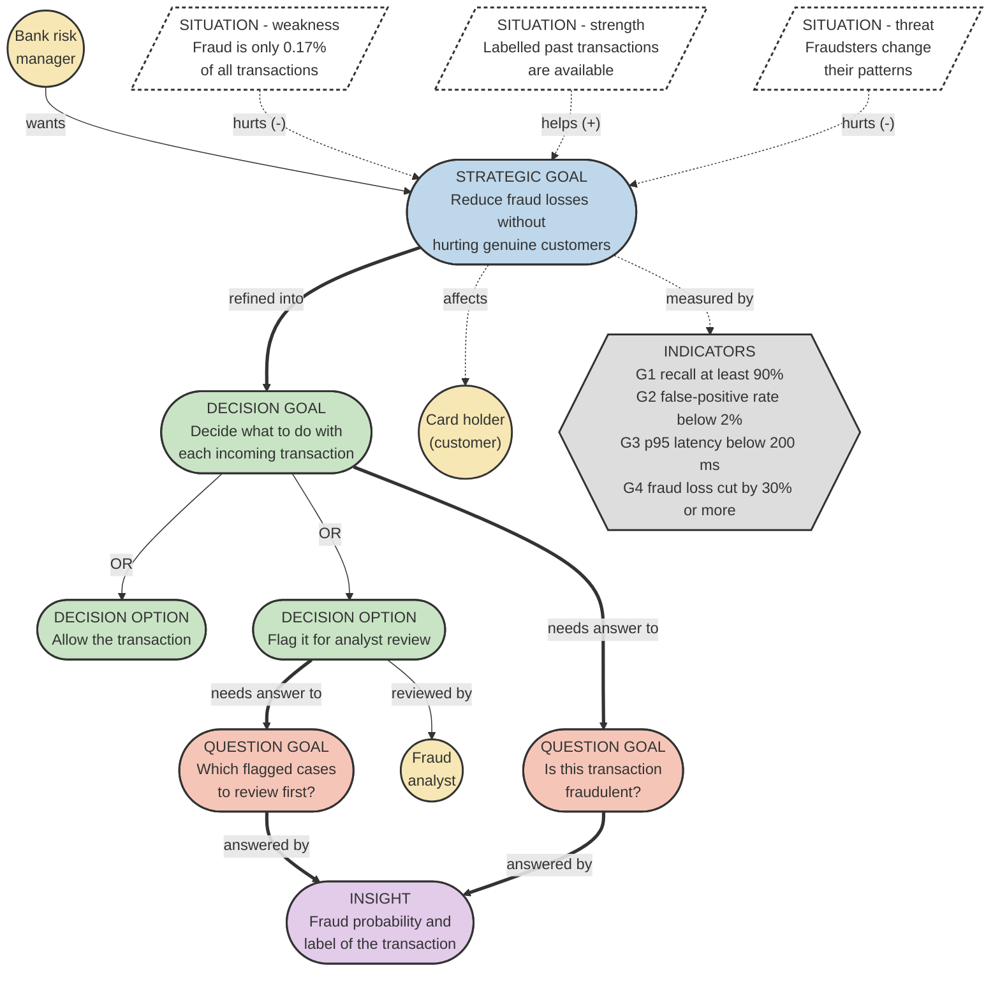

Colour key: yellow circles are actors. Blue, green, red and purple rounded boxes are the strategic goal, the decision goal with its options, the question goals and the insight. The grey hexagon holds the indicators, and the dashed white parallelograms are situations. Thick arrows connect the goals, thin arrows show OR alternatives and who acts, and dotted lines are influence links (helps +, hurts -), "affects" and "measured by".

**Explanation:** The bank risk manager wants the strategic goal, which is to reduce fraud losses without hurting genuine customers. The card holder is affected because a wrongly blocked payment is annoying for them. The strategic goal is refined into one decision goal: decide what to do with each incoming transaction. This decision has two alternatives (an OR refinement): allow the transaction, or flag it for review by a fraud analyst. To take the decision the bank needs the answer to the question goal "is this transaction fraudulent?", and for the flagged cases the analyst also needs to know which ones to review first. Both questions are answered by the same insight, the fraud probability and label of the transaction (a higher probability is reviewed first). Three situations influence the strategic goal. Fraud is very rare (weakness), so it is hard to learn and easy to miss. Labelled past transactions exist (strength), so a supervised model can be trained. Fraudsters change their patterns (threat), so the model must be retrained, which the pipeline and the registry make possible. The strategic goal is measured by the four indicators G1 to G4, which are the measurable goals in Section 2.2.

### 3.2 Analytics Design View

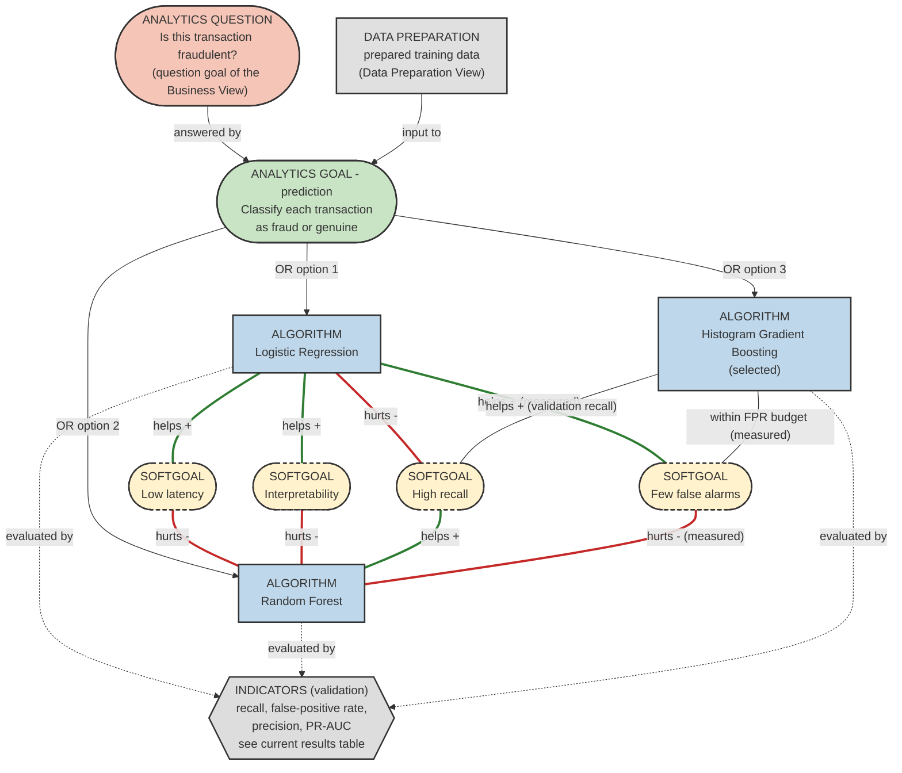

Colour key: green links are positive contributions (+) and red links are negative contributions (-). The Logistic Regression and Random Forest contribution links describe the earlier comparison shown in Figure 6. The boosted candidate's measured links use the current validation results table. The other links show our expectations before training.

**Explanation:** The analytics question comes from the Business View: is this transaction fraudulent? It is answered by a prediction goal that classifies each transaction as fraud or genuine. We first compared Logistic Regression and Random Forest, then added Histogram Gradient Boosting to investigate the recall shortfall. We expected the linear model to be easier to explain and the tree models to learn more complex patterns. All three use the same prepared training data and validation indicators. We now aim for a recall margin while keeping the false-positive limit; the measured choice is reported below, rather than decided from the test scores.

<!--A:analytics-->We compared Logistic Regression, Random Forest and Histogram Gradient Boosting. Histogram Gradient Boosting was selected using validation recall and the false-positive limit, not test results. It reached 92.6% recall and 1.84% FPR on validation, then 86.3% recall and 1.91% FPR in the exploratory test evaluation.<!--/A:analytics-->

### 3.3 Data Preparation View

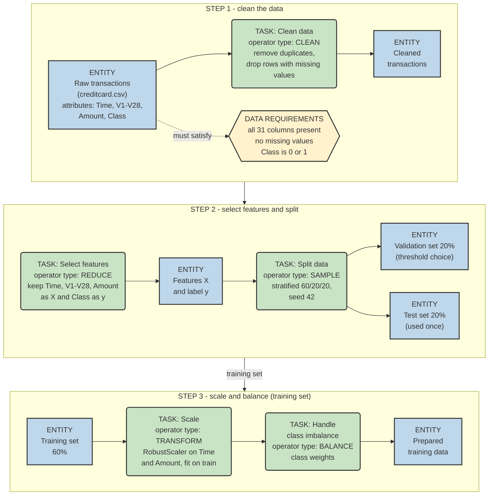

Colour key: blue boxes are entities (data) with their attributes, green boxes are data preparation tasks, and each task names its GR4ML operator type (CLEAN, REDUCE, SAMPLE, TRANSFORM, BALANCE) and how we applied it. The yellow hexagon lists the data requirements the raw data must meet. Arrows show the flow of the data.

**Explanation:** The raw entity has Time, V1 to V28, Amount and Class; ingest requires all 31 columns. The CLEAN task drops 1,081 duplicate rows and rows with missing values. It then rejects an empty dataset, nonnumeric or infinite features, negative Amount, and labels other than 0 or 1; both classes must remain. The REDUCE task selects the 30 inputs and label. The SAMPLE task uses a stratified 60/20/20 split with seed 42. On training data only, TRANSFORM fits the RobustScaler for Time and Amount, and BALANCE supplies class weights to the classifier. Validation selects the threshold; the frozen pipeline is evaluated on the test set. The API also enforces finite features and nonnegative Amount and rejects extra fields.

### 3.4 GR4ML concept mapping

| GR4ML concept             | In this project                                                                                  |
| ------------------------- | ------------------------------------------------------------------------------------------------ |
| Actors                    | Bank risk manager, fraud analyst, card holder                                                    |
| Strategic goal            | Reduce fraud losses without hurting genuine customers                                            |
| Decision goal             | Decide what to do with each transaction (OR: allow, or flag for analyst review)                  |
| Question goals            | Is this transaction fraudulent? Which flagged cases to review first?                             |
| Insight                   | Fraud probability and label per transaction                                                      |
| Situations                | Fraud is rare (weakness), labelled history exists (strength), fraud patterns change (threat)     |
| Indicators                | G1 recall, G2 false-positive rate, G3 p95 latency, G4 fraud loss reduction (Section 2.2)         |
| Analytics question / goal | Is this transaction fraudulent? / prediction (binary classification)                             |
| Algorithms                | Logistic Regression, Random Forest, Histogram Gradient Boosting (selected in the current run)    |
| Softgoals                 | High recall, few false alarms, low latency, interpretability                                     |
| Data preparation entities | Raw transactions, cleaned data, features and label, train/validation/test sets, prepared data    |
| Tasks and operator types  | Clean (CLEAN), select features (REDUCE), split (SAMPLE), scale (TRANSFORM), class weights (BALANCE) |
| Data requirements         | All 31 columns present, no missing values, Class is 0 or 1                                       |

## 4. Top Three Quality Requirements

| #   | Quality requirement   | Measurable target                                         | Justification (why it matters here)                                                                                                            | How architecture supports it                                                                                                                                                                     |
| --- | --------------------- | --------------------------------------------------------- | ---------------------------------------------------------------------------------------------------------------------------------------------- | ------------------------------------------------------------------------------------------------------------------------------------------------------------------------------------------------ |
| 1   | Accuracy (recall)     | Recall at least 90% with false-positive rate below 2%     | A fraud that is not detected is a direct loss for the bank. The classes are very unbalanced, so overall accuracy would hide the missed frauds. | We use class weights and a separate validation set to choose the threshold, and we report recall, precision, F1, PR-AUC and the confusion matrix instead of accuracy.                            |
| 2   | Performance (latency) | p95 latency below 200 ms                                  | The decision has to be taken while the payment is being processed, so a late answer is as bad as no answer.                                    | The model is loaded once when the service starts and kept in memory. The prediction service is separate from training, so for each request it only validates the input and calls the model once. |
| 3   | Security and privacy  | No card number accepted or stored; invalid input rejected | Card data is sensitive, and a service that accepts any input can be misused.                                                                   | The API accepts only the numeric model features (no card number or name) and rejects any extra field. The prediction log stores only the probability, label, latency and model version.          |

**Why these three:** each one is tied to a stakeholder and a measurable goal. Recall protects the bank's money (risk manager, G1 and G4), latency is needed because the answer must arrive while the payment is being processed (payment system, G3), and security and privacy protect the card holder's data. We also considered other quality requirements and ranked them lower for this application:

- **Explainability:** useful for fraud analysts, but V1 to V28 are anonymised components, so a feature-level explanation would not mean much to an analyst. We kept interpretability as a softgoal in the Analytics Design View instead.
- **Fairness:** it cannot be measured here, because the dataset has no customer attributes such as age or gender.
- **Availability and scalability:** important in production, but our prototype runs one instance of each service. The microservice design (Section 6.2) allows the prediction service to be scaled separately later.
- **Maintainability:** supported by the Pipe-and-Filter design and the 30+ automated tests, but it does not directly affect the bank's losses or the customer, so it is not in the top three.

Authentication of API clients is not part of this assignment. We list it as a limitation of our prototype.

---

# Objective 2: System Architecture

## 5. System Architecture Diagram

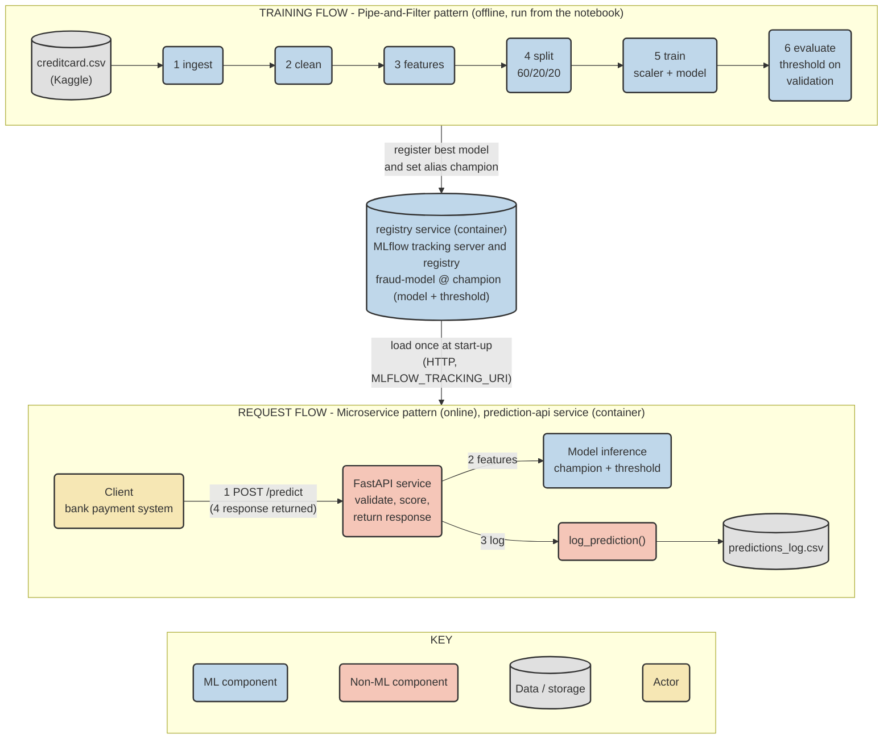

The key inside the diagram explains the colours: blue is an ML component, red is a non-ML component, grey is data or storage and yellow is an actor.

**ML components:** the six pipeline filters (ingest, clean, features, split, train, evaluate), the MLflow model registry that keeps the trained model and its threshold, and the model inference step inside the prediction service.

**Non-ML components:** the FastAPI service with the /predict and /health endpoints, the pydantic request validation, the log_prediction function with the prediction log file, and the client that sends the transactions.

**Request flow:** (1) The client sends a transaction to /predict. (2) The FastAPI service validates it and gives the features to the loaded champion model, which returns a probability. (3) The service compares the probability with the threshold and writes one row to the prediction log through log_prediction(), and (4) the response goes back to the client.

**Deployment:** with Docker Compose the registry and the prediction API run as two separate containers that talk over HTTP (Section 7.7).

**Training flow:** the Kaggle dataset goes through the six filters. In the last filter the threshold is chosen on the validation set, the results are logged to MLflow, and the best model is registered as fraud-model with the alias champion. The prediction service loads this model when it starts.

## 6. Architectural Patterns

### 6.1 Pattern 1: Pipe-and-Filter

**Why we chose it:** Our training workflow has several steps: reading the data, cleaning it, preparing features, splitting it, training and evaluation. Putting all of them in one script would make it harder to test or change one step. Pipe-and-Filter lets each step take the previous step's output and pass its result to the next one.

**How we used it:** We kept the six stages in separate modules under [pipeline](pipeline). [pipeline/run_pipeline.py](pipeline/run_pipeline.py) calls them in order. The training stage accepts a classifier name, so we could compare Logistic Regression, Random Forest and Histogram Gradient Boosting without changing the earlier stages.

**Benefits and limits:** We can test each stage separately, reuse the data-preparation code across the models, and change one stage without rewriting the whole pipeline. We still pass complete tables in memory. This works for our dataset, but we have not tested it with much larger data.

### 6.2 Pattern 2: Microservices

**Why we chose it:** Training takes more resources and runs only when we need a new model. The prediction API needs to answer requests without training a model each time. Keeping these jobs separate makes deployment and maintenance easier.

**How we used it:** Training runs as an offline job. We run MLflow and FastAPI in two separate containers using [docker-compose.yml](docker-compose.yml). MLflow stores the models, and [api/main.py](api/main.py) loads fraud-model through the champion alias at startup. The API handles /predict and /health; it does not train. It contacts the registry over HTTP, and Docker waits for the registry's health check before starting the API (Section 7.7, Screenshot 7).

**Benefits and limits:** We can restart the API without running training again, and the model version is included in each response. The design could support more API instances, but we have not tested scaling or failure recovery. Both containers use the same host and project folder, so a host or storage failure can affect both. The API also needs the registry when it starts, and it must be restarted to load a new champion. For a production setup, we would need a shared artifact store and logging that works safely across multiple API instances.

## 7. Implementation

### 7.1 Technology stack

| Layer              | Technology                                                  | Purpose                                                |
| ------------------ | ----------------------------------------------------------- | ------------------------------------------------------ |
| ML pipeline        | Python, pandas, scikit-learn                                | Filters for data preparation, training and evaluation  |
| Model registry     | MLflow (SQLite backend)                                     | Tracking of runs and registry of the champion model    |
| Prediction service | FastAPI, pydantic, uvicorn                                  | Separate prediction microservice with input validation |
| Logging            | CSV file written by log_prediction()                        | One row per prediction                                 |
| Testing            | pytest, FastAPI TestClient                                  | Tests named after the business rules                   |
| Deployment         | Docker, Docker Compose                                      | Registry and prediction API as two containers          |
| Runtime            | Jupyter notebook 13.ipynb (runs in Google Colab or VS Code) | Runs everything from top to bottom, no GPU needed      |

### 7.2 Pipe-and-Filter pipeline

The notebook writes each filter to its own file and run_pipeline.py joins them. ingest checks that the file and the columns exist, and stops with an error if they do not. clean drops duplicate rows and rows with missing values. features takes Time, V1 to V28 and Amount as inputs and Class as the label. split does a stratified 60/20/20 split with seed 42. train fits a scikit-learn Pipeline where a RobustScaler for Time and Amount comes before the classifier, so the scaler is fitted on the training set only and is saved together with the model. evaluate aims for 95% validation recall within FPR below 2%; when that margin is infeasible, it takes the highest feasible recall at or above 90%. The model and threshold are frozen before test scoring. The repeated test evaluation is exploratory because we already saw the earlier results.

```python
# each stage hands its output to the next one
raw = ingest(data_path)
df = clean(raw)
X, y = build_features(df)
parts = split(X, y)
# train every candidate on the training set and judge it on the validation set
fitted = {}
for name in candidates:
    model = train(parts["X_train"], parts["y_train"], name)
    threshold, val_m = evaluate_validation(model, parts["X_val"], parts["y_val"])
    fitted[name] = (model, threshold, val_m)
# the winner is chosen from validation results only; the test set is used once at the end
winner = pick_winner(fitted)  # validation recall margin within the false-positive budget
model, threshold, val_m = fitted[winner]
test_m = evaluate_test(model, parts["X_test"], parts["y_test"], threshold)
```

<!--A:results-->**About these results:** The model results and Docker screenshots use Docker champion version 17. The latency measurements and charts are from the saved native notebook run using version 8. The native and Docker registries number their versions separately. We checked the Docker version, threshold and results against the running API and the model's MLflow run.

**Model results:** The dataset has 284,807 rows with 492 frauds (0.173%). After removing 1,081 duplicate rows, 283,726 rows remain with 473 frauds (0.167%). The stratified split gives 170,235 training, 56,745 validation and 56,746 test rows. We aimed for 95.0% recall on validation while keeping FPR below 2.0%. Where that was not possible, we chose the highest validation recall within the FPR limit, provided it reached the 90.0% minimum. Infeasible candidates are shown for comparison.

| Model (validation) | Threshold | Recall | Precision | FPR | PR-AUC |
|---|---|---|---|---|---|
| Logistic Regression | 0.7692 | 0.9043 | 0.1286 | 1.02% | 0.786 |
| Random Forest | 0.0010 | 0.9574 | 0.0067 | 23.59% | 0.859 |
| Histogram Gradient Boosting | 0.0226 | 0.9255 | 0.0769 | 1.84% | 0.858 |

We compared 3 models on validation. We selected Histogram Gradient Boosting (version 17) using validation results only: it gave the highest feasible recall (92.6%) within the false-positive limit (1.84%). Below are the test results at the frozen validation-selected threshold:

| Recall | Precision | F1 | PR-AUC | ROC-AUC | FPR |
|---|---|---|---|---|---|
| 0.8632 | 0.0705 | 0.1304 | 0.7796 | 0.9716 | 1.91% |

Confusion matrix on the test set: TN 55,570, FP 1,081, FN 13, TP 82. **The FPR target (below 2%) is met, but the recall target (at least 90%) is not met on the test set (86.3%).** On validation the recall was 92.6%. The test set has only 95 frauds and the validation set 94, so missing just one more fraud changes recall by about one percentage point, and a threshold that is only just enough on validation can fall short on new data. We report the result as it is and did not tune the threshold on the test set.

**Fraud loss (goal G4):** We measured the loss in money using the Amount column and assumed that every flagged fraud is stopped. The 95 frauds in the test set add up to 14,766.31 and the model catches 12,167.76 of it, so the fraud loss goes down by 82.4%, against the target of 30% (met). The cost is that genuine transactions worth 280,972.10 were also flagged, and a real bank would have to consider the cost of these blocked payments too. This is only an estimate from the test set and it does not include chargeback fees or the cost of reviewing the flagged transactions.

**Note on the selection rule:** After seeing the earlier recall shortfall, we added a boosted-tree candidate and a validation recall margin. We compared two boosted-tree configurations using training and validation data, then froze the choice before this test evaluation. The test set had already been inspected, so this is an exploratory result, not a fresh hold-out assessment.<!--/A:results-->

<!--A:fig_cm-->**Figure 5 - Confusion matrix on the test set.** This is the saved native notebook chart for model version 8, not the current Docker model. The current model's counts are in the results table above.

![Confusion matrix on the test set](data:image/png;base64,iVBORw0KGgoAAAANSUhEUgAAAdcAAAFTCAYAAABrpUYPAAAAOnRFWHRTb2Z0d2FyZQBNYXRwbG90bGliIHZlcnNpb24zLjExLjIsIGh0dHBzOi8vbWF0cGxvdGxpYi5vcmcvgI3uAAAAAAlwSFlzAAAPYQAAD2EBqD+naQAANgNJREFUeJzt3Qd4FFXXwPGTQu+9995EqgIKSBEBERAFBQUBAREFKfphe8UXEVEBUVFpKoiiqJQXFekKIqACAkpHpVel10Dme87VWTebTbKb3CUh+f+eJyQ7Oztz587dOXPbEOY4jiMAAMCacHubAgAABFcAAEKAmisAAJYRXAEAsIzgCgCAZQRXAAAsI7gCAGAZwRUAAMsIrkjQqVOnZPPmzfL777+HJLe2bNkiBw8e5Exc5fzZu3ev+fH2yy+/yOHDhwP6fFo/bzt37pQ9e/Zck3kSzHlOabZcpTy+dOmSyacLFy4k6vMEVxETNDQTE/rZvXu3lZOmgerQoUOS0p07d07atGkjhQoVkrvvvluee+65kOynXr16MmLECEntEnveQ5E/x48flxo1asjSpUtjLK9WrZqMHTs2pOm6Vsp/Qtq1aycPP/xwspTlpOZhMOc5OWyO5/iuVh5HRkZKp06dZPjw4Yn7vPUUXYM0aKxbt87z+sSJE7J//34pXry4ZMuWzbP8pptuknfeeSfJ+6tZs6Y89NBD8tprr0lKpse6YMEC2bVrlxQrVixk+6lcubIULlxYUrvEnvdQ5I9eMPLkySP33XdforeR2HRdK+U/JZfl1JyHCR3f1crj8PBwExu6desmffr0MfEgGARXEZk2bVqMTHn//fele/fuMm7cOHN3mlbpDUfRokVDGljV999/H9LtX+ts548280+aNEn+85//SERERIpJV2pAnqSuPG7fvr3069dPxo8fL6NGjQrqszQLBykqKsrU5LSvJa7/8+Dy5cumL8u3WUOXa/Oyfu7PP/8Murn5ypUr8scff8TbV3LmzBnZvn27HDlyJMG+losXL5p+o9OnT/vta3D749x0njx50nMMf/31V6xt79ixI1YfVHz5EUgfio3jiY/357Vv5bfffjPH702X63a1mdwfPW43j7Zu3WqaXIM9797p0P3rNnVdf/mjeazr63Z9y0cg5emjjz4y+dq5c+d410soP+M6b6Eq/740v/T7EB0dHWcfaHz5mtB586Vl0Ht/wZblhK4dgZRl23mozp8/b/Z19uzZeNdL6LsYzHqXk1BG/OVxYq4DgZSfdOnSmS6xd999N9b3LUH6v+Igpvfee09LvjN79mzPsnPnzjkDBgxwsmTJ4hQoUMDJlSuXU6xYMeezzz6L8dlnnnnGyZYtm1O4cGHzfsGCBZ1x48aZ944dO+ZUqVLFCQsLc/LkyWP+1p8+ffrEewp034899pjZbs6cOc02y5cv73z11VeedY4cOeJ06NDBiYyMdIoWLeqkS5fOuf76652VK1fG2JYe1//93/857777rlOkSBGnUKFC5jNDhgzxrPPbb7+ZdOn+0qdP70nnvHnznL1795ptvPHGG7HSWaFCBadt27YB54crR44cTr9+/WIss3k88XE//+abb5rP582b18mdO7fzxRdfmPdff/11k/Z8+fI5mTNndqZMmRJrG23atPHkUalSpUxab7jhBmfTpk0Bn3c3HW+99ZbZn5avsWPH+s2fZcuWOREREaY8enviiSec8PBwZ8GCBfEec7t27ZwyZcrEmx+B5Ke/8xaK8u9r9+7dTsOGDc12ihcv7pQrV85Zs2aN2Vbr1q39Ho+/fE3ovLm0zDdu3NjsT48pvv35y5NArx2B5L2tPHT3peVbz1H+/PnNd12vM5cvX07UdzHQ9Z5JYhnxl8fBlNtgyo+aMWOG2f6qVauCy+Og1k7DwbVly5bmAvvtt996lr366qvmBC1dutS8/vjjj83nFi1aFKPA+Z7gDBkyxLowxiU6Otpp3ry5KWjz58/3LN++fbvz8ssvm7+joqKcGjVqmAK9ceNGs+zUqVNOq1atnEyZMjmbN2/2fE7TV79+fWfo0KGeL5EWbF3ue1HWgqYB01swwTXQ/PD9soTqePzR9fSC+p///MfkterZs6eTNWtW80V98sknnStXrpjl+gXPmDGjc/DgwXi3qcfYokULcwN08eLFgM67pqNu3brO4MGDzXHo5/QL7y9/1MiRI81nZs6caV7PmTPHlMVhw4YleMx6gb/rrrviTEeg+embrlCUf1+XLl0yF0HNW70JdC/IelHXC6W/4BpXvgZy3nR/1apVc8qWLevs3LnTs56Wc3/783euArl2BJv3SclD73zRc+PuS4O9BkQNUsF+FwNd72MLZSSu4BpI3gVbftxrrW5Hz1lQeRzU2mk0uGpB0NeTJ0+Ota5emJs1a+a5I9NCcf78+Xi3H8wXQwOq7nvChAlxrjNr1iyzzrRp02IsP3TokAkGDzzwgGeZrlexYkVPwFBaGPXL3717d6vBNdD88P2yhOp4/NHPV6pUyRNY1bZt2/xud9euXWb5O++843dbepHQi4jWfLSs6Lpr164NOLiWKFEiVq3BX/4oTa/WvLQG8OWXX5oWDQ0M3un1Ry+CelHv27dvnOkIND990xWK8u9LA4Cmce7cuTGW//LLL2a5v+AaV74Gct4+//zzWDfa6ueff/a7P988CfTaEWze2wiupUuXjpUv+t3SYKiBMZjvYqDrPWOhjMQVXAPJu2DLjzpx4oR5b+DAgU4w6HMNwJIlS8zvUqVKmb4ZbfPXoeL6U7p0afnhhx/M+02bNjX9Ou6oYl03qb755hvzu1WrVgl28Ov+vRUoUECqVq0aawBAgwYNzEg4lw5q0WOzNdXIldj8uNrHU79+fQkLC/O81s+qG264IcZ2S5QoYV779st8+umnUrZsWTP46/bbb5d77rlHRo4cad7TPp1A3XzzzQEPMNL06kC8vHnzSuvWrc2o9g8//DBGev3RfmO9FmXOnDnOdRKbn6Eo/75Wr15tfjds2DDG8ipVqkju3LmDytdAztuqVavM78aNG8f4bPXq1SVXrlzWrh1X+7sZV77ccsstpg92/fr1QX0XA12vaQjLSCB5l5jy435XEuqT9kVwDYBOzVH9+/eXu+66y3Rwd+zY0fxs3LjRM0Rbv4DLli0zX5pnn31WKlWqZL64r7/+uiRlZKfSaRPxDSBQ/gqHLvPt2NcLsq9MmTIFVHi8g5Av3w7/xObH1Twef5/XQQz6xfRdrsv0Pe/trl271syF0wCnA750wIoOrpg8ebJ5P77BL74KFiwowciePbuULFnS/F2nTp14y4j3Z/QY4hu8k9j8DEX591c29AKqx+ErrmDnL18DPW/x7S+ui3Firh22ynIwcubMGecxud/BQL+Lga7XOIRlJJC8S0z5cb8rgXy/vBFcA6AnX82bN8/vwyU2bdrkWbdRo0Yyc+ZMOXr0qPz666/mDmnAgAHy9ddfS2K402B0FGtc3Dlf/kbq6rIiRYqILW4B870468VI5wb7Skx+XM3jSar58+ebmqDOh8uYMaNnuY5EDVaw02KGDRtmWjZ0Ht6sWbPk7bffDuhzZcqUifVkJltsl39f+kATLWu+o0V12YEDBwLO10DPm7s/323HVd6Tcu242vbt2xdrmfudc7+DgX4Xg/nONgpxGbFdftxjKleuXFD7IrgGQO829Qs6YcIEv++7j8fyfUyWTnbWC6DS5iBXjhw5TNNLIDp06GD2/eabb8Z6z50yok1aaurUqTHe1yYQbXZx37dBL0RaW1qzZk2sJjZ/U1gCyQ9fV/N4ksp9yIh3bVqnxPgrK8Gc94ToheiFF16QoUOHmnnZGmAHDhxoamQJ0YvZjz/+GOdUssQKRfn3pTVNpU3g3ubMmWOmYNg+b25Zmz59eoLlPSnXjmDZKEsLFy70TEtyffDBB6Y2rU9wCua7GOh6F65CGbFdftymZL0pCAYPkQhA+fLlTbOF3l3p3ZY272gNTmuTX3zxhWmTnzhxojz++ONmbpc+eEL7crRJVx8xpk0Qd9xxR4zHd+mTj7Q/Rvsk9Iuu/Xlx7fvVV1+VQYMGmYKp/ULa1LF8+XLTrKR3gPoYO02bTnLWL/Jtt91m5mxpeq6//noZMmSI2KRpeeyxx8xTfpo3by4//fST+fG9sws0P3xd7eNJijvvvNM8jKFr167mIqFfUH34iDZ/+Qa6YM57fPROWp+spPtwH8321ltvmYd+6MVc9xtff6DesGl51f4+7Ve2JRTl31etWrWkd+/epknR7TfU2t+iRYtME2N83RaJOW/6pCDdn67rXmA3bNhgApPuz9a1I1g2ylLbtm1NedHvsp4j7QPVmy4NNG5tP9DvYqDrPX4Vyojt8qPp0OPTpuygBDX8KY3QaQ06XHvJkiUxlusIQp2OUa9ePTPSr3PnzmYOlI7AdEen6Wg0XV6nTh2nSZMmZoj577//HmM7+/btM9M9ateu7VStWjWgOWorVqxwunbtaj6j233uueeckydPxljnk08+MaN1dUi8zst78cUXnTNnzsRYR4/LnefnTUfzabq9Pfzww2ZEqj86Wvjmm292brzxRpMWnbqg6/bv39+zTqD5ofk5YsSIWPuwfTz+xPX56tWr+x16X7NmTeell16KsUxHmeq+9NzcfvvtZvSujj7UbS9cuDCg8x5XOvzlT48ePUz505GY3nSUs84r1OlD8dGRxjq1RM9voPnhLz990xXK8u9NR4SOHz/eadSokckHnTqi5aJkyZKxphjFl6+Bnjfdn86T1TLoTl85ffq0mS/sm4dxleWErh3B5n1S89Ddl46Svvfee025bt++vbN8+XK/6wfyXQxkvcsWyoi/PA4m74IpP0ePHjXzZSdOnOgEK0z/SfLtAIBrijZz9u3b1/ynFf4GglxrdDCd1gIfffRRGT16dHInB6mk/GiLhTYh6+juDBkyBLVN+lyBNKhLly7SpEkT061wrdHHCPq7WdDlLVq0SJY0IfWVnwsXLsjixYtlzJgxQQdWRc0VQLLTuYgJPQu2QoUKZhqR9tFpn6XO/da+Oh1/oH3Pt956q+kvTKuCycO0bOxVKj8EVwDJTv97se+++y7edXQQkU750CY8/V99dKCJTinKly+f+X+HdaBKWg4cweRhWnb5KpUfgisAAJbR5woAgGUEVwAALOMhEmmQ+6gvnZgd6KR7APCmszh1AJX24Sb0H0akRQTXNEgDq/vMYgBICh0U5D5DGf8iuKZB7nNV01fuJmER6ZM7OUihflvycnInASnY6dOnpGKZEp7rCWIiuKZBblOwBlaCK+Li77/lAuK6niAmGsoBALCM4AoAgGUEVwAALCO4AgBgGcEVAADLCK4AAFhGcAUAwDKCKwAAlhFcAQCwjOAKAIBlBFcAACwjuAIAYBnBFQAAywiuAABYRnAFAMAygisAAJYRXAEAsIzgCgCAZQRXAAAsI7gCAGAZwRUAAMsIrgAAWEZwBQDAMoIrAACWEVwBALCM4AoAgGUEVwAALCO4AgBgGcEVAADLCK4AAFhGcAUAwDKCKwAAlhFcAQCwjOAKAIBlBFcAACwjuAIAYBnBFQAAywiuAABYRnAFAMAygisAAJYRXAEAsIzgCgCAZQRXAAAsI7gCAGAZwRUAAMsIrgAAWEZwBQDAMoIrAACWEVwBALCM4AoAgGUEVwAALCO4AgBgGcEVAADLCK4AAFhGcAUAwDKCKwAAlhFcAQCwLNL2BgHbLh9ZL9Fn9vt9LzJ/LQnPWiik6zqXL0rUnkXxpjEyf00Jz1rY89pxouXKX1sl+swBEeeKhGfMIxF5q0hYZKYEjhY2XblyRVZ9v1K++N8c2blzh9SuXVeGPv1snOuv/elH+WTGh7J//z4pWLCQ3NXxHqlXv0Gs9aKjo2Xu7M/l+5XfyaFDByVfvvxSu05dubvTvZIuXbokpQGpA8EVKV70+WMSfWq33/ec3BVDv65zOc71PArV+3f16Mtyadf/xDl78N99yU65fGyjpC/bXsIz5op/W7Bix47tcmuThnLs6NGA1p/4zlvy+KABJnC6Jk14W55/YaQMHPy4Z9mpU6fk9tuayfp1a2N8Xtcd/coomb9wqeQvUCBRaUDqQXDFNSJM0pVqFWtpeOZ8oV83IqOkK9Xaz2cdidq9SMIy5pbwTHk8Sy8f+tEE1rAMOSQiXw0Ji0gvV45vMwE6as9iyVD+7vgOFJacPnVK/vrzT6nf4GZp3uI2ef4/T8e5rgbB/xsyUCIiImTAoCFSq1Zt+fWXX2Ts6Jdl2LNPSdNmzeW66tebdd8Z/4YJrCVLlpKH+j0qRYsVk4MHDpjgun3bVhnz6ih56ZUxQacBqUuqC65VqlSRV155RVq1in3BTImutfQmp4gcJZNl3bDwCL/rXDn1h0h0lETkqRyzOfjPzSLhkZK+TDsJS5/VLA/PWVYu7Zxtgm70ucMSnvnvmg1Cp1z5CrJz9wHJly+fnDlzJt7A9t6USXL58mUZ/uIoeWzQELOsbfsOUqx4cXm4z4MyeeI78vr4d8zy337bZX6/P32G1Kpdx7ON21q2lmqVynreDzYNSF0SNaBp27ZtUrRoUbn77sTdgVeoUEEWLFggobB//345d+6cXCuutfQmp6iDa+TS7/Mlas9S05/pRF+56ut6u3LsV5HwdBKRs6xnmXPhL5ErFyQ8eylPYFVhYWESmaeK+Tuufl7YlS1bNhPUArFyxXJTa+3es1eM5fd0vs9sZ8Xybz3Latep4+mf9fbjD6vN71q16iQqDUhdElVznTx5smTNmlVmzZolf/zxh5QsGXgtwQ0o58+fT8yuU53NmzdLrlz0wSXMkSuHf/K8uvLXFgk7sk7Sl74jRhAL7bpen7p02jTzRuSuaJp9PcsvnjS/vZuJXWGZ8sZYBynHb7t2SokSJSVHjhwxluvgpAqVKsv6tT+J4zjmJqlb9wflhzVrZMjA/qaftkiRInLo0CHZ/Osv0qZtO3n0sUHJdhy4hmuuUVFRMm3aNBk+fLjceOON8t577/ldZ+TIkVK3bl2pVKmSPPLII3Ly5N8XlHr16pma2oMPPmhqvzVr1jQDBPTvjRs3xtiOvjd79mzP68aNG5v1ihcvbvY9YsQIuXTpUlDpP3LkiNx///1Srlw5adKkiXzyySdSp06dGPvR9L/44otSq1Ytk/5OnTqZ2ro3vaGYPn26dO3a1TTt3nTTTfLVV1953g/0mJo3by7Lli0LeLuBpi91CZPwHKUlssjNkq7ErRJZ8AaRdFnFuXDc9GFenXVjuqxNv+LEaBJWzpV/ymNEhthH8c8y50pUYjIBIXT69GnJGcdNbq6cOc2IX7eFSQNujwd7S606dWXb1i2ydMliE1irVK0mvfs8LJkzZ+ZcIfia67x588wdXNu2bU1he/bZZ+W5556T8PB/47Re7Dds2CBjxowxQUyDx+jRo+W///2vCSxlypSRUaNGSYsWLUxTjI7O09qsb6A8cOCAnD171vNaA6EGFl1/+/bt0r9/fxPEdFuB6tChg+lb+fDDD822+vXrZwKg9366dOli7kTHjh0r+fPnlxkzZpibgi1btkiBf0YB7tu3TwYMGCBvvPGGPP300yZtd955p+zYsUOKFSsW8DH5NgsntN1A05eapCtyk4RFZoyxLCJvVbm0/VPTxBp98ZSEZ8ge0nW9uf2qZiBTloIx3gsL++d74Dh+P/f3SkwvT2kiIyPNdcGfqKi/l7tTbL6e/6Xce/edpqY78uXR5nt58OBBeXfyRGl7+20y5f0PzBQepG3hiWkSfuCBByR9+vTSsWNHc8fn3X+6Zs0aE0BnzpxpAnDlypVNABs2bJh5v2DBgqZpJU+ePKZmV6jQv/MOE6KBw625NmvWTF599VV5//33A/78ypUrzY8GVq1VN2jQwNS89WbBtXbtWpN+/WnYsKFUrFhRnn/+efN76tSpMbb3xBNPSOfOnU0fst5kZM+eXZYvXy5JFd92g0mf6+LFi+YmxPvnWuIbAN1l4TnLmL+dSydDvq636JO/iVw+JxG5K8V+8595rE7UmdjvRZ2Nc79IXnnz5jNzW/05cGC/6TvVa556cfjzJtAuWrZCHun/mBn49NDDj5jXuXLnluHD/nOVU49rvuaqtaqFCxfKa6+9Zl5nypRJ7rvvPpkyZYq0bNnSLFu1apUJnNpk6c27ZptYq1evNgFVa2gaILRWqM28WvMLpClm06ZNJpiXLl3as6xGjRoxPvv999+bYKvpd4Ou/j527JhUrVo1xva8X+sNg9Yidb2kim+7waTPpU30GoBTGyfq7xp/WFjkVV3XDGQKC5eI3BVivReeMbf5HX0m9oXaXRaWMXZ/LJJX5SpVZNHCBfLrL5tM867rwP79smP7Nql7w7/zmHft3CH58xeQfPnzx9iG9tcWL15Cfl6/zrRc2bjmIY0EV7eWp32VLh2YpLXXo0ePmlFx2rSSIUPs/qak2r17t6mtDho0SJ555hnJnTu3rFu3Ttq3b2+CbCDBVddz7z69eS+7cOGCGWD03XffxVovS5YsMV5rk7Yv71pwYsW33WDS53ryySdNvrn0xsRtYk7pnEun5MrpfRKRq4KZEmOWOY5En9gh0cd3aDXw34FCIVrXW/TFEyZIau3W39OWdBBUWKZ84pw7YkYe64An87kLJ+Ty0Y1/B+XsJUKYY0iMVre3McH1qf8bIp98PlcyZsxouo2GPjHIlIvWbe7wrFuocBHT1/rpJzPME5lc87/6QjZt3CCFChcmsCLw4KoFTIOr1lo1oHnT1zrIafDgwaYZWPsftJarTbhxBQ/vIKRBQe/yNEi7tDbqXQvU5ly9M9R+W5fvQJ+ElC1b1vRxHj9+3DNCV9N54sQJzzo6iEj3q/svX768JFYgx5QYiUmf3uyE4obnatBHD17eu0wu7//OPJRBBwVF62jbf5pdIwvUkbCIdCFd19uVY7+Y3xG5Yw5k8hZZsK5E/f6lRO1ZYgKqjiaOPnvIPAYxIl91CUvHgJer5f7OHU0FIPrK39Or1q39Se5q38b83ax5C9Ocq+7r2l1eHzvGDE6qWrGMVKlSVbZt3WqaigsXKSIP9n7Is02drjP08UHSo9t98uIL//X0uW7dooPcRLr36JWoNCB1CbjdYsmSJbJnzx7TF6hB0/tHB9xo07C69dZbTYDt0aOHabJVWsOcOHGiZ1s6dN17dKv2X1SvXl3effddMypPa5gaqPVvl+5Ha8c//fT3tAkdhPTCCy8EdbCaNt3OkCFDzD60wHvX6JQOstK0dOvWzdSWlY50fv31100eBCqQY0oMW+m7VoSlzy4RZn6oI44+rlDniGoAjMgokYXrS2TB2iFf1/uxhlf+2iaSLpuEZ4u75q8PnIgsdotIeHpxzh/9e9tOtBlZrNvG1bNowdeyYP5Xplaqjh45Yl7rj9YyXVpTnTXvK6lRs5YcPnTIBFkNrJWrVJU58+abPlfXw4/0lxEvvWL6V3fu2C7Lli4xgVW7yQYN+T954smnE5UGpNGaqw5k0mkh2p/qq127dvLUU0+Z2qUOEtIBTr179zZBVGtwOmJYg4xLR8H27dvX1IILFy5sgu+ECRPMKGOtnWpB79Wrl+TN+2+znA7e0dHBun3dpgave++9V8aNGxf4wUZGmoFWeoOgg4S0KVmnvGgt1m0a1lq1pl+nD+mAIre5WYOZrhuMhI4pMWym71oQFplB0hVrLJFFbhLn4gnTH6rNsWGZ8vw7MjfE63pEX5F0xZtKWLospi88PpF5KktErvLinDsqjnlwf25qrMnggxkz4xwFXKxY8Rivy5YtJ8u//8EESu1r1ecDV612XazP6bnv/9gg6dO3n/z+2y6zbpasWc26/rpmgkkDUo8wJ8BOQp36oQEiZ86cft/X5lYNIvpwCZfWDLXfQgOZL+3w1+ZNrcl5jxjWJlrdjhZgbWrRv737U7UGqDU1DVJaYA8fPmyCuHux06kuGiz1LjI+um+9UdAmYv2tNwb168esVei+tH/SX0DU49Xl3s2tmhb9cnnnQULH5JveYLYbX/rio5/RNGSo1ivGAxAAb0dXv06GIN7rSJH8ucz12N81Pq0LOLimFh988IFcd911pmlV+0O1NqnTh3QeqdZs0wKCKwJBcEVC1xGCa9zS3FhxDao9e/Y0tUWt8WlNUQdGpZXACgAIvTQXUbTWqoOi9H+o0H5Wf1NzAABIijQXXF2+/ZcAANiS5pqFAQAINYIrAACWEVwBALCM4AoAgGUEVwAALCO4AgBgGcEVAADLCK4AAFhGcAUAwDKCKwAAlhFcAQCwjOAKAIBlBFcAACwjuAIAYBnBFQAAywiuAABYRnAFAMAygisAAJYRXAEAsIzgCgCAZQRXAAAsI7gCAGAZwRUAAMsIrgAAWEZwBQDAMoIrAACWEVwBALCM4AoAgGUEVwAACK4AAKRs1FwBALCM4AoAgGUEVwAALCO4AgBgGcEVAADLCK4AAFhGcAUAwDKCKwAAlhFcAQCwjOAKAIBlBFcAACwjuAIAYBnBFQAAywiuAABYRnAFAMAygisAAJYRXAEAsIzgCgCAZQRXAAAsI7gCAGAZwRUAAMsIrgAAWEZwBQDAMoIrAACWEVwBALCM4AoAgGUEVwAALCO4AgBgWaTtDeLaseebVyV79uzJnQwA16DICOpm8SF3AACwjOAKAIBlBFcAACwjuAIAYBnBFQAAywiuAABYRnAFAMAygisAAJYRXAEAsIzgCgCAZQRXAAAsI7gCAGAZwRUAAMsIrgAAWEZwBQDAMoIrAACWEVwBALCM4AoAgGUEVwAALCO4AgBgGcEVAADLCK4AAFhGcAUAwDKCKwAAlhFcAQCwjOAKAIBlBFcAACwjuAIAYBnBFQAAywiuAABYRnAFAMAygisAAJYRXAEAsIzgCgCAZQRXAAAsI7gCAGAZwRUAAMsIrgAAWEZwBQDAMoIrAACWEVwBALCM4AoAgGUEVwAALCO4AgBgGcEVAADLCK4AAFhGcAUAwDKCKwAAlhFcAQCwjOAKAIBlBFcAACwjuAIAYBnBFQAAywiuAABYRnAFAMAygisAAJYRXAEAILgCAJCyUXMFAMCySNsbBFKic+fOyaKFC2Tu7Fmy+ddfpGz58jL9o0/8rvvbrl0y/YOpsuHn9fLXX39J0WLFpHnzFnJvl/skXbp0Vz3tuDrOnj0rUyZNlJUrV8ihgwclf/78UqfuDdL7oYclZ86cnvWuXLliytKX8/4n27dvk4iICClTpqx079lLataqxemCEeY4jvP3n0grTp06JTly5JDDf56U7NmzS2r3559/SvnSxU2AdV13XXVZs/bnWOsuWbxI2rRqIf6+FtWqXSeLv1mRJvIsrTl8+LA0uulG2f3HH7HeK1CggCxb/r2UKl3avG7VopksW7rE73aGPvWMPPf8cEkr15ECeXLIyZNp4zoSLJqFkepFRUWZ323atpPJ706VrFmzxlt70SA6/MWXZO4X881FddKU96VipUqyadNGmTjh7auYclwtb49/wwTWGjVqyocffyrLV66Rjz+dJfXqNzCBd8yrL3vWvXDhgrRs1VrefGuCfL1oqXy1YLH06dvPvPfSiy/Ils2bOXGgWTgh2hw0efJkueuuu/y+f+DAAbn//vtl1apVEh4eLmfOnEmWYlW0aFF56aWX5L777kuW/adkefPmlb0Hj0rmzJnN68ED+8e5bvNbW8gdbdvFWHZjvXpSrnwFaXxzPdm3Z0/I04urT5uB1TuT3pXrqlf3LK9dp66ULVlUDh36+30176sFkiVLlhifv6VJU7l44YK8/94U+Xn9OqlUufJVTD1SohRRc12/fr2EhYVJgwYNEvV5rYnMmTNHksPLL79smhCPHTuWbIEV8YuMjPQE1oRkypQp1rJLly7J7Fmfmb/rNbiJ7E6FGjZqbH7Pmf256VNV0dHR8vmnM/95/xbPur6B1VWx0t8BtXCRIlchxUjpUsSApkmTJkmdOnVk9erVsmXLFqlUqZJcK3bu3Ck1atQI+OKNa8OMjz6U10a/IhcvXZR9e/eaG6gnhj4lHTvdk9xJQwjoYLVt27bKuLGjTRNxwUKF5OiRI+aGuW+/R+Whh/9u9o2L3oB9+MFU06Vw080NOUdI/prr+fPn5aOPPpJhw4ZJ06ZNZcqUKbHWOX36tPTr108KFy4s2bJlk3bt2snevXvNeyVLljT9ZO3btze134IFC8qJEyfM3z/99FOM7eh706dP97yuWLGiWU+bc7VZtW/fvqaTPpjmxi+//FLGjBljtvPggw96akqjRo2S+vXrS8aMGc2xBbK/QNP9xx9/SLNmzUwtq3z58jJ69Gi/A3CQeMeOHpWNGzfItq1bTfkqXbqMVK12nTk/SH30vNaoWcucZ/0ebt2yxQyEK16ihNSuXSfeUeJaw+3ds7vs2bNbpk6fYUYPA8keXD/77DMz0uy2226T3r17y7Rp0zwDUJQGjdatW5s+zXnz5sn+/fule/fuMmPGDE+g0Waa2bNnm3UPHToU8L63bt1qPnP58mVZvHixbNy4UR5//PGAP69NwS1atJDBgweb7WjfrEsD3vDhw82NgRtck7o/Nz86dOhggrbWmhcuXChz5841fb9xuXjxogni3j+I3z2du8jqH9fL0m9XyjsTp5h879rlHvlg6vtkXSr00fQP5N6OHSRT5swyfcZM+fa71WZAU8GChaRn967y9vg3/X5OBzd1vuduWbTwa/ny68X0tSLlBFcNSD179jS1ubZt25rf//vf/zzvf/PNN7JixQoTTGvVqmUCsa73xBNPWEuD7lNrlc8//7x8+umnVrY5cOBAUxP3d8eblP1pfmzYsME0pRcpUsTU3CdOnBjvZ0aOHGmm3rg/xYoVC/p40pp8+fJJ9euvl3r160u37j3MFBxtKRj/xrjkThpCYPSro8zYDR352+Guu6XuDTdI23btzeClQoULm/d96RxonZaz+vuVsmDxN1Krdm3ODVJGcNWa18qVK6VHjx7mtQYirZV61wB1sJNO5q5QoYL1/WtN+MYbbzQBR5uFmjdvLsePH7cyMKlKlSoh2d/mzZtN83ihQoU8yzRQa3N5XJ588kkzF839cZvUEdyocW0hOXw48JYRXDu0Xz1nrlyxpmllyJBB8uXNJwf27zfNvy6dtnNLw/qmKXjR0uVStVq1ZEg1UrJkDa4aRHVkXvHixU2w0R+dTqJNnW4A0OY4W/1c3l+Obdu2mek1Gth37dpl0qE1ZKXNtkmVPn36GK+Tsj/vdCt/+RFfn6teILTG7/0D/8aOeVWWf/tNjDzXG6Anhgwy3QCVKse+acK1r1Sp0ibAjhn9iuf7qGVg8sQJZn5ziZIlTYuTWr9unZmWpestWbZCypUvn8ypR0qUbMFVC+bUqVPl448/NoHB++emm26S9957z6xXs2ZNM4l7+/btcW5La7zeF0O9+9RBRXpRdOkgBb04un788UfT9Kf9vDowSb84P/zwQ8iON5D9BZLuypUrm37ng//My3P7cpkGFL+Od7WXG2pdb360H1wfW+e+fuzRf0eCrvj2G2nR7BbJnT2zVKtcXiqULSklihSQN8aNNTdMTz/7d/85UpdHBww0v58e+oQUKZBHrq9Wyfx+tN9D5po04LHBnnXv79LJjO3QsSEdO7TzlCP3Z9r7f1+7kLYlW3DVUbbaZ9GyZctY7+lo4HfffdcEzMaNG5v5r507dzZNxHph1D5ZnV/qKlGihJnG495xaoCqV6+evPbaa2bE3759+0y/rnftTptS9Qui29LH4s2fP19GjBgRsuMNZH+BpFvzo1q1atKrVy8TZHfv3i19+vQJWbpTi21bt5jRv/qj5UoHorivf/ttl2e9wY8PldvvaGvW2bljh+zZvdv83ajxLaZfrcFNzHNNjbrc31WmffixqYXqgD8dJa43ttrfOnbcmzGm4rgDLvfu2eMpQ94/h48cTsYjgaT1ea465aZJkyZ+myh1Ws2gQYPMiNpbb73VBGIdwKQjc3Xkq37u9ddf96yvTckDBgwwQSl37twmiGmTs06N0cCr014effRR07/rql27trzyyitmOozWDLVGOGTIEHnqqadCcryB7i+hdGuT8Oeff26Ca5kyZczgJA2u2n+NuM38bI4JqP54l0ENnvqjN2oaWLX5Xh/c7+/hEkhd7u7YyfxocNU+1ixZs/od/Dfnf1+Zea1x0YAM8OD+NCitPbgfgH08uD+FT8UBACC1IbgCAGAZwRUAAMsIrgAAWEZwBQDAMoIrAACWEVwBALCM4AoAgGUEVwAALCO4AgBgGcEVAADLCK4AAFhGcAUAwDKCKwAAlhFcAQCwjOAKAIBlBFcAACwjuAIAYBnBFQAAywiuAABYRnAFAMAygisAAJYRXAEAsIzgCgCAZQRXAAAsI7gCAGAZwRUAAMsIrgAAWEZwBQDAMoIrAACWEVwBALCM4AoAgGUEVwAALCO4AgBgGcEVAADLCK4AAFhGcAUAwDKCKwAAlhFcAQCwjOAKAIBlBFcAACwjuAIAYBnBFQAAywiuAABYRnAFAMAygisAAJYRXAEAsIzgCgCAZQRXAAAsI7gCAGAZwRUAAMsIrgAAWEZwBQDAMoIrAACWEVwBALCM4AoAgGUEVwAALCO4AgBgGcEVAADLCK4AAFhGcAUAwLJI2xtEyuc4jvl9+tSp5E4KgGuUe/1wryeIieCaBp0+fdr8LluqWHInBUAquJ7kyJEjuZOR4oQ53HakOdHR0XLgwAHJli2bhIWFJXdyUoRTp05JsWLFZO/evZI9e/bkTg5SIMpITBo6NLAWLlxYwsPpYfRFzTUN0i9C0aJFkzsZKZIGVoIrKCOBocYaN243AACwjOAKAIBlBFdARDJkyCDPPfec+Q34QxlBMBjQBACAZdRcAQCwjOAKAIBlBFckm19++UWWLl3qef3zzz/Lt99+myLSktIlZ16lRD/++KOsXr3a83rVqlVmWUpIiz9nzpyRRYsWySeffCLHjh2TlJpOJB7zXBHD7Nmz5eLFi+bvLFmySLly5aRixYohyaXPPvtMvvnmG2nSpIl5PX36dBPkGjVqFNDn169fby5SN998s/W0pHTB5lVyPKhk5syZntc6d7hSpUpSqlSpkOxvwoQJcuHCBbnxxhvN63HjxknWrFmlTp06AX1+5cqVZsBS7dq1rafF1/Hjx6V69ermoSX6c/3110vevHmTvF/b6UTSEFwRQ69evcwXvkKFCubpK1o7aty4scyaNUvSp08f0tyqUaNGUBeZqVOnys6dO60E12tNsHl1tV26dEnuvfdeqVevnhQvXtwEFC1LnTt3lilTpoT8yWD169eXjBkzBrz+2LFjTX7aCK4J+eqrr+TKlSsmoCP1Irgili5dusiQIUPM35s3bzYX8rfffls6deoky5cvl7vvvts0Ke3Zs0eaNm0quXLlMuv++uuvsmPHDilSpIj5TGRkZKwLrn5eL6z6vq8qVar4fXLU1q1bZdu2bVK6dGmpVq2aJ13bt2+XQ4cOyccff2yWNWzY0DyKzUZa/NEavX5Gn3Cln9FHSB45ciRWbTe+ff/0009mOzVr1jRNuydPnpS6detK7ty5461Fbdq0SY4ePerZl29eBbLdQNJnW//+/eWee+4xf7s3aq1btzb71XS0bNnSNE0ePHhQ2rRp4wmI69atM+WrZMmSppbnG4zPnTtntpc5c2a/509rrP6OS/Nm9+7dUrlyZdMq4+bdvn37TJ65Zem2226TnDlzWkmLNz3WhQsXmjKk+9LP3HHHHbJixQpT09aavTZpp0uXTpo1a2ZaZ7TsKz2X1113nRQsWDDGNhcvXmzKvR6Ta82aNebxhN610mDSiaQjuCJe+oUtX768uShpbVZrI++//74JKmXLljUXcw0EulwvUrVq1TK1SV02b948TwA4fPiw3HLLLXL27FmzTQ0WeiGJiIiIs6lT19Wajl4Q9CKhF2BtWtSLkl5wdu3aZZqF58yZY9bX9OkF0UZafGkg1cCgQVnToOnUi61+xg14evFKaN+TJ0+W77//Xi5fvmxqdJqPeuFetmyZ58bBXy1K++a+++67OJvQA9luIOkLJU2rnh8tS1qTHTp0qAlwmoe6/1tvvdWcz3bt2pn8rlq1qjlGPZ65c+d6HrWnNwaaDxokSpQoYW6yNL+8uy98m4X1xuTOO+805UbzVcvO7bffLqNHj5YNGzbI/v37TV64ZUlr3JqXNtLibe3ataa8aauQ7itPnjwmuI4aNcr0vep50/Kl3ysNrrqu1nSVvvfDDz/ImDFjpHfv3p5tPvPMM+ZYvIOr3gxr+t3gGmw6YYE+uB9w5cmTx3nllVc8r8+ePevkypXLefLJJ5358+fr/y3lPP300zEyrH///k7Tpk2dCxcumNfR0dFO586dnQ4dOnjW6dWrl1OnTh2zPbVlyxYnY8aMTqNGjTzrDB482GnRooXndd++fZ3SpUs7+/fv9yybM2eO5+8BAwY4rVu3DklafPXo0cN85ty5c+b1tm3bnEyZMsX4TCD77tOnj5M+fXpnw4YNnmUtW7Y067l0fV3Pm+Z5fHkVyHYDSZ8t58+fN2VlxowZnmWHDh1ywsPDnfHjxzuTJk0y77/99tsxPnfnnXc6Xbp0cS5fvmxeX7p0ybnlllvMufY+Lj3vUVFR5vXy5cvNtvRzrk6dOjk9e/b0vG7Tpo1Tu3Zt5/jx455lc+fOjTfPbaXF19ixY50qVarEWKbbyJIli7Nz585483XJkiWm3B09etSz7IYbbnCGDx8eY71u3brFSENi0omkoeaKWLRmobVDrUV88MEHpnmpT58+smXLFk9Tn/fAFe37fOCBB0wNSNfVn0KFCsl7773nWe/TTz+V1157zdw5K71j1jt2rUX6o9vV2tnIkSM9Tb2qbdu2cZ6xUKVFff7556Y2lClTJvNaa/OaFq1NB7Nv1aBBA9O8512j0zQlVXzbDSZ9NmkTpzpx4oQZQKNN0Vp71vzUJmDvGpiuo7W5YcOGmYF1bhq1hUBr4ErL5Pz5801TqNvsq33u2scal7/++ku++OILs023qVfpOY9LqNISn1atWkmZMmX8pl9r11r71vOoP1qj1daXQNhOJwJDcEUs2hemTUo6Wlj7nnTUZ4ECBUxw1Sa8/Pnzx7gIaV+Vftm1/9Nb8+bNzYVAv9y6nl6YvGlTbFwBTZsNtelMg1igQpUW/a/GdLu+n9HXbnANZN/uf8vl2w+qzZE6ajOp4ttuMOmzSfvmNV91tPD9998vPXr08AQ4LUfe+9RmbE2H9hdqGfSmzbTuOsrf+YuL/jeCGhiDKUuhSkt89EbHlw7+euyxx0yTr96Y6KBCPRZtIg7mWGymE4EhuCLeAU0J0QCsAbdbt27StWtXv+to35de6DVgevN97fsZ3e6ff/4Z8BkKZVr0oqYBKq7PBLLvQGnA0Qu7t6QGX5vpS+yAJl++A4Pc/+pv0KBBcU6J0j5K5e/8uQPrfLnBPJiyFKq0xMc3P/QG99FHHzUBVmv77jJtPfH+b7jjKi9uLdV2OhEYHiKBJNFApQN9Jk6cGOsLroNETCELDzd3++5gEaUjW7/88st4t6vNmtOmTYuxXJvGvIOed9AJVVr0MzowRAeyuKKiokxTWzD7DpTWUHSwkUsvpEl9YITN9IWK1qx0UNo777wT6z03jdqCogPpvM+fBs348kcH8GitNZiyFKq0BENbTM6fP2/S4dJ9aYCNr7xoeXab469GOuEfNVck2RtvvGH6fzQYai1FA4/2S2mz36RJk8w6I0aMMBd3rQHqSNUPP/zQ87CKuGgfp35Gp2u4/Zvad6YjLpWO+tR1xo8fb+7OdSpOqNLywgsvmGlH+hkdyTljxgwz+ta7thHIvgNtOdBtDRw40Ey50YuiO30kKWylL5S0lqbnW6fr6NQc7RrQmxg9t9r/qXRkrU4L08CjQUP7chOa06rr6Da1aVxH4Wow0rEFCxYs8JQlLReaD9myZTPdIaFKSzDN/No3qnPP+/bta5p3Ndj7zjfXlogOHTqYmwgdda3lWcumt1CmE/4RXBGDTleIa3i+9gnpF9SXTh3QfimdoqN9bBrodKCKXpRcOnhCp4ro4Bnt93vkkUdMjVDnq8b1YASd/qDr6kVO5wfqtA2dI+jSgKuBVaeo6F2+3uG78yeTmhZfepHT/eh2N27caC52OjdRg14w+aBTQ/Qi7U3TrRdxl17oddsawHVfOphML6A63zeuvApku4GkzxZtgtayohd8f3TgjgYsf4Oy9Dzo4CutfWmZ00CmAc27jGo50PzRqTUvvfSSCTx6sxDXQyT0ZkrPtZ5zPfc6PUkfjOLSPNY0ax+r9str64attPjyPS9Kt+k7f1Xp4DMt41oetAaqtU2dquWdr5qPup62rGhQ/e9//2vGR3i3UCQmnUga/ss5IAA6J1Yn9ru1Bm2a0wu01gD1/4EFAG/UXIEA6OAPvfvv2LGjmcKjNQANuA899BD5ByAWaq5AgLRJ9aOPPjLTILTpXPvC3FGlAOCN4AoAgGVMxQEAwDKCKwAAlhFcAQCwjOAKAIBlBFcAACwjuAIAYBnBFQAAywiuAABYRnAFAEDs+n9uGzpPv3QOjwAAAABJRU5ErkJggg==)<!--/A:fig_cm-->

<!--A:fig_models-->**Figure 6 - Model comparison on the validation set.** This saved native table shows all candidate validation results and the winner's test result for native model version 8. The test row reports the frozen winner; it was not used to select the model. Docker model results are reported separately above.

<div>
<style scoped>
    .dataframe tbody tr th:only-of-type {
        vertical-align: middle;
    }

    .dataframe tbody tr th {
        vertical-align: top;
    }

    .dataframe thead th {
        text-align: right;
    }
</style>
<table border="1" class="dataframe">
  <thead>
    <tr style="text-align: right;">
      <th></th>
      <th>threshold</th>
      <th>recall</th>
      <th>precision</th>
      <th>f1</th>
      <th>pr_auc</th>
      <th>roc_auc</th>
      <th>fpr</th>
    </tr>
  </thead>
  <tbody>
    <tr>
      <th>hist_gradient_boosting (validation)</th>
      <td>0.0226</td>
      <td>0.9255</td>
      <td>0.0769</td>
      <td>0.1419</td>
      <td>0.8584</td>
      <td>0.9757</td>
      <td>0.0184</td>
    </tr>
    <tr>
      <th>random_forest (validation)</th>
      <td>0.0010</td>
      <td>0.9574</td>
      <td>0.0067</td>
      <td>0.0133</td>
      <td>0.8592</td>
      <td>0.9662</td>
      <td>0.2359</td>
    </tr>
    <tr>
      <th>logistic_regression (validation)</th>
      <td>0.7692</td>
      <td>0.9043</td>
      <td>0.1286</td>
      <td>0.2252</td>
      <td>0.7860</td>
      <td>0.9790</td>
      <td>0.0102</td>
    </tr>
    <tr>
      <th>hist_gradient_boosting (TEST, winner)</th>
      <td>0.0226</td>
      <td>0.8632</td>
      <td>0.0705</td>
      <td>0.1304</td>
      <td>0.7796</td>
      <td>0.9716</td>
      <td>0.0191</td>
    </tr>
  </tbody>
</table>
</div><!--/A:fig_models-->

<!--A:fig_pr-->**Figure 7 - Precision-recall curve on the test set.** This is the saved notebook's frozen native-model curve, not a re-evaluation of the Docker model. The red point uses its validation-selected threshold; the dashed line is the 90% recall target. Post-hoc analysis of this saved test set gives precision 1.7% at the recall target, with 4,886 genuine transactions flagged. This analysis is not used to tune, serve or promote a model.

![Precision-recall curve on the test set](data:image/png;base64,iVBORw0KGgoAAAANSUhEUgAAAkwAAAGGCAYAAACJ/96MAAAAOnRFWHRTb2Z0d2FyZQBNYXRwbG90bGliIHZlcnNpb24zLjExLjIsIGh0dHBzOi8vbWF0cGxvdGxpYi5vcmcvgI3uAAAAAAlwSFlzAAAPYQAAD2EBqD+naQAAZ5JJREFUeJzt3Qd8E3UbB/Cne1Gg7I3IUpYgGxSQIYqiIA5ERQQFERdD3CKKAsLrZjhQnDhABVQEZW9lCbKH7N2WAl105P38Hrh4STPbtE3b3/dDuOZyd7n7X5J77j8DLBaLRYiIiIjIqUDnLxERERERAyYiIiIiDzCHiYiIiMgNBkxEREREbjBgIiIiInKDARMRERGRGwyYiIiIiNxgwERERETkBgMmIiIiIjcYMFGe++effyQgIEC++eabIp/6zzzzjAQHB+fZeoVVlSpVpF+/fm7nUf5q1aqVdOjQIVvrFtTzWVD3m7JiwFSEHT58WAMXPKZMmZLl9S+//FJf++OPP7ze9rp163TdmTNn+mhviYjIGxcuXJD//e9/0qhRI4mOjpbSpUtLmzZteLOaTQyYSL388sty/vz5PEmNBg0aCIYw7N27d5FP/XHjxkl6enqerUdEeX9jOn369HxJ9gEDBsjIkSPliSeekCNHjsj27dulbdu2cvfdd8s777yTL/tUkDFgIrnhhhvk1KlT8sYbbzA1iIgKSe7SjBkz5MYbb9TAqXjx4lKuXDmZMGGCVK5cWT777LP83sUChwETSdOmTfWOA1m3x44dc5kip0+fthbj4REWFiZ169aV0aNHS1pami6DYrjmzZvr33fccYd12TFjxjisw3T06FGtj4N6Ofbi4+MlPDxc75AMSUlJ8vzzz0vt2rX1/fEj0L9/fzl58qTLfV+xYoW+788//yzvvvuuVK9eXSIiIqR169ayfPlyp8uiuLJWrVoSFBSkRY2wdetWPbayZcvqPlx55ZW6TXs4VuSkVahQQSIjI+Xqq6/WHyrksDmri7Rv3z7p06eP/qhhHeTIIe1w3O7qMC1atEiuu+46zX7Hui1btpQffvjBZpmHH35YSpYsqTmKSDf8jcd9990nZ8+edZmG9ts4c+aM1s8oVaqUpoHhiy++kBYtWug+FCtWTLp06SJ//vmnw2JfFBEYxQW33nqrbN682fp6s2bNrJ8fHG+lSpWkb9++erfsS672A8eI90eunj3sX+fOnW3m4XgfffRRWblypW4TnzGcP5z7xo0bO3z/du3a6ffIzJM0RM4w9m3JkiVuj9HYL3zW8f3EdrH/f/31l76+dOlSfT/s7xVXXCHz58/Psg3kar7++uu6r/jc4/OPzzc+s2apqakyfPhw/dxHRUVJ165dsyzj7bF6IjfS2Nn5hB9//FF/P/BdwHcA9bPmzZvntg6Tp+lovDf2Ce+D965Ro4ZMnTrVbVqEhITocTlTokQJt9sgOxYqsg4dOoSrtuX555+3/Pvvv5awsDDLgw8+aH39iy++0Nd///13p9uIi4uzfPfdd5YSJUpYnn76aev8v/76S9f9/vvvs6yzZcsWfW3GjBnWeTfffLOlQoUKlrS0NJtl33vvPV1206ZN+jwlJcXSqlUrS9WqVS0///yz5ezZs5Z//vnH0rp1a0vdunUt586dc7qvy5cv12316NHD8sILL1hOnDhh2bdvn+W2227TY8c+2y/bs2dPTZ+jR49ali1bpu+1du1aS2RkpOXWW2+1bNu2TfcBx1m8eHGbNFi1apUlIiLCcv3111s2bNhgOX/+vB5Hv379LDt37tRlsHxQUJDNftauXdvSoUMHy44dOyzJycmW7du3W1566SXL119/bV3G0Xpz5syxBAYGWu6//37L/v37dZ+feuopPY6pU6dalxs0aJCeL+zHL7/8ovv/22+/WaKjo/U1TxjbuOuuuyxz587Vz8Enn3yirz3zzDOW0NBQy5tvvmk5fvy47sdjjz2WJY1HjBhhCQkJsYwZM8Zy4MAB3Qa21b9/f4fvmZSUZFm9erWladOm+jB/VipXrqzHbeZoniPu9iM+Pl7TcOzYsVnWxX506tTJZl5UVJSla9eulltuuUU/HwcPHtRz8/777+t21q1bZ7P8rl27dP748eOt8zxNw1GjRum6ixcvdnuc2K8bbrjB0rt3b8vevXv184/vQpkyZSwrVqyw9OrVy7J7927LyZMn9W8sHxsba7ONu+++Wz/T06dP13TZuHGjpVmzZroNpJ0B3yl8H/C9SEhI0POGNGnUqJGlffv2Ntv09Fg9OZ+5kcbOzie+3/i+vfbaa5bTp0/r9wi/GzfddJP+Trnab0/TEe/drVs3yx133KG/B/hsGt9p/B65g/QIDg62fPzxx3oecG7xecfvlyefGbLFgKkIMwdMMGzYML0Ib9261eOAyYAAJCYmJtsB008//aTzZs+ebbNs48aN9YfE8M477+hy+GEyw48YLnpvvfWW0300giD8+JkhKEGwhsDGftkuXbpk2U7z5s01qElNTbWZP3HiRP1xwg+vse+XXXaZzY+nPfvA5/Dhw/q+06ZNc7qOo/WgTp06liuuuMKSkZFhMx8X9JIlS2rAYQQ7eA8Euma4WOACYh+0OmJs47PPPrOZj+AuICDA+pkyZGZmWq6++mpr2uMzgOVGjhxp8RYu7njvNWvW5Dhg8mQ/shMwFStWzHLmzJks2wkPD7cMHjzYZj4u3PjcHDt2zKs09Bb2CxdkBO72gQRuQHDBNyCgwvxJkyZZ5/35558675VXXrHZLi7w+O4NGDBAn+OGAsvZfxdxvjDfHDB5c6yenM/cSGNn53PcuHG6DVffb0f77Wk6Gu9dunRpmxtBfD/LlStnue+++yyemDBhgm4X74kHbnR+/PFHj9YlWyySI6sXXnhBy7lRSdAVFLm1b99es6EDAwOtxW0oPouNjc1Wit50002aff/JJ59Y523cuFE2bdqk5e+GuXPn6nLXXHONzfpVq1bV7G0UK7hzyy232DxHkR/qcWHdjIwMl8ueOHFCizBQZBMaGmrzGopmkNW+atUqLdrEvt9+++2a5e6p8uXL6/G99tprWlzgrpjRXLF0165d0qNHDz0nZtgHFCtt2LDBZn63bt1snqPoD/UesC346aefbIpf8dixY4fL9Pnll1+0uBHFlWZYt2PHjtbzg2ILLIeiR1dQpIltVaxYUYvksB3j3O/Zs0dyytP98Ba+H/ZFHvi+9OrVS+uVpKSk6Dx83j7//HPr59+bNMyOa6+9VovIDChqRrqiGAvFkYbLL79cP7fmIqKFCxfq9LbbbrPZZrVq1bRYy3jdmNp/NlA8bByjwdfHmltp7Oh8XnXVVboNVGfA8iiG9ISn6WguSkTRnAHnC791roo4DY899phWX0C1Avw+Hz9+XB5//HFNo2nTpnm0v/QfBkxkFRMTI88995z+mDirE4FgCT8yKE9HQIMfCfxoGPU7jHpM3sKPwP3336/vjaAE8IVGmT1+kAz4wuOB5fFAvSIjaMPF1ZOADUGJo3k4FvuWgqhHZIb3hjfffNP6/sY+GHUnsA9GoGO/vifpsGDBAqlXr54MHDhQ96t+/foakCYnJztdzzhu+wuSeR7qnxkQGJsvnMY8QHDlCdSPwAXKUfqgXpz5/OAxceJEvYihLpYn6YO6bWjRg/1BYIP6VfisIRDNyWfNLLvnyWDURbPnbHsPPvigHs+sWbP0OY4Lx2m+KfA0DbMDgacZvjf4HNjPB1ykzZ8Fd58x4/NlLOfse2aWG8eaG2ns6HziJgu/Ubt379a6SwiocNP066+/utw/T9PR4Ojc4Lvq7nu6bds2ef/99+WRRx7RY8d3Fen/yiuvaFA4dOhQn3yHihIGTJTljgSVoZ966imHFwPcqaHSIQIkTFGxEP79998cpyS+1MihwXsgePn66681d8R8Z1emTBm9K8ZyeODuMTMzU/cVj2XLlrl9HyMgs5+HO2rznRwYx2d+f3jppZes72+/Dwh0UIkTslM5uWHDhpqThh9EVD7HDzPeD+fGGVQ4dXVs5n03LpTuILfKOCbjgcrAztLG/B47d+60OT/m9EGg5Un6IIcLQdKkSZM0GDUqsPris2bwZD/wmcAF9dy5c1lec7aeo7Qxcirw+TVyUjHFBREtmbxNw+xwdt49+Ty4+4wZ+41K866WM8uNY82NNHZ2PtFoYsuWLRp4f/XVVxqAICdr8eLFOU5Hb86NIzg24/fEHnKT8Xn2deOJwo4BE9lA0IDiILQGc9YTt30RE+7E7FtiGbkXnmZTA1q9IfsZd224O0QWsvmuELp3765FMfbFS95AMGKGfUSLIPzQ4sLoCu40mzRposfrqh8ktObCcjgOFHNlB9IZOSxovYh0cRUMokgS6Td79uwsgS72AXeXaEGU23CxwA/8t99+69FyCIrdsf+8IaD2FU/2AzkQKC5BDqYZviOOLnqu4L1wkcUFdc2aNdoKEzmr5haPnqZhXuvUqZO1ZZgZinDRist4HbkXjr5nWMbI2cnNY82PNEbgjWIuBE1g3+o2O+mYU7jxBfvPLSDIw/fKUS4gOceAibJAfQ5cXB1lLaNeAuqxoNMzFF+hI7SePXtmqVN02WWX6Z05ipcSExM9TmUESLgzQrN53CUiUDBD9jKKA/GeCASQfZ2QkCBr167VHJhPP/3U7XvghwLNsXFXuH//fm1Oj2zyV1991aN9RJPevXv3ah0EBG4IGA8dOqTBCn7ssD+AnBFcIBDkoRgJ6fD333/rjznqGzmC+lHIVUPv6tg/FMMhmEPxJ7oLcAX9q+DcoEji4MGD+t4oYv3999+1CTOKN3Mb7lxx7tDNxPjx43U/cAwoHkDgh/MHKGYcNmyYvPXWW7pvSD/kqOHiZgTJ119/vdYvQ24nAhPUC8Px+HJIGE/2Ax566CH9PuAmAnfmaGKO5XG83kITcxT93HnnnZojgc9DdtLQ224Fcgr1a7DPOG7Ur8PnHF0vIFDAdx11II26SsidHDVqlN5YIJcQ30/sK3qczu6x5lcaO4PjQc4vvtP4DUBfdvjO43zg5iun6ZhT+A1HEeHkyZO140x8rvE9wnlBPaknn3wyT34TChW7SuBUhFvJmS1cuNDaqsLcSg6tSNA6pEaNGtoaBS3B0MQWLWKwrNEKBdAKDi230DoFr7366qtOW8kZ0JILrTjw+uuvv+5wv9GqDU3AGzRooPtQqlQpS5s2bSyTJ0+2JCYmOj1eo+UbmoyjKTFaBqEJccuWLS1Llixxuqwj6Bagb9++lkqVKmkLlOrVq2tTbPumups3b9b5aOmCZsRogYOmxEhHR63d0MLthx9+0FY6ZcuW1VYy9evX17Qwt8pz1EoOFixYYGnXrp2uh7RBiz771nBGlwD2cD5wzGji7I6zbRjQOhKtodC0HE2Yca7QEg2fOTOkBfYRaYPjRVcNSDMDujtAmuF1nC+0LEIrTuznp59+6pNuBTzZjwsXLlgef/xxbWWGtO3evbvlyJEjTlvJDRkyxOX7YX0cA85VTtLQ224FHO0XzqOj7iTwmTW32DJaaOF7jFai+NxjGTR5R3cE9t/RJ598UltzIU2RRlgG3zX7bgU8PVZvzqcv09hZuqErAXQp0KRJE10Xn5vOnTtb5s2bZ7Oco/32NB2dvTe6LsDvgjv4PcXvdcOGDbXbEPxW4hx8/vnn1t8g8lwA/svvoI0oL6A+EFoJoajg5ptvZqITEZHHWCRHRERE5AYDJiIiIiI3GDARERERucE6TERERERuMIeJiIiIyA0GTERERERu+K4HuAIE3d9jbCEMNpndbueJiIioYEPPSuiMFqMz2A9cbq9IBkwIljCUBBEREdGhQ4ekSpUq/h8woVt/DOmAYTcQ5bmDsbnQtTu6ecfAghhx2hvIWTISyBihnYiIqCjDcEoYXuqBBx6QChUqSFFw9uxZzUAx4gK/DZjQ4/LIkSN1oNb169frSOjuAiaM14PBHRE0YVyioUOHyl133aXje3nKKIZDsMSAiYiISHS8S4zfiOChqF0bAzyonpOvARMGQcXgjDg5nhaRPfvsszrFYKSRkZEaaDVv3lwHOMUI1ERERJS9a3KdOnV0Sn4WMGE0cjh8+LDHlbW/++47HSUawRKgOK5NmzY6iri3AdO5pAsSEHwhG3tOjhSLCGEleiKiAqpUqVJy99135/du+C2/qMPkKdQ5Qm32evXq2czH83Xr1jldLzU1VR/mMksYMOZ3CQm7GHhRzlWrEC0j72sm1SsUraxcIqLCICMjQ1JSUrRYLigoKL93x+8UqH6YjECnZMmSNvNjYmKsrzkyduxYKVGihPXBFnK54+Dxc/LspBWy62B8Lr0DERHllpMnT8rEiRN1SgU8hykiIkKnyGUyQ7BkFNE5q/c0bNgwm+URNDWpW07CI6JycY+LjqOnzsvR04lyLilNXpi6Ul7s30oa1iqT37tFRERU9AKm6tWrS2hoqPz777828/G8Vq1aTtdDBTZHldievb95kWsJkFuSUtLk1U/Wyj97YyU5NUNGfbRanunbXFrULxpNU4mIqHDz+yK5pUuXakVvCAkJkRtuuEEreKN3TqMTysWLF2sfTpR/IsND5OWHWkuzK8vr87T0THlt+p+yZP0hnhYiIirw8jWHaefOnRrsnDlzRp/PmTNHO7Bs1qyZPuCLL76QNWvWyJ133qnPx48fr63ibr31VmnVqpV8/vnn0rJlS7n33nvz81AIOXkhQfL8Ay3k7RkbZenGw5KZaZE3Z2yQxJR0ualtDaYREREVWPkaMMXFxcmmTZv070GDBklSUpI+N3dP3qFDBy2KM6Bzy82bN2ughJ6+R4wYIX379pXg4AJVulhoBQcFyrA+V0tkeLDMW71fkBE49YfNkpicJnd0qs1uB4iI/FT58uXlmWee0dIcyirAYpRtFSGo9I3WcgkJCazDlEvwsfpi3nb5fuFu67zbOtSSfjfXY9DkBzIyMiXlQoakXEjX6YW0DKlaPloDXiKiouKsF/EAs2Uo17qZ79utnkSFh8j0X7bpvB+W7JHElDQZ3OsqCQp03w09iWRkWiQ5NV0r1WOanJIuSanpkoLHhQxJvRTwGH9jmYt//xcMXZxvu2x6RmaW5C1fKlKmPN1RQoLZ/wpRURQbGyvz5s2TG2+8UUqXLp3fu+N3GDBRrurVsbZERYTI5Fl/a/Hc/DUHtHhuWJ+mEhJcuHMzUPH9fPIFOZ+UdvGBv5PT9PiTUv4LgpIuBUJGYITXjPkIfPLKibgk2XckQepWL5Vn70lE/gNjtO7du1enlBUDJsp1N7S+THOa/vf1es0xWfH3UQ0G0K1DeKh/fwSRE2MOdi4GP5f+Np4bQVGy7Wt5Gey4EhgYIOGhQfoICw2+9HewhIUGSURYsHY4euTUeV226BXQExF5xr+vVlRoXNukskSEB8vY6X/KhfRM2bDjpIz6cLW8NKCV5kDlFbTcQzCTcD5VzpxP1WnCuVSJ178vXJx/7tL886nawi8voaQyIjxEK80jmInEIzzk4t+Yd2l+uCnwCQ/7LwAyB0OYRoQFab0kVyNxfzz7H2vAREREjjFgojyDPppeGdRGXpm2Roudtv0bJ89NWSmjH2otJaPDcpwTFHc2ReISUuR0QrLEJqToI/5syn+B0aWgCLlcuSU0OFCKRYZIVESoDkYcHRmqz/E3HlH6d6hEXQp+IsNCLk0vPkfXDK6CGyIiyh8MmChP1b+8tLw2uK3mLp1NvKB1Zp6ZtEJeHdRGysZcHPrGUa4Qgp4TsUlyIi5RTsYna1BkDo4QDPmyOAkBDYK44lFhmgMWjUAHwc+lwOdiEBSa5bXQEFaYJqKCCa3EUOGbI2A4xoCJ8lytKiVl3JBr5KUPVsnphBQtDnp60nJ59I7GWun5YmCUJCfik/TvU/FJWoyXE8FBAVKiWJgGQTotZkxDHcwPZUsxIipyoqKipEWLFvm9G36LARPlC/T5M/7Ra+WFD1bJsdOJcio+WXOdslPnJ6Z4uJQugUeElMbfJSMuPQ+XUsXDpWR0uOYYsaiLiMi55ORk2b17t9SuXds62D39hwET5ZtypSJl/KPIaVot+4+ddbgMirjQP5D5US4mUovvEBAhRyiInS0SEeUYhin78ccfZeDAgQyYHGDARPkqJjpcxj7SVr79Y5f2PYSAqEKpKClXKkLKl4rS4jHmDBERUX5jwET5DhWmB9zSIL93g4iIyKnC3dUyEfkV5CKiRSMRUUHDHCYiyhGMa4duH+LPojPQFO34M/7cxQ5AL86/2BcWnmMcO+jRviZzFYn8TEhIiFSpUkWnlBUDJiLKIi09Q+LOXgx2NPhBwIO/LwU+xiP+XIo1CPLG6i3HGDAR+ZkyZcrIgAED8ns3/BYDJiKymvjVei02Q6eivoROPdHXFbqQQE/rFg5aR0QFDAMmoiLOPBILOgz1FHo5j4m+2OknundAf1iY4vl/89EP1n8dgfZ9+TfNsfJ1bhgCPHYxQZQzx44dkw8//FC7FahYsSKT0w4DJqIiDmP8zV2+T3N+0CM6OvvUBzr+jA6XksURAIX/Fxjp37nfGzpyulAkiDECUT8q7lyKw+fnktJ0+cplo+S9Edexl3YiyhUMmIiKuKtql5WvXrlRBzDGYMGB6D49l6WlZ8qmXSet9aQuBj+pl4Ih1JtKkeRU7+pGHTmVKIdOnJfLK5fItf0moqKLARMRafFaXkKx3IsfeD8UjllIcKAWA6aY6lxlsm4UEeUSBkxElKeBmbs6TBFhwVIKxYAoFowOvzi1eR6mRYbYFnqBnzLrb/l11f48OwYiKpoYMBFRnnm4ZyP5ZdW/GhShYjgCn4sB0aVAKDpcwsP4s0SUH8qWLSuPPfaYFC9enCfAAf4yEVGeuapOWX0Qkf8JDg6WUqVK5fdu+C0OjUJEREQSHx8vP/zwg04pK+YwERE5YHSuiXpSlHtpjJ7iMb4gKu5jmnD+gpxNvDhFcW33a2pIUBDv7fNCSkqKbNmyRVq3bp0n71fQMGAioiIpKSVNTp9JltNnUuSUTv976POEZIkKD5HRA1vLZRVZp8PTACgxJV3OXgp8EhJtAyA8P2uefz5VLqRnutxm8agQ6dismo/OOlH2MWAiokIH/TxdDHySrAHQqXjboAgXdndSL2TI6s1Hi3TAlJlpkXNJF6xjB5oHVzY/R1CEXKL0jIs5c76C/rmI/AEDJiIqNN6esUF7/saFPCddMqHHc+PCn57p2wDAX3KCkE5n0GGoMZjy+YudiOrUOsAynl/QoMmX0Dlq8ahQKYFHsbCLfxcL0+fFi10cc3D2sr0+fU+inGLARESFxoHj59wuExwUKGVKhkvZkpE6LVMyQsqWjNCp8feew2dy3LFmvhWJJadJ7NkUiU1IkbiEFIk9m6zTuEvzjKDIlzlBCDAvBjxhUrwYAqEwKVEs1PbvS1Msh6JOVz3Kr95ylAFTPihWrJi0b99ep5QVAyYiKtAa1S5r03ElxrwrFxMhZWMiNfgpG2MbEOEC7m74lwDxv4reKRfSNegxBz/m6cXgKEUupHk3pIwzQYEXgyD0j2WMIWj+W8cWvDTQstGJqN8VI2pdqlRJOHdB4s+naL2pjIxMuant5fq5IFvR0dHSoUMHJosTDJiIqEBr26iSfPRcZx0LD0FSWEjuDgqcGzC8i9azMiqdG/WtEpKtQRFyjnIKMY0GQdH/BT34+2LwEy4xxcJ0sGUERXk1rqCn0tIz5Mw5BEEXAx+jGBEBkfE3phogJbouRjx88ry80L9lnu5/QZCamiqHDh2SqlWrSlhYWH7vjt9hwEREBV6F0lHirxDIIffHNiBCZfQUa6V01CfKKeTyoMf00iXCrdPS6EXd+jxCAyMUSRYkMxftlu8X7vKokr6nEFhRVnFxcfLVV1/JwIEDpWLFikwiOwyYiIhyGBAhR+hkXJIcj0uSk/FJciL24hQP1BnKSZ3p0OBADXoQ8JgDIuvfeBSyIWUCTcV7573IWTPqUiEw1OmlhzHvrRkbcmmPqSgoPN8wIqJcgKIdBEMnTIHQibj/HnEJydkOiFBPqPSliuZGPSvUrTFXRC/mZ/WD8sKVNUpLpTJRcvR0okSGB/8X/NgEQqFajIiK5FqkiMrkbtKKARPlBAMmIiI3RUJ4ZAcu4mUuVTo3KqCbW+Phgo+giWyhm4Gpz3TS3LuQ4IJXJ40KJwZMRET2P4zBntXzQcXo8qUjpXxMpJQvFSnlSl2c4oHgKDyUP7HZhZwiBkt5KygoSGJiYnRKWfHbTERkp3bVktK4dlnZe+SM9teEoKjcpaDICIzQdUFkeAjTjgqNcuXKyeOPP57fu+G3GDAREdkJDQmSVx9uw3QhIquC1b6UiIiIcsWJEydkwoQJOqWsGDARERGRZGZmSlJSkk4pKwZMRERERG4wYCIiIiJyg5W+iYiI3EhLz9Rx/dA3FDrVLGqdiRIDJiIiKuKSUtJ0gOPYhGSdYtBjfX4mRWLPJusUg/sa7r6+rvTpeoUUNqVLl5b+/fvrlLJiDhMRERUpR06dlxenrtJgCIMgJ6d6N7Dvpl2nCmXAFBoaKlWrVs3v3fBbrMNERERFCgb03bT7lBw6cd5tsBQYGCBlSoRL3Wox1nkWSw5GU/ZjZ8+elfnz5+uUsmIOExERFQlXVI+RHQfibTooLV0iXMqUiNDpxQfG+rs4xXNjvD8ESbeMmCOFWWJioqxZs0YaNWokxYsXz+/d8TsMmIiIqEgYPbC17D2SoGMAIhgqFhHCytvkMQZMRERUJGDsv4Y1y+T3blABle8B07Fjx+TLL7/UrtgbNmwoffr0kZAQ1wNabty4UebNmyfx8fFSrVo16d27t5QtWzbP9pmIiIiKlnyt9L1r1y4NkhYvXizR0dHy2muvyfXXXy8ZGRlO15k8ebK0atVKjhw5oiMrz507V2rXri3bt2/P030nIiIqTCIjI6VZs2Y6pawCLPlY3b9nz56aS4SACZ2AHT58WGrWrCkfffSR9O3b1+E6devWlW7duslbb72lzzHmTa1ateTOO++UcePGefS+aAFQokQJSUhIYMU2IiJyy1zpG5XHJzzejqlWCHgTD+RbDlNaWpoWq6EIzugxtUqVKtKhQweZPXu20/UqVKigB2ZITU2VlJQUqVixYp7sNxERUWGE6zKqyWBKfhQwHTx4UIOdGjVq2My//PLLZffu3U7X+/TTTzUnqkuXLvLggw9Ky5Yt5Z577pFHHnnE6Tp4H0SR5gcRERH95/Tp0/Lhhx/qlPwoYEpOTtYp6i6ZIUssKSnJ6Xpbt26Vf/75RwOrOnXqSPny5WXJkiVy8uRJp+uMHTtWs9yMB3syJSIiogIRMBUrVkynZ86csZmPOk3OyhGRU4S6TY899ph88MEHMnLkSFmwYIEEBQXp3848++yzWoxnPA4dOuTjoyEiIqLCLN8CJnQHgKDJvnUbnterV8/hOshFQoDVtGlT6zzUf2rSpIns3LnT6XuFhYVpEGZ+EBEREfl9wBQYGCh33HGHTJ8+3Vo8t2nTJlm1apXcdddd1uW+/vpref311/XvypUrS0xMjPz22282uU4okkP3BERERJQ9yIDAALxGQyzyo24FkGOEVnHQuHFjDYTQ1cC0adOsy6BiN8a2Qb0lmDVrlvTr109zmVCPadmyZRp8LVq0SFvZeYLdChARkTfYrUDh5E08kK89faPjSfTajdGR0dP3448/rp1SmqEFXKdOnazPe/XqJe3atZOVK1dKbGysdkuAoCs4ON87LSciIqJCKt+jDNQvuuWWW5y+ft1112WZh2FQevTokct7RkREVHScOnVKvv/+e60uw+HG/DBgIiIiKkxFd+eS0uREXKIUjwqT8qUKzjAj6enpGjRhSlkxYCIiIvJCRqZFjpw6L8djE+V4bJJOT8QlyQn8HZcoSSkXA46gwAB547FrpU61GKZvIcCAiYiIyAu7D52Rh8ct9Ciw2rE/jgFTIZFv3QoQEREVJMFBri+ZyFGqUDpSqpS72DEzFS7MYSIiInIDfRPd1aWO/L72gJSMDpMKpaKkfOlIKV8qSoOkCqWjpEyJcAkKCpRlGw/LhC/XF7g0RT+HvXv31illxYCJiIjIA7271NVHYRUeHi516xbe48spFskRERGRnD9/XpYvX65TyooBExEREcm5c+d01AxMKSsGTERERHkg5UK6nE28wLQuoFiHiYiIKJcsWn9IVm05JsdOJ0rc2RSdN+CWBtKjfU2meQHDHCYiIqJcsvdwgmzdF2sNlmDNP8eY3gUQAyYiIiIfqlo+WgIDbOeVKBZq/Tsz0+K3reTq1aunU8qKRXJEREQ+VKNSCXnzyfY6XAr6Z0I/TWGhwdLjqTl+nc7ofwkD75JjDJiIiIh8rGaVkvowD5Pi7zIyMiQxMVGioqIkKCgov3fH7zBgIiIiyuPWcuu2n5Cjp8/LsVOJEns2RZpfWV66tKyer+fh5MmT8uGHH8rAgQOlYsWK+bov/ogBExERUR769+hZGf3xGpt5a7cel2saV5aIMF6W/RUrfRMREeUy1AEPDXFezIWK4Cmp6TwPfoyhLBERUS4LDAyQh25tIIvXH5KY4uFSqUyUPuavOSA7DsQz/QsABkxERER54IbWl+nDviiOCgYGTERERCQVKlSQ559/ni3knGDARERERBIQECDBwQwLnGGlbyIiIpLY2FiZPn26TikrBkxEREQkFy5ckAMHDuiUsmLAREREROQGAyYiIiIiNxgwEREREbnBgImIiIikRIkS0r17d51SVmw/SERERBIZGSlXX301U8IJ5jARERGRJCUlyYYNG3RKWTFgIiIiIklISJC5c+fqlLJiwERERETkBgMmIiIiIjcYMBERERG5wYCJiIiIJDQ0VKpXr65TyordChAREZGULl1a+vXrx5RwgjlMREREJBaLRdLT03VKWTFgIiIiIjl+/Li89tprOqWsGDARERERucGAiYiIiMgNBkxEREREbjBgIiIiInKD3QoQERGRlCtXToYOHSpRUVFMDQcYMBEREZEEBQVJ8eLFmRJOsEiOiIiIJD4+Xr7//nudUlYMmIiIiEhSUlJk27ZtOqWsGDARERERucGAiYiIiMgNBkxEREREudlKLjEx0WHlsCpVqni8jXXr1smUKVPkxIkT0rBhQxkxYoSOmOxKamqqTJs2TRYtWiSRkZHy4IMPSrt27bJ1DERERCQSHR0tHTt21Cn5KIdp8+bN0qRJEylWrJhUrVo1y8NTq1atkrZt2+rJue+++6zPEYg5k5SUJO3bt5cPPvhAbr31Vn28+uqrGngRERFR9uCafu211+qUfJTD9NBDD0nt2rVl8uTJEhMTI9n13HPPyU033SRvv/22Pu/WrZtUqlRJPv74Y3niiSccrjNmzBj5999/ZceOHdb3vu222zSQIiIiouxB67gDBw5I9erVJTw8nMnoi4Dpn3/+kfnz50vJkiUlu5KTk2X58uXy6aefWuchp6lTp06yYMECpwHT9OnTNTfKHKgFBASwZ1IiIqIcQBWbb775RgYOHCgVK1ZkWvqiSA7R59mzZyUnDh06JJmZmVnqO+H5/v37Ha4TFxcnx44d07pOL7/8snTv3l0GDRokK1eudFvnCftrfhARERHlasA0fPhwGTJkiAYv2XXhwgWdRkRE2MxHJW7jNXtGsdvIkSP1bxQNlilTRus0zZo1y+l7jR07VkqUKGF9eFPPioiIiChbRXIoLkPFbNQ3QoCDIjGz8+fPu92GUaSGXCOz2NhYp/WijPloEffGG2/o37fccoscPHhQJkyYIL169XK43rPPPivDhg2zPkcOE4MmIiIiytWA6csvv5Scqly5spQtW1Y2bNigFb8NeN68eXOH62AE5bp162qRoFm1atW0hZ0zYWFh+iAiIiLHgoOD9bqMKWWVrVTp0aOH+ML999+v/SmhHlK5cuXk119/lU2bNsn7779vXebNN9+U7du3y0cffaTPBwwYoF0KoIVdqVKlJCEhQX744Qfp0KGDT/aJiIioKEKw9Mgjj+T3bvitHIWRaWlpWkHbYrFIjRo1JCQkxKv1R48eLVu3btUuCmrWrKmBEYra0BeTAQMBrlmzxvp86NCh2koPy1955ZXavQBypCZOnJiTQyEiIiLybcCEQAmt1N566y3tHsCovI1gBvM9DZxQ/wm5Srt27dKevhEAoRK3fQVz5CJZdzg4WD777DOtt4QHiuPwICIiouw7fvy4dvXzwAMPSIUKFZiUvgiYXnjhBa3H9O6770qrVq200vfq1atl1KhRkp6eLuPHj/dqe3Xq1NGHIwiiHGGgRERE5DsoLUIrdUzJRwHT559/rs3427RpY51Xv359DW5uv/12rwMmIiIiokLXDxO6AqhXr16W+Zhn300AERERUZEMmBo0aCBTp07NMn/KlCn6GhEREZEU9SK5cePGyc033yw//fSTtGjRQuetXbtWuwT4+eeffb2PRERElMvQ6ArjyNk3vqIc5DB16dJFuwNo1qyZbNmyRZv5o2k/5uE1IiIiKljQwh2D7nrbRVBRke1+mGrVqmXTwSQREREVXOjCZ8WKFXLNNdfouKvkgxwmIiIiKlwwqP26deusA91TNnOYjAF20T+D/WC79tiHAxERERXJgOn33393+DcRERFRYedxwNS5c2eHfxs8yXkiIiIiKjJ1mDDg7iuvvGJ9jr8xLhx6+8a4cERERFSwREVF6XBnmJKPAiYMsnv11Vfr3//++6+MHTtWO7Js2bKljBgxIjubJCIionxUvHhx6dq1q07JR90KLFmyRMeTg/nz52snlvfff79OnQ2iS0RERP4LA++eOHFCypcvL6Ghofm9O4UjhykoKEjOnDljDZg6depkfY31mIiIiAqe2NhY+eSTT3RKPsphQm/effr0kdatW8uCBQusHVguW7ZM2rdvn51NEhERERWuHKZJkybpILsYEuWrr76SypUr6/wff/xRXn75ZV/vIxEREVHBy2EqVaqUTJkyJct8o14TERERUWHCoVGIiIhIAgMDtYsgTCkrDo1CRERE2jruqaeeYko4waFRiIiIiPJqaBQiIiIquE6ePCnffPON9O7dW8qVK5ffu+N3slVQmZaWJqtWrcoyH/PwGhERERUsGRkZEh8fr1PyUcCEseMWL16cZf6iRYtkzJgx2dkkERERUeEKmKZNmyYDBgzIMv/BBx+UTz/91Bf7RURERFSwA6azZ886zLJLT09nl+pERERU6GQrYGrTpo2MHz9eLBaLdR7+Hjt2rA6XQkRERAULOqW+5557dEo+6ul73Lhx0q5dOx077pprrtFgacWKFbJ3715ZunRpdjZJRERE+SgsLExq1arFc+DLHKarr75aNm7cKG3btpX169fr3wicMG3atGl2NklERET56Ny5c7JkyRKdko9ymKB27do6CC8REREVfOfPn9dSorp160p0dHR+747fyfaAMSiG27lzp8ybN8+3e0RERERUGAIm9AaKOkxXXHGFdOvWzTq/a9eusnDhQl/uHxEREVHBDJiGDRsmlSpVytKFwHPPPSevvfaar/aNiIiIqODWYVqwYIFs3rw5S9PDJk2ayOrVq321b0RERJRHwsPDpWHDhjolHwVMqBgWERGhfwcEBFjnI8cJzRKJiIioYImJiZHbbrstv3ej8HVc+eWXX9oETOjl+6WXXtK6TURERFSw4DoeFxenU/JRDtMbb7whHTt2lN9//11byw0ePFgre584cUJWrlyZnU0SERFRPjp16pR8+OGHMnDgQKlYsSLPha86rtywYYNUr15dh0LZtGmTdOnSRec1aNAgO5skIiIiKlw5TGPGjJEXXnhB3nnnHd/vEREREVFhyGF69dVXWcZJRERERUa2AiZ0H8C6SkRERFRUZKtIDs0Oe/fuLcOHD5d69epJaGiozeudO3f21f4RERFRHkBF71GjRjGtfRkwPf300zp96qmnHL6OlnNERETkvdS0DDl84pwUiwyV8qUimYQFOWBiQERERORbb3+zUY7HJuoj0yISFBggEx6/VmpXjcmTpD59+rTMnj1bbr31VilTpkyevGehr8NEREREvrVh50k5evpisAQZmRbZsT8+z5I5LS1NDh8+rFPyYcCEPpfuv/9+adGihT769eun/TERERGRZyqXLWbzPDQ4UEqX4FhuhaZI7uuvv5b77rtPO6vs2rWrzvvrr7+kWbNmOmQKKoQTERGRa/fccKVcVrG4hIUGSfUKxaV86ShZvumI/O+r9Uy6whAwPf/88zJp0iR5+OGHbeZPmTJFnnvuOQZMREREHggJDpQOTasyrQprkRwqhvXp0yfLfMzDWDRERETkG+eSLsjWfbHy66p/Zeai3XI28UKuJG3JkiWlZ8+eOiUfBUyNGjVy2HHlqlWr5KqrrvK6eK9ly5Zy2WWXSffu3eWff/7xeN0JEyZIhQoV5KWXXvLqPYmIiAqC6T9vlT4vzpNnJq2QKbM2y2e/bJMPf9ySK+8VERGh13dMyUdFcghsUE9pyJAh0rx5c+1mYN26dVpMhyK5P/74w6NOLGfOnKmVxSdPnqyD+E6cOFE6dOgg27Ztk3LlyrnchzVr1mgRYGRkpJw9ezY7h0FEROR3AgP++/tCemaW108nJOfK+yYmJsrWrVulfv36EhUVlSvvUeQCpmeffVanY8eOzfLaM88843GfTRjEFy3tHnzwQX3+0UcfSaVKlTQQctXbaEJCgtxzzz0ybdo0GTp0aHYOgYiIyC9deVlpKR4VqkVvmFarEC1VykXLb6v35+r7IvNh3rx5UrVqVQZM/tRxJU7M33//rTlS1p0JDpZOnTrJsmXLXK6LAOv222+X6667Lsf7QURE5E/KxkTIpy9eL8mp6VKiWJjOS0vPzPWAiXIhYPKFI0eO6LR8+fI28/HcVX9OH3zwgezdu1e++uorj98rNTVVHwYW4RERkT8LDQnSB/mPfOvp28ilQq6SGZ5nZGQ4XAd1m9ClAYIl+wF/XUHRYYkSJawPZDcSERER+X3AVLZsWWsXBWbolsBZhe9FixbJuXPntCgOrePwQAU11H3C384CLdS5Qr0n43Ho0KFcOCIiIqKCCxkRNWvW9CpDoijJ14AJXQmsWLHCZv7y5ct1qBVH+vfvLwcOHNAiO+NRt25drQCOv4OCHGdfhoWFSfHixW0eRERE9J/SpUvLvffeq1Pys8F3H330Ufn4449l/fr1mjv05ptv6sB/AwcOtC4zfPhw7WoA0IWAkbNkPFCEZ8wnIiKi7MnMzNT6vpiSH1X6hmHDhsmJEyekXbt2eoKQ64S+ma644grrMihCsy+2IyIiIt/C9fjDDz/UTIuKFSsyef0pYAoICJA33nhDXn/9da2bhO7YMc8MuU5paWlOt7Fw4UKWtxIREVHhDZgMKFaLiYlx+Jq7+kYsayUiIqJCXYeJiIiIqCBgwERERERUEIrkiIiIKH+hD8QRI0ZIeHg4T4UDDJiIiIhI+zKMiopiSjjBIjkiIiKSuLg4mTFjhk4pKwZMREREpJ1W7tq1y2awevoPAyYiIiIiNxgwEREREbnBgImIiIjIDQZMREREJNHR0XL99dfrlLJitwJEREQkxYoVk9atWzMlnGAOExEREUlycrJs3bpVp5QVAyYiIiKSM2fOyMyZM3VKWTFgIiIiInKDARMRERGRGwyYiIiIiNxgwEREREQSHBwsFSpU0CllxVQhIiIiKVu2rAwaNIgp4QRzmIiIiIjcYMBEREREcuzYMRkzZoxOKSsGTERERKQyMjKYEk4wYCIiIiJygwETERERkRsMmIiIiIjcYLcCREREJGXKlJHBgwdLTEwMU8MBBkxEREQkISEhUq5cOaaEEyySIyIiIjlz5ozMmTNHp5QVAyYiIiKS5ORk2bhxo04pKwZMRERERG4wYCIiIiJygwETERERkRsMmIiIiEiioqKkbdu2OqWs2K0AERERSfHixaVz585MCSeYw0RERESSmpoq+/fv1yllxYCJiIiIJC4uTj777DOdUlYMmIiIiIjcYMBERERE5AYDJiIiIiI3GDARERGRBAYGSnR0tE4pK3YrQERERFK+fHkZNmwYU8IJhpFEREREbjBgIiIiIjlx4oS8+eabOqWsGDARERGRZGZmyrlz53RKWTFgIiIiInKDARMRERGRGwyYiIiIiNxgwERERERSqlQpuf/++3VKfhwwpaSkeLV8enq6WCyWXNsfIiKioiQsLEwuu+wynZIfBkyjRo2SkiVLSrFixaR27dry22+/uVx+9uzZcu211+o6UVFR0qlTJ9m8eXOe7S8REVFhdPbsWfnjjz90Sn4WML333nvy9ttvy88//yxJSUnywAMPSI8ePWTPnj0Ol8/IyJBPP/1Uxo0bJ7GxsXL8+HGpWLGidO3aVRISEvJ8/4mIiAqLxMREWblypU7JzwImBEsPPvigXHPNNRIaGirPPfecVKhQQaZOnepw+aCgIPnpp5+kbdu2mmVYvHhxGT9+vAZOa9euzfP9JyIioqIh38aSO336tOzbt0+L18zatWvnVfBz8OBBnZYpU8Yn+4VcrLS0NJ9si4ioKAsJCdEbXaLCIN8CppMnTzoMdMqVK+dxwJSamipPPPGEtGnTRpo0aeJyOTwMzspnz58/L4cPH2ZlciIiHwgICJAqVapoHVWigi7fAiaDfRfsaP2GL5k7WK5Pnz465g3KXF2tM3bsWBk9erTbnCUES5GRkVK2bFmP9oGIiBxDK+ZTp07p7yoa9DCnyf9FRERo5gOm5EcBU6VKlXRqP8gfcp6M11wFN/fee6/89ddfsnTpUr2DceXZZ5+VYcOG2eQwVa1a1WYZFMPhC45giR8WIqKcw+/p/v379feVAZP/Q+vzW265Jb93w28F5ueJadCggSxcuNAmt2nRokVaCdyQnJysgwHaB0urVq2SJUuWSI0aNdy+l1FB3PxwhjlLRES+wd/TggWBLTItWI/XD1vJoVUcugn46quvtAL4kCFDtK7R4MGDrcs89thj0rp1a2tAhV5IEVShtRx6Iz1z5ow+Lly4IIUN+sPo2bOnFPRjuOOOO/LlfQt62tlD1xm4mUBxNGUPbrjQ0CQ+Pp5JSOSgMdaUKVN0Sn4WMN199916ctA1AIKi3bt3azCEvpUMqFNk5AghMEKfTQiqOnbsqD2SGo9vv/1WChtcGJHD5sjy5cvlxhtvdLk+cuC6d+8u/nIMnuyzO54ek6u08zX7ffLFcTry1ltvafAZHBwsGzdu1Iq0eJQvX166detm7b/M/BoaUaCfsh07drjcNoqpUXzy1FNP2czHdw3bse/nDDnER48etd7ITJw4URo1aqTbQLcfP/zwg9P3+vfff7XD2dKlS+v3GM8dQV9rxnEYj5iYGGsfMejktlmzZtpw5Oqrr5a5c+e6fQ8UC911113yv//9z01qExH5WU/f/fv31566UZcJuQL2rd3effddLX4Dc46S/eO+++6TogQtA11dlPI6aPDVPrvjb8fkaJ98cZyOTJs2TS/2Rk5JiRIltA8yfH/Qf9lDDz2U5bV//vlHbygGDhzoctvffPONNG3aVL788kub3FrU60OAYj8MEVqUGg02kDP82WefaUCH90MwMmPGjCz1Ew3oew3B1d9//y3NmzfX544g2MExGI9XXnlF2rdvrz38472RFk8++aTs3LlTnn76aX1uFCW4eg8sh5xtDq1ERAUqYCLXcPFCESUqtuNicejQIZ2PIPK2227Tv1GpsnPnznqBwV04LiKAIinkfmDe9ddf7/Q9cOF4+eWXpXr16npxef31163FaAhib7rpJhk0aJBUrlxZVq9eLVu2bNFtRkdHy+WXX67rmuHCZmwLFfMN5n2Gzz//XK666iq92KOH9yNHjti8p6Pj9vSYjLTDhRLb6NKli7XPLsBFvW7duhpMoEGAudsJZ695ms7m43R1LK7S3R6CAnTuirQy1w8xcphwfsxDBBmvIYdpwIABGsi4ggACQQdybObMmSOeQpoikEMROXJ0sC+tWrWS77//Xv+2Z7RqffXVVzU90HoV3YgYuVX2zLlLCOZwLBAYGKjnAe+BKdIFN1TIQXL3HsgFw2fXXZoQEflVtwL+bOhbSyT+3H8XUl+LiQ6Tt4Z2cLkMinceeeQR/dHHxRVdJEyePFlzEYxcjTfffFMvuN99951eVNFZHOAuHxd/FFW4aqGC3BAUaf7yyy+6Lu7AjZaHyD1B0Qe2haJTo3gUd/yAixPqlaHDURR9/Pjjj1onDUWn2Fbv3r2t2zLvM4pev/jiC91nXPA++eQTzanAhRfvuWDBAn1P++P29JgAQQyG2xkzZoyug9xMBDAYj3DSpEkyc+ZMzYlBIwK8jjp1rl7zNJ1xcTaO09WxuEp3e6jj5+w1pCsCFDTddvQazkn9+vWdptP27dv1fHbo0EGLwXAubr/9dvHE+vXrNeCrWbOmR8sfOHBAW8Ea/fKEh4dri1UEXq5ax6KYEfuIokdzrtgNN9yguV1o2Yp0RCDlyXtUq1ZN9u7dKw0bNvRov4mKCrZmdI45TC4gWIpNSMm1hyfBGOp24eKFnII777xTdu3alWWZWrVq6cXio48+0pwIY6RpXCjw4ceFw1VXCbigP/roo9pqETkrw4cPt3m9RYsW+t6ot4ILEopoENzUq1dPGjduLH/++af1bh3BFSrq40J0xRVXZNmWAcECgkEUAyEnB8EELr7ujtvTYwLUa0FRLXIfXnvtNVmxYoXmOs2bN0+DULyOC/2LL76o88DVa9lNZ2fH4i7dzZAbhbQ3Q44J3hNFVAgEEYTZv4b9QQ4Qiszs6zcZuVnIXULQi1wpNClet26dNbfPVSsnvIaiMW9+YLG8/TZxXAjsXEGaYx+N90JAiv1HoIp9ff/99zU4N4oK3b0HnrNIjsgW6g+/8MILNvWI6T/MYXKTA5Tf20eldwMq+zpqIfX444/rRRe5Ovfcc48WjSCXxFO4kGDbBiPnxICcFjPUVUlJSdE+sFDhdsSIEdZ6L7hYudqWAXVN8MU0irXAHBB4ctzumN8bF1pcRHGsjo7XuJi6ei276ezsWNyluxlyROyLrfCjZgRu9usar6F+H4IyBFOomI0iUCN30NgX5PRhObxuBCMIsJCrZnTJgZxEBMyAFjRGn2WoJ4QK1ceOHfPoRxa5ZFgWnx8EmvgcoIjSvl80M+wPcugQmJtzxfCZQw4iIDB+6aWXtLgY23L3HgiyEKgTEXmKAZML7orL/AmKw/BAiygjCMGFDn1q4MLsKhcAzaxx4e/Vq5deRHFxddVXFS6uyC1BUczWrVu1yGfkyJH6GurooOgKdXhwEcedv3GhNUPRCgIQ5GjgouspT48JUH8KOS/XXXed5kQgNww5LniO+kLI7UFdFuwviqPA1Ws5TeecpDty89BSLS4uTuvqmOspOWK8hsf06dM1t69fv34a8JnXQTEiAh20UDWsWbNG61whYALU/0KaYP9wfCjixHlGsSSKAXEOkbuDFq94HwQnSG8ExPic2AdMyH3E62iRh0YdV155pQaEzqC4EYGeucgRwQ7SY/78+XouUMSLoA516lCvydV7YD0s683njqgoQM/syP3H7zduiMgWi+QKAXTPgIsgcjLQGmrcuHE6Hy0O0QwbRTauKkijng4uSLigYIr6LggWnEFxHDocxfvhImzuaBTD1aDSLy5oCFBQ58eRW2+9VStUo/k9ghjsvyctHT09JmjZsqW8/fbbum3konz88cfW9ELdFwQhCBYQ0BnBgbvXcpLOOUl35L717dtX61Z5yziGoUOHZnkN9ZWwH+bK1cg5Q/C3bNkyXea9997TfouMCtbbtm3T9cyV91GEiXpsyJFC0IkiRmc/uB988IHWc8N5xznBc3MLQ9RjM8MyRmVvA4JGFDWiZSACc6TNhx9+aK1o7uo9cEFADiHrahDZQo4zcqDZ15tjAZYiWJCPPmdQzIQ7TeOOHtn3KFpAz+HIxvcHuGihOMHYHxR3ocUWLgJ4DUUS+Bv7jg84LhxGvRozbAOvu6vzg+0j9wgXH+SiIKCx3wf7/cNFB/uBHA1zsRC2ZdQbMdY377OZsf/IZTGWc3bcnh6TeRvGvjg7Zk9f8zSdkfNiHKcnx+Io3R1BLtbNN9+sOUDG/piL+8zbs3/N6B7APkcqKSlJj8U+eMD6mGc+p9iGo7pU9mngqmjR3bIofkP6mfcH+41jcVafyvjsePIe2H/UKUOuKOtp5D5//F0tqNLSM+W2py/2NVb/8tIybsh/N6q+gqJs3HjghrCofD/OOogHnGGRnB/DRcN84cCFyrjQYr7xt7sfIlww3F3EUDEaFWaN3B+jt3X7fbDfP8AFzp5xUTWvb95nM/v9d3Xcnh6TeRuuLvDevOZNOpvPk6tjcZbujqB4C7k+CBzwcBQsGe9h/5qz4jtn23B0rMb7uuJpsORsWUefD+TcueIsWHL2HosXL+Z4kUTkNRbJFRGoxGvfazIeRvEHmlijXgfG7TOKMgr6MRUE3qY7AhmOz5V9SLuC8NkmIv/DHKYiAnU2ULnYnnHxcHcXXxCPqSAoiOlORIUT6juiCxRHDXWIAVORgWILZy2qCqrCeExERPkFN5uuOrkt6lgkR0RERFqfEsNfGfUqyRYDJiIiItK6lBiBAFPKigETERERkRsMmIq4DRs26MP+byIiIvoPW8kVcXPmzNEpemo2/20PA+OiPyH03p2XkD2MYS1cjTWGztbQtw56lkYv1a76VsL4aggKMUQHhibJ7naIiKho4RWBPIKekTHobF7DOGB///2309c3b96sw5h8++23OjYdxjRzBmOhYRgXjJ82aNAgefjhh7O1HSKiwgi9/tepU8fhSAbEHCa/dvjwYR3cFgOJrly5UsfqwlhZGEZjxYoVOvwGBkHF+F4GdO+O1zAeEMY3wyCK2AZaPiCHCGO8YR1vck/QseKmTZu012SMy4Wx09CBorNtYtBbY7iNjRs36lhlRlCya9cuHS8Mo8rjuCpVqmQdPR5DfmC7yN3BFGOWYSBX5DLheDp37pxlhHkMCosAZ/To0TqEBgZoRQ6So1yyUaNGaS4ahsbAkA01a9aU4cOH6zrebIeIqDDCGI0YM5McYw6TH/vnn3/kkUce0SEzfvnlF225gHm44GPA06+//lpHXN++fbs1IMFo8e+8844GM0bODIqaEIwsX75cnn/+eenevbtX+4H3RUCD4AXbwdTVNmfNmqWD8iIXxxjAFYOfIuDB4LEYDw3HhYAIEMRgDDXkYr3//vsapBgjymPQVxSj4b1iY2Oz7BsCyR49elg7gezSpYvOs4cxxDBuWpkyZfQ5AjL04YTg0pvtEBEVVhj7EjeMmFJWrMPkQbBg3ycFLrbIvcGgn6dOncqyjjFo4enTp3XwTzP0oOpNT9R4bwRCRo/QCExwMUegZAz1MHXqVA2SnnnmGRkxYoTmmpghUEFODgIo5O4gwDl48KBUq1bNo32oVauW3HTTTXrcL7zwgnW+q23iNXMRHl5fsmSJNGjQQHPILr/8cutrQ4YM0dwdpCkgFwsjyj/wwAN6nCg6Q5DlbEBaIwgC/I1Ayx7SCXdOffr0kfvuu09zwTDoorGsp9shIiqs8DtY1Abf9QYDJjdQ2Xnp0qU281CUhKIuXHDx4XJU9AOzZ8/WYjWznj17WoMdT2BZ8/AZKMpC4ILcEsAoy0bPrCh6mzhxYpZtTJgwQd5++22t5IxcFeS2INDzNGByxN02kQtmQM4QgksES0bQiDQEBE/IrUIukgHLYVBaT2Bb5j5D8LdRzGcPgSVy5lC8iMATAZHxPt5sh4iIih4GTG40bdpU6tat63Ak9+LFi2sk7gyK0hzlMHnDPNI9VK5cWbdr1AsyQ8svBE2ovGz2xRdfaEVnFHWlpqZqERgCHG/3IzMz0+Ntmvcbx4z6Vgio0AIN2b3//vuvNeBDjtuTTz5pDahcva89BF4oVjOOGcVoGAvJ2VAq/fv3178RyCIHCxXBvd0OEREVPQyY3IiOjtaHw8QLDnaZbWku4vEVFG2hSAmBEYq1UNSEIjFc6FEkN2DAAK3nhGb4qMCHnDDUa0Ku1/XXX6+5XghwvIUK0ij2Q44MgkhvtomgB/uFYjUUiaFoDuXkqCSO/X/ppZe0yA91nsqVK6frIAcIFdzxviiiQ24QiiLtK30j0Orbt6/mYiHnCO+F5eDPP//UgLVt27bW3EJUQo+Li9OcQbwfihvdbYeIiIiVvv0Ygp4bbrjBZl63bt004EArNAQEqAxt1LVBkIHK4QgS1q5da630jeCgRYsWWlkbARcCK+T0AHKIjJZg5r/tof4PAgq0HMN2XG0T86+66iqb9VF8h6AJ9ZxQ4RuBkVHk9dRTT8mnn36qRZw4HjyM4jHUmWrWrJnWOXJU6RtB2DfffCNHjx7VoslFixZpEAYHDhyw5mSBudL6+PHj5X//+59H2yEiIgqweFs2UwjgwoyiILTEQrEaoJk5Lq41atSwFrmR76COElrUoWhu4cKFWiSG4IVBCVHhxd9V30lLz5Tbnp6rf9e/vLSMG3KN+BqqP+CGG13IFJWOe886iAecYZEc5QnUX0KAhC8iOo988MEHGSwREWXD1n2x8vr0PyU5JV0SU9IkPSNTOjerKre0v1jFILsQJLHTSucYMFGeQJCEBxER5dzqzUelUuppufrMTqmdeFBCl6XL6snhUrpVC6nY7UYpVqe21zelqPYwb948ufHGG206RKaLGDARERH5uZDgQGl6RTlZv+OkBFoy5caTq6ThuX2SIQESJBdr1mSmpMipZSvk1JJlUrZjB6k1ZLAEBnt+mUeVib179+qUsmLAREREVAC8NKCV7D+WIAlffCJJ+y42aDGCJatL3bCcWnyx/8Dajz/K6g8+UjRqdRERERVwgYEBUvb8SUlavRLjPbleGJ0JL1oi53ftzqvdK/QYMBERERUQx36dh8jJs4WDAuXYr7/l9i4VGQyYfCivemjA+HLoY8jf5cV+og8qjNmXnTGT8HC2TUd9PtFF6H4DHY/a/01EuS927Z/WYje3MjIlbu1aj7eNZvWo8O2ueX1RxYAphwHSuZ27ZNdb78jq3vfIqh636xTPMT+3AigM4YFeqv0NLpz79+/P0/186623tCdwb2FIFGNYFEfbREearqAfKYyB5wlXy6ITTfvBnQ3oRNMfAzcMKYOORO3/dtavCyqRoo8Td1DRdN++fU6POT4+XrZt26Y92Zvhe4bPnT8Gbvb7mt1lsiM5OVn27NnjUQVeR8uiPx7sm/3D+F3D8sY89LdEuQ9pn5nsXVpnJKd4fC3CuKXoeNg8fin9hwFTNmWmp8vud96XzSOf1VYJxocYUzzH/N3vvq/LFRWrV6/W/pUKM1xQ0Cs4xp7DGIMYpsbZj5GrZdFbO+Zh2BYMNzNy5EjrergQYX6rVq10+BsMG+OPwYA7CGIwhA66k0Cv7s4CVMDwOlgGQ+3gmO+66y4dsBkwfeihh3QcxV69eknv3r2t682fP1+X79Spk6bjc889J/7EvK85WcZbv/76q6Znhw4ddIxJfDe9XRZ9p2HfjAc+h9ddd531M4we+jG/SZMmsmPHDp8fA2WFbgICI7zrWDkoItzjSt8InDdv3qxTyooBUzbgB2PP+1Pk1JKLrRCyZI+aWinsmTQlxzlNSUlJsn37dr2Tw8C19rkXjj7cGC/t+PHjWeZjzLfdu3frtpCD4SiHyPwe5mI1Z+9lwHLYBrZtHpLE0brm7SKXBcdoQBGb/b4Bhksx0sE+xwL7jO3Zpw8cOXJEe3N1BecI++FqoF/48ssvNV2RY4Ttrlu3Tvst8XZZ5JRgGBsMFYO/P/roIx3qBnDxmTRpkr6G4kHsF5YFpBN6TXdXRIl0wHm2P74zZ844PXakq5EThvfGc09zKBzBGIEIgLBN5EIhmHGWezR27FiZMGGCvh8+K+gVHukFCLQwDiD20Tj/BuwnOkRFLhbGV3zjjTesQwW5g9wsfCbxmbVfx3gND7yHAcEbPtuOvgd4zch1MT5vGG7HnM74jOJ187kxLwPYNpYzfxaxLj4ngPOL3DZnsN6jjz6qnymk5euvvy5PPPGE18siiDLnLN1xxx0a9Bs9QP/44486H2M+Ut4p3bKFV3WYSrVs6fG28fuA8+rod4IYMGULWh2cWrwk11sp4MfMGHcNg+jibs4YYw13f8iBaNeund55GxdbZKPjhw133RjPDQPzYlmjiAzj0+FOEduaNm3apd20yJAhQ3Rg286dO+vwMBiLzlgH7+3ovRxd9LZs2aLbxsC8rvbT2G7z5s11kFsEAVgWd7AYzw7Zwi1btrReYDHwb7Vq1aw5DOY7Zlwwa9eurbkyDRo0sAZTuOggDfAeuHNG7pej4BUXxzp16kjr1q11MF7cYTmDwAXFUBg+B4My33PPPTJ37lyvl8V5NQb+xXFhoGacO0CuFAYdRlr+/vvvekFv1KiRvoZ0wrlyBsWJGLMP699+++06D2mO4+vYsaPON6cD0g7zcOxIV6MoEuPsGbkKuHA6O0ZXcPyDBw/WvzE4NMYE/OOPPxwu2759e1m8eLE1qIyMjNRzChi38MUXX9TAzb6+GnKecCwYN/Hnn3/W48Sg057AQNBYHzl9WA/Ha6QLXhs4cKDOf/XVV3Ue0gaf4a5du+rnCUGGAd8lnEOM/YjtGN8f5C4C9ht/X3vttfr68OHDresaywCCRozJiO9L9erVrdvBjQ5ycjCeIz7P+B5PmTLF4XEhcMQNCb4rcP/992tg4yiQ9HRZfDa/+OIL/WxR/kKnlN7UYarYzXY8Uso+5jD5cSuFzz77TC9ouMM17qxLliypr+FO9uuvv9aLPe7k3333XesPN+7ojQeCn1deeUVf++qrr+Tll1+WXbt26bZwETJyQpCzhDHefvrpJy0eMv+gO3sve1OnTtXgCNv+/PPP3a6Li/+MGTM0RwUXAwzgiwsKigh+++03Lc5BAGBse+XKldY6LOZBiZGLg+ACd8hY5/vvv9f5Tz/9tBbVILcKaYj1f/jhhyz7/eyzz8qdd96p6+MChYuIM0hTXCwNuHAh9ygny06fPl0v8ghaDMiRQbEULtwIoIzgAenkLOgw4DiQRsbgy8gVwIUYd45YF9vGuUZwgEGVcV6MdYwiLQSoSAsESrgwY4Blb+ACj1xOT9MKQRzeD8E+ghgElEZPw8g9wnlDEI0gs2fPntbiOuN7gvVwHvHA8DueCgoK0pwrfEaQ6zNr1izra6jHgc8NAiPsA24IUHSIfcFnDN8T5PhhPRRPIVfMyGHCTYAZ0htBo5FzN2fOnCz7gu/4uHHj9POHYB8DT5uLuBEw3nrrrZrDhRuO1157zennDoGdUQyD9EAukKO093RZHDd+SzAwNeUv9OBd9roOKJ9zvWBAgHZeieXJNxgw+VkrBTP8KPbr18/hHTPuMpGLBE2bNrUWYSE3AXewERERmnVuXIigW7duGjDhgoMiH6NezNKlS/Xiiosz1kVwYr7oOHsvT7haFzkORi6LsR/ffvuttc4EimGM4iDkRiFIQnrgombOKUJAYVRSRO6UOS369++vfyPQRFBkpIUZlkNOEODuvnv37k6PB+MsmYuoEBggrbO7LC68b7/9tgYm5sEukRuE4BAXNOyzNxXbsf/FihXTvxEI4QKLiy/SFMETiutQpIPXkBuHNLU3evRorROEHCZ8ZsyV+T2Bzw+CEU/TCp9J7CP2Fe/1/vvva5BhbAvnBYENLuQIvhGEGxAY4yYAn5fHH39cAw9PIccGwQI+Pwi6zLmnSC8jkECOJnJA8X3CfLwPAg20tMRNDer/mHOK7CEYxnI4r7iBcdR6FIEscliRswTIzcHNhPE9DQ4O1u8BNG7c2GnRo/3nzlXae7osPn/MXfIP+EzWenSwlL2uvT7PDLC7jAddfI7X0dM3Bzj3HQZMftZKwQzFOLhLdwQ/ngZ8IYz6DvjhN5c/48JoXDxxIcUPMHIVEJzgImWsY2TFGw8Uj7h7L3uOvpiu1kVRlRn2AxdK836gTgrgbhr7jGI33IXjbj8naWH/vvbLOWMUlRnwN+ZlZ1nkwo0ZM0YWLFigxa4Gc+4J9hcXWwQJnjKnK9ZHIIaLtX19FHy+UF/GvoUTin1RJIfgBbknyPFzV7fLHt4TRbyepBW+G8htRLAAMTExmpNmBD4IqlFEZZwrBOEI9uzTCsvhPb0J7uzPu7l1kDkdMR85RPYtxvB+rr6nBhS7Ii2RA4YACMdgX5Hf/nOIYBafZ2M/EICav2POflNwg2Lu7gGBHo4NOXzZWRa5YqtWrcqVyumUPRjuBD14N3pjrJyofKWkBgRrf9+B4eFS9tprdT5e92ZYFOPmBLnC3uTSFiUcGiWbrRS8CZq8aaVghjovyFVBVjguILgIXXnllS7XQb0V5KQg6xx9aeCuHZU6jR8+VEZFsRWKN1AcZtxlo+4S7mwxHwFIiRIlHP7AuoKsfFwUcKeM+hzeQm4Q9hVBEn7IkWaoP4McNlw8kTOCHCTUK/GkuT2CAhQtojgKF1gEKCg2cZRmQ4cO1SAM+4/iB6S3I8iJuuWWWzS3DIEG6nUYuVa4wGG/jBw1V8uiGA4XT+SUGH1CIb2R7qh0i7pXRtCA/Z45c6auhyIg5LSg3o0nkLOGflVQvIecGCO3EkV8eA1FR/fee68eP94bxWAIWAA5PPjxRFCXHTh+vOfEiRNl2bJlGoihiBSQC4gAAJ8ZnGcEwlgWx47cIgSR+OwC6hKNHz9e9w3phCIxo/I8chfxOvYTxbjIgcJn2Lj4I7fEXCxoD/WTcLwIeFCcbeRq2cP348knn9R9RH0f1LHC9wTfJRwTPrfIlcP+INcGAZK5Lxt8LpBbWLFiRW01+MEHH2jOjjlAQ+7Tww8/rDmOKNrG96BHjx6aTkb9Nk/gc4T0RF035IiheBWfceNmAZ9x7Aeeu1sWPvnkEz1mBIZm+BziM4+gFUWWOG53v0/kO/jeRNetIzua3iRrw5tqndkvRt8oJaPDsr1N/G4zJ9E5BkzZbKWArgM8KpbzspWCGe5Cv/vuO/0Rwx0/7vJRTIcfLtzZGvCji6DKqDyL4jbUO8HFAv0g4UcYsA1cEHD3gKADdZcAF3RUmH3zzTe1RRJ+ANG6Cc9dvZc9VLjGXSgq+uJuHO/tbF377QKKOXCRwb7jwoc7aNSdQY4YvsQI9nChwgXRqFSOYiPzDzlyaoxcB9THwUUNU2wXxX1GsYk5RwfvgQsS6qQgIMPyzgI+XFyQLriYYdsIfIzgBcEYglDUFXO3LHJ8EAA89thj1m0j5wwXXOSmoRgMF3Bc2BBoGbkvyIlBfRln9Zjs0wNwnrEPCECMnBDUVUOODPYVQcOIESM0oEGxLI4fQRo+L7hwIpA1B6g4h8aF3vy3PaQnci4QtCLwxWcMF39AwIBABUEIIHDEMSM9MB/7bASt+Bwh5wX7iKAOla/RIABQxw1FXMglQfCC7hqMuk8IPFChGd8fZxAooF4dLvyoXI5AFZAThs+aAWmK84vgEcERAlfsJ+bhNeR+ImBC/SsEQtgvBKNGnR8EeDi/uOnBOUW6G4GpsQye47ziePBZRdCEbQLWs68/hO+bMzh/SH8EoPhM46bBgHn4zOPz6W5ZwA2QEbya4RgR2OK7gu8j0stZgxDKA9m4KSfvBFjyqntqP4ILL3548SNp3AUiBwA/urgA2BcV2UOnlOhnyVPIHsWdABHlHQTZyJlyFvwiIDFycyh3ePO7Stkz5pO1snbrxS5kvnj5hhzlMCEXFDcOyLVFYF9U4wFnWIcpG9hKgcj/GU39nbHPRSIicoVFcjlopSABov0saRcD5uI5tFLIyGQrBSI/ZhSdEhF5ggFTDlspVLyhq/azhK4D0BoOFbxRZwmdhSEnik06iYgoL6RcSJfzyYGSkZEpmZkWKR4VKkGXuhmgnGPA5INWCkb9JFQHY4BERET54aHXbRuDRIQFyxuPXSsli4VJpsUiGRkWiQwPlqgIdhuQHQyY7OSkDjyDJSIi3/yekmeQi+RMcmq6PDbxvz71DLdce7l0aFpFc6FQmwR9X15eqYSUKFlKBg4aLFHFouV8cppEhgVLYGBAlnNquXRadYInAQESZLdcYcSA6RI0tUfAg75b0Kswgx8iouzDhRW/p/gtZUeIuef2jrU1MEo4f0GDlsCgANm8+7SkZzjv9mbO8n368JXAwADp1uYyGdTz4piXhZVfdCuADtDQzT/6BnLXrC8n67hrRog+W9DBoR8kCRFRgYdgCR2HOuphn3JPRqZFZizYIbsOxGswExQYqN00Gd0POBMakCqVw47LkdQKcsHiffcEZUqES1hokGRa0A7KIifikuTeG66Q0JCgi6NkWERKFguVa66qLOFhwQWuW4F8DZjQRwd6s0anbuhlGuMrod8Uc2d+vljHmwRCb9Le9KpLRESuxxQk/7DrYLwsXndIAyoEUngcO50oew6fkUploiQo45yEnflLLpRsIZsPXpBaVUuiMbgGWwH6F57oP2spzPb9rocFcqRH+5oy4BbnHa/6a8CUryEeerFFz7DoVh+dZKH3YYxvhp6cjZ58fbGON/Dl5heciIgKmzrVYvThuuPKv+TROxt73HHllj2n5b3vNsmZ8ykXhw4LCND6T678tHSv7DuSkKWTcg3KTFWhDp84J52aV9PAzsjaQcec1zWtIpHhITalQXlRjSZfc5gwjAOG0TCGuQAMXYEu+6dOneqzdXISURIRERUFvuzp++jp87Ln0BlrEHUhPUPe/HqD5KaOzWzHP61TtaTc2KZGlorrBS6HCYNvog4SxjEzQ07Rxo0bfbYOYEw1PAxIGCOhiIiISHQ8SVR7wdTZGJGeKhYq0rimbQDSuWk5mb96v9Zlyg3zV+60fY4cqUiRhrWc9/hvxAGe5B3lW8BkDAJqDJRpwHPjNV+sAxiF3hjE0gwjdRMREdF/MFB0YTF/kmfLIUhETpNfBkxGM1NEs2bJyckSGhrqs3Xg2WeflWHDhlmfY+RzVBg/ePCg2wSivIEoHwEsWj+ymNQ/8Jz4H54T/8TzUnDPCXKWECxVqlTJ7TbzLWDCgQQGBsqRI0ds5uN5tWrVfLYOhIWF6cMegiVenP0LzgfPiX/hOfE/PCf+ieelYJ4TTzNO8m2QGYwS3qZNG5kzZ451XmJiovzxxx/SpUsX67w9e/ZY6yd5ug4RERGRL+XrqHxjxozRbgFQZIYgqEePHlKuXDmtoW8uS73vvvu8WoeIiIio0ARM7du3l8WLF2vnk++8847Ur19fVqxYYdMrbO3ateXqq6/2ah13UDyHbgkcFdNR/uA58T88J/6H58Q/8bwUjXPiF0OjEBEREfmzfM1hIiIiIioIGDARERERucGAiYiIiKgoBkyolrV161b5+++/JT09PdfWIe+gA7F169Z5PCRNRkaGbN++XXbv3s1zkkvQiSvOyeHDh71ed/Xq1bJhQ+6ODVUUpaWlaVcq+Ox74/Tp03o+0NUK+d6uXbs0fc3DbLk7jzt37tRzaQzHRb6FzzwafWHqqePHj8tff/0lsbGx3r+hpZDZuXOn5YorrrCUK1fOUrVqVUvlypUtq1at8vk65Lnk5GTLbbfdZomIiNB0xvTdd991uc6YMWMs5cuXt1x55ZWWyy67TM/J3Llzmew+NGHCBEt4eLimMc7JXXfdZUlNTfVo3XfeeccSGBhoqVu3Ls+JDy1atEg/9/jMly5d2tKoUSPL/v37Xa5z/vx5S58+fSyRkZGWpk2b6m/YBx98wPPiI8eOHbO0aNHCUrJkScvll19uKVWqlOXnn392uQ5er1ixop7Hxo0b6/ds6NChPCc+sm3bNst9992naYwwZsaMGW7XSU9PtwwYMEDPRb169SxhYWGWl156yav3LXQBU5MmTSzdu3fXxIFBgwZZKlWqpBdtX65DnnvmmWcsVapUsRw9elSf//jjj/ohX7NmjcPlcR6ef/55S2xsrHXeqFGj9IKAHy/KuSVLllgCAgIs8+fP1+cHDhzQG4bRo0e7XXfjxo16Ue7Xrx8DJh9KSEjQIGnkyJH6/MKFC5brrrvOcu2117pcr0ePHnoBML5fKSkplo8//tiXu1ak3XzzzZaWLVtakpKS9Pmrr75qKVasmOXEiRMOl8/IyNDg6oknnrDOW7Fihf7mzZs3L8/2uzCbNWuW5bPPPrOcO3fO44Dp7bff1vOCDBJYvny5JTg42DJ79uyiGTBt2LAhy4X40KFDemHARdpX65B3cMf88ssv28xr0KCBBqaeOn78uJ6nX375hcnvA3379rW0atXKZt6IESMs1atXd7kefqCQq4TcvqeffpoBkw99/vnnlpCQEEt8fLx13m+//aaf+927dztcZ/369fr6ggULfLkrZPrdwbVg5syZ1jRB4BQVFWV57733HKYTXkfu6zfffGOdh+AXF2ecY/KdtLQ0jwMm5NY+/PDDNvM6d+5sufXWWz1+v0JVh8kYQsXc0WWVKlWkYsWK1td8sQ557ujRo3LixAlp2rSpzfwWLVp4lb4oc4aaNWsy+X0Aae/onKBD2Pj4eKfrDRkyRDp27Cg333wzz0MunJPLL79cSpYsaXNOjNccWbhwoQ4ZhXOyd+9e2bJliw5GTr6BOq3IWDB/VyIiIrTDZGfnBK+jw8TRo0fLd999J/Pnz9fRKpo1aya9evXiqckHqE+GOso5vQ7l2+C7uSEuLk4H2QsJCbGZX7p0aX3NV+uQd+fESM/spi8q9D322GNy5513St26dZn8PoC0d3ROjNdiYmKyrPPll1/Kn3/+yYreeXhOEDxhwHFn3xXckGBoKHw38MMfHh6uFfgnTJgggwYNyq1dLTKy+/t1++23y2+//SZPPfWUDuyKm8a3335bg1vKe6h0j0ZEObkOQaHKYULQk5KSkmU+7rhCQ0N9tg55d07APo09TV980G+44QapUKGCfPzxx0x6H3H0uTdyJhydF7QoGTx4sDzyyCOyfv16bZmCCzPWwd+ucqUo++fkwoULkpmZ6fL3a//+/dKgQQPZt2+fbNu2TYeMwnlCbhPl/e8XfrMwhBceODebN2/WcU/79eun46BSwbsOFcqAqXr16voDY25iiKgS0X21atV8tg55rmrVqnqHfOTIEZv5eO4ufdH9wPXXXy9BQUF6txYdHc2k9xF87h2dE/ywIDi1hx+aq666Sr799lt55pln9LF06VI5deqU/u1tE3jy/JyAs+/KZZddptOHH37YOg8XZlwEVq5cyWT2wTkxnwfzeXF2TtasWaPXEwStAQEBOq9ly5ZaJIfAifIecvmQW5ud61ChDZjatWunPxTmD+WiRYvk3Llz0qVLF5v6MIj8vVmHsgdZ0G3atLFJX/QT88cff9ik7549e2zKko1gCRYsWKAfePIdpD3S1dynzOzZs6VDhw7WuzHkKiH3CDcUlStX1r/Nj3vuuUd/bPA3zjHl/JzgRg3FnuZzgoHFW7dubb2ZQ3qfPHlSn+M7gouy+UKAIBbntWzZsjwlOdS4cWMpU6aMze+X0Tec+fcLuUjocwmMdDf3bYbzhuJTnpO8c/DgQVm7dq31eefOnWXu3LnW5+hv8ZdffvHuOm8pZF588UVtOvjRRx9ZvvrqK23OjhZBZujTZ/jw4V6tQzlrwo7WP+heAE040TKhZs2a2uLKgP4x6tevb21R0qZNG23mjv5M0PzTeKDVCuVcXFycpVq1apZu3bpZ5syZYxk2bJglNDTUsnr1ausy33//vbZAQatRR9hKzvd69uxpqVWrlrawmjx5srbGeuONN6yvowUdzsmnn35qnTd48GDtVuDbb7/V7xe+O2iFajSDp5xBn1boswfN0vGdwO9Ux44dbZZBtwPox8zoVgBdQdSpU0evJ7/++qvlzjvv1G5RduzYwdPhA/ge4HqAawu+D2iFjed79uyxLoOuadBNh2Hz5s16DtBSDr95vXr10muMN13VFKpK34CWCTVq1JBZs2ZpBDls2DB59NFHs9SMxzLerEPZh7L8xYsXy6RJk/TuuWHDhvLFF1/onbOhdu3ampMBSUlJeteMeWPHjrXZFop/2EIr51Cpe9WqVTJ+/HitjIpWocuWLdOiAwPurNu2bSthYWFOi4PsW51QzsyYMUPPxyeffKLp/sEHH2hOniE4OFjPSfny5a3z3n//ffnwww/ls88+0+Lvrl27ypNPPqmttSjnBg4cqN8F/GadP39eK9gPHz7cZhkUV+M7BDgHqEIwefJkmTlzpv6e1alTRzZt2qS/aZRzyM3DtQDwffj999/10aNHDxkxYoS1OLVVq1bWdXDdwW/eW2+9pQ80IELxqaMqCM4EIGrywf4TERERFVqFqg4TERERUW5gwERERETkBgMmIiIiIjcYMBERERExYCIiIiLKGeYwEREREbnBgImIiIjIDQZMRERe+O677+T48eNOnxNR4cSAiYjIC3369NFem509J6LCiQETERERkRuFbiw5Iircli5dKiVKlNCxojAWVGhoqHTq1Elfw7hdq1evltTUVGnUqJFUqVIly/rJycm6XkpKio6dV6pUKetrGJUe28B4YFi3SZMmHJONiBQDJiIqUDAg89mzZ7Xe0JVXXinNmzfXgGnRokVy9913S82aNa2DC2MQ2lGjRlnXXbhwoRahlS5dWgMuDOI5ZcoUHbAW5s+fL7GxsZKRkSHbt2+XxMRE+fnnn6V+/fr5eMRE5A8YMBFRgbNlyxbZvHmz1KhRQ5/HxcVJr1695KOPPpLbb79d5+3du1caN26swdQ111wjp0+flttuu02GDBkir7/+ui6TkJAgGzdutG530qRJNu/zyCOP6Ojn8+bNy9PjIyL/w4CJiAqc7t27W4Ml+OmnnyQzM1P//v7773VqsVikWrVqsnjxYg2YfvzxR13GnOOEor0OHTrYbHvPnj2ya9cuzcXC63/++WeeHRcR+S8GTERU4FSsWNHm+f79+7Xe0cyZM23mN2zY0FqP6eDBgxpAhYWFOdwmiuFQpIdiuRYtWmixHnKlkHuF14KCgnLxiIjI3zFgIqICJyAgwOZ58eLFdd4333zjdJ2SJUtq/SRnfvnlF1mwYIHmMJUtW1bnIQBDDhVyq4ioaGO3AkRU4KHSdnx8vHYiaYaWcEaQ1KVLFzlx4oQGRWanTp3SKSqRo8WcESyBfY4VERVdzGEiogIPRW8vvvii9O3bV7sVaNCggezbt09mzZolX375pbaKQzcDI0eO1IrfTzzxhLaSQ/DUtm1bGTp0qAZUmPbv31/n/f7771o8R0QEzGEiogIFlbTRP5K9V155RYMcFM2tWLFCoqOj5Y8//pBmzZpZlxk/frz88MMP2jpuw4YNcs8992iQBKhEjv6ZUNF7+fLl2l3Bb7/9JnfddZfWjzLgubkOlf1zIiqcAiwsnCciIiJyiTlMRERERG4wYCIiIiJygwETERERkRsMmIiIiIjcYMBERERE5AYDJiIiIiI3GDARERERucGAiYiIiMgNBkxEREREbjBgIiIiInKDARMRERGRGwyYiIiIiMS1/wMVH3bT2xH9twAAAABJRU5ErkJggg==)<!--/A:fig_pr-->

### 7.3 MLflow model registry

Every candidate model is logged as an MLflow run with its parameters (model name, seed, threshold) and its validation metrics. In demonstration mode, the winning model also gets its test metrics, is registered as fraud-model, and the alias champion is set on this version. The threshold is saved as a run parameter, so the prediction service reads the same value that was chosen during evaluation and it is not written inside the service code. <!--A:registry-->We stored Histogram Gradient Boosting as fraud-model version 17 in the Docker registry, with the alias champion and threshold 0.0226. When the API starts, it looks up champion once and loads that version and its threshold. This keeps the model and threshold together even if champion changes while the API is starting. We need to restart the API to load a new champion. This assignment uses explicit demonstration mode, so the served champion is not a production acceptance claim. New runs record model_quality_acceptance and deployment_scope tags. run_pipeline(demonstration=False) refuses to promote a winner with missing or failed recall, false-positive or fraud-loss checks. Passing that gate still requires separate fresh-holdout and service validation.<!--/A:registry-->

### 7.4 Prediction microservice (FastAPI)

The service has two endpoints. GET /health returns the status and the model version. POST /predict takes the 30 input values and returns request_id, probability, is_fraud, threshold, model_version and latency_ms. The label is true only when the probability is greater than or equal to the threshold. Invalid input gets HTTP 422 and is not logged. If the prediction log cannot be written, the call fails with HTTP 500 and does not continue silently.

```python
@app.post("/predict", response_model=Prediction)
def predict(tx: Transaction) -> Prediction:
    """Score one transaction; the label is probability >= threshold and nothing else (BR-001)."""
    start = time.perf_counter()
    # Invalid requests never reach this point, FastAPI has already answered with 422.
    row = pd.DataFrame([tx.model_dump()], columns=config.FEATURES)
    # The saved model scales the input itself, so no separate preprocessing is done here (BR-004).
    probability = float(app.state.model.predict_proba(row)[0, 1])
    is_fraud = probability >= app.state.threshold
    latency_ms = (time.perf_counter() - start) * 1000
    request_id = str(uuid.uuid4())  # unique id so a log row can be matched to a call
    try:
        log_prediction(request_id, probability, is_fraud, latency_ms, app.state.version)
    except OSError as exc:
        # A failed log write is reported as an error, never ignored (BR-008).
        raise HTTPException(status_code=500, detail=f"Prediction log failed: {exc}") from exc
    return Prediction(request_id=request_id, probability=probability, is_fraud=is_fraud,
                      threshold=app.state.threshold, model_version=app.state.version,
                      latency_ms=round(latency_ms, 3))
```

<!--A:latency-->**Response time:** In the saved native notebook run (model version 8), we sent 100 requests. The median was 13.3 ms, the p95 was 27.8 ms and the maximum was 30.2 ms. The p95 target of below 200 ms was met.<!--/A:latency-->

### 7.5 Prediction logging

Every successful prediction is added to predictions_log.csv with the time, request id, probability, label, latency and model version. We do not write the feature values to the log, so no transaction data is stored there.

```python
def log_prediction(request_id: str, probability: float, is_fraud: bool, latency_ms: float,
                   model_version: str, path: Path | None = None) -> None:
    """Write one log row; an OSError is raised if the file cannot be written."""
    path = Path(path or config.LOG_PATH)
    # Only result data is logged. The transaction values themselves are not stored.
    row = {"timestamp": datetime.now(timezone.utc).isoformat(), "request_id": request_id,
           "probability": round(probability, 6), "is_fraud": int(is_fraud),
           "latency_ms": round(latency_ms, 3), "model_version": model_version}
    with _lock:
        new_file = not path.exists() or path.stat().st_size == 0  # write the header once
        with path.open("a", newline="") as f:  # "a" = append, old rows are kept
            writer = csv.DictWriter(f, fieldnames=FIELDS)
            if new_file:
                writer.writeheader()
            writer.writerow(row)
```

### 7.6 End-to-end run and test calls

We run the notebook from top to bottom after restarting the runtime. It unzips the dataset from data/creditcard.zip (in Colab it asks for an upload), runs the pipeline, shows the MLflow registry and starts the service in the background. Then it sends one fraud row and one genuine row from the test set, three invalid requests (negative Amount, missing field, unknown field) and 100 requests to measure the latency. At the end it shows the prediction log, runs the automated tests with pytest and, when Docker is installed, starts the two containers and calls the API through them. <!--A:tests-->In the saved notebook test run, **58 tests passed**.<!--/A:tests-->

### 7.7 Containerised deployment (Docker Compose)

<!--A:deployment-->The API and model registry run as separate Docker services:

- **prediction-api**: the FastAPI service (container port 8000), using `MLFLOW_TRACKING_URI=http://registry:5000` and `MLFLOW_ARTIFACT_DIR=/app/mlruns`.
- **registry**: the MLflow tracking and registry service (container port 5000). It runs SQLite at `/app/docker-mlflow.db`. SQLite is embedded, not a separate database-server container.

Both services mount the project at `/app`, independent of its Windows, macOS or Linux host path. The database persists as `docker-mlflow.db`; Docker model files persist in `mlruns/`. These files survive stopping and removing containers. Native Python uses separate `mlflow.db` and `mlruns-native/`. The native reset preserves Docker artifacts and the shared prediction log. Evaluation outputs in `artifacts/` are shared, so train native and Docker workflows sequentially.

Docker chooses available loopback host ports instead of requiring host ports 5000 and 8000. The final cell reads these ports from Compose and prints the actual URLs. It starts the registry, trains and registers a model inside Docker, recreates the API to load the selected champion version, verifies requests, and leaves both services running. They use `restart: unless-stopped`.

This retrains all three candidates and requires the real dataset. Docker must be installed and running. Output uses UTF-8 decoding with replacement for invalid bytes. Failed checks leave services available for inspection with `docker compose logs`.

This is an assignment demonstration, not an accepted production deployment. The runner defaults to `demonstration=True`: a winner that misses a goal can still be served, but new runs are tagged `deployment_scope=demonstration_only` and retain their real acceptance status. `run_pipeline(demonstration=False)` rejects promotion when recall, false-positive or fraud-loss checks fail. Strict rejection leaves any existing champion unchanged. Fresh untouched evaluation and service-quality checks are still needed for production.

To start or retrain from the project folder:

```text
docker compose up -d --build --wait registry
docker compose run --rm prediction-api python -m pipeline.run_pipeline
docker compose up -d --no-deps --force-recreate --wait prediction-api
docker compose port prediction-api 8000
docker compose port registry 5000
```

Open `http://<prediction-api-address>/docs` and `http://<registry-address>` using the printed addresses. Resume a trained deployment with `docker compose up -d --wait`. Stop it explicitly with `docker compose down`; database and model files remain in the project folder.<!--/A:deployment-->

## 8. Application Screenshots

**Verification safeguards:** Native results are read from the native registry's current champion, not the metrics file shared with Docker. The frozen model must reproduce its logged validation and test metrics; registry, version and run ID accompany the results. A single version-pinned scorer verifies the current champion, threshold and reproduced metrics and stops on failure. Plotting checks registry, run, version, threshold, row count and checksum and labels the curve as native. The Docker notebook cell checks API/registry/metrics agreement, both sample predictions, and HTTP 422 for negative Amount, missing features and extra fields. Manual report generation verifies current metrics against the live Docker API and champion's logged run; keep Docker services running when building its report. Older saved notebook outputs are explicitly labelled historical and do not block verified current results. Save the latest notebook outputs to refresh its charts and other recorded evidence. Native and Docker version numbers are independent and must not be substituted for each other. Shared training outputs still require sequential training runs.

<!--A:shots-->**Screenshot 1 - Pipeline run.** The six pipeline stages read 284,807 rows, removed 1,081 duplicates and made the 60/20/20 split. We trained 3 models and chose Histogram Gradient Boosting. Its test recall was 0.863 and FPR was 0.0191.

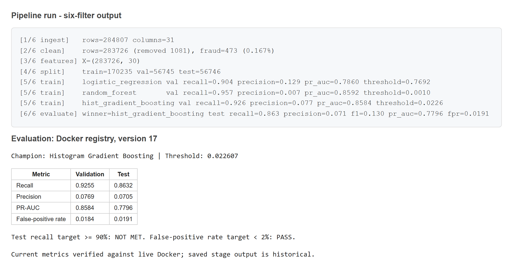

**Screenshot 2 - MLflow.** The running Docker registry shows fraud-model version 17 with the alias champion.

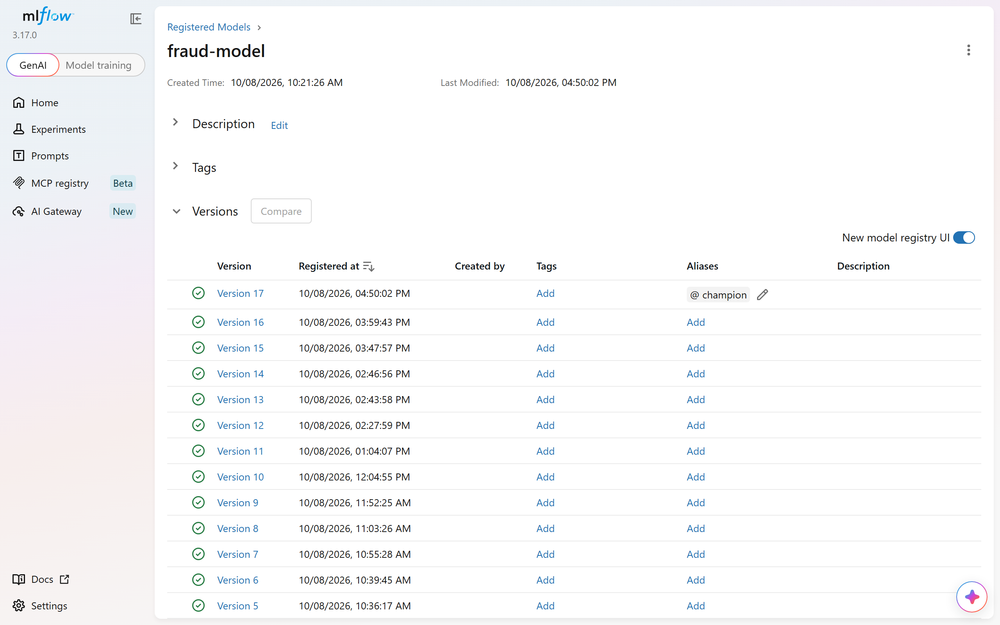

**Screenshot 3 - FastAPI.** We ran GET /health from the Docker API /docs page. The response shows model version 17 and its threshold. The number in the Swagger page heading is the API release, not the model version.

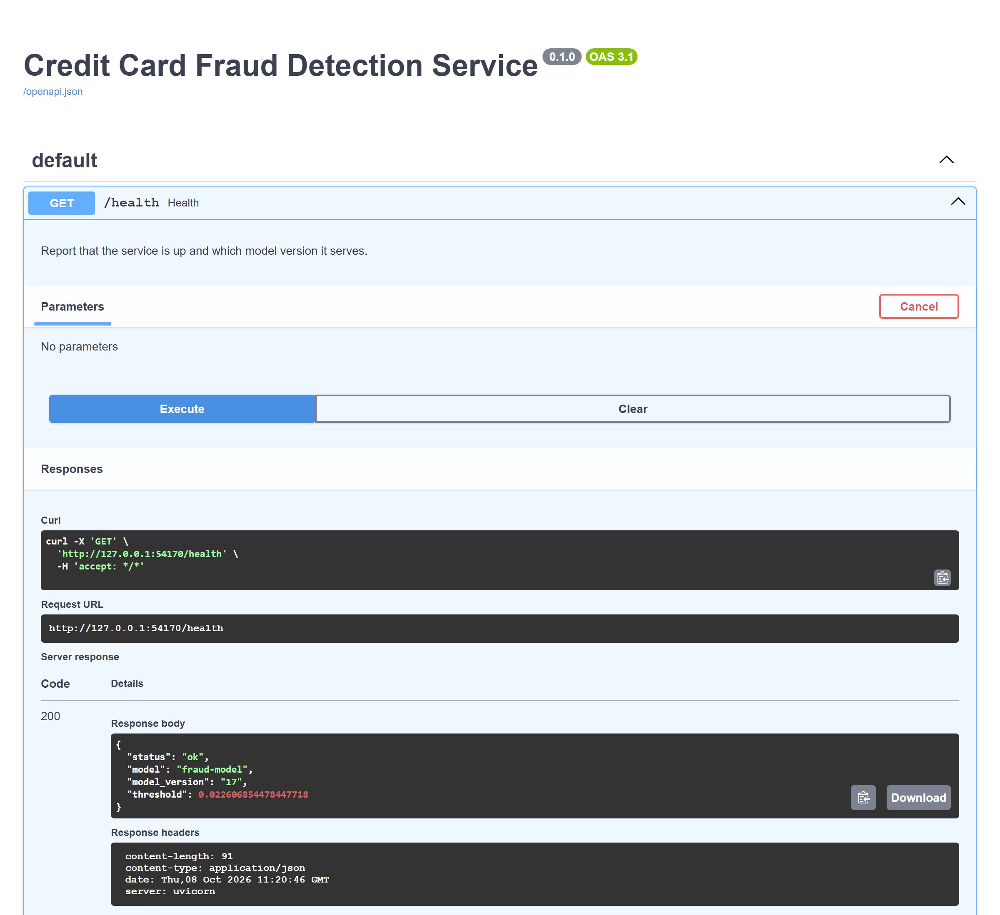

**Screenshot 4 - Fraud test call.** We sent this request to the running Docker API through Swagger /docs. The API used model version 17 and returned fraud probability 0.9994, is_fraud=true, in 22 ms.

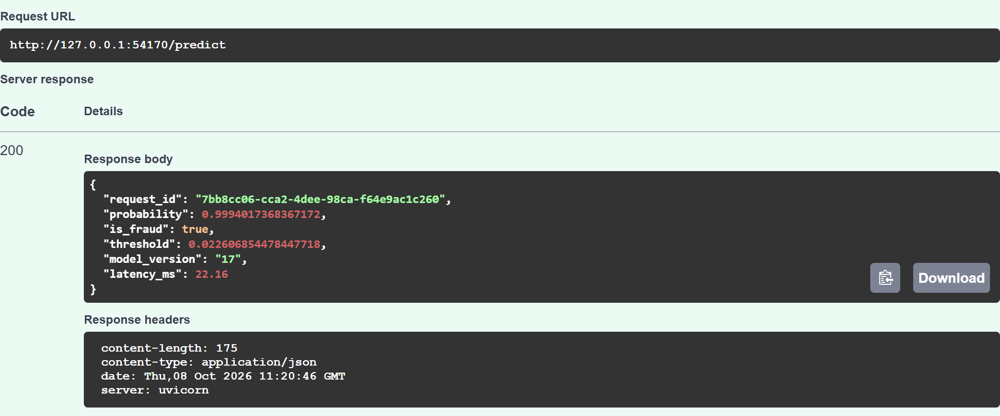

**Screenshot 5 - Genuine test call.** We sent this request to the running Docker API through Swagger /docs. Model version 17 returned probability 0.000, below the threshold 0.0226, so is_fraud=false.

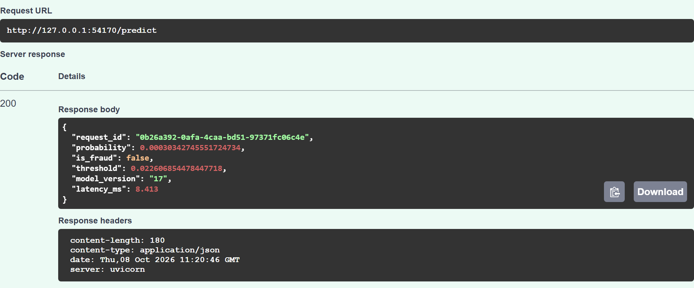

**Screenshot 6 - Prediction log.** These two log rows have the same request IDs as screenshots 4 and 5 and use Docker model version 17. The CSV had 963 rows when we took the screenshot; we show only these two rows. This log is separate from the saved native timing measurements.

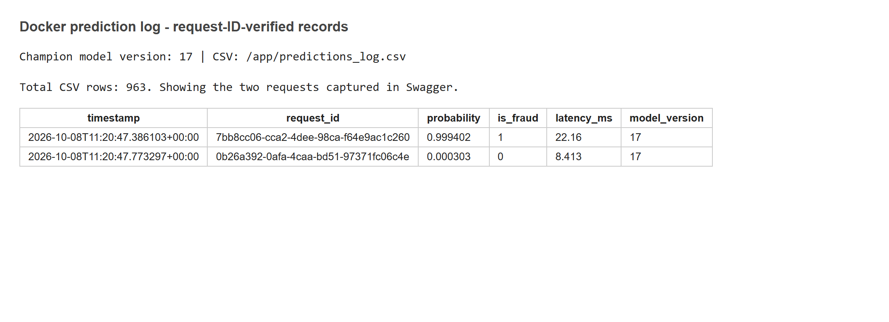

**Screenshot 7 - Docker Compose.** Docker Compose shows the registry and prediction API running on container ports 5000 and 8000. Their localhost ports are assigned when they start. The Docker champion is version 17. We leave both services running until we stop them manually.

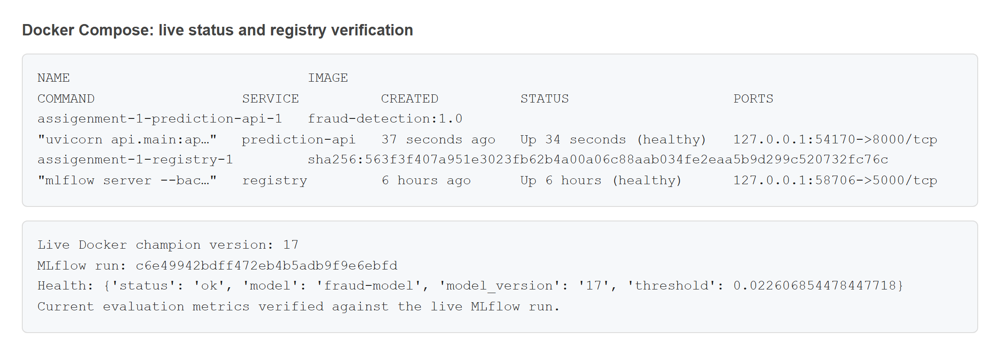

**Screenshot 8 - Docker database.** We checked SQLite inside the registry container without changing it. The screenshot shows the file, tables, number of model versions and champion version 17. The database file, /app/docker-mlflow.db, is kept in the shared project folder. SQLite runs inside the registry; it is not another container.

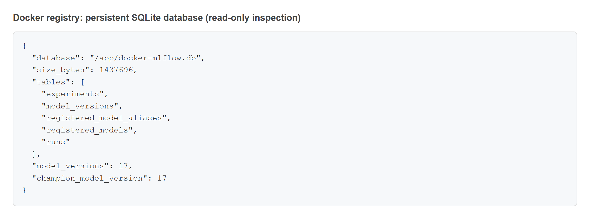<!--/A:shots-->

## 9. Conclusion

### Limitations

- We used one credit-card dataset. We cannot assume the same results for another bank or a different time period.
- Fraud patterns can change over time. The model would need to be checked again using recent labelled transactions.
- We have not added automatic retraining or checks for changes in model performance or data patterns. Retraining is manual. We have prediction logs and health checks, but they do not tell us whether the model is becoming less accurate.

<!--A:conclusion-->In this assignment we built a fraud detection system with a pipe-and-filter training pipeline, an MLflow registry and a FastAPI microservice that serves the champion model, with prediction logging and automated tests. In the saved notebook run, 58 tests passed. With Docker Compose the registry and the prediction API also run as two separate containers. This serves the selected model as an assignment demonstration, not as an accepted production model. Against our goals: false-positive rate (1.91% against 2%) is met, latency (p95 27.8 ms against 200 ms) is met, and the test recall is 86.3% against the 90% target, so that goal is not met. The estimated fraud loss reduction is 82.4% against the 30% target (met). From this work we learned that with so few frauds in each split the recall on the test set can differ from the validation recall, that the model for serving should be chosen on validation results only, and that a registry alias keeps the service independent of the model version. If we had more time we would try more tuning on validation, cross-validation for the threshold, and more fraud examples.<!--/A:conclusion-->

